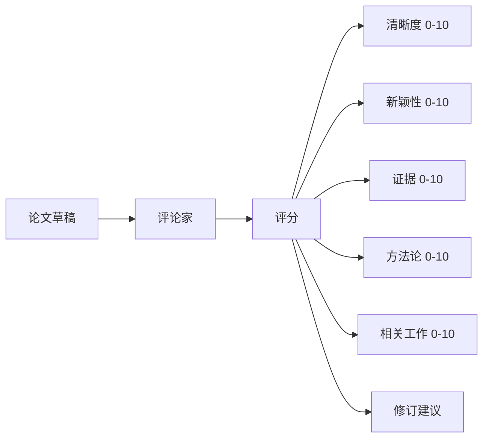
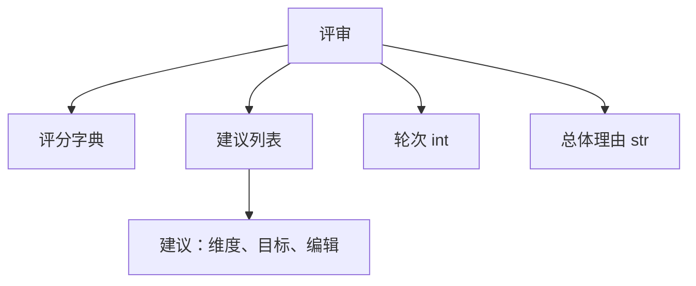
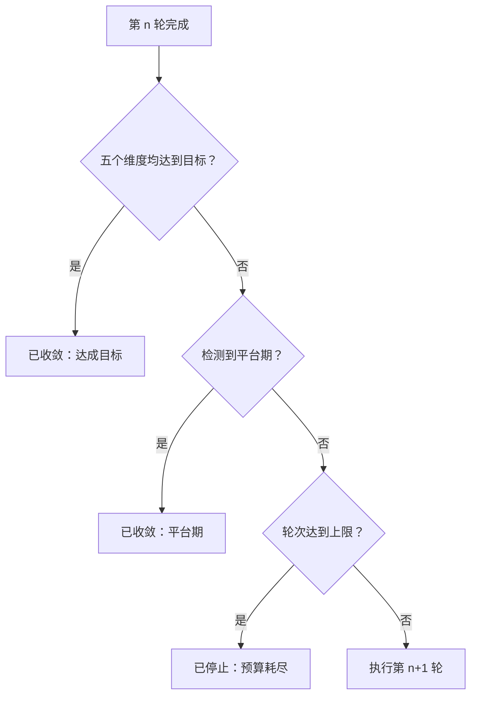
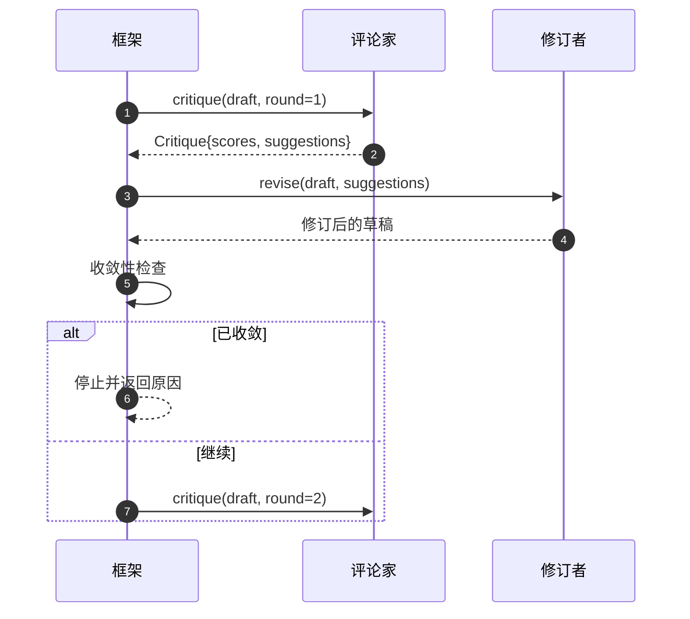

# 评论家循环

> 一个第一次就说"看起来不错"的评论家是有问题的。一个总是说"需要改进"的评论家也是有问题的。有趣的评论家是那种能够收敛的评论家，而你必须设计出这种收敛性。

**类型：** 构建
**语言：** Python
**前置条件：** 阶段 19 第 50–53 课
**时间：** 约 90 分钟

## 学习目标

- 在五个固定维度（清晰度、新颖性、证据、方法论、相关工作）上对论文草稿进行评分。
- 将每轮评审意见作为结构化的修订差异（diff）而非自由形式的改写来应用。
- 通过对比轮次间的评分来检测收敛性；在达到平台期、达成目标或预算耗尽时停止。
- 使用最大迭代预算来限制轮次，以防止不收敛的评论家无限运行。
- 输出每轮的追踪记录，以便仪表盘或下一阶段可以呈现评分轨迹。

## 为什么是五个固定维度

自由形式的评论家返回一段建议文字。下一轮的修订将这段文字当作模糊上下文处理。改写是否解决了批评意见无从验证，因为批评本身从未具有结构。

五个维度为框架提供了契约。


```mermaid
flowchart LR
    Draft[论文草稿] --> Critic[评论家]
    Critic --> Scores[评分]
    Scores --> Clar[清晰度 0-10]
    Scores --> Nov[新颖性 0-10]
    Scores --> Ev[证据 0-10]
    Scores --> Meth[方法论 0-10]
    Scores --> Rel[相关工作 0-10]
    Scores --> Revs[修订建议]
```

评分是一个向量。框架监控每个维度在各轮之间的变化。一轮修订提高了清晰度但降低了证据分，这在证据维度上就是退化，收敛检查能够发现这一点。仅靠模型的评论家无法提供这种保证。

## 评审（Critique）的结构


```mermaid
flowchart TB
    Critique[评审] --> Scores[评分字典]
    Critique --> Sugg[建议列表]
    Sugg --> S1[建议：维度、目标、编辑]
    Critique --> Round[轮次 int]
    Critique --> Reason[总体理由 str]
```

每条建议都包含其改进的维度、目标章节，以及一个修订者可以应用的 `edit` 指令。修订者也是一个可调用对象。本课程附带一个确定性修订者，它将编辑指令解释为"追加到章节"的操作。一个模型驱动的修订者会将同一字段解释为提示词。契约不变。

## 收敛规则（按优先级排序）

评论家循环在三个条件中的任意一个触发时终止。


```mermaid
flowchart TB
    Start[第 n 轮完成] --> A{五个维度均达到目标？}
    A -- 是 --> Stop1[已收敛：达成目标]
    A -- 否 --> B{检测到平台期？}
    B -- 是 --> Stop2[已收敛：平台期]
    B -- 否 --> C{轮次达到上限？}
    C -- 是 --> Stop3[已停止：预算耗尽]
    C -- 否 --> Next[执行第 n+1 轮]
```

达成目标是最严格的情况：五个维度（清晰度、新颖性、证据、方法论、相关工作）中的每一个都必须达到 `>= target_score`（默认 `8.0`），循环才会返回成功。均值高但某一维度薄弱是不够的。平台期检测将当前轮次的均值与上一轮次的均值进行比较。如果连续两轮的改进幅度低于 `plateau_epsilon`（默认 `0.1`），循环以 `plateau` 退出。预算是对轮次的硬性上限（默认 `5`），以 `budget` 退出。

优先级顺序很重要：达成目标优先于平台期，平台期优先于预算耗尽。如果第三轮在同样会触发平台期的迭代中达成了目标，结果是 `target` 而非 `plateau`。

## 为什么平台期检测需要两轮

一轮的平台期是噪音。即使草稿固定，一个真实的评论家每次迭代返回的评分也会略有不同，因为确定性评分仍然取决于哪些建议被应用以及应用的顺序。要求连续两轮的平台期可以过滤掉这种噪音。如果框架报告了平台期，说明草稿确实已经停止改进。

## 本课程中的确定性评论家

本课程不调用模型。附带的评论家是一个可调用对象，它根据三个信号对草稿进行评分：平均章节正文长度（清晰度）、图表数量和引用数量（证据），以及论文元数据中的 `originality_tag` 字段（新颖性）。修订者知道如何推动每个评分上升。

```text
清晰度（clarity）     随平均章节正文长度增加而增长
新颖性（novelty）     当 originality_tag 设置为 "high" 时增长
证据（evidence）      当章节的 figure_refs 非空时增长
方法论（methodology）  当存在标题为 "Method" 且非空的章节时增长
相关工作（related-work）当存在标题为 "Related Work" 且非空的章节时增长
```

修订者将每条建议解释为定向追加。第一轮之后，框架可以观察到评分上升。测试利用这一特性来断言循环缩小了差距。

## 完整的循环契约


```mermaid
sequenceDiagram
    autonumber
    participant H as 框架
    participant C as 评论家
    participant R as 修订者
    H->>C: critique(draft, round=1)
    C-->>H: Critique{scores, suggestions}
    H->>R: revise(draft, suggestions)
    R-->>H: 修订后的草稿
    H->>H: 收敛性检查
    alt 已收敛
        H-->>H: 停止并返回原因
    else 继续
        H->>C: critique(draft, round=2)
    end
```

框架拥有轮次计数器、追踪记录和收敛性检查。评论家拥有评分。修订者拥有差异（diff）。三者互不干涉对方的状态。

## 追踪输出

每一轮都会产生一个追踪事件，包含轮次编号、评分向量、建议数量和收敛判定。完整的追踪记录随最终草稿一起返回。下游仪表盘可以绘制每轮评分图表。下一课（迭代调度器）会读取追踪记录，以判断该分支是否值得保留。

## 防范糟糕评论家的预算机制

一个总是提出无法改善评分的建议的评论家，会被循环锁定在最大迭代上限。追踪记录使这一点可见：五轮评分持平，判定为 `budget`。用户会将其解读为评论家的缺陷，而非草稿的缺陷。如果只呈现最终草稿，则会掩盖诊断信息。追踪优先的设计使其浮出水面。

## 如何阅读代码

`code/main.py` 定义了 `Critique`、`Suggestion`、`Critic` 协议、`Reviser` 协议、`CriticLoop`，以及一个 `make_deterministic_critic_pair` 工厂函数，该函数返回确定性评论家及其配对的修订者。包含一个最小的 `Paper` 结构，使本课程能够独立运行。

`code/tests/test_critic_loop.py` 覆盖了：第一轮后的单调改进、在调优草稿上的目标收敛、两轮平稳后的平台期检测、建议无法改善评分时的预算耗尽、修订者对建议的应用，以及追踪记录的结构。

## 拓展方向

真实实现会需要的两个扩展。第一，维度权重：面向研讨会的论文，新颖性权重高于方法论；面向期刊的论文则相反。收敛性检查变为加权平均值。第二，配对评论家：一个评论家评分，另一个评论家在修订者看到建议之前对其进行裁定。两者都增加价值，两者都在相同的 `Critique` 结构上组合。

关键在于评分向量。一旦评审具有结构，所有其他改进、收敛规则、仪表盘、配对评论家，都可以在不改变循环的情况下加入。
