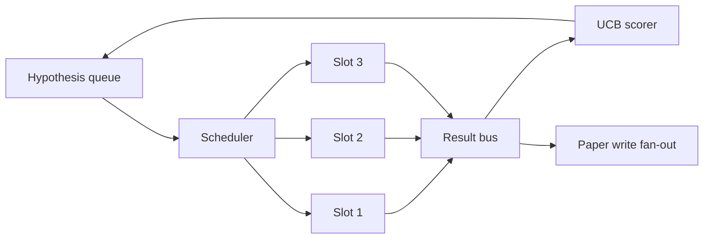
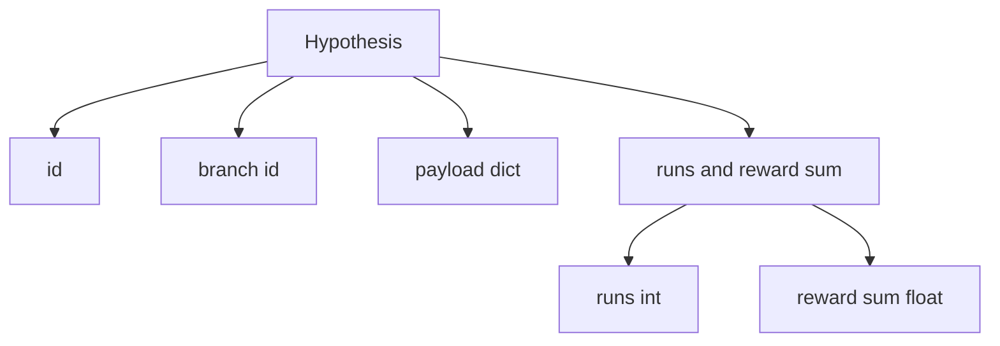
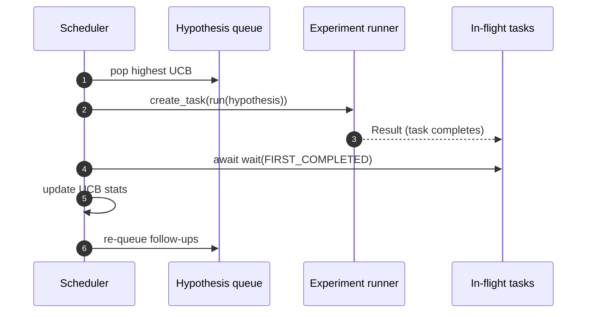

# 反復スケジューラー

> scheduler のない研究ループは、ただの worklist です。何を探索し続け、何を止めるかを決める場所が scheduler であり、その判断が全体の勝負を決めます。

**種別:** Build
**言語:** Python
**前提:** Phase 19 lessons 50-53
**時間:** 約90分

## 学習目標
- hypothesis queue が parallel experiment slots に流れ、result が fan-in する研究 workflow を model 化する。
- `asyncio` で複数 experiment を同時に走らせ、slot を空けない。
- UCB で各 hypothesis branch を score し、exploration を残しつつ low-yield branch を prune する。
- 完了 result を paper-write stage と re-queue stage に fan out し、高 yield branch から follow-up hypothesis を生む。
- branch score、slot occupancy、pruning decision を持つ per-iteration trace を出す。

## Scheduler と worklist の違い

flat worklist は job を投入順に実行します。各 job が独立しているなら十分です。しかし研究では experiment 3 の発見が experiment 4 と 5 の優先順位を変えます。result fan-in を読み queue を並べ替える scheduler は、同じ compute でより有用な work を行えます。

scoring rule が設計の中心です。greedy scorer は current leader だけを選び exploration しません。uniform scorer は exploitation しません。UCB、upper confidence bound はその中間です。leader を exploit しながら、試行回数の少ない branch に capacity を残します。

## System shape



queue は hypotheses を保持します。slot が空くと scheduler は最高 UCB の hypothesis を選びます。各 slot は experiment を async に走らせます。完了した result は bus に流れ、originating branch の UCB statistics を更新し、yield が threshold を超えれば paper-write stage へ fan out します。

## Hypothesis の形



`branch` は UCB statistics の key です。複数の hypothesis が同じ branch を共有できます。branch は研究方向、hypothesis はその中の一試行です。`runs` は完了 experiment 数、`reward_sum` は累積 reward です。

## UCB scoring

この lesson の UCB は classic UCB1 です。

```text
ucb(branch) = mean_reward(branch) + c * sqrt( ln(total_runs) / runs(branch) )
```

`total_runs` は全 branch の完了 experiment 数です。`c` は exploration weight で、default は `sqrt(2)` です。runs が0の branch は `+inf` となり、未試行 branch が必ず先に選ばれます。mean reward が高い branch は高 score を保ちますが、何度も低 reward なら未探索 branch に抜かれます。

pruning gate は picker とは別です。mean reward が absolute floor、default `0.2` を下回り、かつ `prune_after_runs`、default `3` に達した branch は future scheduling から外されます。

## asyncio の parallel slots

scheduler は `asyncio.create_task` で experiment を駆動します。各 task は async runner を走らせ、`Result` を返します。main loop は in-flight task set に対して `asyncio.wait(..., return_when=asyncio.FIRST_COMPLETED)` を待ち、完了ごとに scoring update を行います。



main loop は単一 experiment を block しません。queue が空で in-flight task もなくなるか budget が尽きるまで、slot が空くたびに新しい task を起動します。

## Fan-out: paper triggers

branch の mean reward が `paper_threshold`、default `0.7` を超え、まだ paper を作っていない場合、scheduler は `paper.trigger` event を output list に出します。本 lesson では tests が assert できるよう list として捕捉します。

## Fan-out: follow-up hypotheses

high-yield result が届くと、scheduler は user-supplied `expander` を呼んで follow-up hypotheses を生成できます。expander は `Result` から `list[Hypothesis]` への pure function です。この lesson の deterministic expander は threshold を超えた result から二つの follow-up を作ります。

## Budgets

二つの budget が runaway loop を防ぎます。

```text
max_experiments    : 全 branch 合計の experiment 実行数
max_seconds        : wall-clock cap (asyncio time)
```

どちらかが発火すると、scheduler は新しい task を起動せず、in-flight を await して final trace を返します。trace には `stop_reason` が含まれます。

## Trace と final report

pick、dispatch、result、prune、fan-out の各 scheduling decision が event を出します。final report は branch stats、total runs、total wall-clock、paper triggers をまとめます。次の end-to-end demo はこの report を読み paper writer を動かします。

## コードの読み方

`code/main.py` は `Hypothesis`, `Result`, `BranchStats`, `IterationScheduler`, predictable rewards を持つ asyncio experiment runner を返す `make_deterministic_runner` を定義します。runner は固定 `delay_ms`、default `5ms` だけ sleep するため concurrency が観測できます。

`code/tests/test_scheduler.py` は、未試行 branch を UCB が先に選ぶこと、parallel slot occupancy、threshold crossing での paper trigger、low-yield branch pruning、follow-up hypothesis fan-out、experiment count と wall clock の budget exit を確認します。

## 発展

本番化では persistent UCB stats、multi-objective scoring、contextual bandits が有用です。stats を checkpoint すれば restart 後も exploration budget を保持できます。scalar reward を vector にすれば Pareto-style picker に拡張できます。hypothesis features を条件にした contextual bandit なら似た仮説間で exploration を共有できます。
