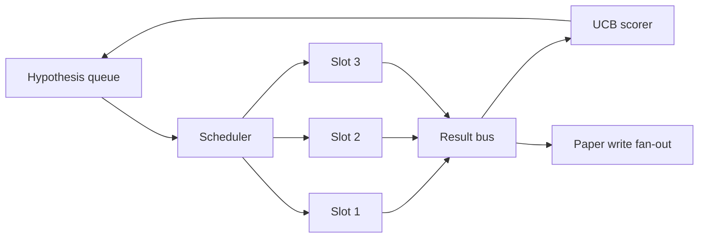
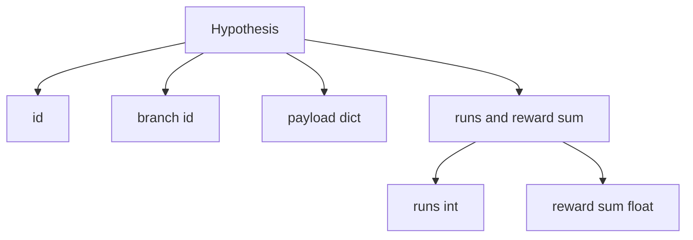
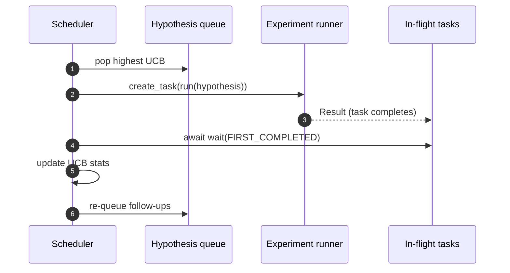

# Yineleme Zamanlayıcı

> Zamanlayıcısı olmayan bir araştırma döngüsü, yanılgılarla dolu bir kuyruktur. Zamanlayıcı, döngünün neyi keşfetmeyi bırakacağına karar verdiği yerdir ve bu karar oyunun tamamıdır.

**Tür:** Yapım
**Diller:** Python
**Önkoşullar:** 19. Aşama dersleri 50-53
**Süre:** ~90 dakika

## Öğrenme Hedefleri

- Bir araştırma iş akışını, sonuçları tekrar gelen paralel deney aralıklarını besleyen bir hipotez kuyruğu olarak modelleyin.
- Zamanlayıcının tüm yuvaları meşgul tutabilmesi için asyncio ile birden fazla denemeyi aynı anda çalıştırın.
- Planlayıcının araştırmayı bırakmadan düşük verimli dalları budaması için her hipotez dalını UCB ile puanlayın.
- Biten sonuçları kağıt yazma aşamasına ve yeniden sıraya alma aşamasına yayın, böylece yüksek getirili bir dal, takip hipotezleri doğurur.
- Dal puanları, yuva doluluğu ve budama kararlarıyla her yineleme izini yüzeye çıkarın.

## Neden iş listesi değil de zamanlayıcı

Düz bir iş listesi işleri gönderim sırasına göre çalıştırır. Her iş bağımsız olduğunda bu sorun değil. Araştırma bağımsız değildir: Üçüncü deneyden elde edilen bir bulgu, dördüncü ve beşinci deneylerin önceliğini değiştirir. Sonuç yelpazesini okuyan ve kuyruğu yeniden düzenleyen bir zamanlayıcı, bilgi işlem birimi başına daha fazla yararlı iş yapılmasını sağlar.

İlginç tasarım seçimi puanlama kuralıdır. Açgözlü bir golcü her zaman mevcut lideri seçer ve asla keşfetmez. Tek tip bir golcü asla istismar etmez. UCB (üst güven sınırı) orta yoldur: kapasiteyi daha az denenmiş dallara ayırırken lideri istismar edin.

## Sistem şekli



Kuyrukta hipotezler var. Zamanlayıcı, bir slot boşaldığında en yüksek UCB hipotezini seçer. Her slot bir denemeyi eşzamansız olarak çalıştırır. Biten deneyler sonuçlarını otobüse yayar. Otobüs, UCB'nin başlangıç ​​şubesine ilişkin istatistiklerini günceller ve bir şubenin getirisi bir eşiği aştığında kağıt yazma aşamasına geçer.

## Hipotez şekli



`branch` UCB istatistiklerinin anahtarıdır. Birden fazla hipotez bir dalı paylaşabilir (dal araştırmanın yönüdür; hipotez onun içindeki bir denemedir). `runs` o dal için tamamlanan deneylerin sayısıdır, `reward_sum` ise kümülatif ödüldür. UCB her ikisini de okur.

## UCB puanlaması

Bu derste kullanılan UCB formülü klasik UCB1'dir.

```text
ucb(branch) = mean_reward(branch) + c * sqrt( ln(total_runs) / runs(branch) )
```

`total_runs` , tüm dallarda tamamlanan tüm deneylerin sayısıdır. `c` keşif ağırlığıdır; ders varsayılan olarak `sqrt(2)`'dır. Sıfır çalıştırmalı bir dal `+inf` alır, böylece denenmemiş dallar her zaman ilk önce planlanır. Yüksek ortalama ödüle sahip bir dal, diğer dallar yetişinceye kadar yüksek puanı korur; Çok fazla ödül almadan defalarca çalışan bir dal, daha az çalıştırılan alternatifler tarafından gölgede bırakılır.

Budama kapısı toplayıcıdan ayrıdır. Budama, bir şubenin ortalama ödülü en az `prune_after_runs` denemeden (varsayılan `3`) sonra mutlak bir tabanın (varsayılan `0.2`) altına düştüğünde gelecekteki planlamadan çıkarır. Bu kuyruğu sınırlı tutar.

## Asyncio'lu paralel yuvalar

Planlayıcı, `asyncio.create_task` ile denemeleri yönlendirir. Her görev, bir `Result` döndüren deneme çalıştırıcısını (bir `async def` çağrılabilir) çalıştırır. Ana döngü, `asyncio.wait(..., return_when=asyncio.FIRST_COMPLETED)` ile birlikte hareket halindeki görevler kümesini bekler ve her tamamlamada puanlama güncellemesini başlatır.



Üç slot aynı anda çalışır. Ana döngü hiçbir zaman tek bir deneyde bloke olmaz. Zamanlayıcı, bir yuva boşalır boşalmaz, hem kuyruk boşalana hem de hiçbir görev uçuşta kalmayana kadar yeni görevleri başlatmaya devam eder.

## Yayılma: kağıt tetikleyicileri

Bir şubenin ortalama ödülü `paper_threshold` (varsayılan `0.7`) ile kesiştiğinde ve bu şube henüz bir makale üretmediğinde, zamanlayıcı bir çıktı listesine bir `paper.trigger` olayı ekler. Elli dördüncü dersin makale yazarı bu konuyu ele alacaktı. Bu derste tetikleyici bir liste olarak yakalanır, böylece testler bunu doğrulayabilir.

## Yayılma: takip hipotezleri

Yüksek getirili bir sonuç elde edildiğinde, zamanlayıcı aynı dalda bir veya daha fazla takip hipotezi üretmek için kullanıcı tarafından sağlanan `expander` 'yı çağırabilir. Genişletici, `Result` ile `list[Hypothesis]` arasında saf bir fonksiyondur. Ders, ödülü kağıt eşiğini aşan herhangi bir sonuç için iki takip üreten deterministik bir genişletici sunar.

## Bütçeler

İki bütçe, zamanlayıcıyı kontrolden çıkan döngülerden korur.

```text
max_experiments    : total count of experiments run across all branches
max_seconds        : wall-clock cap (asyncio time)
```

Her iki görev de tetiklendiğinde, zamanlayıcı yeni görevleri planlamayı durdurur, devam eden görevleri bekler ve son izi döndürür. İz bir `stop_reason` içeriyor.

## İzleme ve nihai rapor

Her planlama kararı (toplama, gönderme, sonuç, budama, yayma) bir olay yayar. Nihai rapor, şube başına istatistikleri, toplam işlemleri, toplam duvar saatini ve tetiklenen kağıt tetikleyicilerini özetler. Bir sonraki ders olan uçtan uca demo, makale yazarını yönlendirmek için bu raporu okur.

## Kod nasıl okunur

`code/main.py` , `Hypothesis`, `Result`, `BranchStats`, `IterationScheduler` ve öngörülebilir ödüllere sahip bir eşzamansız deneme çalıştırıcısı döndüren bir `make_deterministic_runner` fabrikasını tanımlar. Koşucu sabit bir `delay_ms` (varsayılan `5ms`) boyunca uyur, böylece eşzamanlılık gözlemlenebilir.

`code/tests/test_scheduler.py` şunları kapsar: UCB önce denenmemiş dalları seçer, paralel slot doluluğu, eşik aşıldığında kâğıt tetikler, düşük getirili denemelerden sonra dal budama, yayılma takip hipotezleri ve bütçeden çıkış (hem deney sayısı hem de duvar saati).

## Daha ileri gidiyoruz

Gerçek bir uygulamanın isteyeceği üç uzantı. İlk olarak, oturumlar boyunca kalıcı UCB istatistikleri: mevcut istatistikler bellekte yaşar; Gerçek bir planlayıcı onları kontrol eder, böylece yeniden başlatma zaten harcanmış olan keşif bütçesini korur. İkincisi, çok amaçlı puanlama: Skaler bir ödül yerine, her sonuç bir vektör yayar ve UCB, Pareto tarzı bir seçiciye dönüşür. Üçüncüsü, bağlamsal haydutlar: hipotez özelliklerine (uzunluk, karmaşıklık) ilişkin seçici koşullar, dolayısıyla benzer hipotezler araştırmayı paylaşır.

Zamanlayıcı, araştırmanın bir çalışma listesinden daha fazlası haline geldiği yerdir. UCB'nin kabloları bağlandığında ve yuvalar paralel olarak çalıştığında, diğer tüm iyileştirmeler en üstte yer alır.
