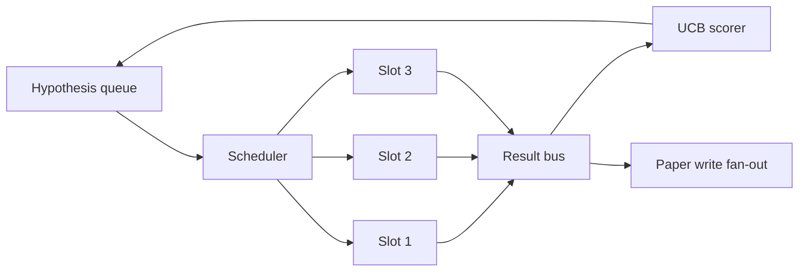
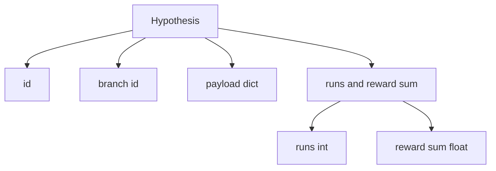
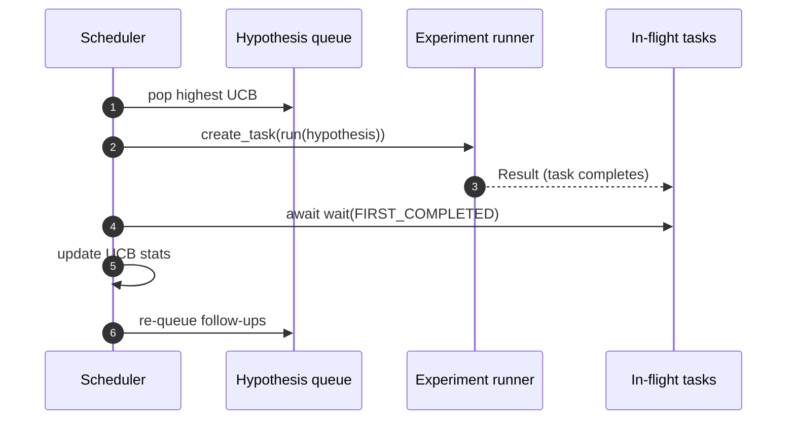

# 56 · 迭代调度器（Iteration Scheduler）

> 缺少调度器的研究循环不过是一个自欺欺人的队列。调度器是循环决定"停止探索什么"的地方，而那个决定就是整个游戏的全部。

**类型：** 构建
**语言：** Python
**前置：** 第19阶段第50-53课
**时长：** 约90分钟

## 学习目标

- 将研究工作流建模为一个假设队列（hypothesis queue），该队列向并行实验槽位（slot）输送任务，实验结果则扇回反馈。
- 使用 asyncio 并发运行多个实验，使调度器能够保持所有槽位忙碌。
- 用 UCB（Upper Confidence Bound，置信上限）为每个假设分支打分，使调度器能够修剪低收益分支而不放弃探索。
- 将完成的结果扇出到论文撰写阶段和重新入队阶段，使高收益分支能够衍生后续假设。
- 输出每次迭代的跟踪记录，包含分支评分、槽位占用情况和修剪决策。

## 为什么是调度器而非工作列表

扁平工作列表按提交顺序执行任务。当每个任务相互独立时，这没有问题。但研究不是独立的：实验三的发现会改变实验四和实验五的优先级。一个能够读取结果反馈并重新排序队列的调度器，可以在单位计算资源内完成更多有用的工作。

这里最有趣的设计选择是评分规则。贪婪评分器总是选择当前领先者，从不探索。均匀评分器从不利用。UCB 是中间路径：在利用领先者的同时，为尝试次数较少的分支保留探索容量。

## 系统形态



队列中存放假设。调度器在槽位空闲时选择 UCB 值最高的假设。每个槽位异步运行实验。完成的实验将结果扇出到结果总线（result bus）。总线更新来源分支的 UCB 统计信息，并在某个分支的收益超过阈值时扇出到论文撰写阶段。

## 假设的数据结构



`branch` 是 UCB 统计的键。多个假设可能共享同一个分支（分支代表研究方向；假设是该方向内的一次试验）。`runs` 是该分支已完成实验的次数，`reward_sum` 是累积奖励。UCB 同时读取这两个值。

## UCB 评分

本课使用的 UCB 公式是经典的 UCB1。

```text
ucb(branch) = mean_reward(branch) + c * sqrt( ln(total_runs) / runs(branch) )
```

`total_runs` 是所有分支已完成实验的总数。`c` 是探索权重；本课默认值为 `sqrt(2)`。零次运行的分支得分为 `+inf`，因此未尝试的分支总是被优先调度。均值奖励高的分支会保持高分，直到其他分支追上来；一个运行次数很多但奖励微薄的分支会被运行较少的分支超越。

修剪门控（pruning gate）独立于选择器。当某个分支在至少 `prune_after_runs` 次试验（默认 `3`）后，其均值奖励低于绝对下限（默认 `0.2`）时，修剪会将该分支从未来的调度中移除。这样保持了队列的有界性。

## 使用 asyncio 的并行槽位

调度器通过 `asyncio.create_task` 驱动实验。每个任务运行实验执行器（一个 `async def` 可调用对象），该执行器返回一个 `Result`。主循环使用 `asyncio.wait(..., return_when=asyncio.FIRST_COMPLETED)` 等待正在运行的任务集，并在每个任务完成时触发评分更新。



三个槽位并发运行。主循环永远不会阻塞在单个实验上。调度器在槽位空闲后立即启动新任务，直到队列为空且没有任务在运行中。

## 扇出：论文触发器

当一个分支的均值奖励超过 `paper_threshold`（默认 `0.7`）并且该分支尚未产出论文时，调度器会将一个 `paper.trigger` 事件扇出到输出列表中。下游由第54课的论文撰写器接收此事件。在本课中，触发器被捕获为一个列表，以便测试可以断言它。

## 扇出：后续假设

当高收益结果到达时，调度器可以调用用户提供的 `expander` 来在同一分支上生成一个或多个后续假设。expander 是一个纯函数，从 `Result` 映射到 `list[Hypothesis]`。本课提供了一个确定性 expander，对于任何奖励超过论文阈值的结果，它会生成两个后续假设。

## 预算

两个预算保护调度器免受失控循环的影响。

```text
max_experiments    : 所有分支运行的实验总数上限
max_seconds        : 墙上时钟上限（asyncio 时间）
```

当任一预算耗尽时，调度器停止调度新任务，等待正在运行的任务完成，并返回最终的跟踪记录。跟踪记录包含一个 `stop_reason`。

## 跟踪记录与最终报告

每次调度决策（选取、分发、结果、修剪、扇出）都会发出一个事件。最终报告汇总每个分支的统计信息、总运行次数、总墙上时钟时间以及触发的论文事件。下一课（端到端演示）将读取此报告来驱动论文撰写器。

## 如何阅读代码

`code/main.py` 定义了 `Hypothesis`、`Result`、`BranchStats`、`IterationScheduler`，以及一个 `make_deterministic_runner` 工厂函数，该函数返回一个具有可预测奖励的 asyncio 实验执行器。执行器休眠固定的 `delay_ms`（默认 `5ms`），以便可以观察到并发行为。

`code/tests/test_scheduler.py` 覆盖了以下测试用例：UCB 优先选择未尝试的分支、并行槽位占用、超过阈值时的论文触发、低收益试验后的分支修剪、扇出后续假设，以及预算退出（包括实验次数和墙上时钟两种方式）。

## 进一步探索

一个真正的实现会希望有三个扩展。第一，跨会话持久化 UCB 统计：当前的统计信息存在于内存中；真正的调度器会对其做检查点（checkpoint），以便重启时保留已消耗的探索预算。第二，多目标评分：不再使用标量奖励，而是每个结果发出一个向量，UCB 变为帕累托式（Pareto-style）选择器。第三，上下文赌博机（contextual bandits）：选择器根据假设特征（如长度、复杂度）进行条件化，使相似的假设共享探索信息。

调度器是研究超越工作列表的地方。一旦 UCB 接线完成并且槽位并行运行，所有其他改进都可以在此基础上叠加。
