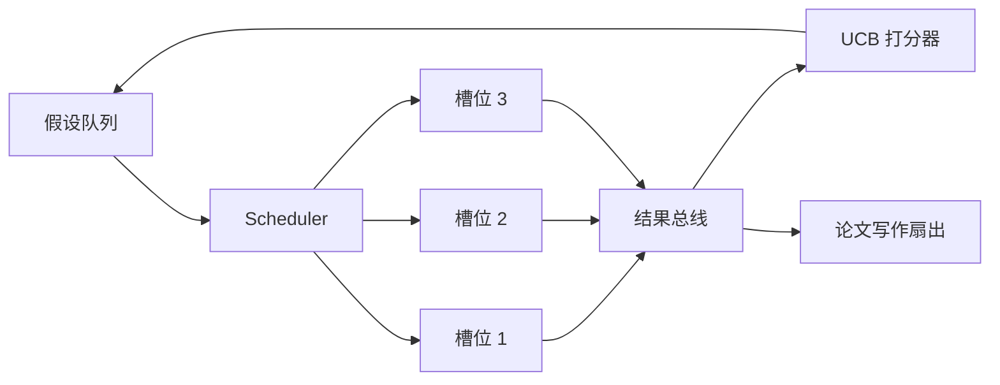
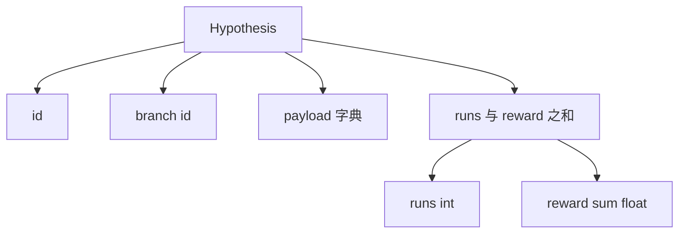
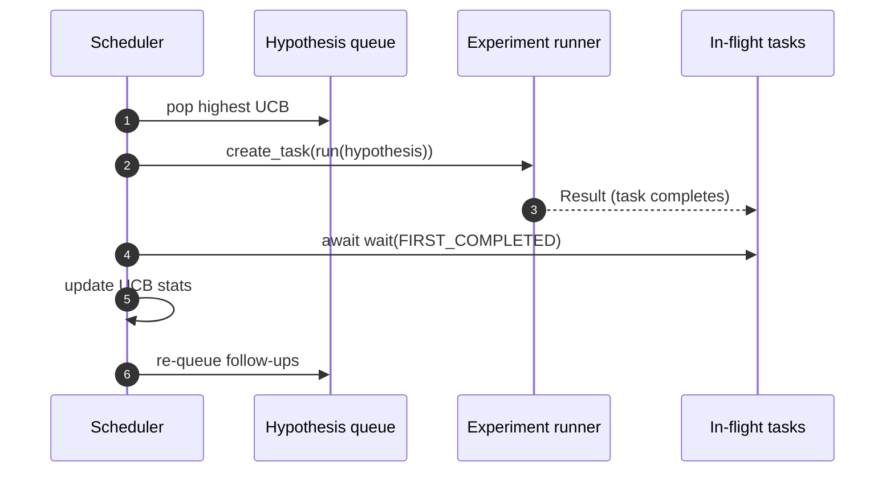

# 迭代调度器（Iteration Scheduler）

> 译注：本文译自同目录 [`en.md`](./en.md)。术语遵循仓根 [TRANSLATION_GUIDE.md](../../../../TRANSLATION_GUIDE.md)。

> 没有调度器的研究循环，只是一个有妄想症的队列。调度器决定了循环何时停止探索某条路径，而这个决策就是整盘棋。

**Type:** Build
**Languages:** Python
**Prerequisites:** Phase 19 lessons 50-53
**Time:** ~90 minutes

## 学习目标（Learning Objectives）

- 把研究工作流建模为：一个 hypothesis（假设）队列，喂入若干并行的 experiment slot（实验槽位），结果再 fan-in 回来。
- 用 asyncio 并发跑多个实验，让调度器始终保持所有 slot 满载。
- 用 UCB 给每条 hypothesis 分支打分，让调度器在不放弃探索的前提下，剪掉低收益分支。
- 把跑完的结果 fan-out 到「写论文」阶段和「重新入队」阶段，让高收益分支能繁衍出新的 follow-up hypothesis。
- 暴露逐迭代的 trace，包含分支分数、slot 占用情况、剪枝决策。

## 为什么是调度器，而不是工作清单（Why a scheduler, not a worklist）

扁平的工作清单按提交顺序跑任务。各任务彼此独立时这没问题。但研究不是独立的：实验三的发现会改变实验四和实验五的优先级。一个能读取结果 fan-in 并据此重排队列的调度器，每单位算力能干出更多有用的活。

有意思的设计点在打分规则。贪心打分器永远只挑当前的领跑者，从不探索。均匀打分器永远不利用。UCB（upper confidence bound，置信上界）走的是中间路：既利用领跑者，又给那些尝试次数较少的分支留出容量。

## 系统形态（The system shape）



队列里放着 hypothesis。某个 slot 空出来时，调度器挑出 UCB 最高的那个 hypothesis。每个 slot 异步跑一个实验。跑完的实验把结果 fan 到 bus 上。bus 更新原分支的 UCB 统计量，并在分支的收益越过阈值时 fan-out 到「写论文」阶段。

## Hypothesis 的形态（The Hypothesis shape）



`branch` 是 UCB 统计量的索引键。多个 hypothesis 可以共享同一个 branch（branch 是研究方向，hypothesis 是该方向下的一次具体试验）。`runs` 是这个分支已完成实验的计数，`reward_sum` 是累计奖励。UCB 同时读这两个量。

## UCB 打分（UCB scoring）

本课用的是经典的 UCB1 公式：

```text
ucb(branch) = mean_reward(branch) + c * sqrt( ln(total_runs) / runs(branch) )
```

`total_runs` 是所有分支累计跑完的实验总数。`c` 是探索权重，本课默认取 `sqrt(2)`。一个还没跑过的分支会拿到 `+inf`，所以未尝试的分支总是被优先调度。平均奖励高的分支会一直保持高分，直到别的分支追上来；而那种跑了很多次却收益寥寥的分支，则会被那些跑得少的对手反超。

剪枝门禁和挑选器是分开的。剪枝是这样工作的：当一个分支至少跑过 `prune_after_runs` 次（默认 `3` 次）且其平均奖励低于绝对地板线（默认 `0.2`）时，就把这个分支从未来的调度中移除。这样可以让队列保持有界。

## 用 asyncio 跑并行 slot（Parallel slots with asyncio）

调度器用 `asyncio.create_task` 驱动实验。每个 task 跑一个实验 runner（一个 `async def` 可调用对象），返回一个 `Result`。主循环用 `asyncio.wait(..., return_when=asyncio.FIRST_COMPLETED)` 等待这一组在飞 task，每完成一个就触发一次打分更新。



三个 slot 并发地跑。主循环从不会阻塞在某一个实验上。只要 slot 一空出来，调度器就立刻起新 task，直到队列空、且没有 task 还在飞为止。

## Fan-out：论文触发器（Fan-out: paper triggers）

当一个分支的平均奖励越过 `paper_threshold`（默认 `0.7`）且该分支尚未产出过论文时，调度器会把一个 `paper.trigger` 事件 fan 到一个输出列表上。下游由第 54 课的论文写作器（paper writer）来接走。本课中我们把这些 trigger 收集到一个列表里，方便测试断言。

## Fan-out：follow-up hypothesis（Fan-out: follow-up hypotheses）

当一个高收益结果落地时，调度器可以调用用户提供的 `expander`，在同一分支上产出一个或多个 follow-up hypothesis。`expander` 是一个纯函数，输入 `Result`，输出 `list[Hypothesis]`。本课内置了一个确定性 expander：只要某个 result 的奖励超过论文阈值，它就产出两个 follow-up。

## 预算（Budgets）

两个预算守住调度器，避免它失控狂跑：

```text
max_experiments    : total count of experiments run across all branches
max_seconds        : wall-clock cap (asyncio time)
```

任何一个触发，调度器就停止调度新 task，等在飞的 task 跑完，并返回最终的 trace。trace 里会包含一个 `stop_reason`。

## Trace 与最终报告（The Trace and final report）

每个调度决策（pick、dispatch、result、prune、fan-out）都会发出一个事件。最终报告汇总每个分支的统计量、总运行数、总 wall-clock 时间、以及触发过的论文 trigger。下一课的端到端 demo 会读这份报告来驱动论文写作器。

## 如何读代码（How to read the code）

`code/main.py` 里定义了 `Hypothesis`、`Result`、`BranchStats`、`IterationScheduler`，以及一个 `make_deterministic_runner` 工厂——它返回一个 asyncio 实验 runner，奖励是可预测的。runner 会 sleep 固定的 `delay_ms`（默认 `5ms`），这样并发效果可以观察到。

`code/tests/test_scheduler.py` 覆盖了：UCB 优先挑未尝试的分支、并行 slot 的占用情况、阈值越过时的论文 trigger、低收益试验后的分支剪枝、fan-out follow-up hypothesis、以及预算退出（实验计数和 wall-clock 都覆盖）。

## 走得更远（Going further）

真实实现还会想要三个扩展。第一，跨 session 持久化的 UCB 统计量：当前统计量只活在内存里；真实调度器会做 checkpoint，让重启后已花掉的探索预算不至于白费。第二，多目标打分：每个 result 不再发出一个标量奖励，而是发出一个向量，UCB 变成 Pareto 风格的挑选器。第三，contextual bandit：挑选器以 hypothesis 的特征（长度、复杂度）为条件，让相似的 hypothesis 共享探索。

调度器是研究真正超越「工作清单」的那个地方。一旦 UCB 接好、slot 并行起来，其它每一项改进都能在它之上层叠累积。
