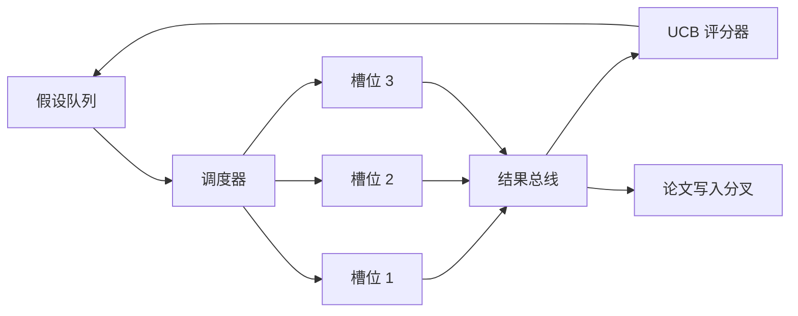
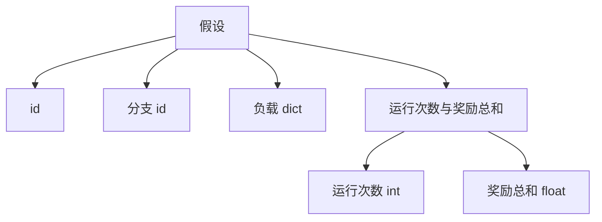
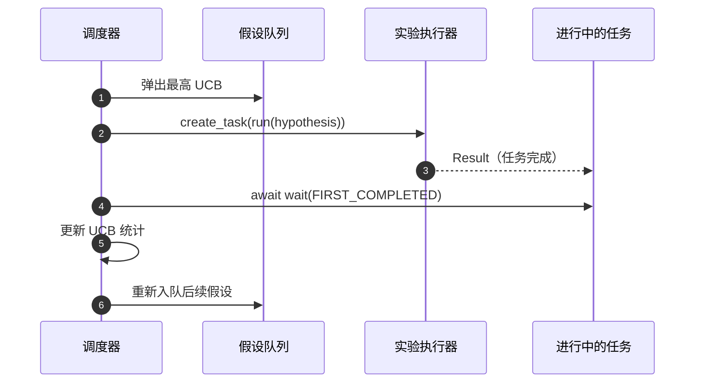

# 迭代调度器

> 一个没有调度器的研究循环，只是一个自欺欺人的队列。调度器是循环决定停止探索什么的地方，而这个决定就是全局的关键。

**类型：** 构建
**语言：** Python
**前置知识：** 阶段 19 第 50-53 课
**时长：** ~90 分钟

## 学习目标

- 将研究工作流建模为一个假设队列，其输出馈送到并行实验槽中，而实验结果再汇聚回来。
- 使用 asyncio 并发运行多个实验，使调度器能保持所有槽位繁忙。
- 使用 UCB 对每个假设分支进行评分，使调度器能够修剪低收益分支而不放弃探索。
- 将完成的结果分叉输出到论文撰写阶段和重新入队阶段，使高收益分支能衍生出后续假设。
- 呈现每次迭代的跟踪记录，包含分支评分、槽位占用率和修剪决策。

## 为什么需要调度器，而不是工作清单

一个扁平的清单按提交顺序运行任务。当每个任务独立时，这没问题。但研究不是独立的：实验三的发现会改变实验四和实验五的优先级。一个读取结果汇聚信息并重新排列队列的调度器，能在单位计算量内完成更多有用的工作。

有趣的设计选择在于评分规则。贪婪评分为总是选择当前领先者，永不探索。均匀评分器从不利用。UCB（上置信界）是一条中间路径：在利用领先者的同时，为尝试较少的分支保留容量。

## 系统结构


```mermaid
flowchart LR
    Queue[假设队列] --> Sched[调度器]
    Sched --> Slot1[槽位 1]
    Sched --> Slot2[槽位 2]
    Sched --> Slot3[槽位 3]
    Slot1 --> Bus[结果总线]
    Slot2 --> Bus
    Slot3 --> Bus
    Bus --> Score[UCB 评分器]
    Score --> Queue
    Bus --> Paper[论文写入分叉]
```

队列持有假设。当某个槽位空闲时，调度器选择 UCB 最高的假设。每个槽位异步运行一个实验。完成的实验将其结果分叉到总线上。总线更新对应分支的 UCB 统计数据，并在分支的收益达到阈值时，将结果分叉输出到论文撰写阶段。

## 假设的形状


```mermaid
flowchart TB
    Hyp[假设] --> Id[id]
    Hyp --> Branch[分支 id]
    Hyp --> Payload[负载 dict]
    Hyp --> Stats[运行次数与奖励总和]
    Stats --> Runs[运行次数 int]
    Stats --> Sum[奖励总和 float]
```

`branch` 是 UCB 统计的关键字段。多个假设可能共享同一个分支（分支是研究方向，而假设是该方向内的一次试验）。`runs` 是该分支已完成的实验次数，`reward_sum` 是累积奖励。UCB 会读取这两个值。

## UCB 评分

本课使用的 UCB 公式是经典的 UCB1。

```text
ucb(branch) = mean_reward(branch) + c * sqrt( ln(total_runs) / runs(branch) )
```

`total_runs` 是所有分支完成的实验总数。`c` 是探索权重；本课默认使用 `sqrt(2)`。运行次数为零的分支得到 `+inf`，因此未尝试的分支总是被优先调度。均值奖励高的分支会保持高分，直到其他分支赶上；运行次数多但奖励不高的分支会被尝试较少的替代分支超越。

修剪门控与选择器是分开的。当一个分支的均值奖励在至少 `prune_after_runs` 次试验（默认 `3`）后低于绝对下限（默认 `0.2`）时，修剪会将其从未来的调度中移除。这保证了队列是有界的。

## 使用 asyncio 实现并行槽位

调度器使用 `asyncio.create_task` 驱动实验。每个任务运行实验执行器（一个 `async def` 可调用对象），返回一个 `Result`。主循环使用 `asyncio.wait(..., return_when=asyncio.FIRST_COMPLETED)` 等待正在进行的任务集合，并在每次任务完成时触发评分更新。


```mermaid
sequenceDiagram
    autonumber
    participant S as 调度器
    participant Q as 假设队列
    participant R as 实验执行器
    participant T as 进行中的任务
    S->>Q: 弹出最高 UCB
    S->>R: create_task(run(hypothesis))
    R-->>T: Result（任务完成）
    S->>T: await wait(FIRST_COMPLETED)
    S->>S: 更新 UCB 统计
    S->>Q: 重新入队后续假设
```

三个槽位并发运行。主循环永远不会阻塞在单个实验上。调度器在槽位一空闲时就立即启动新任务，直到队列为空且没有任务在进行中。

## 分叉输出：论文触发

当某个分支的均值奖励超过 `paper_threshold`（默认 `0.7`）且该分支尚未生成论文时，调度器会将一个 `paper.trigger` 事件输出到一个列表中。下游的论文撰写器（来自第 54 课）会拾取这个事件。在本课中，触发事件被捕获为一个列表，以便测试可以对其进行断言。

## 分叉输出：后续假设

当一个高收益结果落地时，调度器可以调用用户提供的 `expander` 来生成同一分支上的一个或多个后续假设。扩展器是一个从 `Result` 到 `list[Hypothesis]` 的纯函数。本课附带了一个确定性扩展器，对于任何奖励超过论文阈值的结果，它都会生成两个后续假设。

## 预算限制

两种预算机制保护调度器免受失控循环的影响。

```text
max_experiments    : 所有分支运行的总实验次数
max_seconds        : 挂钟时间上限（asyncio 计时）
```

当任一预算触发时，调度器停止调度新任务，等待正在进行的任务完成，并返回最终跟踪记录。跟踪记录中包含 `stop_reason`。

## 跟踪记录与最终报告

每次调度决策（选择、分派、结果、修剪、分叉输出）都会产生一个事件。最终报告总结了每个分支的统计数据、总运行次数、总挂钟时间以及触发的论文事件。下一课（端到端演示）会读取这份报告来驱动论文撰写器。

## 如何阅读代码

`code/main.py` 定义了 `Hypothesis`、`Result`、`BranchStats`、`IterationScheduler` 和一个 `make_deterministic_runner` 工厂函数，该函数返回一个具有可预测奖励的 asyncio 实验执行器。执行器会休眠固定的 `delay_ms`（默认 `5ms`），以便观察到并发行为。

`code/tests/test_scheduler.py` 涵盖以下内容：UCB 优先选择未尝试的分支、并行槽位占用率、达到阈值时触发论文、低收益试验后的分支修剪、分叉输出后续假设，以及预算退出（包括实验次数和挂钟时间两种）。

## 进一步探索

一个真实的实现还需要三种扩展。第一，跨会话持久化 UCB 统计：当前的统计信息保存在内存中；真实的调度器会对其做检查点，以便重启后保留已花费的探索预算。第二，多目标评分：每个结果输出一个向量而非标量奖励，UCB 变成帕累托风格的选择器。第三，上下文相关的摇臂：选择器根据假设的特征（长度、复杂度）进行条件判断，使相似的假设共享探索。

调度器是研究超越简单工作清单的关键所在。一旦 UCB 接入完毕且槽位并行运行，其他所有改进都可以在此基础上组合叠加。
