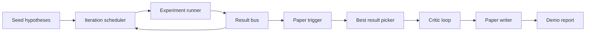
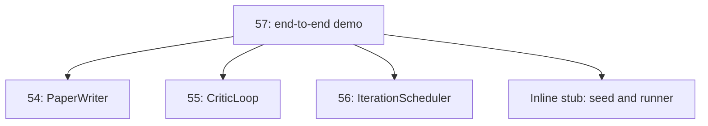
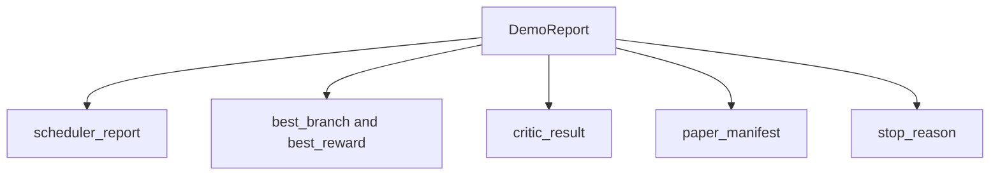

# End-to-End 研究デモ

> demo は、これまで書いたすべての contract が合成できるかを試す場所です。一つでも漏れがあれば、この lesson がそれを見つけます。

**種別:** Build
**言語:** Python
**前提:** Phase 19 lessons 50-53
**時間:** 約90分

## 学習目標
- auto-research loop を end to end につなぐ: hypothesis seed、experiment runner、scheduler、critic loop、paper writer。
- earlier Track D lessons の primitive を framework ではなく plain Python imports で合成する。
- loop を自己終了まで走らせ、各 stage の出力を列挙する単一 demo report を出す。
- demo を決定的に保ち、test suite が final shape を assert できるようにする。
- stage contract が壊れたとき clear failure mode を出し、壊れた input で次 stage を走らせない。

## ここで合成するもの



五つの stage があります。seed は三つの hypothesis list です。scheduler は三つの parallel slot で六つの experiment を走らせます。bus は paper trigger を一つ以上報告します。picker は単一の best result を選びます。critic loop はその result から作った draft を反復します。paper writer は final LaTeX、BibTeX、manifest を出します。

## なぜ copy ではなく import か

各 earlier lesson は public dataclass と function を持つ `main.py` を含みます。demo は各 lesson の parent directory を `sys.path` に足して import します。これは framework wiring ではなく、各 lesson の test file がすでに使っている import と同じです。



inline stub は lessons 50 から 53 の代役です。小さな seed hypothesis generator と synchronous reward function です。user は import を二つ調整するだけで実 primitive に替えられます。

## Determinism guarantees

demo は構造的に決定的です。experiment runner は seeded numpy です。critic loop の reviser は fixed dimensions を fixed order で処理します。paper writer の prose generator は lesson 54 の mock です。scheduler の UCB picker は random ではなく iteration order で tie break します。

同じ seed なら同じ report を出します。test は demo を二回実行して manifest を比較します。

## Demo report の形



各 field は upstream stage からそのまま来ます。demo は output を変換せず、合成します。それが demo の test です。

## Failure mode handling

各 stage は成功するか typed error を raise します。

```text
Scheduler ........ returns SchedulerReport with stop_reason
                   in {queue_empty, max_experiments, deadline}
Best-result pick . raises NoTriggerError if no paper trigger fired
Critic loop ...... returns LoopResult with status converged or stopped
Paper writer ..... raises PaperValidationError on contract break
```

どの stage でも failure があれば demo は typed exception で short-circuit します。tests は `NoTriggerError` / `BestResultError` と writer が呼ばれないことを pin します。

## Best-result picker

scheduler は branch ごとに paper trigger を出します。picker は trigger された branch の中で mean reward が最大のものを選びます。tie は branch id の alphabetic order で break するため、demo は決定的です。

## Critic loop wiring

lesson 55 の critic loop は `MiniPaper` を扱います。demo は選ばれた branch から `MiniPaper` を作ります。abstract には branch id を入れ、Introduction と Results の二 section を seed し、branch mean reward から `originality_tag` を設定します。

reviser は draft を convergence まで反復します。その output が paper writer に渡ります。

## Paper writer wiring

lesson 54 の paper writer は full `Paper` shape を扱います。demo は `mini_to_full_paper` で converged `MiniPaper` を昇格させます。選ばれた branch 用の figure を一つ付け、critic が提案した cite key の union から小さな synthetic bibliography を作ります。demo が追加する cite はすべて bibliography list にも追加されるため validation は通ります。

## コードの読み方

`code/main.py` は `BestResultError`, `NoTriggerError`, `DemoReport`, `pick_best_branch`, `build_mini_paper`, `mini_to_full_paper`, `run_demo` を定義します。top-level import は `sys.path` を一度調整し、`PaperWriter`, `CriticLoop`, `IterationScheduler` を各 lesson から読みます。

`code/tests/test_e2e.py` は end to end の成功、二回実行の determinism、trigger がない場合の `NoTriggerError`、writer contract break の `PaperValidationError`、paper manifest に選ばれた branch の figure があること、scheduler stop reason が期待集合に含まれることを確認します。

## 発展

demo が green になったら三つの拡張が有用です。第一に persistent state です。各 stage の result を小さな JSON store に書けば restart で cheap stage を再実行せずに済みます。第二に dashboard です。scheduler と critic loop の trace event を単一 timeline として表示できます。第三に real model calls です。mocked prose generator と deterministic critic を model-driven なものに替えても wiring は変わりません。
