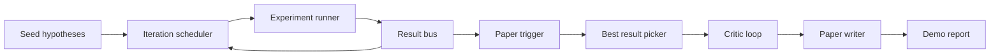
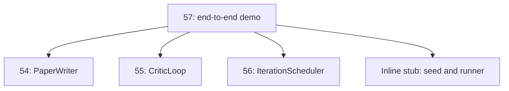
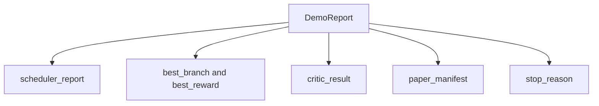

# Uçtan Uca Araştırma Demosu

> Demo, daha önce yazdığınız her sözleşmenin oluşturulması gereken yerdir. Bunlardan herhangi biri sızdırılırsa demo onu yakalayacak derstir.

**Tür:** Yapım
**Diller:** Python
**Önkoşullar:** 19. Aşama dersleri 50-53
**Süre:** ~90 dakika

## Öğrenme Hedefleri

- Otomatik araştırma döngüsünü uçtan uca bağlayın: hipotez tohumu, deney yürütücüsü, zamanlayıcı, eleştiri döngüsü, makale yazarı.
- Daha önceki dört Track D dersindeki ilkelleri, framework yerine, düz Python içe aktarmaları yoluyla oluşturun.
- Döngüyü kendi kendini sonlandıran bir sona kadar çalıştırın ve her aşamanın çıktısını listeleyen tek bir demo raporu yayınlayın.
- Test takımının nihai şekli ortaya koyabilmesi için demoyu deterministik tutun.
- Herhangi bir aşamanın sözleşmesi bozulduğunda net bir başarısızlık modu ortaya çıkarın, böylece bir sonraki aşama bozuk bir girdiyle çalışmaz.

## Burada ne oluşur



Beş aşama. Tohum üç hipotezden oluşan bir listedir. Zamanlayıcı, üç paralel yuvayla bunların üzerinde altı deney çalıştırır. Veri yolu bir veya daha fazla kağıt tetikleyicisini bildirir. Seçici tek başına en iyi sonucu seçer. Eleştirmen döngüsü bu sonuçtan oluşturulan bir taslak üzerinde yinelenir. Makaleyi yazan kişi son LaTeX, BibTeX ve bildirimi yayınlar.

## Neden kopyalamak değil de içe aktarmak

Daha önceki her ders, genel veri sınıfları ve işlevleri içeren bir `main.py` gönderir. Demo, bunları her dersin ana dizinine `sys.path` ayarlayarak aktarır. Bu framework kablolama değil; Bu, daha önceki derslerde halihazırda kullanılan test dosyalarının içe aktarılmasıyla aynıdır.



Satır içi taslak, elliden elli üçe kadar olan derslerin yerine geçer: küçük bir tohum hipotez oluşturucusu ve eşzamanlı bir ödül işlevi. Kullanıcı, iki içe aktarmayı ayarlayarak satır içi saplamayı bu derslerden gerçek ilkellerle değiştirebilir.

## Determinizm garanti eder

Demo yapısı gereği deterministiktir. Deney çalıştırıcısı uyuşmuş durumda. Eleştirmen döngüsünün düzenleyicisi sabit boyutlarda sabit sırayla yürür. Makale yazarının düzyazı oluşturucusu, elli dördüncü dersteki alay konusu olanıdır. Zamanlayıcının UCB seçicisi, rastgele seçime göre değil yineleme sırasına göre bağları koparır.

Aynı tohum verildiğinde demo aynı raporu yayınlar. Test, demoyu iki kez çalıştırarak ve bildirimi karşılaştırarak bu özelliği doğrular.

## Demo rapor şekli



Her alan kelimesi kelimesine yukarı akış aşamasından gelir. Demo herhangi bir çıktıyı dönüştürmez; onları oluşturur. Demonun yaptığı test budur.

## Arıza modu yönetimi

Her aşama ya başarılı olur ya da yazılan bir hataya neden olur.

```text
Scheduler ........ returns SchedulerReport with stop_reason
                   in {queue_empty, max_experiments, deadline}
Best-result pick . raises NoTriggerError if no paper trigger fired
Critic loop ...... returns LoopResult with status converged or stopped
Paper writer ..... raises PaperValidationError on contract break
```

Herhangi bir aşamadaki başarısızlık, demoda yazılan bir istisna dışında kısa devre yapılmasına neden olur. Testler şu sözleşmeyi sabitler: `test_no_triggers_raises_typed_error` ve `test_best_picker_raises_when_no_triggers` , hiçbir dal bir tetikleyiciyi tetiklemediğinde ve yazar hiçbir zaman çağrılmadığında seçicinin `NoTriggerError` / `BestResultError` yükselttiğini iddia eder.

## En iyi sonuç seçici

Zamanlayıcı, dal başına kağıt tetikleyiciler yayınlar. Seçici, tüm tetikleyiciler arasında en yüksek ortalama ödüle sahip dalı seçer. Demonun belirleyici olması için bağlar şube kimliğine göre alfabetik olarak bozulur. Seçici küçük, saf bir fonksiyondur; test bunu sabit bir zamanlayıcı raporuna sabitler.

## Eleştirmen döngüsünün kablolanması

Elli beşinci dersteki eleştiri döngüsü bir `MiniPaper` üzerinde çalışmaktadır. Demo, özeti dal kimliğiyle doldurarak, iki bölümü (Giriş ve Sonuçlar) tohumlayarak ve dalın ortalama ödülünden ( `>= 0.8` ise yüksek, `>= 0.6` ise orta, aksi halde düşük) `originality_tag` ayarlayarak seçilen daldan bir `MiniPaper` oluşturur.

Gözden geçiren kişi daha sonra taslağı yakınsama için yineler. Çıktı kağıt yazıcıya gider.

## Kağıt yazıcısını kablolama

Elli dördüncü dersteki makale yazarı, şekiller ve kaynakça ile tam `Paper` şekli üzerinde çalışmaktadır. Demo, seçilen dal için bir şekil ve eleştirmenin önerdiği alıntı anahtarlarının birleşiminden oluşturulmuş küçük bir sentetik bibliyografya ekleyen `mini_to_full_paper` aracılığıyla yakınsanmış `MiniPaper` 'yi yükseltir. Demonun eklediği her alıntı kaynakça listesine de eklenir, böylece doğrulama geçer.

## Kod nasıl okunur

`code/main.py` , `BestResultError`, `NoTriggerError`, `DemoReport`, `pick_best_branch`, `build_mini_paper`, `mini_to_full_paper` ve `run_demo`'yi tanımlar. Üstteki içe aktarmalar `sys.path` 'yi bir kez ayarlar ve `PaperWriter`, `CriticLoop` ve `IterationScheduler` 'yi derslerinden çeker.

`code/tests/test_e2e.py` şunları kapsar: demo uçtan uca çalışır ve beş alanın tamamının doldurulduğu bir rapor yayınlar, iki çalıştırma boyunca determinizm, hiçbir şube eşiği geçmediğinde NoTriggerError, yazarın sözleşmesi bozulduğunda PaperValidationError, kağıt bildirimi seçilen şubenin rakamını içerir ve zamanlayıcının durma nedeni beklenen değerlerden biridir.

## Daha ileri gidiyoruz

Demo yeşil olduğunda kablolamaya değer üç uzantı. Birincisi, kalıcı durum: Her aşamanın sonucu küçük bir JSON deposuna yazılır, böylece yeniden başlatma, ucuz aşamaları yeniden çalıştırmadan devam edebilir. İkincisi, bir kontrol paneli: zamanlayıcıdan ve kritik döngüsünden gelen izleme olayları tek bir zaman çizelgesi olarak oluşturulur. Üçüncüsü, gerçek model çağrıları: alaycı düzyazı oluşturucuyu ve deterministik eleştirmeni model odaklı olanlarla değiştirin; kablolama değişmez.

Demonun görevi kompozisyonun mimari olduğunu kanıtlamaktır. Beş ders, dört ithalat, bir rapor. Bir dahaki sefere sahne eklediğinizde kablolar tam olarak bir satır büyür.
