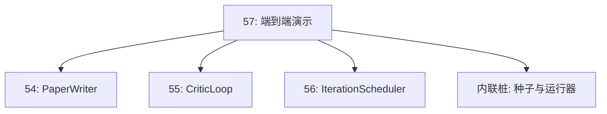

# 57 · 端到端研究演示

> 演示是检验你之前所写的每一份契约能否协同运作的试金石。如果有任何一个契约出了问题，演示就是帮你揪出它的那堂课。

**类型：** 构建
**语言：** Python
**前置：** 阶段 19 第 50-53 课
**时长：** 约 90 分钟

## 学习目标

- 将自动化研究循环（auto-research loop）端到端串联起来：假设种子（hypothesis seed）、实验运行器（experiment runner）、调度器（scheduler）、批评循环（critic loop）、论文编写器（paper writer）。
- 通过纯 Python 导入（而非框架）将 Track D 前面四课的基础组件组合在一起。
- 运行循环直到其自行终止，并输出一份演示报告（demo report），报告中列出每个阶段的输出。
- 保持演示的可确定性（deterministic），以便测试套件能够断言其最终形态。
- 当任一阶段的契约被破坏时，暴露出清晰的失败模式，确保后续阶段不会在错误输入下继续运行。

## 这里组合了什么


五个阶段。种子是三个假设组成的列表。调度器以三个并行槽位（parallel slots）跨这些假设运行六次实验。总线报告一个或多个论文触发器。选择器选出唯一的最佳结果。批评循环基于该结果生成的草稿进行迭代。论文编写器输出最终的 LaTeX、BibTeX 和清单（manifest）。

## 为什么是导入，而非复制

前面每一课都提供了一个 `main.py`，其中包含公开的数据类（dataclass）和函数。演示通过将 `sys.path` 调整到各课的父目录来导入它们。这不是框架式的接线，而是前面各课测试文件中已经在使用的同一种导入方式。



内联桩（inline stub）代替了第 50 到 53 课的内容：一个生成种子假设的小型生成器和一个同步奖励函数。用户可以通过调整两个导入语句，将内联桩替换为那些课程中的真实基础组件。

## 确定性保证

演示从构造上就是确定性的。实验运行器使用带种子的 numpy。批评循环的修订器（reviser）按固定维度、固定顺序逐步推进。论文编写器的散文生成器使用的是第 54 课中的模拟（mocked）版本。调度器的 UCB 选择器在迭代顺序上打破平局，而非随机选择。

给定相同的种子，演示会生成相同的报告。测试通过运行演示两次并比较清单来断言这一特性。

## 演示报告的形态


每个字段都原封不动地来自上游阶段。演示不转换任何输出；它只是将它们组合起来。这就是演示所要验证的事情。

## 失败模式处理

每个阶段要么成功，要么抛出一个带类型的错误。

```text
调度器 ........... 返回带有 stop_reason 的 SchedulerReport，
                   取值在 {queue_empty, max_experiments, deadline} 中
最佳结果选择器 ... 如果没有论文触发器触发，则抛出 NoTriggerError
批评循环 ......... 返回 LoopResult，状态为 converged 或 stopped
论文编写器 ....... 在契约被破坏时抛出 PaperValidationError
```

任何阶段的失败都会通过一个带类型异常让演示短路。测试对此契约进行了固定：`test_no_triggers_raises_typed_error` 和 `test_best_picker_raises_when_no_triggers` 断言在没有分支触发时，选择器抛出 `NoTriggerError` / `BestResultError`，且编写器永远不会被调用。

## 最佳结果选择器

调度器按分支发出论文触发器。选择器从所有触发器中选出平均奖励最高的分支。平局时按分支 id 的字母顺序打破，以保证演示是确定性的。选择器是一个小型纯函数；测试用固定的调度器报告对其进行了固定。

## 接入批评循环

第 55 课中的批评循环操作的是 `MiniPaper`。演示从被选中的分支构建一个 `MiniPaper`：用分支 id 填充摘要，设定两个节（Introduction 和 Results），并根据分支的平均奖励设置 `originality_tag`（`>= 0.8` 为 high，`>= 0.6` 为 medium，否则为 low）。

随后，修订器将草稿迭代至收敛。输出进入论文编写器。

## 接入论文编写器

第 54 课中的论文编写器操作完整的 `Paper` 形态，包含图表和参考文献。演示通过 `mini_to_full_paper` 将收敛后的 `MiniPaper` 升级：为选中的分支附加一个图表，并根据批评环节建议的引用键（cite key）并集构建一个小型合成参考文献列表。演示添加的每一条引用同时也被加入参考文献列表，因此验证能够通过。

## 如何阅读代码

`code/main.py` 定义了 `BestResultError`、`NoTriggerError`、`DemoReport`、`pick_best_branch`、`build_mini_paper`、`mini_to_full_paper` 和 `run_demo`。顶部的导入语句会一次性调整 `sys.path`，并从各自的课程中引入 `PaperWriter`、`CriticLoop` 和 `IterationScheduler`。

`code/tests/test_e2e.py` 覆盖了以下内容：演示端到端运行并输出包含全部五个字段的报告、两次运行的确定性、没有分支跨过阈值时抛出 NoTriggerError、编写器契约被破坏时抛出 PaperValidationError、论文清单包含被选中分支的图表、调度器的停止原因是预期值之一。

## 进一步拓展

当演示跑通之后，有三个值得接入的扩展方向。第一，持久化状态：每个阶段的结果写入一个小型 JSON 存储，这样重启时无需重新运行已完成的低成本阶段即可恢复执行。第二，仪表盘：调度器和批评循环的跟踪事件（trace events）渲染为单一时间线。第三，真实模型调用：将模拟的散文生成器和确定性批评替换为模型驱动版本；接线方式无需任何改变。

演示的职责是证明组合本身就是架构。五节课，四次导入，一份报告。下次你再添加一个阶段时，接线只多一行。
