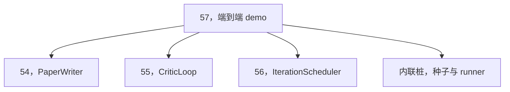
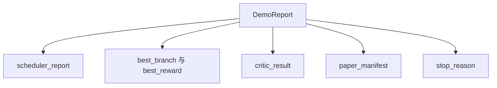

# 端到端研究 demo（End-to-End Research Demo）

> 译注：本文译自同目录 [`en.md`](./en.md)。术语遵循仓根 [TRANSLATION_GUIDE.md](../../../../TRANSLATION_GUIDE.md)。

> demo 是前面写过的所有契约必须组合起来的地方。任何一个契约漏了，demo 就是把它逮个正着的那堂课。

**Type:** Build
**Languages:** Python
**Prerequisites:** Phase 19 lessons 50-53
**Time:** ~90 minutes

## 学习目标（Learning Objectives）

- 把自动研究 loop 端到端串起来：hypothesis（假设）种子、实验 runner、调度器、critic loop（评审循环）、paper writer（论文写手）。
- 用普通 Python import 把前面四节 Track D 课的原语组合起来，而不是套一个框架。
- 让 loop 跑到自终止，并发出一份列出每个阶段输出的 demo 报告。
- 保持 demo 是确定性的，这样测试套件能对最终形态做断言。
- 当任何一个阶段的契约破了的时候，把失败模式清晰地暴露出来，让下一个阶段不会拿着坏掉的输入继续跑。

## 在这里组合的是什么（What composes here）


五个阶段。种子是三条 hypothesis 的列表。调度器在三个并行槽位里跨这三条假设跑六个实验。bus 报告一个或多个 paper 触发。picker 挑出唯一的最佳结果。critic loop 在从那个结果构建出的草稿上做迭代。paper writer 发出最终的 LaTeX、BibTeX 和 manifest。

## 为什么是 import，而不是复制（Why import, not copy）

前面每节课都附了一个带公开 dataclass 和函数的 `main.py`。demo 通过把 `sys.path` 调到每节课的父目录来 import 它们。这不是框架式接线；这就是前面那几节课的测试文件已经在用的同一种 import 方式。



那个内联 stub 顶替了第五十到五十三节课：一个小的种子假设生成器加一个同步的奖励函数。用户只要改两处 import，就能把内联 stub 换成那几节课里真正的原语。

## 确定性保证（Determinism guarantees）

demo 在构造上就是确定性的。实验 runner 是带种子的 numpy。critic loop 的修订器按固定顺序走固定维度。paper writer 的散文生成器是第五十四节课里那个 mock 过的版本。调度器的 UCB picker 在打平时按迭代顺序破平，而不是随机挑。

种子相同，demo 发出的报告就相同。测试通过把 demo 跑两次并比对 manifest 来对这条性质做断言。

## demo 报告的形态（The demo report shape）



每个字段都原样来自上游阶段。demo 不对任何输出做变换；它只是把它们组合起来。这就是 demo 本身要做的那场测试。

## 失败模式处理（Failure mode handling）

每个阶段要么成功，要么抛一个有类型的错误。

```text
Scheduler ........ returns SchedulerReport with stop_reason
                   in {queue_empty, max_experiments, deadline}
Best-result pick . raises NoTriggerError if no paper trigger fired
Critic loop ...... returns LoopResult with status converged or stopped
Paper writer ..... raises PaperValidationError on contract break
```

任何一个阶段失败都会用一个有类型的异常把 demo 短路掉。测试把这条契约钉死：`test_no_triggers_raises_typed_error` 和 `test_best_picker_raises_when_no_triggers` 断言当没有 branch 触发 trigger 时 picker 会抛出 `NoTriggerError` / `BestResultError`，而 writer 永远不会被调用。

## 最佳结果 picker（The best-result picker）

调度器按 branch 发出 paper 触发。picker 挑出在所有触发里平均奖励最高的那个 branch。打平时按 branch id 字母序破平，让 demo 保持确定性。picker 是一个小的纯函数；测试把它钉在一个固定的调度器报告上。

## 接上 critic loop（Wiring the critic loop）

第五十五节课里的 critic loop 跑在一个 `MiniPaper` 上。demo 从挑出的 branch 构造一个 `MiniPaper`：把摘要填成 branch id，初始化两个 section（Introduction 和 Results），并按 branch 的平均奖励设置 `originality_tag`（`>= 0.8` 为高，`>= 0.6` 为中，否则为低）。

修订器随后把草稿迭代到收敛。输出再喂给 paper writer。

## 接上 paper writer（Wiring the paper writer）

第五十四节课里的 paper writer 跑在带图和参考文献的完整 `Paper` 形态上。demo 通过 `mini_to_full_paper` 把收敛后的 `MiniPaper` 升格——它会为选中的 branch 挂上一张图，并基于 critic 建议的 cite key 的并集构造一个小的合成参考文献列表。demo 加进去的每一条 cite 同时也加进了参考文献列表，所以校验能通过。

## 怎么读这份代码（How to read the code）

`code/main.py` 定义了 `BestResultError`、`NoTriggerError`、`DemoReport`、`pick_best_branch`、`build_mini_paper`、`mini_to_full_paper` 和 `run_demo`。文件顶部的 import 一次性调好 `sys.path`，再从对应课程里把 `PaperWriter`、`CriticLoop` 和 `IterationScheduler` 拉进来。

`code/tests/test_e2e.py` 覆盖：demo 端到端跑通并发出五个字段都填好了的报告；两次跑之间的确定性；当没有 branch 越过阈值时抛 NoTriggerError；当 writer 的契约被打破时抛 PaperValidationError；论文 manifest 包含被挑中那个 branch 的图；以及调度器的 stop reason 是预期值之一。

## 再往前走（Going further）

demo 跑绿了之后值得再接三件扩展。第一，持久化状态：每个阶段的结果写入一个小的 JSON 存储，这样重启后可以续跑而不必重跑那些便宜的阶段。第二，仪表盘：把调度器和 critic loop 发的 trace 事件渲染成一条统一的时间线。第三，真实的模型调用：把 mock 过的散文生成器和确定性 critic 换成模型驱动的版本；接线方式不会变。

demo 的任务是证明：组合本身就是架构。五节课、四个 import、一份报告。下次你再加一个阶段，接线只会多出恰好一行。
