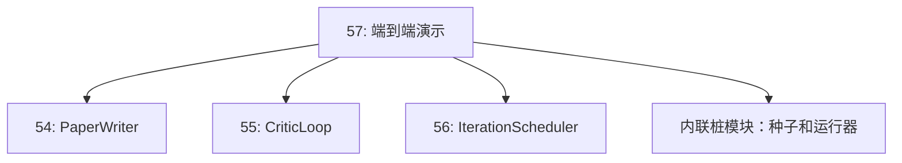
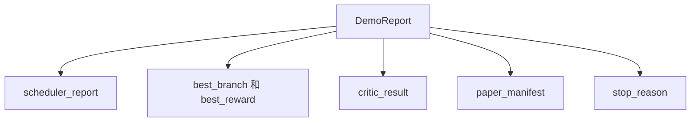

# 端到端研究演示

> 演示是检验你之前编写的每一个约定是否协同工作的地方。只要其中任何一个存在漏洞，演示就会成为抓住它的教训。

**类型：** 构建
**语言：** Python
**前置条件：** 阶段 19 第 50–53 课
**时长：** 约 90 分钟

## 学习目标

- 将自动研究循环端到端连接起来：假设种子、实验运行器、调度器、评审循环、论文撰写器。
- 通过纯 Python 导入（而非框架）组合来自前四节 Track D 课程的原语。
- 运行循环直至自行终止，并输出一份包含每个阶段输出的单一演示报告。
- 保持演示的确定性，以便测试套件能够断言最终形态。
- 当任何阶段的约定被破坏时，暴露清晰的失败模式，使下一阶段不会以错误的输入运行。

## 此处组合了什么


```mermaid
flowchart LR
    Seed[种子假设] --> Sched[迭代调度器]
    Sched --> Exp[实验运行器]
    Exp --> Bus[结果总线]
    Bus --> Sched
    Bus --> Trig[论文触发器]
    Trig --> Pick[最佳结果选择器]
    Pick --> Critic[评审循环]
    Critic --> Writer[论文撰写器]
    Writer --> Report[演示报告]
```

五个阶段。种子是一个包含三个假设的列表。调度器使用三个并行槽对它们运行六个实验。总线报告一个或多个论文触发器。选择器选择单个最佳结果。评审循环基于该结果迭代一份草稿。论文撰写器输出最终的 LaTeX、BibTeX 和清单。

## 为什么用导入而非复制

每节早期课程都提供一个包含公共数据类和函数的 `main.py`。演示通过调整 `sys.path` 指向每节课程的父目录来导入它们。这不是框架式的连接；它正是早期课程中测试文件已经在使用的导入方式。


```mermaid
flowchart TB
    Demo[57: 端到端演示] --> A[54: PaperWriter]
    Demo --> B[55: CriticLoop]
    Demo --> C[56: IterationScheduler]
    Demo --> Inline[内联桩模块：种子和运行器]
```

内联桩模块替代了第五十至五十三课：一个种子假设的小型生成器和一个同步奖励函数。用户可以通过调整两个导入，将内联桩模块替换为来自那些课程的真实原语。

## 确定性保证

演示在结构上是确定性的。实验运行器使用设置了种子的 numpy。评审循环的修订器按固定顺序遍历固定维度。论文撰写器的散文生成器是来自第五十四课的模拟版本。调度器的 UCB 选择器按迭代顺序（而非随机选择）打破平局。

给定相同的种子，演示会输出相同的报告。测试通过运行演示两次并比较清单来断言这一属性。

## 演示报告结构


```mermaid
flowchart TB
    Rep[DemoReport] --> Sch[scheduler_report]
    Rep --> Pick[best_branch 和 best_reward]
    Rep --> Cri[critic_result]
    Rep --> Pap[paper_manifest]
    Rep --> Term[stop_reason]
```

每个字段直接来自上游阶段。演示不转换任何输出；它只是组合它们。这就是演示所要验证的。

## 失败模式处理

每个阶段要么成功，要么引发一个类型化的错误。

```text
调度器 ........ 返回包含 stop_reason 的 SchedulerReport，
                  可能的取值为 queue_empty、max_experiments、deadline
最佳结果选择器 . 如果未触发任何论文触发器，则引发 NoTriggerError
评审循环 ...... 返回状态为 converged 或 stopped 的 LoopResult
论文撰写器 ..... 在约定被破坏时引发 PaperValidationError
```

任何阶段的失败都会通过类型化的异常使演示短路。测试固定了这一约定：`test_no_triggers_raises_typed_error` 和 `test_best_picker_raises_when_no_triggers` 断言当没有分支触发触发器时，选择器会引发 `NoTriggerError` / `BestResultError`，并且不会调用撰写器。

## 最佳结果选择器

调度器为每个分支发出论文触发器。选择器选择在所有触发器中平均奖励最高的分支。平局时按分支 ID 的字母顺序打破，以保证演示的确定性。选择器是一个小型纯函数；测试在固定的调度器报告上固定了它。

## 连接评审循环

第五十五课中的评审循环操作一个 `MiniPaper`。演示通过使用分支 ID 填充摘要、播种两个章节（引言和结果），并根据分支的平均奖励设置 `originality_tag`（如果 `>= 0.8` 则为高，如果 `>= 0.6` 则为中，否则为低），从选中的分支构建一个 `MiniPaper`。

然后修订器迭代草稿直至收敛。输出进入论文撰写器。

## 连接论文撰写器

第五十四课中的论文撰写器操作完整的 `Paper` 结构，包含图表和参考文献。演示通过 `mini_to_full_paper` 将收敛后的 `MiniPaper` 升级为完整形态，该函数为选中的分支附加一张图表，并构建一个基于评审建议的引用键合并的小型合成参考文献列表。演示添加的每个引用也同时加入参考文献列表，因此验证能够通过。

## 如何阅读代码

`code/main.py` 定义了 `BestResultError`、`NoTriggerError`、`DemoReport`、`pick_best_branch`、`build_mini_paper`、`mini_to_full_paper` 和 `run_demo`。顶部的导入一次性调整 `sys.path`，并从各课程中引入 `PaperWriter`、`CriticLoop` 和 `IterationScheduler`。

`code/tests/test_e2e.py` 覆盖了：演示端到端运行并输出包含全部五个字段的报告、两次运行之间的确定性、当没有分支超过阈值时产生 NoTriggerError、当撰写器的约定被破坏时产生 PaperValidationError、论文清单包含选中分支的图表，以及调度器停止原因是预期值之一。

## 深入拓展

演示通过后，有三个值得连接的扩展。第一，持久化状态：每个阶段的结果写入一个小的 JSON 存储，以便重启时可以恢复而无需重新运行廉价阶段。第二，仪表盘：调度器和评审循环的追踪事件渲染为单一时间线。第三，真实模型调用：将模拟的散文生成器和确定性评审替换为模型驱动的版本；连接方式不变。

演示的任务是证明组合即架构。五节课，四个导入，一份报告。下次你添加一个阶段时，连接代码恰好增加一行。
