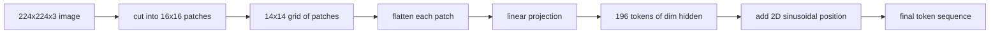

# Vision Encoder Yamaları

> Pikselleri okuyan bir görüş modelinin pikseller için bir tokenizer'ye ihtiyacı vardır. embedding yaması şu tokenizer. Görüntüyü karelerden oluşan bir ızgaraya kesin, her kareyi düzleştirin, onu bir doğrusal katman boyunca yansıtın, ardından bir 2B konum sinyali ekleyin, böylece transformer her karenin orijinal görüntüde nerede bulunduğunu bilir.

**Tür:** Yapım
**Diller:** Python
**Önkoşullar:** Aşama 19 dersleri 30-37 (B Yolunun temelleri)
**Süre:** ~90 dakika

## Öğrenme Hedefleri

- Tokenbir görüntüyü sabit uzunlukta bir yama embedding dizisine dönüştürür.
- Açılı-sonra-doğrusal matematikle eşleşen `Conv2d` tabanlı bir yama projeksiyonu uygulayın.
- Belirleyici bir 2 boyutlu sinüzoidal konum embedding oluşturun, böylece token düzeni uzaysal konumu kodlar.
- Sentetik bir fikstür üzerinde yama sayısını, embedding şeklini ve `Conv2d`/açılma eşdeğerliğini doğrulayın.

## Sorun

Bir transformer bir dizi vektörü yer. Bir görüntü 3 kanallı bir ızgaradır. Her pikseli bir token olarak okumak dizi uzunluğunu patlatır: 224x224 RGB görüntü 150.528 tokens'dir ve 12 katmanlı bir transformer bu dikkati karşılayamaz. Görüntüyü dev bir düz vektör olarak okumak, dikkat katmanının kurtaramayacağı yerelliği ortadan kaldırır. Kodlayıcı ön ucunun görevi, piksel ızgarasını her biri bir kare bölgeyi özetleyen birkaç yüz token'a sıkıştırmaktır.

embedding Yaması bunu bir doğrusal projeksiyonla çözmektedir. 16x16 parçaya kesilen 224x224 boyutlu bir görüntü, 196 parçadan oluşan 14x14 ızgara oluşturur. Her yama, `(3, 16, 16) = 768` piksel değerinden tek bir vektöre düzleştirilir, ardından doğrusal bir katman onu modelin gizli boyutuyla eşler. transformer, 196 tokens boyutunda `hidden` (genellikle 768) artı bir CLS token görür. Bu, ağın geri kalanının çiğneyebileceği bir dizi.

## Konsept



### Neden pikseller değil yamalar

Dikkat dizi uzunluğu bakımından ikinci derecedendir. 196-token dizisi, katman başına kafa başına `196 * 196 = 38,416` dikkat puanına mal olur; 150,528-token'lik bir dizinin maliyeti `150,528 * 150,528 = 22.6 billion`'dir. Yamalar, dikkat hesaplamasında 590.000 kat azalma sağlar ve 16x16'lık tek bir bölge, yüksek seviyeli görme görevleri için yeterli sinyali taşır. Maliyet, bir yama içindeki ince taneli uzamsal ayrıntıların kaybıdır; bu nedenle, ince yerelleştirme önemli olduğunda aşağı yönlü çok modlu yığınlar genellikle ikinci bir yüksek çözünürlüklü dal çalıştırır.

### Neden doğrusal bir projeksiyon yeterlidir?

Her yama bağımsız bir vektör olarak ele alınır. Projeksiyon bir temel öğreniyor: kenar dedektörleri, renk filtreleri, basit dokular. Tek bir doğrusal katman küçüktür (ViT-Base için `768 * 768 = 589,824` parametreler) ve hızlı eğitilir. Daha derin evrişimli gövdeler mevcuttur ("hibrit" ViT), ancak düz doğrusal projeksiyon standarttır ve modern açık ağırlıklı kodlayıcıların çoğu bu tam şekil ile gönderilir.

### `Conv2d` numarası

Dolgusuz bir `Conv2d(in_channels=3, out_channels=hidden, kernel_size=patch_size, stride=patch_size)` , daha sonra doğrusal olanla aynı sayısal sonucu verir, çünkü her çıktı konumu, yama piksellerini bir filtreye göre nokta olarak üretir. Evrişim yama projeksiyonudur ve çoğu üretim kod tabanı bunu bu şekilde gönderir çünkü GPU'da daha hızlıdır ve daha az yeniden şekillendirme kullanır.

### Konum embeddings

Token'lar projeksiyondan hiçbir emir taşımazlar. 2 boyutlu sinüzoidal embedding, her token'a, `(row, col)` konumunu kodlayan sabit bir sinyal verir. embedding boyutunun yarısı, satır konumunu birden fazla frekansta sin/cos ile kodlar; diğer yarısı sütun konumunu kodlar. Kodlama deterministiktir, böylece yeniden eğitime gerek kalmadan çözünürlükleri değiştirebilirsiniz ve modelin eğitim sırasında hiç görmediği ızgaralara temiz bir şekilde enterpolasyon yapar.

| Bileşen | Şekil | Parametreler |
|-----------|-------|------------|
| Yama projeksiyonu (`Conv2d`) | `(hidden, 3, patch, patch)` | `3 * P * P * hidden + hidden` |
| Konum embedding (sabit) | `(num_patches, hidden)` | 0 (hesaplanmıştır, öğrenilmemiştir) |
| CLS token (öğrenildi) | `(1, hidden)` | `hidden` |

224 çözünürlükte ViT-Base/16 için: projeksiyonda 590.592 parametre, CLS token'de 768 ve sinüzoidal konum için sıfır. Bir sonraki ders (59), bu ön ucun üstüne 12 katmanlı bir transformer yığıyor.

### Akıl sağlığı kontrolü olarak eşdeğerlik

Yama adımının iki yazılışı vardır: `Conv2d` projeksiyonu ve açık, sonra doğrusal. Aynı ağırlıklar için aynı çıktıyı üretmeleri gerekir. Aksi takdirde, açık matematik yanlıştır ve kodlayıcının geri kalanı kum üzerine inşa edilmiştir. Bu dersteki testler bu eşdeğerliği uygulamaktadır.

## Build It — Kendin Geliştir

`code/main.py` şunu uygular:

- `PatchEmbed`, yama projeksiyonu için bir `nn.Module` sarma `Conv2d` .
- `sinusoidal_2d(grid_h, grid_w, dim)`, 2B konum tablosunu oluşturan durum bilgisi olmayan bir işlev.
- `VisionFrontEnd`, embedding yamasını, CLS başına eklemeyi ve konum eklemeyi tek bir ileri geçişte oluşturur.
- `numpy.random`'den deterministik 224x224x3 fikstür oluşturan bir `synthesize_image(seed)` yardımcı.
- Bir fikstür görüntüsünü ön uçtan çalıştıran ve çıktı şeklini, CLS token normunu ve embedding konumunun bir satırını yazdıran bir demo.

Çalıştır:

```bash
python3 code/main.py
```

Çıktı: 224x224 fikstür tokenbir dizi `(1, 197, 768)` şekline göre boyutlandırılmıştır. İlk token CLS'dir; sonraki 196 yama token'lardır. Konum embedding normları bir satır içinde tekdüzedir, bu sinüzoidal imzadır.

## Use It — Hazır Araçla Uygula

Aynı yama ön ucu, tüm modern görüş dili modellerinde görülür: CLIP ViT-L/14, SigLIP, DINOv2, Qwen-VL ailesi ve InternVL yığınının tümü, bir `Conv2d` yama projeksiyonu artı bir konum sinyalinden başlar. Aşağı yönde yaşayan aileler arasındaki farklılıklar (CLS ve CLS olmayan havuzlama, kayıt token'lar, değişen yama boyutları 14'e 16, enterpolasyonlu konumlar aracılığıyla dinamik çözünürlük). Bu dersteki ön uç, bu modellerin her birinin üzerinde durduğu alt tabakadır.

## Testler

`code/test_main.py` şunları kapsar:

- yama sayısı `(image_size / patch_size) ** 2` ile eşleşiyor
- çıktı şekli `(batch, num_patches + 1, hidden)` ile eşleşiyor
- `Conv2d` projeksiyonu, küçük bir fikstür üzerinde manuel açma ve ardından doğrusallığa eşittir
- sinüzoidal konum tablosu çağrılar arasında belirleyicidir
- CLS token toplu loşlukta sızıntı olmadan yayın yapar

Onları çalıştırın:

```bash
python3 -m unittest code/test_main.py
```

## Egzersizler

1. Sinüzoidal konumu öğrenilmiş bir `nn.Parameter` ile değiştirin ve küçük bir sentetik sınıflandırma görevinde ilk dönem kaybını karşılaştırın. Öğrenilen pozisyonlar sabit çözünürlükte kazanır; Eğitimden sonra çözünürlüğü değiştirdiğinizde sinüzoidal kazanır.

2. `Conv2d` 'yı açık bir `nn.Unfold` artı `nn.Linear` ile değiştirin ve çıkışların değişkenlik toleransı dahilinde eşleştiğini iddia edin. Aynı matematik, bunu hecelemenin iki yolu.

3. Kare olmayan yama boyutları için destek ekleyin (e.g. 32x16 geniş en-boy girişleri için) ve konum tablosunun kare olmayan ızgaraları işlediğini doğrulayın.

4. 1, 8, 64 parti boyutlarında yama adımının profilini çıkarın. Yama projeksiyonu nadiren darboğaz oluşturur; aşağı yöndeki dikkat katmanları hakimdir.

5. Ön ucu, 4 sınıflı sentetik şekil dataset (daireler, kareler, üçgenler, yıldızlar) üzerinde donmuş özellik çıkarıcı olarak eğitin. CLS token çıkışı doğrusal olarak ayrılmalıdır.

## Anahtar Terimler

| Dönem | Ne anlama geliyor |
|------|---------------|
| Yama | Görüntünün kare alt bölgesi, genellikle 14x14 veya 16x16 |
| Yama embedding | Düzleştirilmiş bir yamanın gizli loşluğa doğrusal projeksiyonu |
| Sıra uzunluğu | Yama tokenlaştırma sonrasındaki token sayısı, genellikle artı CLS |
| Sinüzoidal konum | 2D ızgara koordinatlarını kodlayan sabit sin/cos sinyali |
| CLS token | Öğrenilen vektör, havuzlama başlığı olarak dizinin başına eklenmiştir |

## Daha Fazla Okuma

- Orijinal yama gömme çerçeveleme için Bir Görüntü 16x16 Kelimeye Değerdir (ViT, 2021).
- Burada 2D'ye uyarlanan sinüzoidal konum formülü için Dikkat Tek İhtiyacınız Var (2017).
- token kayıtları için DINOv2 kağıdı, 6. alıştırma olarak ekleyebileceğiniz bir uzantı.
