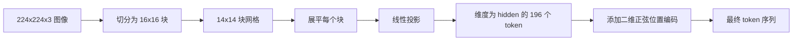

# Vision Encoder Patches（视觉编码器分块）

> 一个读取像素的视觉模型需要为像素配备一个分词器。分块嵌入（Patch Embedding）就是这个分词器。将图像切割成正方形网格，展平每个方块，通过一个线性层进行投影，然后添加二维位置信号，这样 Transformer 就能知道每个方块在原始图像中的位置。

**类型：** 构建
**语言：** Python
**前置知识：** 第 19 阶段第 30–37 课（Track B 基础）
**时长：** 约 90 分钟

## 学习目标

- 将图像分词化为固定长度的分块嵌入序列。
- 实现基于 `Conv2d` 的分块投影，其数学原理等价于 unfold-then-linear。
- 构建确定性二维正弦位置嵌入，使 token 顺序编码空间位置。
- 在合成测试数据上验证分块数量、嵌入形状以及 `Conv2d`/unfold 的等价性。

## 问题

Transformer 处理的是向量序列，而图像是一个三通道的网格。如果每个像素都被当作一个 token，序列长度将会爆炸：一张 224x224 的 RGB 图像会产生 150,528 个 token，这是 12 层 Transformer 在注意力计算中无法承受的。将整张图像当作一个巨大的扁平向量来处理则会丢失局部性信息，而注意力层无法弥补这一点。编码器前端的工作就是将像素网格压缩成几百个 token，每个 token 概括一个正方形区域的信息。

分块嵌入通过一次线性投影解决了这个问题。一张 224x224 的图像，切成 16x16 的块后，会产生一个 14x14 的网格，共 196 个块。每个块从 `(3, 16, 16) = 768` 个像素值展平成一个向量，然后通过一个线性层映射到模型的隐藏维度。Transformer 会看到维度为 `hidden`（通常为 768）的 196 个 token 加上一个 CLS token。这个序列就是网络后续部分可以处理的了。

## 概念



### 为什么用分块而非像素

注意力机制的复杂度与序列长度呈二次方关系。一个 196 个 token 的序列每层每个注意力头的计算量为 `196 * 196 = 38,416` 个注意力分数；而一个 150,528 个 token 的序列则需要 `150,528 * 150,528 = 226 亿` 次计算。分块带来了 590,000 倍的注意力计算量缩减，同时一个 16x16 的区域已经承载了足够的高层视觉任务所需的信号。代价是单个分块内部精细空间细节的丢失——这就是为什么下游多模态模型在需要精细定位时，通常会额外运行一个高分辨率分支。

### 为什么线性投影就足够了

每个分块被当作一个独立的向量来处理。投影层学习一组基：边缘检测器、颜色滤波器、简单纹理。单个线性层规模很小（ViT-Base 只需要 `768 * 768 = 589,824` 个参数），训练速度快。虽然也存在更深的卷积主干（即"混合"ViT），但平坦的线性投影是标准做法，大多数现代开源权重编码器都使用这种精确的形状。

### `Conv2d` 技巧

一个 `Conv2d(in_channels=3, out_channels=hidden, kernel_size=patch_size, stride=patch_size)`（无填充）在数值上与 unfold-then-linear 得到相同的结果，因为每个输出位置将分块像素与一个滤波器做点积。卷积就是分块投影，大多数生产代码库都采用这种方式，因为它在 GPU 上更快，并且减少了一次 reshape 操作。

### 位置嵌入

投影后的 token 本身不携带顺序信息。二维正弦嵌入为每个 token 提供一个固定的信号，编码其 `(row, col)` 位置。一半的嵌入维度使用多个频率的正弦/余弦函数编码行位置；另一半编码列位置。这种编码是确定性的，因此可以在不重新训练的情况下切换分辨率，并且能够很好地插值到模型在训练时从未见过的网格尺寸。

| 组件 | 形状 | 参数量 |
|-----------|-------|------------|
| 分块投影（`Conv2d`） | `(hidden, 3, patch, patch)` | `3 * P * P * hidden + hidden` |
| 位置嵌入（固定） | `(num_patches, hidden)` | 0（计算生成，非学习） |
| CLS token（可学习） | `(1, hidden)` | `hidden` |

对于 224 分辨率下的 ViT-Base/16：投影层 590,592 个参数，CLS token 768 个参数，正弦位置参数为零。下一课（第 59 课）将在此前端之上堆叠一个 12 层 Transformer。

### 等价性检查

分块步骤有两种实现方式：`Conv2d` 投影和显式的 unfold-then-linear。在相同权重下，它们必须产生相同的输出。如果不能，则 unfold 数学实现有误，编码器的其余部分将建立在错误的基础之上。本课的测试将验证这种等价性。

## 构建

`code/main.py` 实现了：

- `PatchEmbed`，一个封装了 `Conv2d` 用于分块投影的 `nn.Module`。
- `sinusoidal_2d(grid_h, grid_w, dim)`，一个构建二维位置表的无状态函数。
- `VisionFrontEnd`，将分块嵌入、CLS token 前置和位置加法组合到一次前向传播中。
- `synthesize_image(seed)` 辅助函数，使用 `numpy.random` 构建一个确定性的 224x224x3 测试数据。
- 一个演示程序，将一张测试图像通过前端处理，并输出形状、CLS token 范数和位置嵌入的一行。

运行方式：

```bash
python3 code/main.py
```

输出：224x224 的测试图像被分词化为形状为 `(1, 197, 768)` 的序列。第一个 token 是 CLS；接下来的 196 个是分块 token。位置嵌入的范数在同一行内是一致的，这正是正弦嵌入的特征。

## 应用场景

同样的分块前端出现在所有现代视觉语言模型中：CLIP ViT-L/14、SigLIP、DINOv2、Qwen-VL 系列和 InternVL 栈都始于一个 `Conv2d` 分块投影加上位置信号。不同系列之间的差异在下游部分（CLS 与无 CLS 池化、寄存器 token、不同的分块大小 14 与 16、通过插值位置实现的动态分辨率）。本课中的前端是所有那些模型所依赖的基础组件。

## 测试

`code/test_main.py` 覆盖以下内容：

- 分块数量匹配 `(image_size / patch_size) ** 2`
- 输出形状匹配 `(batch, num_patches + 1, hidden)`
- `Conv2d` 投影与手动 unfold-then-linear 在小型测试数据上结果一致
- 正弦位置表在多次调用间具有确定性
- CLS token 在 batch 维度上广播且不会泄漏信息

运行测试：

```bash
python3 -m unittest code/test_main.py
```

## 练习

1. 将正弦位置替换为可学习的 `nn.Parameter`，并在一个小型合成分类任务上比较第一个 epoch 的损失。在固定分辨率下，可学习位置更优；在训练后改变分辨率时，正弦位置更优。

2. 将 `Conv2d` 替换为显式的 `nn.Unfold` 加 `nn.Linear`，并断言两者输出在浮点容差范围内一致。相同的数学原理，两种实现方式。

3. 增加对非正方形分块尺寸的支持（例如宽高比输入使用 32x16），并验证位置表能正确处理非正方形网格。

4. 在 batch 大小为 1、8、64 时对分块步骤进行性能分析。分块投影很少成为瓶颈；下游的注意力层才是主要消耗。

5. 将前端作为冻结的特征提取器，在 4 类合成形状数据集（圆形、方形、三角形、星形）上进行训练。CLS token 的输出应能线性可分。

## 关键术语

| 术语 | 含义 |
|------|------|
| 分块（Patch） | 图像的一个正方形子区域，通常为 14x14 或 16x16 |
| 分块嵌入（Patch embedding） | 将一个展平的分块线性投影到隐藏维度 |
| 序列长度（Sequence length） | 分块分词化后的 token 数量，通常加上 CLS token |
| 正弦位置（Sinusoidal position） | 固定的正弦/余弦信号，用于编码二维网格坐标 |
| CLS token | 可学习的向量，前置到序列前作为汇聚头 |

## 延伸阅读

- *An Image is Worth 16x16 Words*（ViT，2021），分块嵌入框架的原始论文。
- *Attention Is All You Need*（2017），本文中正弦位置公式的出处，此处将其适配为二维。
- DINOv2 论文，关于寄存器 token——你可以将其作为练习 6 来添加扩展。
