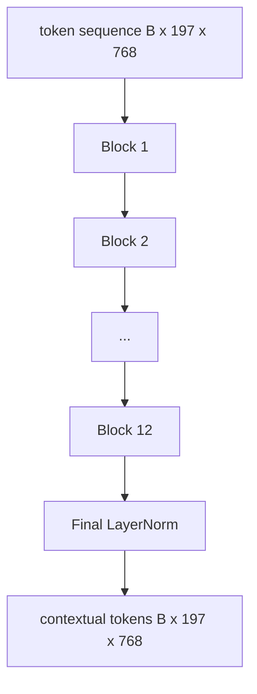
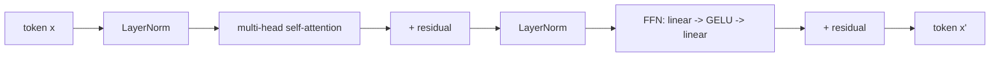

# Vizyon Transformer Kodlayıcı

> Yamaları tek başına görmüyoruz. 12 dikkat başlığına sahip 12 katmanlı ön-LN transformer, yama token dizisini bağlamsal token dizisine dönüştürür ve CLS token tüm görüntü özelliklerini son gizli durumunda bir araya toplar. Bu ders her modern görme dili modelinin makine dairesidir.

**Tür:** Yapım
**Diller:** Python
**Önkoşullar:** Aşama 19 dersleri 30-37 (B Yolunun temelleri)
**Süre:** ~90 dakika

## Öğrenme Hedefleri

- Çok başlı öz dikkat ve ileri beslemeli alt katmana sahip bir LN öncesi transformer bloğu uygulayın.
- Bir ViT-Base kodlayıcı oluşturmak için 12 bloktan 12'sini istifleyin.
- Ders 58'deki yamanın ön ucunu kodlayıcıya bağlayın ve ileri bir geçiş yapın.
- CLS token'ın her yamadaki bilgileri topladığını doğrulayın.

## Sorun

embedding yaması, her biri başka herhangi bir yamanın farkında olmayan bir vektör olan 197 token'lik bir dizi üretir. Bir kedi resminde hangi parçaların bıyık, hangilerinin arka plan ve hangilerinin göz içerdiğini bilmek için her parçaya ihtiyaç vardır. transformer, her seferinde bir dikkat katmanı olmak üzere bu farkındalığı oluşturan mekanizmadır. O olmadan yama ön ucu hiçbir anlayışa sahip olmayan akıllı bir tokenizer olur.

Standart tarif, on iki blok derinliğinde, on iki kafa genişliğinde olup, LayerNorm öncesi yerleştirme, GELU aktivasyonu ve 4x ileri besleme genişletme özelliğine sahiptir. Bu tarif, CLIP ViT-L, SigLIP, DINOv2, Qwen-VL ailesi, InternVL ve 2025-2026'nın diğer tüm açık ağırlıklı görüntü kodlayıcılarının omurgasını oluşturmaktadır. Tarif, aksi açıkça belirtilmediği sürece bu makalelerden herhangi birini okuyabileceğiniz ve bu blok şeklini alabileceğiniz kadar kararlıdır.

## Konsept





### LN öncesi ve LN sonrası

Orijinal Transformer, LayerNorm'u artıktan sonra yerleştirdi. Ön-LN (her alt katmandan önceki KatmanNorm), her modern görüş dili modelinin kullandığı versiyondur, çünkü öğrenme hızı ısınma hileleri olmadan istikrarlı bir şekilde eğitim verir. Fark ileri geçişte bir çizgidir ve 12+ derinlikteki gradient akışı gece ve gündüzdür.

### Çok kafalı öz dikkat

Her kafa, token vektörünü, `head_dim = hidden / num_heads` boyutlu kendi `(query, key, value)` üçlüsüne yansıtır. `hidden = 768` ve `heads = 12` ile her kafada `dim = 64` bulunur. 12 kafa paralel olarak katılır, ardından çıktıları 768 boyutuna geri döner ve bir çıktı projeksiyonundan geçer. Çoklu kafanın amacı, bir kafanın "kedi gözüyle ilgilenmeyi" öğrenebilmesi, diğerinin ise müdahale olmadan "arka planla ilgilenmeyi gradient" öğrenebilmesidir.

### Neden 4x ileri beslemeli genişleme

FFN ortada GELU olacak şekilde `hidden -> 4 * hidden -> hidden` olur. Faktör 4 ampiriktir ve 2017'den bu yana dil ve vizyon transformer'larda geçerliliğini korumuştur. Daha küçük (2x) yetersiz uyum; sabit veri bütçesinde daha büyük (8 kat) fazla uyum. MLP, modelin öğrenilen gerçeklerin çoğunu depoladığı yerdir ve daha geniş olan orta kısım ise modelin bulunduğu yerdir.

| Bileşen | ViT-Base ölçeğindeki parametreler |
|-----------|------------------------------|
| blok başına qkv projeksiyonu | `3 * 768 * 768 = 1.77M` |
| blok başına çıktı projeksiyonu | `768 * 768 = 590K` |
| Blok başına FFN (4x genişletme) | `2 * 768 * 4 * 768 = 4.72M` |
| Blok başına KatmanNormu | `4 * 768 = 3K` |
| Blok başına toplam | yaklaşık 7,1 milyon |
| 12 blok | yaklaşık 85M |
| Ayrıca ön uç | toplamda yaklaşık 86 milyon |

ViT-Base 86M parametreli bir kodlayıcıdır. Bu, 2026 standartlarına göre küçüktür (SigLIP-So400M, 400M, Qwen-VL ViT, 675M'dir), ancak mimari, genişlik ve derinliğe kadar aynıdır.

### Nedensel maske mi, değil mi?

Vizyon Transformer'lar yalnızca kodlayıcıdır ve çift yönlüdür: token `i` , herhangi bir çift için token `j` ile ilgilenebilir. Maske yok. 61. dersteki kod çözücü tarafındaki çapraz dikkat nedensel bir maske kullanacaktır, ancak görüş kodlayıcının içinde dikkat tamamen bağlantılıdır.

### CLS token ne öğrenir?

CLS token öğrenilmiş bir parametre olarak başlar, kendine ait bir yama içeriğine sahip değildir ve her blokta dikkat yoluyla bilgi biriktirir. Son katmanda, CLS satırı tüm görüntünün bir vektör özetidir; aşağı akış başlıkları bu tek vektörü sınıf logitlerine, karşılaştırmalı embedding'lara veya bir metin kod çözücü için çapraz dikkat anahtarlarına yansıtır.

## Build It — Kendin Geliştir

`code/main.py` şunu uygular:

- `MultiHeadSelfAttention`, `qkv` ve çıktı projeksiyonları, ölçekli nokta-ürün dikkat matematiği ve şekil iddiaları ile.
- `FeedForward`, 4x genişlemeli GELU MLP.
- `Block`, artıklarla birlikte dikkat ve ileri beslemeli alt katmanları oluşturan bir LN öncesi blok.
- `ViT`, son LayerNorm'a sahip 12 bloktan oluşan bir yığın.
- `VisionEncoder`, ders 58'den `VisionFrontEnd` 'yi `ViT` yığınına bağlar ve bağlamsal diziyi ve havuzlanmış CLS vektörünü döndüren bir `forward()` 'yi açığa çıkarır.
- Sentezlenmiş bir 224x224 fikstür görüntüsünü tam kodlayıcı aracılığıyla çalıştıran ve her iki katmanda giriş şeklini, çıkış şeklini, parametre sayısını ve CLS normunu yazdıran bir demo.

Çalıştır:

```bash
python3 code/main.py
```

Çıktı: Fikstür bir `(1, 197, 768)` tensörüne kodlanmıştır. CLS normu, katmanlar oluştukça yukarı doğru kayar ve ardından son Katman Normunda sabitlenir. Toplam parametre raporu yaklaşık 86M'dir.

## Use It — Hazır Araçla Uygula

Burada tanımlanan kodlayıcı, genişliğine ve derinliğine kadar 2025-2026'da her açık ağırlıklı VLM'de gönderilen blok yığınının aynısıdır. Farklılıklar şurada yaşıyor:

- **Genişlik ve derinlik.** ViT-Large `hidden=1024, depth=24, heads=16`'dır; SigLIP So400M `hidden=1152, depth=27, heads=16`'dir. Aynı blok.
- **Kafayı havuzlama.** CLS havuzlaması (bu ders) ile ortalama havuzlama (SigLIP) ve dikkat havuzu (daha sonra VLM'ler) karşılaştırması.
- **Konum işleme.** Sabit sinüzoidal (ders 58) ile öğrenilmiş 1D, ALiBi ve 2D RoPE karşılaştırması. Blok matematiği değişmedi.
- **token'ları kaydedin.** DINOv2, öğrenilen fazladan 4 token'ın başına eklenir. Bir satır kod.

Bu blok yığını alt tabakadır. Sonraki dersler (60-63) bunun üzerinde duruyor.

## Testler

`code/test_main.py` şunları kapsar:

- tek bir blok şekli korur ve giriş parti boyutuna göre değişmez
- dikkat puanlarının toplamı ana eksen boyunca bire eşit olur (softmax akıl sağlığı)
- kalan yollar kabloludur (sıfır giriş hala CLS token aracılığıyla sıfır olmayan çıkış üretir)
- 4 katmanlı istiflenmiş ileri geçiş, doğru şekli üretir
- CLS çıkışından yama projeksiyonuna gradient akışı

Onları çalıştırın:

```bash
python3 -m unittest code/test_main.py
```

## Egzersizler

1. token kayıtlarını ekleyin (CLS'den sonra eklenen 4 öğrenilmiş vektör) ve yeniden çalıştırın. Dikkat haritası düzgünlüğünü son katmandaki softmax dağılımının entropisi aracılığıyla karşılaştırın.

2. LN öncesi ile LN sonrası arasında geçiş yapın ve sentetik bir şekil sınıflandırıcıda bir dönem boyunca eğitim yapın. LR ısınması olmadan hangisinin istikrarlı bir şekilde antrenman yaptığını gözlemleyin.

3. Nedensel maskelemeyi `attn_mask` argümanı olarak uygulayın, böylece aynı blok kod çözücü bloğu olarak yeniden kullanılabilir. Maske şekli `(seq, seq)` olup alt üçgendir.

4. `torch.profiler` ile 1, 8, 64 parti boyutlarında ileri geçişin profilini çıkarın. MLP katmanı dikkati değil, duvar süresini domine ediyor.

5. Bir dikkat kafasının q-k-v projeksiyonlarını düşük dereceli bir LoRA adaptörüyle değiştirin, geri kalanını dondurun ve gradient'nin yalnızca beklediğiniz yerde aktığını doğrulayın.

## Anahtar Terimler

| Dönem | Ne anlama geliyor |
|------|---------------|
| LN Öncesi | LayerNorm |
| Kendine dikkat | Her token diğer token ile aynı sırayla ilgilenir |
| Çok kafalı | Gizli loşluk `H` bağımsız dikkat kafasına bölünmüştür |
| FFN genişletmesi | İleri besleme katmanı daralmadan önce `4 * hidden` değerine genişler |
| CLS havuzlama | Resim özeti olarak ilk token'ın son gizli durumunu kullanın |

## Daha Fazla Okuma

- Kodlayıcı tarifi için Bir Görüntü 16x16 Kelimeye Değerdir (ViT, 2021).
- token kayıtları ve kendi kendini denetleyen ön eğitim hedefi için DINOv2 (2023).
- Ortalama havuzlama değişkeni ve 62. derste kullanılan sigmoid karşılaştırmalı kayıp için SigLIP (2023).
