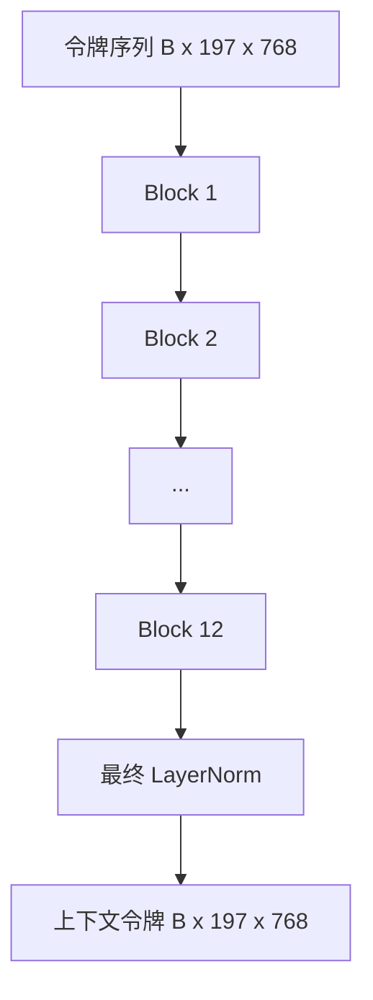
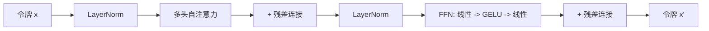

# Vision Transformer 编码器

> 仅有图像块是不够的。一个 12 层 pre-LN  Transformer（12 个注意力头）将图像块令牌序列转化为上下文令牌序列，其中 CLS 令牌在其最终隐藏状态中汇聚了整幅图像的特征。本课是现代视觉-语言模型的核心引擎。

**类型：** 构建
**语言：** Python
**前置条件：** 第 19 阶段第 30–37 课（Track B 基础）
**时长：** 约 90 分钟

## 学习目标

- 实现一个 pre-LN transformer 块，包含多头自注意力和前馈子层。
- 堆叠 12 个块（12 个头）构成 ViT-Base 编码器。
- 将第 58 课的图像块前端接入编码器并执行一次前向传播。
- 验证 CLS 令牌能够汇聚每个图像块的信息。

## 问题

图像块嵌入生成一个包含 197 个令牌的序列，每个令牌是一个向量，彼此之间没有任何感知。一张猫的图片需要每个图像块知道哪些块包含胡须、哪些包含背景、哪些包含眼睛。Transformer 就是逐层构建这种感知的机制——一次一个注意力层。没有它，图像块前端只是一个聪明的分词器，毫无理解能力。

标准的配方是：十二层深度、十二头宽度、pre-LayerNorm 放置、GELU 激活、4 倍前馈扩展。这个配方是 CLIP ViT-L、SigLIP、DINOv2、Qwen-VL 家族、InternVL 以及 2025–2026 年所有其他开源视觉编码器的骨架。这个配方足够稳定，你可以阅读这些论文中的任何一篇，并假定其块结构就是如此，除非它们明确说明另有不同。

## 概念





### Pre-LN 与 Post-LN

原始 Transformer 将 LayerNorm 放在残差连接之后。Pre-LN（在每个子层之前应用 LayerNorm）是所有现代视觉-语言模型使用的版本，因为它无需学习率预热技巧即可稳定训练。差异在前向传播中只有一行代码，但在 12 层以上的梯度流动效果有天壤之别。

### 多头自注意力

每个头将令牌向量投影到自己的（查询、键、值）三元组，维度为 `head_dim = hidden / num_heads`。当 `hidden = 768` 且 `heads = 12` 时，每个头的 `dim = 64`。12 个头并行进行注意力计算，然后将它们的输出拼接回 768 维，并通过一个输出投影层。多头的好处在于，一个头可以学习"关注猫眼"，而另一个头可以学习"关注背景渐变"，彼此互不干扰。

### 为什么是 4 倍前馈扩展

FFN 的结构是 `hidden -> 4 * hidden -> hidden`，中间使用 GELU 激活。因子 4 是经验值，自 2017 年以来在语言和视觉 transformer 中一直沿用。更小的（2 倍）会导致欠拟合；更大的（8 倍）在固定数据量下会导致过拟合。MLP 是模型存储大部分已学习事实的地方，而更宽的中间层正是这些事实的存放位置。

| 组件 | ViT-Base 规模下的参数量 |
|-----------|------------------------------|
| 每个块的 qkv 投影 | `3 * 768 * 768 = 1.77M` |
| 每个块的输出投影 | `768 * 768 = 590K` |
| 每个块的 FFN（4 倍扩展） | `2 * 768 * 4 * 768 = 4.72M` |
| 每个块的 LayerNorm | `4 * 768 = 3K` |
| 每个块合计 | 约 7.1M |
| 12 个块 | 约 85M |
| 加上前端 | 总计约 86M |

ViT-Base 是一个 86M 参数的编码器。按 2026 年的标准（SigLIP-So400M 为 400M，Qwen-VL ViT 为 675M）这算小模型，但架构在宽度和深度之外是完全相同的。

### 是否需要因果掩码？

Vision Transformer 是纯编码器且是双向的：令牌 `i` 可以关注任何令牌 `j`。无需掩码。第 61 课的解码器侧交叉注意力会使用因果掩码，但在视觉编码器内部，注意力是全连接的。

### CLS 令牌学到了什么

CLS 令牌一开始是一个可学习的参数，本身不包含任何图像块内容，通过每个块中的注意力逐步累积信息。到最后一层时，CLS 行向量成为整幅图像的向量摘要；下游模块将此单一向量投影为类别 logits、对比嵌入或文本解码器的交叉注意力键。

## 构建

`code/main.py` 实现了：

- `MultiHeadSelfAttention`，包含 `qkv` 和输出投影、缩放点积注意力计算以及形状断言。
- `FeedForward`，4 倍扩展的 GELU MLP。
- `Block`，一个 pre-LN 块，组合注意力和前馈子层并带有残差连接。
- `ViT`，一个由 12 个块和最终 LayerNorm 组成的堆叠。
- `VisionEncoder`，将第 58 课的 `VisionFrontEnd` 接入 `ViT` 堆叠，并暴露一个返回上下文序列和汇集的 CLS 向量的 `forward()` 方法。
- 一个演示程序，将合成的 224x224 测试图像通过完整编码器运行，并打印输入形状、输出形状、参数量以及每隔一层的 CLS 范数。

运行方式：

```bash
python3 code/main.py
```

输出：测试图像被编码为 `(1, 197, 768)` 的张量。CLS 范数随着层的组合向上漂移，然后在最终 LayerNorm 处稳定下来。总参数约为 86M。

## 使用

此处定义的编码器，在宽度和深度之外，与 2025–2026 年所有开源 VLM 内部使用的块堆叠完全相同。差异在于：

- **宽度和深度。** ViT-Large 为 `hidden=1024, depth=24, heads=16`；SigLIP So400M 为 `hidden=1152, depth=27, heads=16`。块结构相同。
- **汇聚方式。** CLS 汇聚（本课）与平均汇聚（SigLIP）与注意力汇聚（后来的 VLM）。
- **位置处理。** 固定正弦（第 58 课）与可学习 1D 与 ALiBi 与 2D RoPE。块的数学运算不变。
- **注册令牌。** DINOv2 在前面添加了 4 个额外的可学习令牌。只需一行代码。

这个块堆叠是基础。后续课程（第 60–63 课）将在此基础上构建。

## 测试

`code/test_main.py` 覆盖：

- 单个块保持形状不变，且对输入批次大小不敏感
- 注意力分数沿键轴求和为 1（softmax 正确性检查）
- 残差路径已连接（零输入通过 CLS 令牌仍能产生非零输出）
- 4 层堆叠的前向传播产生正确的形状
- 梯度从 CLS 输出流向图像块投影

运行测试：

```bash
python3 -m unittest code/test_main.py
```

## 练习

1. 添加注册令牌（在 CLS 之后添加 4 个可学习向量）并重新运行。通过最后一层 softmax 分布的熵来比较注意力图的平滑度。

2. 将 pre-LN 替换为 post-LN，并在合成形状分类器上训练一个 epoch。观察哪一个无需 LR 预热即可稳定训练。

3. 实现因果掩码作为 `attn_mask` 参数，使同一块可以复用为解码器块。掩码形状为 `(seq, seq)`，下三角矩阵。

4. 使用 `torch.profiler` 在批次大小为 1、8、64 时分析前向传播性能。MLP 层占用的 wall time 最多，而非注意力层。

5. 将一个注意力头的 q-k-v 投影替换为低秩 LoRA 适配器，冻结其余部分，并验证梯度仅在你期望的地方流动。

## 关键术语

| 术语 | 含义 |
|------|---------------|
| Pre-LN | 在每个子层之前（而非之后）应用 LayerNorm |
| 自注意力 | 每个令牌关注同一序列中的其他所有令牌 |
| 多头 | 隐藏维度被分割到 `H` 个独立的注意力头上 |
| FFN 扩展 | 前馈层先扩展到 `4 * hidden` 再收缩 |
| CLS 汇聚 | 使用第一个令牌的最终隐藏状态作为图像摘要 |

## 延伸阅读

- *An Image is Worth 16x16 Words*（ViT，2021）——编码器配方。
- *DINOv2*（2023）——注册令牌和自监督预训练目标。
- *SigLIP*（2023）——平均汇聚变体以及第 62 课中使用的 sigmoid 对比损失。
