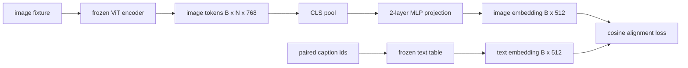

# Modalite Hizalaması için Projeksiyon Katmanı

> Bir görüntü kodlayıcı, token görüntülerini üretir. Bir metin kod çözücü, token metinlerini tüketir. İkisi farklı vektör uzaylarında yaşıyor. Küçük bir iki katmanlı MLP, token görüntülerini embedding metin alanına yansıtır ve eşleştirilmiş bir başlığa karşı kosinüs hizalama kaybı, iki alanı uyumlu hale getirir. Bu projeksiyon, vizyon-dil modelinin en küçük parçasıdır ve aktarım için en önemli olanıdır.

**Tür:** Yapım
**Diller:** Python
**Önkoşullar:** Aşama 19 dersleri 30-37 (B Yolunun temelleri)
**Süre:** ~90 dakika

## Öğrenme Hedefleri

- Görüntü özelliklerini metin embedding alanına eşleyen iki katmanlı bir MLP projeksiyonu oluşturun.
- Bir sahte metin embedding tablosu oluşturun (önceden eğitilmiş tokenizer yok, gerçek derlem yok).
- Yansıtılan görüntü token'lar ile eşleştirilmiş resim yazısı embedding arasındaki kosinüs hizalama kaybını hesaplayın.
- Dondurulmuş bir görüntü kodlayıcı ve dondurulmuş bir metin tablosuyla projeksiyonu tek başına eğitin.

## Sorun

`vision_hidden = 768` boyutunun token'larini üreten bir görüntü kodlayıcınız (58-59. dersler) var. embedding boyutu `text_hidden = 512` ile üstüne cıvatalamak istediğiniz bir metin kod çözücünüz var (başka herhangi bir sayı da aynı derecede makul). Kod çözücü, metin şeklindeki token'lari bekler. Görüntü token'lar metin şeklinde değildir: yalnızca görme ön eğitimi sırasında kodlayıcının öğrendiği bir temelde yaşarlar ve kod çözücünün kelime vektörleriyle hiçbir ilişkisi yoktur.

İki katmanlı MLP projeksiyonu (doğrusal, GELU, doğrusal) boşluğu doldurur. Tek bir GPU üzerinde dakikalar içinde eğitilebilecek kadar küçüktür (yaklaşık `768 * 1024 + 1024 * 512 = 1.3M` parametre) ve hizalama aşamasında öğrenilmesi gereken tek parçadır. Görüntü kodlayıcı donmuş halde kalır. Metin embedding tablosu donmuş halde kalır. Yalnızca projeksiyon hareket eder. Bu, LLaVA'nın 2023'te gönderdiği, BLIP-2'nin Q-Former olarak yeniden çerçevelendirdiği ve o zamandan beri her açık ağırlıklı VLM'nin bir şekilde benimsediği reçetedir.

## Konsept



### Projeksiyondan önce havuzlama

Görüntü kodlayıcı 197 tokens yayar. Metin tarafında tek bir başlık düzeyinde embedding bulunur. Bunları hizalamak için örnek başına bir görüntü düzeyinde vektöre ihtiyacınız vardır. CLS havuzlaması en basit olanıdır: kodlayıcıdan ilk token'ı alın ve yansıtın. 197 token'ın tamamı üzerinden ortalama havuzlama başka bir seçenektir ve SigLIP'in kullandığı yöntemdir. Her ikisi de 197 vektörü bire indirir.

### Neden bir değil de iki katman

Tek bir doğrusal projeksiyon dönebilir ve yeniden ölçeklenebilir ancak iki alanda eğrilik uyumsuzluğu varsa temeli düzeltemez. İki doğrusal katman arasındaki GELU, projeksiyona doğrusal olmayan bir bükülme verir; bu, deneysel olarak CLIP tarzı özellikleri embedding dil modellerine hizalamak için yeterlidir. Daha derin projeksiyonlar (LLaVA-NeXT'de GLU kullanıldı; Qwen-VL'de bir dizi dikkat katmanı kullanıldı) uzantılardır; iki katmanlı MLP standart taban çizgisidir ve BLIP-2'nin Q-Former projeksiyon kafasının kaputun altında birlikte geldiği şeydir.

| Katman | Şekil | Parametreler |
|-------|-------|------------|
| fc1 | `(vision_hidden, projection_hidden)` | `768 * 1024 + 1024` |
| aktivasyon | GEL | 0 |
| fc2 | `(projection_hidden, text_hidden)` | `1024 * 512 + 512` |

Bir `768 -> 1024 -> 512` kafası için yaklaşık 1,3 milyon parametre.

### Kosinüs hizalama kaybı

Hizalama `image_emb == text_emb` anlamına gelmez. Hizalama, eklem alanında `image_emb` 'nin `text_emb` ile aynı yönde olması anlamına gelir. Kosinüs kaybı `1 - cos_sim(image, text)` olup, 0'dan (mükemmel hizalanmış) 2'ye (ters) kadar değişir. Eğitim bunu çift başına sıfıra doğru yönlendirir. Ders 62, her görüntünün kendi başlığına gruptaki diğer başlıklardan daha yakın olması gereken karşılaştırmalı bir gruba (InfoNCE) genelleştirir; Bu ders, dinamiklerin görülebilmesi için çift başına sürümü kullanır.

### Dondurulmuş kodlayıcı işin püf noktasıdır

Görüntü kodlayıcının 86M parametresi vardır. Metin tablosunda birkaç milyon daha var. Hepsini sahte bir korpustan eğitmek başlangıç ​​dışıdır. Her ikisinin de dondurulması, projeksiyonun 1,3M parametrelerinin değişen tek şey olduğu ve sentetik çiftler üzerinde birkaç yüz adımın kaybı azaltmak için yeterli olduğu anlamına gelir. Bu tam olarak her adaptör tabanlı VLM'nin operasyonel şeklidir: ağır parçalar donmuş halde kalır, hafif köprü dizileri.

## Build It — Kendin Geliştir

`code/main.py` şunu uygular:

- `MLPProjector(in_dim, hidden_dim, out_dim)`, GELU aktivasyonuna sahip iki katmanlı doğrusal MLP.
- `MockTextEmbedding(vocab_size, dim)`, bir tohumdan deterministik başlangıçlı donmuş bir embedding tablosu.
- `make_pair(seed, vocab_size)`, eşleştirilmiş (resim, başlık) bir örneği sentezler. Altyazılar kısa kimlik dizileridir; embedding başlığı, token embeddings üzerinden ortalama havuzlanmıştır.
- `cosine_alignment_loss(image_emb, text_emb)`, çift başına `1 - cos_sim` hedefi.
- Görüntü kodlayıcı ve metin tablosu dondurularak projeksiyonu 32 sentetik çift (döngüsel) üzerinden 200 adım boyunca çalıştıran ve her 25 adımda bir kaybı yazdıran bir eğitim döngüsü.

Çalıştır:

```bash
python3 code/main.py
```

Çıktı: eğitim raporları ilk kayıp olan 1,07'den 200 adımda yaklaşık 0,80'e düşüyor, bu da projeksiyonun tek başına görüntü token'lari metin alanına doğru çekebildiğini gösteriyor. Çift başına son kosinüs benzerliği de yazdırılır.

## Use It — Hazır Araçla Uygula

Aynı model her açık ağırlıklı VLM'de görülür:

- **LLaVA 1.5.** CLIP-ViT-L'den LLaMA embedding dim'e gizlenmiş iki katmanlı GELU MLP projeksiyonu. Dondurulmuş görüntü kodlayıcı, dondurulmuş LLM, yalnızca projeksiyonu eğitir (daha sonra ikinci aşamada LLM'yi çözer).
- **BLIP-2.** Q-Former, 32 öğrenilmiş sorgu token'ı görüntü token'lare karşı çapraz dikkat yoluyla alır, ardından LLM embedding sönüklüğüne yansıtır. Q-Former'ın en sonundaki projeksiyon kafası bu dersteki MLP'nin benzeridir.
- **MiniGPT-4.** BLIP-2 Q-Former çıkışından Vicuna embedding dim'e tek doğrusal projeksiyon.
- **Qwen-VL.** Birkaç katmana sahip çapraz dikkat adaptörü, ancak son parça yine LM embedding loşluğuna bir projeksiyondur.

Şekil değişir ancak rol aynıdır: havuz görüntüsü tokens, projeden metne embedding loş, tek başına eğitim.

## Testler

`code/test_main.py` şunları kapsar:

- projektör çıkış şekli yapılandırılan `out_dim` ile eşleşiyor
- dondurulmuş metin embedding tablosunda sıfır `requires_grad` parametresi var
- kosinüs kaybı aynı vektörlerde sıfır, anti-paralel vektörlerde ise 2'dir
- projektör gradient bir geri geçişten sonra akar
- eğitim döngüsü adım 0 ile adım 200 arasındaki kaybı azaltır

Onları çalıştırın:

```bash
python3 -m unittest code/test_main.py
```

## Egzersizler

1. CLS havuzlamasını 196 yama token'ları üzerinden ortalama havuzlamayla değiştirin ve 200 adımdan sonraki son kaybı karşılaştırın. Ortalama havuzlama genellikle sentetik veriler üzerinde daha hızlı eğitim verir; CLS, doğal görüntülerde örnekleme açısından daha verimlidir.

2. Kosinüs kaybına (`cos / tau`) öğrenilmiş bir skaler sıcaklık ekleyin ve `tau` çok küçük (gradient gürültü) veya çok büyük (kayıp platoları yüksek) olduğunda ne olacağını gözlemleyin.

3. İki katmanlı MLP'yi tek bir doğrusal katmanla değiştirin ve kayıp açığını ölçün. Doğrusal olmama, doğal görüntü özelliklerinde daha fazla, sentetik olanlarda ise daha az önemlidir.

4. Projektör ağırlıklarına küçük bir L2 cezası ekleyin ve bunun kosinüs hizalaması ile nasıl etkileşime girdiğini izleyin (kosinüs ölçekle değişmez, dolayısıyla ceza çoğunlukla kullanılmayan yönleri küçültür).

5. Projektör ağırlıklarına devam edin, ardından dağıtım zamanında yalnızca projektöre ihtiyaç duyulduğunu doğrulamak için görüntü kodlayıcı geri geçişi olmadan yeniden yükleyin ve inference çalıştırın.

## Anahtar Terimler

| Dönem | Ne anlama geliyor |
|------|---------------|
| Modalite hizalaması | Resim ve metni embeddingtek bir paylaşılan alanda karşılaştırılabilir hale getirme eylemi |
| Projeksiyon kafası | Bir alanı diğerine eşleyen küçük modül, genellikle 2 katmanlı bir MLP |
| Kosinüs benzerliği | Nokta çarpımının L2 normlarının çarpımına bölümü |
| Dondurulmuş kodlayıcı | Vizyon (veya metin) modelinin tüm parametreleri `requires_grad=False` |
| Sahte külliyat | Eğitimin dataset indirme bağımlılığı olmaması için sentetik çiftler kullanıldı |

## Daha Fazla Okuma

- İki aşamalı tren için LLaVA kağıdı (projelendirin, ardından LM'yi çözün).
- Öğrenilebilir bir projeksiyon alternatifi olarak Q-Former için BLIP-2 kağıdı.
- Daha derin projeksiyon kafaları olarak çapraz dikkat adaptörleri için Qwen-VL teknik raporu.
