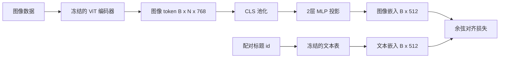

# 模态对齐中的投影层

> 视觉编码器产生图像 token，文本解码器消费文本 token，两者存在于不同的向量空间中。一个轻量的两层 MLP 将图像 token 投影到文本嵌入空间，并通过与配对标题的余弦对齐损失将两个空间拉近。这个投影层是视觉-语言模型中最小的组成部分，也是迁移学习中最重要的部分。

**类型：** 构建
**语言：** Python
**前置要求：** 阶段 19 课程 30-37（Track B 基础）
**时长：** ~90 分钟

## 学习目标

- 构建一个将图像特征映射到文本嵌入空间的两层 MLP 投影层。
- 构建一个模拟文本嵌入表（无需预训练分词器，无需真实语料库）。
- 计算投影后图像 token 与配对标题嵌入之间的余弦对齐损失。
- 在冻结视觉编码器和冻结文本表的情况下，仅训练投影层。

## 问题

你有一个视觉编码器（课程 58-59），它产生的 token 维度为 `vision_hidden = 768`。你有一个想要接上去的文本解码器，其嵌入维度为 `text_hidden = 512`（其他任意数字也同样可行）。解码器期望输入文本形态的 token。但图像 token 并非文本形态：它们存在于编码器在纯视觉预训练期间学到的基空间中，与解码器的词向量毫无关联。

两层 MLP 投影（线性 → GELU → 线性）弥合了这一差距。它足够小（约 `768 * 1024 + 1024 * 512 = 130万` 参数），只需几分钟即可在单张 GPU 上完成训练，并且是对齐阶段唯一需要学习的部分。视觉编码器保持冻结，文本嵌入表也保持冻结。只有投影层在动。这正是 LLaVA 在 2023 年采用的方案，BLIP-2 将其重塑为 Q-Former，而此后所有开源权重 VLM 都以某种形式沿用了这一方案。

## 概念



### 投影前的池化

视觉编码器输出 197 个 token。文本侧只有一个标题级别的嵌入。要对齐它们，每个样本需要一个图像级别的向量。CLS 池化是最简单的方法：取编码器的第一个 token 进行投影。对所有 197 个 token 做平均池化是另一种选择，也是 SigLIP 使用的方法。无论哪种方式，都是将 197 个向量压缩为一个。

### 为什么是两层而不是一层

单层线性投影可以旋转和缩放，但如果两个空间存在曲率不匹配，它无法修正基空间。在两个线性层之间加入 GELU 激活函数，赋予了投影一次非线性弯曲的能力，经验上这足以将 CLIP 风格的特征对齐到语言模型嵌入。更深的投影（LLaVA-NeXT 使用了 GLU；Qwen-VL 使用了一层注意力层）是延伸方案；两层 MLP 是规范的基线，BLIP-2 的 Q-Former 投影头底层使用的也正是它。

| 层 | 形状 | 参数量 |
|----------|-------|------------|
| fc1 | `(vision_hidden, projection_hidden)` | `768 * 1024 + 1024` |
| 激活函数 | GELU | 0 |
| fc2 | `(projection_hidden, text_hidden)` | `1024 * 512 + 512` |

一个 `768 -> 1024 -> 512` 的投影头约有 130 万参数。

### 余弦对齐损失

"对齐"并不意味着 `image_emb == text_emb`。"对齐"意味着 `image_emb` 在联合空间中指向与 `text_emb` 相同的方向。余弦损失为 `1 - cos_sim(image, text)`，范围从 0（完全对齐）到 2（完全相反）。训练过程中，每对样本的损失趋近于零。课程 62 将其推广到对比批次（InfoNCE），其中每个图像必须比批次中任何其他标题更接近自己的标题；本课程使用逐对版本，以便动态可见。

### 冻结编码器是关键技巧

视觉编码器有 8600 万参数。文本表还有几百万参数。在模拟语料库上训练所有这些参数是不可行的。冻结两者意味着投影层的 130 万参数是唯一变化的部分，在合成数据对上几百步就足以降低损失。这正是所有基于适配器的 VLM 的操作形态：重部件保持冻结，轻量桥梁进行训练。

## 构建代码

`code/main.py` 实现：

- `MLPProjector(in_dim, hidden_dim, out_dim)`，使用 GELU 激活的两层线性 MLP。
- `MockTextEmbedding(vocab_size, dim)`，使用种子确定性初始化的冻结嵌入表。
- `make_pair(seed, vocab_size)`，合成一对（图像，标题）样本。标题是短 id 序列；标题嵌入是 token 嵌入的平均池化结果。
- `cosine_alignment_loss(image_emb, text_emb)`，逐对的 `1 - cos_sim` 目标函数。
- 训练循环：在 32 个合成数据对（循环使用）上对投影层运行 200 步，视觉编码器和文本表保持冻结，每 25 步打印一次损失。

运行：

```bash
python3 code/main.py
```

输出：训练报告显示初始损失约 1.07，在 200 步内降至约 0.80，表明仅靠投影层就能将图像 token 拉向文本空间。同时还会打印每对最终的余弦相似度。

## 实际应用

同样的模式出现在每一个开源权重 VLM 中：

- **LLaVA 1.5。** 从 CLIP-ViT-L 隐藏层到 LLaMA 嵌入维度的两层 GELU MLP 投影。冻结视觉编码器，冻结 LLM，仅训练投影层（然后在第二阶段解冻 LLM）。
- **BLIP-2。** Q-Former 使用 32 个可学习查询 token 与图像 token 进行交叉注意力计算，然后投影到 LLM 嵌入维度。Q-Former 最末端的投影头与本课程中的 MLP 类似。
- **MiniGPT-4。** 从 BLIP-2 Q-Former 输出到 Vicuna 嵌入维度的单层线性投影。
- **Qwen-VL。** 交叉注意力适配器包含多个层，但最终部分仍然是到 LM 嵌入维度的投影。

形状各异，但角色完全相同：池化图像 token，投影到文本嵌入维度，单独训练。

## 测试

`code/test_main.py` 覆盖：

- 投影器的输出形状与配置的 `out_dim` 一致
- 冻结的文本嵌入表没有 `requires_grad` 参数
- 余弦损失在相同向量上为零，在相反向量上为 2
- 一次反向传播后投影器有梯度流动
- 训练循环从第 0 步到第 200 步降低了损失

运行测试：

```bash
python3 -m unittest code/test_main.py
```

## 练习

1. 将 CLS 池化替换为对 196 个 patch token 的平均池化，对比 200 步后的最终损失。平均池化通常在合成数据上训练更快；CLS 在自然图像上样本效率更高。

2. 在余弦损失中添加一个可学习的标量温度参数（`cos / tau`），观察当 `tau` 太小（梯度噪声大）或太大（损失居高不下）时会发生什么。

3. 将两层 MLP 替换为单层线性层，量化损失差距。非线性在自然图像特征上更重要，在合成特征上影响较小。

4. 对投影器权重添加一个小的 L2 惩罚项，观察它如何与余弦对齐相互作用（余弦是尺度不变的，因此惩罚项主要收缩未使用的方向）。

5. 持久化投影器权重，然后重新加载并在不进行视觉编码器反向传播的情况下运行推理，验证部署时只需要投影器。

## 关键术语

| 术语 | 含义 |
|------|---------------|
| 模态对齐 | 将图像和文本嵌入拉入共享空间，使其可比较 |
| 投影头 | 将一个空间映射到另一个空间的小模块，通常是两层 MLP |
| 余弦相似度 | 点积除以 L2 范数的乘积 |
| 冻结编码器 | 视觉（或文本）模型的所有参数均设置为 `requires_grad=False` |
| 模拟语料库 | 用于训练的合成数据对，无需下载数据集 |

## 延伸阅读

- LLaVA 论文：两阶段训练（先训练投影层，再解冻 LM）。
- BLIP-2 论文：将 Q-Former 作为可学习的投影替代方案。
- Qwen-VL 技术报告：将交叉注意力适配器作为更深的投影头。
