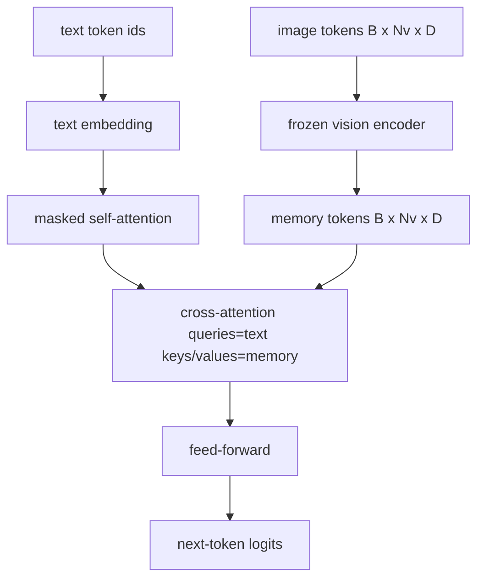
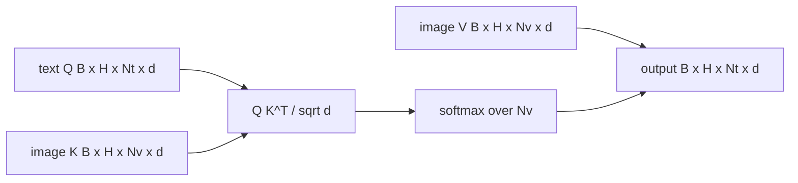

# Çapraz Dikkat Füzyonu

> Projeksiyon katmanı bir görüntü vektörünü bir başlık vektörüyle hizalar. Gerçek bir görüş dili kod çözücünün, her yamaya token katılmak için her metne token ihtiyacı vardır, böylece model her kelimeyi bir bölgedeki temellendirebilir. Çapraz dikkat bu topraklanmanın nasıl gerçekleştiğidir. Metin sorguları; görüş anahtarları ve değerler yanıt verir. Bu ders çapraz dikkat bloğunu, nedensel metin öz dikkatini ve her ikisini de yasal tutan maske şekillerini oluşturur.

**Tür:** Yapım
**Diller:** Python
**Önkoşullar:** Aşama 19 dersleri 30-37 (B Yolunun temelleri)
**Süre:** ~90 dakika

## Öğrenme Hedefleri

- Sorgu akışının metin ve anahtar/değer akışının vizyon olduğu çok kafalı çapraz dikkati uygulayın.
- Bir kod çözücü bloğu oluşturun: nedensel kişisel dikkat + çapraz dikkat + ileri besleme.
- Maske şekillerini doğru kullanın: kişisel dikkat için nedensel maske, çapraz dikkat için maske yok.
- Toplu metin token'lar ve sabit bir görüntü token'lar havuzuyla ileri geçiş çalıştırın.

## Sorun

Görüntü token'lari ve metin token'lari tek bir dizide birleştirmek bir füzyon seçeneğidir (erken füzyon, Chameleon ve Emu3'ün izlediği yol). Çapraz dikkat diğeridir (geç füzyon, Flamingo'nun başlattığı yol ve o zamandan beri her Flamingo şeklindeki kod çözücünün kopyaladığı yol). Geç füzyonda, metin kod çözücü salt metin token'lar üzerinde çalışır ve her katmanda çapraz dikkat yoluyla görüntü akışına ulaşır.

Geç füzyonun iki avantajı vardır. İlk olarak metin akışı temiz kalır ve model salt metin özelliklerini korur. İkincisi, görüntü akışı görüntü başına bir kez hesaplanır ve her kod çözme adımında yeniden kullanılır, böylece uzun altyazılar için bile üretim ucuz olur. Maliyet, blok başına bir ekstra dikkat alt katmanıdır.

## Konsept





### Maske şekilleri

Bir kod çözücü bloğunun içindeki iki dikkatin farklı maskelere ihtiyacı vardır:

| Dikkat | Sorgu uzunluğu | Anahtar uzunluğu | Maske | Neden |
|-----------|--------------|------------|------|-----|
| Kendine dikkat | `Nt` (metin) | `Nt` (metin) | Nedensel: alt üçgen `(Nt, Nt)` | Metin token'lar otomatik regresyon sırasında ileriye bakmayabilir |
| Çapraz dikkat | `Nt` (metin) | `Nv` (vizyon) | Maske yok | Resmin tamamı her metin konumunda görülebilir |

Ders bir şekil doğrulama işlevi içerir, bu nedenle bunları sessizce bozulan bir kayıp eğrisi yerine `ValueError` olarak karıştırma hatası ortaya çıkar.

### Çapraz dikkatte neden maske yok

Herhangi bir metin oluşturulmadan önce görüntü tamamen gözlemlenir. Altyazının Token `t` 'si görüntünün herhangi bir yamasına eşlik edebilir; görüntü yamalarında zamansal bir sıralama yoktur. Bazı Flamingo çeşitleri, birden fazla görüntüyü ve metin parçasını araya eklerken örnek başına bir maskeleme modeli ekler, ancak tek bir görüntü artı bir başlık için çapraz dikkat her şeyi görür.

### Anahtar/değer önbelleğe alma

Görüntü anahtarları ve değerleri, kod çözmenin başlangıcında bir kez hesaplanır ve bir önbellekte tutulur. Her yeni metin token, yeniden hesaplama olmaksızın önbelleği kullanır. inference'da altyazı eklemeyi hızlı kılan şey budur: ağır ViT bir kez çalışır; çapraz dikkat her adımda anahtarlarını ve değerlerini yeniden kullanır. Ders, önbelleği ortaya çıkarır ve önbellek isabet yolunu test eder.

### Blok kompozisyonu

Bir kod çözücü bloğu şunları çalıştırır: ön-LN -> kişisel dikkat -> artık -> ön-LN -> çapraz dikkat -> artık -> ön-LN -> ileri besleme -> artık. Her biri kendi LayerNorm'una sahip üç alt katman. Flamingo makalesi, çapraz dikkat konusunda öğrenilmiş bir geçit ekledi; böylece model, eğitim süresi istikrar maliyeti karşılığında görüntü yolundan çıkabildi; (burada kullanılan) kanonik taban çizgisinin kapısı yoktur.

```python
class DecoderBlock:
  def forward(self, text_tokens, image_tokens, text_mask, cross_mask):
      text_tokens = text_tokens + self.self_attn(self.ln1(text_tokens),
                                                 mask=text_mask)
      text_tokens = text_tokens + self.cross_attn(self.ln2(text_tokens),
                                                  image_tokens,
                                                  mask=cross_mask)
      text_tokens = text_tokens + self.ffn(self.ln3(text_tokens))
      return text_tokens
```

## Build It — Kendin Geliştir

`code/main.py` şunu uygular:

- `CrossAttention(hidden, heads)`, ayrı `q` ve `kv` projeksiyonlarıyla çok kafalı çapraz dikkat.
- `CausalSelfAttention(hidden, heads)`, standart bir kod çözücüden gelen maskelenmiş öz-dikkat.
- `DecoderBlock`, LN öncesi artıklara sahip üç alt katmanı oluşturur.
- `VisionLanguageDecoder`, sahte görüntü kodlayıcı çıkışı ve küçük bir metin embedding tablosu tarafından beslenen dört katmanlı kod çözücü.
- `causal_mask(length)` , `(length, length)` alt üçgen boole tensörünü döndürüyor.
- 10 uzunluğunda iki metin dizisini 197 uzunluğunda görüntü belleğiyle besleyen ve çıktı şeklini, kişisel dikkat maskesi şeklini ve konum başına çapraz dikkat çıktı normunu yazdıran bir demo.

Çalıştır:

```bash
python3 code/main.py
```

Çıktı: kod çözücü bir `(2, 10, text_vocab)` logit tensörü üretir. Maske şekli `(10, 10)`'dir. KV-önbellek yeniden kullanım kontrolü, önbelleğe alınmış ve önbelleğe alınmamış yollar arasındaki aynı logitleri doğrular.

## Use It — Hazır Araçla Uygula

Çapraz dikkat iki yapım ailesinde ortaya çıkıyor:

- **Flamingo ve IDEFICS.** Dondurulmuş bir LM ile her K dili modeli bloğuna çapraz dikkat alt katmanı ekleyin. Görme dili bağdaştırıcısı çapraz dikkat bloğu artı onun kapısıdır.
- **BLIP-2.** Q-Former, görüntü özelliklerine sabit 32 sorgu token kümesinden gelen çapraz dikkati kullanır, ardından sorguları LM embedding alanına yansıtır.

Bu dersteki bloğun şekli doğrudan her ikisine de eşleşir. Maske disiplini (kendi üzerinde nedensel, çarmıhta yok) aynıdır.

## Testler

`code/test_main.py` şunları kapsar:

- nedensel maske alt üçgen şeklindedir ve beklenen boole şekliyle eşleşir
- çapraz dikkat çıktı şekli, anahtar uzunluğundan bağımsız olarak `(B, Nt, hidden)` şeklindedir
- KV-önbellek yolu, önbelleğe alınmamış yolla kayan nokta toleransıyla eşleşir
- metin ve resim akışları arasındaki şekil uyumsuzluğu net bir `ValueError` ortaya çıkarıyor
- kod çözücünün tam ileri geçişi, doğru parti ve dizi şeklini üretir

Onları çalıştırın:

```bash
python3 -m unittest code/test_main.py
```

## Egzersizler

1. Çapraz dikkat kalıntısına öğrenilmiş bir tanh kapısı ekleyin (Flamingo numarası) ve eğitimin sıfıra yakın bir başlangıç ​​kapısından yakınsadığını doğrulayın. Kapı 0'dan başlar; model, görüntü akışını karıştırmadan önce salt metin davranışını kurtarır.

2. Aynı kod çözücünün birden çok görüntüyü ve birden çok metin bölümünü tükettiği yerlerde aralıklı dikkat uygulayın. Metin segmenti 2'nin görüntü 1'e katılmasını önleyen örnek başına çapraz dikkat maskesini oluşturun.

3. `Nt=64, Nv=576` 'da (daha yüksek çözünürlükte 24x24 ızgara) çapraz dikkat ve kişisel dikkat katmanının profilini çıkarın. Çapraz dikkat maliyeti `Nt * Nv` 'dir ve yüksek görüntü çözünürlüğünde hakimdir.

4. Çapraz dikkat haritasına sorgu tarafında bir çıkış ekleyin ve demodaki altyazı çeşitliliğini ölçün (çapraz haritada altyazı örneği varyansı artar).

5. Çapraz dikkat katmanını, sabit 32-token sorgu havuzunun katman başına bir kez görüntü özelliklerine katıldığı Q-Former tarzı bir dikkat bloğuyla değiştirin.

## Anahtar Terimler

| Dönem | Ne anlama geliyor |
|------|---------------|
| Geç füzyon | Metin ve görüntü ayrı akışlarda kalır; çapraz dikkat onları her blokta birleştiriyor |
| Çapraz dikkat | Q bir akıştan, K ve V ise diğerinden gelir |
| Nedensel maske | Otoregresyon sırasında ileriye bakmayı engelleyen alt üçgen boole maskesi |
| KV önbelleği | Görüntü anahtarları ve değerleri bir kez saklanır ve her kod çözme adımında yeniden kullanılır |
| Bellek tokens | Kod çözücünün ulaştığı donmuş görüntü token'lar |

## Daha Fazla Okuma

- Kapılı çapraz dikkat içeren kanonik geç füzyon tasarımı için Flamingo (2022).
- Öğrenilmiş bir sorgu havuzu gibi giyinmiş bir çapraz dikkat bloğu olan Q-Former için BLIP-2 (2023).
- Flamingo tarifinin açık ağırlıkta çoğaltılması için IDEFICS (2023).
