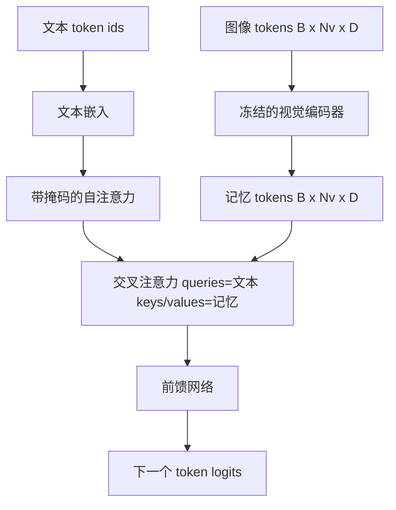
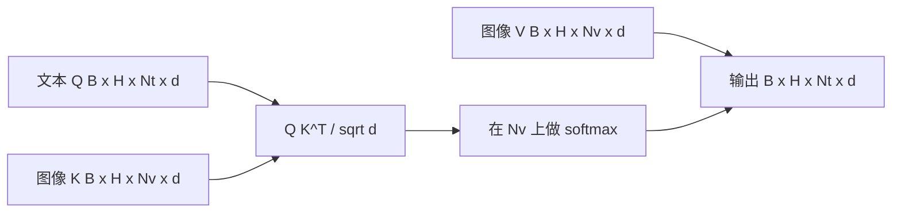

# 交叉注意力融合（Cross-Attention Fusion）

> 投影层将一张图像向量与一条标题向量对齐。但真正的视觉-语言解码器需要每个文本 token 都能关注到每个图像块 token，这样模型才能将每个词定位到对应的区域。交叉注意力（Cross-attention）正是实现这种定位的机制：文本作为查询（queries），视觉作为键（keys）和值（values）来回答。本节课将构建交叉注意力模块、因果文本自注意力模块，以及保持两者合法所需的掩码形状。

**类型：** 构建
**语言：** Python
**前置知识：** 第 19 阶段第 30-37 课（Track B 基础）
**时长：** 约 90 分钟

## 学习目标

- 实现多头交叉注意力，其中查询流为文本，键/值流为视觉。
- 组合解码器模块：因果自注意力 + 交叉注意力 + 前馈网络。
- 掌握正确的掩码形状：自注意力使用因果掩码，交叉注意力不使用掩码。
- 对批量文本 token 和固定图像 token 池执行一次前向传播。

## 问题概述

将图像 token 和文本 token 拼接成一个序列是一种融合方案（早期融合，Chameleon 和 Emu3 采用的方式）。交叉注意力是另一种方案（晚期融合，由 Flamingo 引入，此后所有 Flamingo 形状的解码器都沿用了这一方案）。在晚期融合中，文本解码器仅对文本 token 运行，并通过每一层的交叉注意力伸入图像流。

晚期融合有两个优势。首先，文本流保持干净，模型保留了纯文本能力。其次，图像流每张图像只计算一次，并在每个解码步骤中复用，因此即使对于长标题，生成也非常高效。代价是每个模块多了一个注意力子层。

## 概念





### 掩码形状

解码器模块中的两种注意力需要不同的掩码：

| 注意力 | 查询长度 | 键长度 | 掩码 | 原因 |
|--------|----------|--------|------|------|
| 自注意力 | `Nt`（文本） | `Nt`（文本） | 因果：下三角 `(Nt, Nt)` | 文本 token 在自回归过程中不能看到未来 |
| 交叉注意力 | `Nt`（文本） | `Nv`（视觉） | 无掩码 | 每个文本位置都能看到整张图像 |

本课程包含一个形状验证函数，因此混淆两者的错误会引发 `ValueError` 而非悄悄地破坏损失曲线。

### 为什么交叉注意力没有掩码

图像在生成任何文本之前已被完全观察到。标题的第 `t` 个 token 可以关注图像的任意块；图像块之间没有时序顺序。某些 Flamingo 变体在交错排列多个图像和文本段时会使用每个样本的掩码模式，但对于单张图像加一条标题的情况，交叉注意力可以看到全部内容。

### 键/值缓存

图像的键和值在解码开始时计算一次，并保存在缓存中。每个新的文本 token 都使用该缓存，无需重新计算。这就是推理时标题生成速度快的原理：庞大的 ViT 只运行一次；交叉注意力在每个步骤中复用其键和值。本课程会展示缓存并测试缓存命中路径。

### 模块组合

解码器模块的运行顺序为：pre-LN → 自注意力 → 残差连接 → pre-LN → 交叉注意力 → 残差连接 → pre-LN → 前馈网络 → 残差连接。共三个子层，每个子层有自己的 LayerNorm。Flamingo 论文在交叉注意力上添加了一个可学习的门控，使模型可以在训练稳定性成本下选择退出图像路径；规范基线（本文使用）不包含门控。

```python
class DecoderBlock:
  def forward(self, text_tokens, image_tokens, text_mask, cross_mask):
      text_tokens = text_tokens + self.self_attn(self.ln1(text_tokens),
                                                 mask=text_mask)
      text_tokens = text_tokens + self.cross_attn(self.ln2(text_tokens),
                                                  image_tokens,
                                                  mask=cross_mask)
      text_tokens = text_tokens + self.ffn(self.ln3(text_tokens))
      return text_tokens
```

## 构建

`code/main.py` 实现了：

- `CrossAttention(hidden, heads)`，多头交叉注意力，包含独立的 `q` 和 `kv` 投影。
- `CausalSelfAttention(hidden, heads)`，来自标准解码器的带掩码自注意力。
- `DecoderBlock`，组合三个子层并使用 pre-LN 残差连接。
- `VisionLanguageDecoder`，四层解码器，接收模拟视觉编码器输出和一个小型文本嵌入表。
- `causal_mask(length)` 返回一个 `(length, length)` 的下三角布尔张量。
- 一个演示程序：输入一批两个长度为 10 的文本序列，图像记忆长度为 197，打印输出形状、自注意力掩码形状以及每个位置的交叉注意力输出范数。

运行：

```bash
python3 code/main.py
```

输出：解码器生成一个 `(2, 10, text_vocab)` 的 logits 张量。掩码形状为 `(10, 10)`。KV 缓存复用检查确认缓存路径与非缓存路径产生相同的 logits。

## 应用

交叉注意力出现在两个生产系列中：

- **Flamingo 和 IDEFICS。** 每 K 个语言模型模块中插入一个交叉注意力子层，LM 保持冻结。视觉-语言适配器就是交叉注意力模块及其门控。
- **BLIP-2。** Q-Former 使用固定 32 个查询 token 的交叉注意力到图像特征，然后将查询投影到 LM 嵌入空间。

本课程中的模块形状直接映射到两者。掩码规则（自注意力使用因果掩码，交叉注意力不使用掩码）也是相同的。

## 测试

`code/test_main.py` 覆盖：

- 因果掩码是下三角的，且符合预期的布尔形状
- 交叉注意力输出形状为 `(B, Nt, hidden)`，与键长度无关
- KV 缓存路径与非缓存路径在浮点容差内一致
- 文本流与图像流之间的形状不匹配会引发明确的 `ValueError`
- 完整的解码器前向传播产生正确的批量和序列形状

运行测试：

```bash
python3 -m unittest code/test_main.py
```

## 练习

1. 为交叉注意力残差连接添加一个可学习的 tanh 门控（Flamingo 技巧），验证训练在初始门控接近于零时能够收敛。门控从 0 开始；模型在混合图像流之前先恢复纯文本行为。

2. 实现交错注意力，使同一个解码器处理多张图像和多个文本段。构建每个样本的交叉注意力掩码，阻止文本段 2 关注图像 1。

3. 在 `Nt=64, Nv=576`（更高分辨率下的 24x24 网格）下分析交叉注意力层与自注意力层的性能。交叉注意力的计算成本为 `Nt * Nv`，在高图像分辨率下占主导地位。

4. 在交叉注意力映射上添加查询侧的 dropout，并在演示程序中测量标题多样性（交叉映射中的 dropout 增加时，标题样本方差增大）。

5. 将交叉注意力层替换为 Q-Former 风格的注意力模块，其中固定 32 个 token 的查询池每层一次关注图像特征。

## 关键术语

| 术语 | 含义 |
|------|------|
| 晚期融合（Late fusion） | 文本和视觉保持在独立流中；交叉注意力在每个模块中连接两者 |
| 交叉注意力（Cross-attention） | Q 来自一个流，K 和 V 来自另一个流 |
| 因果掩码（Causal mask） | 下三角布尔掩码，防止自回归过程中的向前看 |
| KV 缓存（KV cache） | 图像的键和值存储一次，每个解码步骤复用 |
| 记忆 token（Memory tokens） | 解码器所伸入的冻结图像 token |

## 延伸阅读

- Flamingo (2022)：规范的晚期融合设计，带门控交叉注意力。
- BLIP-2 (2023)：Q-Former，本质上是一个交叉注意力模块，但伪装成可学习的查询池。
- IDEFICS (2023)：Flamingo 方案的开源权重复现。
