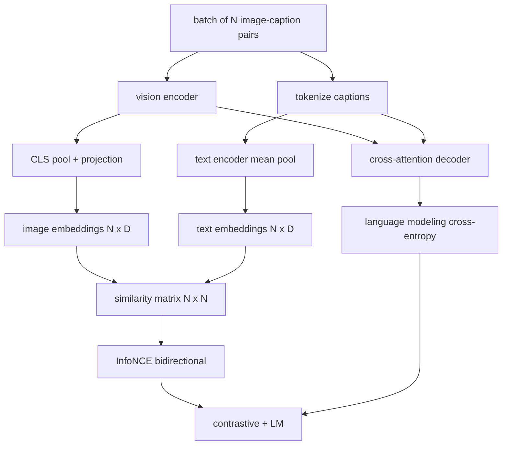

# Vizyon-Dil Ön Eğitimi

> Kodlayıcı, projeksiyon ve kod çözücü kabloludur. Şimdi onları birlikte eğitin. Öğrenmeyi iki amaç yönlendirir: eşleşen çiftleri ortak embedding alanında bir araya getiren karşılaştırmalı görüntü-metin kaybı (InfoNCE) ve kod çözücüden her görüntüye altyazı eklemesini isteyen bir dil modelleme kaybı. Birlikte, ağa hem resim yazısı için doğru görseli bulmayı hem de resim için resim yazısı yazmayı öğretir.

**Tür:** Yapım
**Diller:** Python
**Önkoşullar:** Aşama 19 dersleri 30-37 (B Yolunun temelleri)
**Süre:** ~90 dakika

## Öğrenme Hedefleri

- Bir dizi resim yazısı çiftinde InfoNCE karşılaştırmalı kaybını uygulayın.
- Otoregresif dil modelleme kaybıyla karşılaştırmalı kayıp oluşturun.
- Gerçek bir dataset indirmeye ihtiyaç duymadan 200 çiftlik sahte resim yazısı topluluğunu sentezleyin.
- 50 adımlık bir demo eğitim döngüsü çalıştırın ve her iki kaybın da azaldığını gözlemleyin.

## Sorun

Vizyon dili modelinin iki beceriye ihtiyacı vardır. Sıralaması gerekir: Bir başlık verildiğinde, pek çok fotoğraf arasından doğru görseli bulun. Şunu oluşturmalıdır: bir resim verildiğinde bir başlık yazılmalıdır. Modeli yalnızca bir beceriye göre önceden eğitmek size sistemin yarısını verir. CLIP sıralamayı tutturdu ancak altyazı yazamıyor. GPT-4V altyazı ekleyebilir ancak sıralama için ayrı bir alma başlığı kullanır. Çok amaçlı ön eğitim her ikisini de tek geçişte gerçekleştirir.

InfoNCE sıralamanın yarısını yönetiyor. N çiftten oluşan bir grup için model, N eşleşen çifti pozitif ve `N^2 - N` uyumsuz çifti negatif olarak ele alır ve ardından ortaya çıkan `(N, N)` benzerlik matrisinde bir çapraz entropi kaybı çalıştırır. LM kaybı, nesil yarısını yönetir: görüntüye koşullandırılmış standart sonraki-token tahmini. Her iki kayıp da farklılaştırılabilir ve kodlayıcı, projektör ve kod çözücü ağırlıklarını paylaşabilir.

## Konsept



### InfoNCE tek paragrafta

N görüntü embedding'leri satırlar halinde ve N metin embedding'leri satırlar olarak yığınlayın. L2-her ikisini de normalleştirin. `N x N` matrisini `S = I T^T / tau` hesaplayın; burada `tau` öğrenilen sıcaklıktır. Çapraz girişler eşleşen çiftlerdir; çapraz olmayan girişler negatiftir. Çapraz entropiyi `argmax` hedefi çaprazdan aşağıya doğru ilerlerken uygulayın: `i` satırının en yüksek girişi `i` sütununda olmalıdır. Aynısını sütunlar boyunca simetrik olarak yapın. Toplam ikisinin ortalamasıdır. Bu, sekiz satırdaki CLIP kaybıdır.

### Sıcaklık önemlidir

Sıcaklık `tau` softmax'ın ne kadar zirveye ulaştığını kontrol eder. Çok küçük (e.g. `tau = 0.01`) ve gradient yalnızca en sert olumsuzluktan gelir, eğitim gürültülüdür. Çok büyükse softmax düzleşir ve gradient kaybolur. CLIP, `tau` 'yi parametre olarak öğrenir; buradaki demo da aynısını yapıyor.

### Dil modelleme kaybı

Kod çözücü, çapraz dikkat yoluyla görüntü belleği token'lari tüketir ve her konumda bir sonraki token metnini tahmin eder. Kayıp, bir sonraki konum hedefiyle standart çapraz entropidir. Dolgu pozisyonları kayıptan maskelenir.

### Kayıpların birleştirilmesi

`total = contrastive + lm_weight * lm` burada `lm_weight` bir skalerdir (genellikle 1,0). İki kayıp, kodlayıcı ve projeksiyonda gradient'ları paylaşır; yalnızca kod çözücü LM kaybı gradient alır. Bu, CoCa, BLIP ve SigLIP tarzı modellerin hepsinin çeşitli ağırlıklarla kullandığı çok görevli tariftir.

| Bileşen | Kayıp yüzeyi | Etkiler |
|-----------|--------------|---------|
| InfoNCE | Ortak alanda çift sıralaması | Kodlayıcı + projeksiyon + metin başlığı |
| LM | Token tahmin görsele dayalı | Kodlayıcı + yansıtma + kod çözücü |
| Kombine | Çoklu görev | Tüm yığın |

### Bir demo için neden 50 adım yeterlidir?

Sahte derleme, rastgele görseller ve rastgele altyazı kimlikleri içeren 200 çiftlik sentetik bir settir. Parti büyüklüğü 16 olan 50 SGD adımından sonra, mutlak değerler gerçek veri modelinin elde edebileceğinin üzerinde kalsa bile her iki kayıp da gözle görülür şekilde düşüyor. Demonun amacı, gradient tesisat işinin uçtan uca yapıldığını ve LM kaybının eklenmesinin karşılaştırmalı hedefi istikrarsızlaştırmadığını doğrulamaktır.

## Build It — Kendin Geliştir

`code/main.py` şunu uygular:

- `MultimodalModel`, küçük bir ViT kodlayıcıyı, MLP projektörü, küçük bir metin tarafı kodlayıcıyı (gömülü kimlikler üzerinde ortalama havuz) ve 61. dersteki çapraz dikkat kod çözücüyü birleştirir.
- `info_nce_loss(image_emb, text_emb, temperature)`, çift yönlü CLIP tarzı karşılaştırmalı kayıp.
- `lm_loss(logits, target_ids, padding_id)`, sonraki-token çapraz entropiyi maskeledi.
- `make_mock_corpus(seed, n_pairs)`, 200 deterministik (resim, resim yazısı_kimliği) çifti döndürüyor.
- Toplu iş boyutu 16, Adam optimizer ve öğrenilmiş bir günlük sıcaklık parametresi ile 50 adımdan oluşan bir eğitim döngüsü. Her iki kayıp da her 5 adımda bir yazdırılır.

Çalıştır:

```bash
python3 code/main.py
```

Çıktı: karşılaştırmalı kayıp yaklaşık `ln(16) = 2.77` 'dan 2,4'e düşer; LM kaybı, `ln(512) ≈ 6.24` rastgele tekdüze taban çizgisinden yaklaşık 4,7'ye düşüyor. Her iki düşüş de gradient'nın doğru kablolandığını kanıtlar. Gerçek modeller milyonlarca adım antrenmanı yapar; dinamikler aynı.

## Use It — Hazır Araçla Uygula

Bu, gönderilen aynı kayıp tarifi:

- **CLIP (2021).** Ayrı bir dondurulmuş kodlayıcı altyazı probu ile yalnızca kontrastlı görüntü metni.
- **CoCa (2022).** Bir modelde görüntü metni karşılaştırmalı artı görüntü altyazısı LM kaybı. Bu dersin oluşturduğu tam model.
- **BLIP (2022) ve BLIP-2.** Karşılaştırmalı artı LM artı görüntü-metin eşleştirme kafası. Üç kayıp bir arada.
- **SigLIP (2023).** Sigmoid çifti kaybı için InfoNCE'yi değiştirir; aynı zıt rol, farklı işlevsel biçim.
- **LLaVA ailesi.** Birinci aşamanın hizalama olduğu (dondurulmuş bir LM'de kosinüs) ve ikinci aşamanın, dondurulmamış bir LM ile LM kaybına eklendiği iki aşamalı eğitim. Ders 60 birinci aşamayı haritalar; bu ders ikinci aşamaya eşlenir.

## Testler

`code/test_main.py` şunları kapsar:

- InfoNCE kaybı görüntü/metin satırları arasında simetriktir
- Benzerlik matrisi büyük pozitif sayıların mükemmel bir köşegeni olduğunda InfoNCE kaybı 0 değerini döndürür
- LM kaybı dolgu konumlarını doğru şekilde maskeler
- ileri geçiş modeli her iki kaybı da hatasız üretir
- 5 adımlı eğitim döngüsü birleşik kaybı azaltır

Onları çalıştırın:

```bash
python3 -m unittest code/test_main.py
```

## Egzersizler

1. InfoNCE'yi SigLIP tarzı sigmoid çifti kaybıyla değiştirin ve sahte korpustaki yakınsamayı karşılaştırın.

2. Kesin negatif bir madencilik adımı ekleyin: her iki grupta bir, önceki gruptan en zor çapraz olmayan çifti seçin ve ekleyin. Karşılaştırmalı kaybın daha hızlı düşüp düşmediğini eğitin ve inceleyin.

3. BLIP'in üç kafalı düzenini kopyalayarak üçüncü bir kayıp için embedding (doğru/yanlış: bunlar eşleşiyor mu?) ekleminin üstüne görüntü-metin eşleşen bir ikili başlık ekleyin.

4. Sahte derlemi, geçiş matrisi görüntü karmasına göre koşullandırılan bir Markov zincirinden alınan başlık kimliği dizileriyle değiştirin. Gerçek öğrenilebilir sinyal olduğundan altyazı kaybının daha da düşmesi gerekir.

5. Aynı modeli `lm_weight = 0` ile ve tekrar `lm_weight = 1` ile eğitin. Karşılaştırmalı kaybı karşılaştırın; LM kaybı sıralama hedefini geriletmemelidir.

## Anahtar Terimler

| Dönem | Ne anlama geliyor |
|------|---------------|
| InfoNCE | Gürültü karşılaştırmalı tahmini: benzerlik matrisinde çapraz entropi |
| Sıcaklık | Karşılaştırmalı softmax'ın ne kadar zirveye ulaştığını kontrol eden skaler |
| Sert negatif | Modelin kafa karıştırıcı bulduğu çapraz olmayan bir çift, örnekleme için yararlı |
| LM kaybı | Altyazı tarafında standart next-token çapraz entropi |
| Ortak embedding alanı | Görüntü ve metin vektörlerinin projeksiyondan sonra yaşadığı ortak alan |

## Daha Fazla Okuma

- Orijinal karşılaştırmalı tarif için CLIP kağıdı.
- Tek modelde karşılaştırmalı artı başlıklar için CoCa kağıdı.
- Sigmoid çifti kaybı varyantı ve neden daha iyi ölçeklendiğine ilişkin SigLIP kağıdı.
