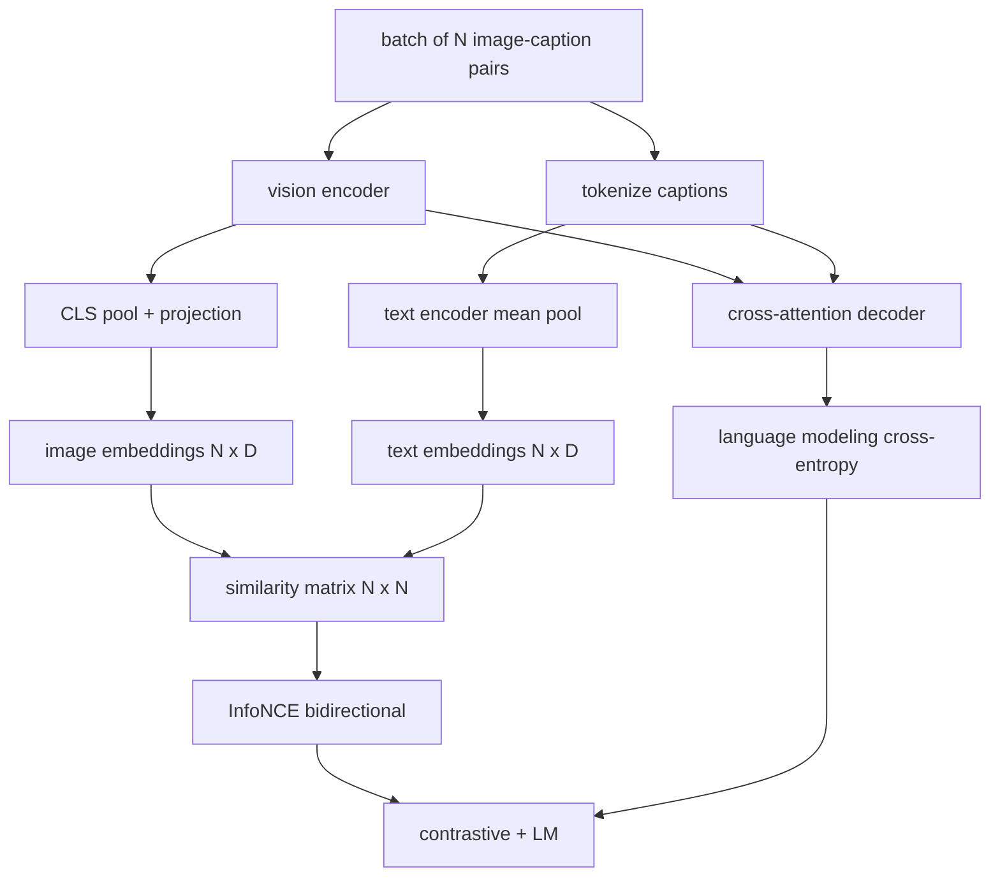

# 视觉语言预训练

> 编码器、投影层和解码器已经连接好。现在将它们一起训练。两个目标驱动学习：对比性图像-文本损失（InfoNCE），它将匹配对在联合嵌入空间中拉近；以及语言建模损失，它要求解码器为每张图像生成描述。两者结合，教会网络既能为描述找到正确的图像，也能为图像写出描述。

**类型：** 构建
**语言：** Python
**前置要求：** 第19阶段第30-37课（Track B 基础）
**预计时间：** 约90分钟

## 学习目标

- 在一个批次的图像-描述对上实现 InfoNCE 对比损失。
- 将对比损失与自回归语言建模损失组合起来。
- 合成一个包含200对模拟图像-描述语料库，无需下载真实数据集。
- 运行一个50步的演示训练循环，观察两种损失都在下降。

## 问题

一个视觉语言模型需要两种能力。它必须能够排序：给定一个描述，在众多图像中找到正确的那张。它必须能够生成：给定一张图像，写出一段描述。只用其中一种能力进行预训练，你只得到了半个系统。CLIP 擅长排序但无法生成描述。GPT-4V 可以生成描述但使用独立的检索头进行排序。多目标预训练在单次训练中同时获得两种能力。

InfoNCE 处理排序部分。对于 N 对组成的一个批次，模型将 N 个匹配对视为正样本，将 `N^2 - N` 个不匹配对视为负样本，然后在得到的 `(N, N)` 相似度矩阵上运行交叉熵损失。LM 损失处理生成部分：以图像为条件进行标准的下一个 token 预测。两种损失都是可微的，并且可以共享编码器、投影层和解码器的权重。

## 概念



### InfoNCE 概述

将 N 个图像嵌入作为行堆叠，N 个文本嵌入也作为行堆叠。两者都做 L2 归一化。计算 `N x N` 矩阵 `S = I T^T / tau`，其中 `tau` 是一个可学习的温度参数。对角线上的条目是匹配对；非对角线上的条目是负样本。以对角线上的 `argmax` 为目标应用交叉熵：第 `i` 行应该在第 `i` 列有最大值。对列也做同样的对称操作。总损失就是两者的平均值。这就是 CLIP 损失的核心实现。

### 温度系数的重要性

温度系数 `tau` 控制 softmax 的尖锐程度。太小（例如 `tau = 0.01`）时梯度只来自最难的负样本，训练噪声大。太大时 softmax 变得平坦，梯度消失。CLIP 将 `tau` 作为参数学习；这里的演示也采用同样的方式。

### 语言建模损失

解码器通过交叉注意力机制消费图像的记忆 token，并在每个位置预测下一个文本 token。损失是与下一个位置目标的标准交叉熵。填充位置会被从损失中屏蔽掉。

### 组合损失

`total = contrastive + lm_weight * lm`，其中 `lm_weight` 是一个标量（通常为 1.0）。两种损失的梯度共享到编码器和投影层；只有解码器接收 LM 损失的梯度。这是 CoCa、BLIP 和 SigLIP 风格模型都采用的多任务方案，各有不同的权重配置。

| 组件 | 损失面 | 影响范围 |
|-----------|--------------|---------|
| InfoNCE | 联合空间中的配对排序 | 编码器 + 投影层 + 文本头 |
| LM | 以图像为条件的 token 预测 | 编码器 + 投影层 + 解码器 |
| 组合 | 多任务 | 整个堆栈 |

### 为什么 50 步对于一个演示来说足够

模拟语料库是一个合成数据集，包含200对随机图像和随机描述 ID。在使用批次大小为 16 的 50 步 SGD 后，两种损失都会明显下降，即使绝对值仍然高于使用真实数据的模型所能达到的水平。这个演示的目的是确认梯度通路从端到端是正常工作的，并且添加 LM 损失不会破坏对比目标的稳定性。

## 构建

`code/main.py` 实现了：

- `MultimodalModel`，组合了一个小型 ViT 编码器、MLP 投影层、一个微小的文本侧编码器（对嵌入 ID 进行均值池化）以及第61课中的交叉注意力解码器。
- `info_nce_loss(image_emb, text_emb, temperature)`，双向 CLIP 风格的对比损失。
- `lm_loss(logits, target_ids, padding_id)`，带掩码的下一个 token 交叉熵。
- `make_mock_corpus(seed, n_pairs)`，返回200个确定性的（图像，描述 ID）对。
- 一个训练循环，运行50步，批次大小为16，使用 Adam 优化器和一个可学习的 log-temperature 参数。每5步打印两种损失。

运行：

```bash
python3 code/main.py
```

输出：对比损失从约 `ln(16) = 2.77` 下降到约 2.4；LM 损失从随机均匀基线 `ln(512) ≈ 6.24` 下降到约 4.7。两种下降都证明梯度连接正确。真实模型要训练数百万步，但动态过程是相同的。

## 应用

这种损失方案已应用于以下产品中：

- **CLIP（2021年）。** 仅使用图像-文本对比学习，附带一个冻结编码器的描述探测头。
- **CoCa（2022年）。** 在一个模型中同时使用图像-文本对比损失和图像描述 LM 损失。这正是本课构建的模式。
- **BLIP（2022年）和 BLIP-2。** 对比损失加 LM 损失加图像-文本匹配头。三种损失组合。
- **SigLIP（2023年）。** 将 InfoNCE 替换为 sigmoid 对损失；对比角色相同，函数形式不同。
- **LLaVA 系列。** 两阶段训练，第一阶段是对齐（在冻结的 LM 上使用余弦相似度），第二阶段是在解冻的 LM 上添加 LM 损失。第60课对应第一阶段；本课对应第二阶段。

## 测试

`code/test_main.py` 覆盖：

- InfoNCE 损失在图像/文本行之间是对称的
- 当相似度矩阵是完美的大正数对角线时，InfoNCE 损失返回 0
- LM 损失正确地屏蔽了填充位置
- 模型前向传播可以无错误地产生两种损失
- 5步训练循环可以降低组合损失

运行测试：

```bash
python3 -m unittest code/test_main.py
```

## 练习

1. 将 InfoNCE 替换为 SigLIP 风格的 sigmoid 对损失，并在模拟语料库上比较收敛情况。

2. 添加一个难负样本挖掘步骤：每隔一个批次，从上一个批次中选择最难的非对角线对并追加到当前批次。训练并观察对比损失是否下降得更快。

3. 在联合嵌入之上添加一个图像-文本匹配二元分类头（是/否：这对匹配吗？）作为第三个损失，复现 BLIP 的三头设置。

4. 将模拟语料库替换为从马尔可夫链中生成的描述 ID 序列，其转移矩阵以图像哈希为条件。由于存在实际可学习的信号，描述损失应该下降得更多。

5. 分别使用 `lm_weight = 0` 和 `lm_weight = 1` 训练同一个模型。对比对比损失；LM 损失不应使排序目标退化。

## 关键术语

| 术语 | 含义 |
|------|------|
| InfoNCE | 噪声对比估计：在相似度矩阵上计算交叉熵 |
| 温度系数 | 控制对比 softmax 尖锐程度的标量 |
| 难负样本 | 模型感到困惑的非对角线对，对采样有用 |
| LM 损失 | 描述侧的标准下一个 token 交叉熵 |
| 联合嵌入空间 | 图像和文本向量经过投影后所在的共享空间 |

## 扩展阅读

- CLIP 论文，了解原始的对比方案。
- CoCa 论文，了解在一个模型中同时进行对比学习和描述生成。
- SigLIP 论文，了解 sigmoid 对损失变体及其为何具有更好的可扩展性。
