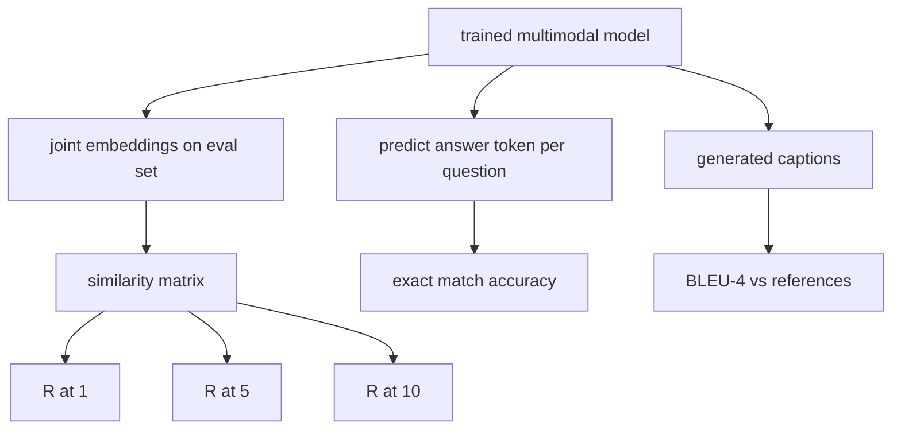

# Çok Modlu Değerlendirme

> Eğitim döngünün yarısıdır. Diğer yarısı ölçümdür. Bu ders ilkellerden üç değerlendirme yüzeyi oluşturur: R@1, R@5, R@10 olarak rapor edilen resim yazısı erişimi; tam eşleşme doğruluğu olarak rapor edilen görsel soru yanıtlaması; ve resim yazısı BLEU-4 olarak rapor edildi. Her metrik, modelin çıktıları üzerindeki bir fonksiyondur ve saniyeler içinde çalışan sentetik bir değerlendirme paketidir.

**Tür:** Yapım
**Diller:** Python
**Önkoşullar:** Aşama 19 dersler 58-62 (Track E temelleri: kodlayıcı, transformer, projeksiyon, çapraz dikkat füzyonu, ön eğitim)
**Süre:** ~90 dakika

## Öğrenme Hedefleri

- Resim ve başlık embedding'lar arasındaki benzerlik matrisinden Recall@K'yi hesaplayın.
- (Resim, soru) çiftlerini sabit bir cevap sözlüğüne eşleyen bir modelden tam eşleşme VQA doğruluğunu hesaplayın.
- Herhangi bir harici kütüphane olmadan, oluşturulan ve referans token dizilerinden BLEU-4'ü hesaplayın.
- Üç değerlendirmeyi de ders 62'deki eğitilmiş modelin üzerine inşa edilmiş sentetik bir pakette çalıştırın.

## Sorun

Eğitim kaybı durağanlaştığında multimodal bir modelin tamamlandığını ilan etmek cazip geliyor. Eğitim kaybı ölçümleri eğitim dağılımına uygundur; modelin uzun bir gruptaki çiftleri sıralayıp sıralayamayacağını, bir soruyu yanıtlayıp yanıtlayamayacağını veya bir insanın kabul edeceği bir başlık yazıp yazamayacağını ölçmüyor. Üç değerlendirme yüzeyi standarttır:

- **Alma (R@1, R@5, R@10).** Bir sorgu başlığı için embedding eklemini oluşturun; değerlendirme havuzundaki her görüntüyü kosinüse göre sıralayın; eşleşen görselin ilk 1, ilk 5, ilk 10'a girip girmediğini raporlayın. Simetrik (resimden metne) form aynı şekilde çalışır.
- **Görsel soru yanıtlama (tam eşleşme).** Verilen (resim, soru) model, bir token yanıtının çıktısını verir. Tam eşleşme örnek başına bir bittir: tahmin edilen cevap referans cevaba eşit miydi? Değerlendirme kümesinin ortalaması.
- **Altyazı oluşturma (BLEU-4).** Bir başlık oluşturun. Referans başlıklarına göre 1 gramdan 4 grama kadar hassasiyetlerin geometrik ortalamasını kısalık cezasıyla hesaplayın. Çoklu referans standart formdur (bir resim, birkaç referans başlığı).

Her metrik ince bir fonksiyondur. Ders bunların hepsini kod halinde oluşturur, böylece matematik somutlaşır ve yüzey sizin kontrolünüz altında kalır. Gerçek benchmark süitler (MS-COCO, VQA v2, GQA, OK-VQA) aynı işlev şekillerine takılır.

## Konsept



### Benzerlik matrisinden @K'yi geri çağırın

Resim ve başlık embedding'lar arasında `(N, N)` kosinüs benzerlik matrisini oluşturun. Her satır için sütunları benzerliğe göre azalan şekilde sıralayın. Recall@K, çapraz sütun indeksinin üst K konumlarında yer aldığı satırların kesiridir. Simetrik Recall@K (resime resim yazısı), aktarılan matris üzerinde hesaplanır. Her iki sayı da bildirildi. N=100 değerlendirme için R@1 = 0,6, 100 başlıktan 60'ının en iyi eşleşme olarak doğru görüntüyü aldığı anlamına gelir.

### VQA tam eşleşmesi

Her biri için (görüntü, soru, cevap), görüntüyü kodlayın, soruyu yerleştirin, kod çözücü aracılığıyla birleştirin ve sonraki token'ı okuyun. Tahmin edilen token kimliği, referans kimliğiyle karşılaştırılır; eşitse doğru. Değerlendirme kümesinin ortalaması. Gerçek VQA dataset'ler, soru başına birden fazla insan tarafından açıklamalı yanıtla birlikte gelir ve yumuşak doğruluk formülü kullanır (10 ek açıklamacıdan en az 3'ü aynı fikirdeyse 1,0, aşağıda ölçeklendirilmiştir); derste netlik sağlamak amacıyla tek yanıtlı tam eşleşme kullanılmaktadır.

### BLEU-4

```text
BLEU-4 = BP * exp(mean(log p1, log p2, log p3, log p4))
```

Burada `p_n` değiştirilmiş n-gram kesinliğidir (herhangi bir referansta görünen oluşturulan n-gramların kırpılmış sayısı, toplam üretilen n-gramlara bölünür) ve `BP` kısalık cezasıdır:

```text
BP = 1                if generated length > reference length
   = exp(1 - r/g)     otherwise, where r is reference length and g is generated
```

Bazı `p_n` 'ların sıfır olduğu küçük örnekler için yumuşatma gereklidir. Uygulama, düşük sayım rejimleri için en güvenli varsayılan olan Chen ve Cherry "yöntem 1"i (herhangi bir sıfır sayımı için pay ve paydaya 1 ekleyin) kullanır.

### Sentetik değerlendirme paketi

62. derste kullanılan aynı sahte derlem modelinden, uzatılmış bir tohumla, hafızada 50 örnekli bir değerlendirme paketi oluşturulmuştur. Paketi üç liste oluşturuyor:

- `pairs`: alma için 50 (resim, resim yazısı_idleri) çift.
- `vqa`: 50 (resim, soru_idleri, cevap_id) üçlüsü.
- `caps`: Resim başına en fazla 3 referansla 50 (resim, [reference_caption_ids, ...]) giriş.

Paket, tohumdan itibaren deterministiktir ve eğitim külliyatından elde edilir; dolayısıyla ölçümler, modelin hiç görmediği veriler üzerinden hesaplanır. Paketi JSON'da sürdürmek bir alıştırma olarak bırakılmıştır (aşağıya bakınız).

| Metrik | Menzil | Rastgele taban çizgisi (N=50) |
|--------|-------|------------------------|
| R@1 | 0'dan 1'e | 0,02 (1 / H) |
| R@5 | 0'dan 1'e | 0.10 |
| R@10 | 0'dan 1'e | 0.20 |
| MYK EM | 0'dan 1'e | 1 / kelime bilgisi |
| BLEU-4 | 0'dan 1'e | küçük ama sıfırdan farklı |

Sentetik veriler üzerinde 50 adımlık bir eğitim çalıştırması için metriklerin yüksek olması beklenmiyor; demo tarafından kontrol edilen rastgele taban çizgisinin üzerinde olmaları bekleniyor.

## Build It — Kendin Geliştir

`code/main.py` şunu uygular:

- `recall_at_k(sim_matrix, k)`, her iki yön için de `[0, 1]` 'da bir kayan nokta döndürüyor.
- `vqa_exact_match(predictions, references)`, `int` eşitliği üzerinden ortalamayı döndürüyor.
- `bleu4(generated, references, smoothing=True)`, çoklu referans desteğiyle.
- `build_eval_suite(seed, n_samples, vocab_size, max_len)`, üç deterministik değerlendirme listesi döndürüyor.
- `evaluate(model, suite)`, üç ölçümün tümünü çalıştırır ve `dict` sayı döndürür.
- 62. dersten yeni başlatılan çok modlu bir modeli yükleyen, onu değerlendiren, ardından onu 50 adım boyunca eğiten ve önceki/sonraki ölçümleri yazdırarak yeniden değerlendiren bir demo.

Çalıştır:

```bash
python3 code/main.py
```

Çıktı: öncesi/sonrası metrik tablosu, modelin öğrenilen sinyaline doğru neredeyse rastgeleden almanın geliştiğini, VQA'nın rastgelenin üzerinde geliştiğini ve BLEU-4'ün geliştiğini gösterir (sentetik yapı 4 gramlık hassas bir kaldırma için yeterlidir).

## Use It — Hazır Araçla Uygula

Her metrik doğrudan bir üretim benchmark ile eşleşir:

- **Geri alma.** MS-COCO 5K val, Flickr30K, ImageNet sıfır atış, hepsi aynı benzerlik matrisindeki R@K problemleridir. Sentetik değerlendirmeyi gerçek dosyalarla değiştirin; işlev imzası değişmez.
- **VQA.** VQA v2, GQA, OK-VQA aynı tam eşleşme şeklini kullanır (VQA v2 için tek yanıtlı EM yerine soft-acc ile).
- **BLEU-4.** MS-COCO altyazıları, NoCaps, Flickr30K altyazılarının tümü BLEU-4 artı CIDEr ve METEOR'u kullanır. CIDEr eklemek bir işlev dahadır.

Gerçek benchmark'lar için, `build_eval_suite` 'yi gerçek bir yükleyiciyle değiştirin ve işlev gövdelerini koruyun. Matematik benchmark-agnostiktir.

## Testler

`code/test_main.py` şunları kapsar:

- geri çağırma@k, k < N için mükemmel bir kimlik benzerliği matrisinde 1,0 ve ters çevrilmiş matriste 0,0 değerini döndürür
- geri çağırma@k, `k <= N` üst sınırına saygı duyar
- bleu4, referanslardan birine tam olarak eşit olduğunda 1,0 değerini döndürür
- bleu4 ayrık kelime dağarcığında 0,0 değerini döndürür
- vqa tam eşleşme eşit çiftlerin kesrine eşittir
- build_eval_suite beklenen çift sayısını, vqa öğesini ve altyazı girişini döndürür

Onları çalıştırın:

```bash
python3 -m unittest code/test_main.py
```

## Egzersizler

1. Altyazı ölçümlerine CIDEr'ı ekleyin. CIDEr, bilgilendirici token'lari ödüllendiren n-gramlar üzerinde TF-IDF ağırlıklandırmasını kullanır.

2. Esnek doğruluklu VQA uygulayın: soru başına birden fazla insan yanıtı, herhangi bir eşleşme varsa doğruluk `min(human_count / 3, 1)` 'dur. VQA v2'yi kopyalar.

3. Boş oluşturulan dizileri çökmeden işleyen, NaN-güvenli bir `bleu4` çeşidi ekleyin.

4. R@K ile birlikte ortalama karşılıklı sıralamayı (MRR) hesaplayın. MRR, doğru öğenin üst K'nın ötesine geçtiği yere duyarlıdır; R@K, üst K'ye girip girmediğine duyarlıdır.

5. Eğitim sırasında model üzerindeki değerlendirmeyi beş kontrol noktasında çalıştırın (adım 0, 10, 20, 30, 40, 50) ve öğrenme eğrisini çizin. Metrik yörüngelerin kayıp yörüngesini takip ettiğini doğrulayın.

## Anahtar Terimler

| Dönem | Ne anlama geliyor |
|------|---------------|
| R@K | Doğru eşleşmenin en üst K sonuçlarında yer aldığı sorguların oranı |
| Tam eşleşme | En basit VQA puanlaması: tahmin edilen yanıt eşittir referans |
| BLEU-4 | Kısalık cezasıyla birlikte 1 ila 4 gram hassasiyetin geometrik ortalaması |
| Çoklu referans | Altyazı ölçümü, görüntü başına birden fazla referans başlığını kabul eder |
| Uzatılmış | Değerlendirme kümesi, eğitim derleminden ayrık bir tohumdan örneklenir |

## Daha Fazla Okuma

- Yumuşak doğruluk formülü ve dataset istatistikleri için VQA v2 makalesi.
- TF-IDF ağırlıklı n-gram altyazıları için CIDEr kağıdı.
- Düzgünleştirme çeşitleri için BLEU orijinali (Papineni ve diğerleri, 2002).
- Kurallı referans uygulaması için MS-COCO altyazılı değerlendirme komut dosyaları.
