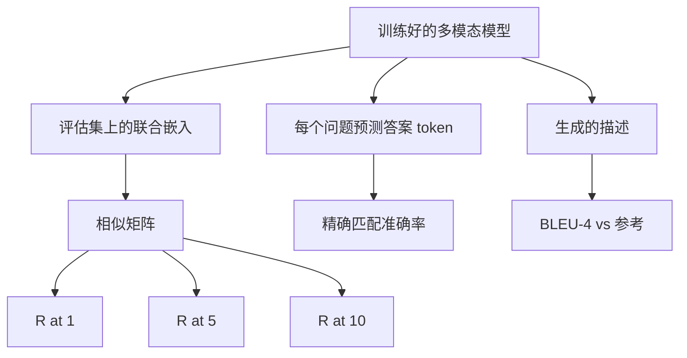

# 多模态评估

> 训练只是循环的一半。另一半是度量。本课从基础构建三个评估面：图像-标题检索，报告 R@1、R@5、R@10；视觉问答，报告精确匹配准确率；图像描述生成，报告 BLEU-4。每个指标都是模型输出的一个函数，配合一个可在数秒内运行的综合评估套件。

**类型：** 构建
**语言：** Python
**前置条件：** 第 19 阶段第 58–62 课（E 轨道基础：编码器、Transformer、投影、交叉注意力融合、预训练）
**时长：** ~90 分钟

## 学习目标

- 从图像和标题嵌入之间的相似矩阵计算 Recall@K。
- 从一个将（图像，问题）对映射到固定答案词汇表的模型计算精确匹配 VQA 准确率。
- 不依赖任何外部库，从生成序列和参考序列计算 BLEU-4。
- 对第 62 课训练好的模型之上构建的合成评估套件运行全部三项评估。

## 问题

一个常见的诱惑是，当训练损失趋于平稳时就宣布多模态模型已完成。训练损失衡量的是训练分布上的拟合程度；它不能衡量模型能否在留出批次中对配对进行排序、回答问题或写出人能接受的描述。三个标准的评估面如下：

- **检索（R@1、R@5、R@10）。** 为查询标题构建联合嵌入；按余弦相似度对评估池中的所有图像排序；报告匹配图像是否出现在前 1、前 5、前 10 中。对称形式（图像到文本）运行方式相同。
- **视觉问答（精确匹配）。** 给定（图像，问题），模型输出一个答案 token。精确匹配是每样本 1 比特：预测答案是否等于参考答案？对评估集求平均。
- **描述生成（BLEU-4）。** 生成一段描述。计算相对于参考描述的 1-gram 到 4-gram 修正精度的几何平均值，并加上长度惩罚。多参考是标准形式（一张图像，多条参考描述）。

每个指标都是一个薄函数。本课在代码中全部构建，使数学具体化，评估面始终在你的掌控之下。真实的基准套件（MS-COCO、VQA v2、GQA、OK-VQA）接入相同的函数形态。

## 概念



### 从相似矩阵计算 Recall@K

构建图像嵌入和标题嵌入之间的 `(N, N)` 余弦相似矩阵。对每一行，按相似度降序列排列列。Recall@K 是矩阵中其对角线上列索引位于前 K 个位置内的行的比例。对称 Recall@K（标题到图像）在转置矩阵上计算。两个数值都会报告。对于 N=100 的评估集，R@1 = 0.6 意味着 100 个标题中有 60 个正确检索到了它们对应的图像作为最佳匹配。

### VQA 精确匹配

对于每个（图像，问题，答案），对图像编码，嵌入问题，通过解码器融合，读出下一个 token。预测的 token id 与参考 id 比较；相等则正确。对评估集求平均。真实 VQA 数据集每个问题附带多人标注的答案，并使用软准确率公式（如果 10 个标注者中至少 3 人一致则为 1.0，否则按比例缩放）；本课为清晰起见使用单答案精确匹配。

### BLEU-4

```text
BLEU-4 = BP * exp(mean(log p1, log p2, log p3, log p4))
```

其中 `p_n` 是修正的 n-gram 精度（出现在任何参考中的生成 n-gram 的截断计数，除以生成的 n-gram 总数），`BP` 是长度惩罚：

```text
BP = 1                如果生成长度 > 参考长度
   = exp(1 - r/g)     否则，其中 r 是参考长度，g 是生成长度
```

小样本中某些 `p_n` 为零时需要进行平滑处理。实现使用 Chen 和 Cherry 的"方法 1"（对任何零计数的分子和分母都加 1），这是低计数场景下最安全的默认方案。

### 合成评估套件

一个包含 50 个样本的评估套件在内存中构建，使用与第 62 课相同的模拟语料模式，但使用留出种子。套件由三个列表组成：

- `pairs`：50 个（图像，标题 ID）对，用于检索。
- `vqa`：50 个（图像，问题 ID，答案 ID）三元组。
- `caps`：50 个（图像，[参考标题 ID, ...]）条目，每张图像最多 3 条参考。

该套件由种子确定性生成，并且从训练语料中留出，因此指标是在模型从未见过的数据上计算的。将套件持久化为 JSON 格式留作练习（见下文）。

| 指标 | 范围 | 随机基线 (N=50) |
|------|------|------------------|
| R@1 | 0 到 1 | 0.02 (1 / N) |
| R@5 | 0 到 1 | 0.10 |
| R@10 | 0 到 1 | 0.20 |
| VQA EM | 0 到 1 | 1 / vocab |
| BLEU-4 | 0 到 1 | 很小但非零 |

对于在合成数据上运行 50 步的训练，指标预计不会很高；但应高于随机基线，这正是演示要检查的内容。

## 构建

`code/main.py` 实现：

- `recall_at_k(sim_matrix, k)`，返回 `[0, 1]` 范围内的浮点数（两个方向）。
- `vqa_exact_match(predictions, references)`，返回 `int` 相等性的均值。
- `bleu4(generated, references, smoothing=True)`，支持多参考。
- `build_eval_suite(seed, n_samples, vocab_size, max_len)`，返回三个确定性的评估列表。
- `evaluate(model, suite)`，运行全部三项指标并返回一个 `dict` 结果。
- 一个演示程序：加载第 62 课中刚初始化的多模态模型，评估它，然后训练 50 步并再次评估，打印训练前后的指标。

运行：

```bash
python3 code/main.py
```

输出：评估前后的指标表显示，检索从接近随机水平向模型学习到的信号方向改善，VQA 提升至随机之上，BLEU-4 也有改善（合成结构足以带来 4-gram 精度的提升）。

## 使用

每个指标直接映射到生产基准上：

- **检索。** MS-COCO 5K 验证集、Flickr30K、ImageNet 零样本都是在同一相似矩阵上的 R@K 问题。将合成评估替换为真实文件，函数签名保持不变。
- **VQA。** VQA v2、GQA、OK-VQA 使用相同的精确匹配形态（VQA v2 使用软准确率而非单答案精确匹配）。
- **BLEU-4。** MS-COCO 描述生成、NoCaps、Flickr30K 描述生成都使用 BLEU-4 加上 CIDEr 和 METEOR。添加 CIDEr 只是一个函数的事。

对于真实基准，将 `build_eval_suite` 替换为真实数据加载器，保留函数体。数学与基准无关。

## 测试

`code/test_main.py` 覆盖：

- recall@k 在完美单位相似矩阵上返回 1.0，在翻转矩阵上返回 0.0（k < N 时）
- recall@k 遵循 `k <= N` 上限
- bleu4 在生成序列与某个参考完全一致时返回 1.0
- bleu4 在词汇表无交集时返回 0.0
- vqa 精确匹配等于相等对的比例
- build_eval_suite 返回预期数量的对、vqa 条目和描述条目

运行：

```bash
python3 -m unittest code/test_main.py
```

## 练习

1. 为描述生成指标添加 CIDEr。CIDEr 使用 TF-IDF 加权 n-gram，奖励信息量大的 token。

2. 实现软准确率 VQA：每个问题有多个人工答案，如果存在匹配则准确率为 `min(human_count / 3, 1)`。模拟 VQA v2。

3. 添加 `bleu4` 的 NaN 安全变体，处理空生成序列而不崩溃。

4. 在 R@K 之外计算平均倒数排名（MRR）。MRR 对正确项在前 K 名之外的具体位置敏感；R@K 对是否在前 K 名之内敏感。

5. 在训练过程中对五个检查点（第 0、10、20、30、40、50 步）运行评估，并绘制学习曲线。确认指标轨迹与损失轨迹一致。

## 关键术语

| 术语 | 含义 |
|------|------|
| R@K | 正确匹配出现在前 K 个结果中的查询比例 |
| 精确匹配 | 最简单的 VQA 评分：预测答案等于参考 |
| BLEU-4 | 1-gram 到 4-gram 精度的几何平均值，含长度惩罚 |
| 多参考 | 描述生成指标接受每张图像的多条参考描述 |
| 留出 | 评估集从一个与训练语料不相交的种子中采样 |

## 延伸阅读

- VQA v2 论文，了解软准确率公式和数据集统计。
- CIDEr 论文，了解 TF-IDF 加权 n-gram 描述生成。
- BLEU 原始论文（Papineni 等人，2002），了解平滑变体。
- MS-COCO 描述生成评估脚本，了解规范的参考实现。
