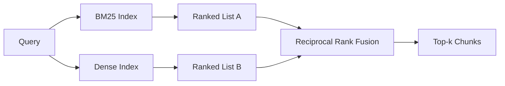

# BM25 ve Yoğun Embedding'larla Hibrit Erişim

> Karşıt sorgu dağılımlarında sözcüksel ve anlamsal erişim başarısız olur. Karşılıklı sıralama birleştirmeli hibrit erişim enterpolasyon yapmaz, oy verir ve her sorgu sınıfında oy kazanır.

**Tür:** Yapım
**Diller:** Python
**Önkoşullar:** Aşama 11 dersleri 04 (embeddings), 06 (RAG); Aşama 19 Bölüm B'nin temelleri (20-29. dersler); Aşama 19 ders 64 (parçalama stratejileri)
**Süre:** ~90 dakika

## Öğrenme Hedefleri
- Alan ağırlıklandırma, belge uzunluğu normalleştirme ve ayarlanabilir k1 ve b ile BM25'i Robertson ve Sparck Jones formülasyonundan sıfırdan uygulayın.
- Döngünün çevrimdışı çalışması için deterministik bir modelin embedding üzerine yoğun bir alıcı oluşturun.
- Karşılıklı sıralama füzyonunu tam olarak Cormack, Clarke ve Buettcher'ın 2009'da yayınladığı gibi uygulayın ve bunun neden puan ağırlıklı enterpolasyona hakim olduğunu açıklayın.
- RRF k sabitini ve modalite başına ağırlıkları ayarlayın ve küçük bir fikstür derlemindeki değiş-tokuşları okuyun.

## Sorun

Sorgu, derlemde aynen yer alan gerçek bir tanımlayıcıyı taşıdığında sözcüksel arama kazanır. `AbortMultipartOnFail` için yapılan bir sorgu, BM25 aracılığıyla mikrosaniye cinsinden doğru Go işlevini döndürür. Gömülü olarak aynı sorgu, üç benzerlik kümesinin sınırında yer alır ve yoğun bir alıcı, yanlış dosyayı ilk sıraya koyar.

Sorgu, derlemdeki değişmez token'lardan farklı sözcüklerle ifade edildiğinde yoğun arama kazanır. "İptal edilen yüklemeleri nasıl halledeceğiz?" diye soran bir kullanıcı hiçbir zaman iptal veya çok parçalı kelimelerini yazmadı. BM25, "büyük dosyaların yüklenmesi" ile ilgili belge yığınını döndürür çünkü bu sayfada yüklemeler sözcüğü bulunur. Yoğun alma, özetinde iptalin belirtildiği iptal işlevini bulur.

İkisi arasındaki seçim statik bir seçim değildir. Sorgu dağıtımı değişkendir. Üretim RAG sistemi her iki sınıfı da aynı uç noktadan yönetir, dolayısıyla alma işleminde her ikisinin de aynı anda ele alınması gerekir. Bu hibrit erişimdir. Birleştirme adımı doğru olması gereken kısımdır.

## Konsept



### BM25 bir paragrafta

BM25, bir sorgu-belge çiftini, sorgu terimleri üzerinden ters belge sıklık faktörünü uzunluk normalleştirme düzeltmesini içeren doygun terim-frekans faktörüyle çarparak toplayarak puanlar. İki düğme. `k1` terim frekansı doygunluğunu kontrol eder; varsayılan 1,5, yayınlanan öneridir ve onu benchmark olmadan taşımamalısınız. `b` belge uzunluğunun ne kadar önemli olduğunu kontrol eder; varsayılan 0,75, daha uzun belgelerin cezalandırıldığını ancak doğrusal olarak olmadığını belirtir.

IDF formülü, `log((N - df + 0.5) / (df + 0.5) + 1)` olan, düzeltilmiş Robertson ve Sparck Jones tanımını kullanır. Günlüğün içindeki artı bir, bir terim derlemin yarısından fazlasında göründüğünde IDF'yi pozitif tutar. Bu, engellenecek kelimelerin teknik olarak nadir olduğu küçük derlemlerde önemlidir.

Alan ağırlıklandırma, BM25'e sembol adındaki bir eşleşmenin gövdedeki bir eşleşmeden daha önemli olduğunu söylemenizi sağlar. Uygulama, puanlama süresinde değil, indeksleme sırasında terim sayımlarında bir çarpandır. Bu, matematiği aynı tutar ve alan başına ayrı bir puan alınmasını önler.

### Tek paragrafta yoğun erişim

Her parçayı bir embedding modeliyle sabit boyutlu bir vektöre gömün. Sorgu zamanında sorguyu yerleştirin, her parçayı benzerliğe göre kosinüs derecesine göre sıralayın ve en üstteki k'yi döndürün. Model kaliteyi belirleyen değişkendir. Alma algoritmasının kendisi iki satırdır: nokta çarpımı ve sıralama.

Bu ders deterministik karma tabanlı embedding kullanır, böylece füzyon matematiğini ağ çağrısı olmadan okuyabilirsiniz. Karma, token anahtarlı uzaklıkları 96 boyutlu bir vektör halinde toplar ve normalleştirir. Kosinüs dereceleri çalıştırmalar arasında belirleyicidir ve test paketinin gerektirdiği de budur.

### Karşılıklı sıralama füzyonu, yayınlanan formül

İki sıralı liste. Her iki listede de görünen her aday için karşılıklı sıralamadaki katkılarını toplayın. 2009 makalesinde varsayılan olarak k 60'a eşit olacak şekilde `1 / (k + rank)` kullanılmıştır. Toplam puana göre sıralayın. Bütün algoritma budur.

Yayınlanan sabit k = 60 keyfi değildir. k = 60 ile 1. sıra katkısı 1/61 ve 10. sıra katkısı 1/70 olur. Katkı yavaş yavaş azaldığı için derin adaylar hâlâ oy verir. Daha küçük k, en iyi sonuçların baskın olmasını sağlar. Daha büyük k, katkı eğrisini düzleştirir.

Uygulamamızda iki ayarlanabilir düğme. `k` sabiti. BM25'i artırabilmeniz veya daha iyi olduğuna dair önceden kanıtınız olduğunda yoğunlaştırma yapabilmeniz için bir çift modalite ağırlığı. Sıra katkısının ağırlıkla çarpılması en basit prensipli uygulamadır; sıralama bozulma şeklini korur ve ölçeksiz kalır.

### Füzyon neden puan ağırlıklı enterpolasyonu yener?

BM25 puanları sınırsızdır ve derle bağlıdır. Kosinüs benzerlikleri -1 ile 1 arasında sınırlanmıştır. Doğrusal bir kombinasyon `alpha * bm25 + (1 - alpha) * cosine` , derlem başına alfa ayarlaması gerektirir ve her yeniden indeksleme yaptığınızda bozulur. Sıralamaya dayalı füzyon bunu yapmaz. İki derece, yöntemler arasında karşılaştırılabilir. Yayınlanan RRF temel çizgisi, 2010'dan bu yana tüm halka açık TREC pistlerinde skor enterpolasyonunu geride bırakıyor.

Bu, Vespa ve Weaviate belgelerinde RankFusion ve RRF hakkında duyduğunuz argümanın aynısıdır. Aynı sonuca vardılar: Puanları enterpolasyona tabi tutacak çok güçlü bir kanıtınız olmadığı sürece sıralamaya dayalı kalın.

## Build It — Kendin Geliştir

`code/main.py` şunu uygular:

- `tokenize(text)` - hızlı bir normal ifade tokenizer.
- `BM25Index` - alan ağırlıklı, `add` ve `search` ile ayarlanabilir ve ayarlanabilir k1, b.
- `mock_embed`, `DenseIndex` - ders 64 ile aynı deterministik embedding, dolayısıyla parçalar karşılaştırılabilir.
- `rrf(rankings, k, weights)` - çok modlu ağırlıklarla yayınlanmış füzyon.
- `HybridRetriever` - BM25 ile yoğun'u birleştirir.
- Küçük bir fikstür derlemi yükleyen, her avlayıcının güçlü ve zayıf yönlerini hedef alan üç sorgu çalıştıran ve her yöntemin ürettiği sıralamaları artı birleştirilmiş listeyi yazdıran bir demo `main()` .

Çalıştır:

```bash
python3 code/main.py
```

Demo çıktısını yan yana okuyun. Gerçek tanımlayıcı sorgusu BM25 sıralaması 1, yoğun sıralaması 4, RRF sıralaması 1'e ulaşır. Başka kelimelerle ifade edilen sorgu BM25 sıralaması 6, yoğun sıralaması 1, RRF sıralaması 1'e ulaşır. Belirsiz sorgu BM25 sıralaması 3, yoğun sıralaması 3, RRF sıralaması 1'e ulaşır. Füzyon eşitliği bozucu değildir; her sorgu sınıfında kazanan sistemdir.

## Düğmelerin ayarlanması

| Düğme | Varsayılan | | |
|------|---------|----------------|------------------|
| BM25 k1 | 1.5 | Terimler belgelerde tekrarlanıyor ve sıklığın daha fazla önem taşımasını istiyorsunuz | Belgeler kısa ve terim tekrarı gürültüye neden oluyor |
| BM25 b | 0,75 | Uzun belgeler gerçekten kelime başına daha az şey ifade ediyor | Belge uzunluğunun konuyla alakası yok |
| RRF k | 60 | Derin adaylar oy vermeye devam etmeli | İlk 1 hakim olmalı |
| BM25 ağırlığı | 1.0 | Derleminiz gerçek tanımlayıcılar içerir ve bunlarla eşleşen sorgular | Sorgularınız kullanıcı tarafından yeniden ifade edilir |
| Yoğun ağırlık | 1.0 | Sorgular başka kelimelerle ifade edilmiştir | Sorgular gerçektir |

Sezgiyle değil, 68. dersin değerlendirme donanımını uzun sorgu setinizde yeniden çalıştırarak ayar yapın.

## Demonun gizleyeceği arıza modları

**Kelime dışı token'lar.** BM25'in IDF'si derlemden hesaplanır, dolayısıyla yalnızca sorgudaki terimler sıfıra katkıda bulunur. Yoğun embedding'lar aynı terim için bir vektör halüsinasyonu gösterir. Derlem dışı tanımlayıcılarda yoğun yöntem, makul görünen ancak yanlış komşular döndürür. Füzyon bunu absorbe eder çünkü BM25 hiçbir şey döndürmez ve sıralama katkısı düşer, ancak yalnızca parça bazında değil belge bazında çoğaltmayı kaldırırsanız.

**Dur-token hakimiyeti.** BM25, "the" kelimesine karşı, bütünce üzerinde tekdüze bir sıralama üretir. Dizin oluşturucudaki token durdurmalarını filtreleyin veya yüksek IDF koşullarının doğal olarak hakim olduğunu kabul edin.

**Modaliteler arasında aynı içerik.** Derleminiz BM25'in ilk 1'inin aynı zamanda yoğunların da ilk 1'i olmasını sağlayacak kadar küçükse, RRF size aynı komşularla aynı ilk 1'i verir. Bu doğru bir davranıştır, bir başarısızlık değildir ancak füzyonun görünmez görünmesine neden olur. Füzyonun gerçekten çalıştığını doğrulamak için değerlendirmenize bir rakip sorgu çifti ekleyin.

## Use It — Hazır Araçla Uygula

Üretim modelleri:

- BM25 endeksi işleniyor; darboğaz vektörler değil, terim-frekans sözlüğüdür.
- Yoğun vektörleri ayrı bir depoda indeksleyin (bu derste düz bir liste kullanıyoruz; üretimde HNSW'yi kullanacaksınız).
- Her iki sorguyu da paralel olarak çalıştırın; füzyon, birleşim üzerinde sabit zamanlı bir birleşmedir.
- Alınan her isabetin yöntemini sürdürün, böylece alt kademedeki bir yeniden sıralama uzmanı hangi yöntemin ona oy verdiğini görebilir.

## Ship It — Kullanıma Sun

Ders 66, bu dersteki birleştirilmiş top-k'yi alır ve bir çapraz kodlayıcıyla yeniden sıralar. Ders 68, tüm işlem hattını hassasiyet, geri çağırma, MRR ve nDCG ile değerlendirir. Bu dersteki hibrit av köpeği 69. dersteki uçtan uca sistemin ilk aşamasıdır.

## Egzersizler

1. `mock_embed` 'yi sağlayıcınızın gerçek modeliyle değiştirin. Demoyu yeniden çalıştırın ve başka kelimelerle ifade edilen sorguda yalnızca yoğun sıralamanın nasıl değiştiğini bildirin.
2. Üçüncü bir yöntem ekleyin: ayrı ayrı indekslenen ve üçüncü sıradaki liste olarak birleştirilen parça özetleri. Kazanımı ölçün.
3. RRF k'yi 10, 30, 60, 100, 200 boyunca tarayın. 68. dersten geri çağırma@k eğrisini çizin. Derleminizde eğrinin zirve yaptığı yerde k değerini rapor edin.
4. BM25F'yi doğru bir şekilde uygulayın (çarpan hilesi yerine alan başına uzunluk normalizasyonu) ve sembol eşleşmelerinin en önemli olduğu bir derlem üzerinde karşılaştırın.

## Anahtar Terimler

| Dönem | İnsanlar ne diyor | Aslında ne anlama geliyor |
|------|-----------------|------------------------|
| BM25 | "Sözcüksel arama" | idf x saturating tf x uzunluk normalizasyonu ile olasılıksal sıralama |
| RRF | "Sıra füzyonu" | Sıralanmış listelerde 1 / (k + sıra) toplamı; k = 60 varsayılan |
| k1 | "TF doygunluğu" | Tekrarlanan bir terimin daha fazla puan eklemeyi ne kadar hızlı durdurduğunu kontrol eder |
| b | "Uzunluk cezası" | 0, belge uzunluğunun göz ardı edilmesi anlamına gelir; 1, tam normalleştirme anlamına gelir |
| Alan ağırlıklandırma | "Sembol güçlendirme" | Bu alandaki eşleşmeleri artırmak için indeksleme sırasında token saniyelerini tekrarlayın |
| Sıralamaya dayalı ve puana dayalı füzyon | "RRF neden doğrusaldan üstündür?" | Sıralamalar yöntemler arasında karşılaştırılabilir; puanlar |

## Daha Fazla Okuma

- Cormack, Clarke, Buettcher, "Karşılıklı Sıralama Füzyonu, Condorcet ve bireysel sıralama öğrenme yöntemlerinden daha iyi performans gösteriyor", SIGIR 2009
- Robertson, Walker, Beaulieu, Gatford, Payne, "Okapi at TREC-3" (orijinal BM25 makalesi)
- [Vespa: BM25 ve Embeddings](https://docs.vespa.ai/en/tutorials/hybrid-search.html) ile Hibrit Erişim
- [Weaviate: Karma Arama](https://weaviate.io/developers/weaviate/search/hybrid)
- Aşama 11 ders 06 - RAG temelleri
- Aşama 19 ders 64 - çıktısı burada indekslenen yığınlayıcılar
- Aşama 19 ders 66 - birleştirilmiş top-k'yi tüketen çapraz kodlayıcı yeniden sıralaması
