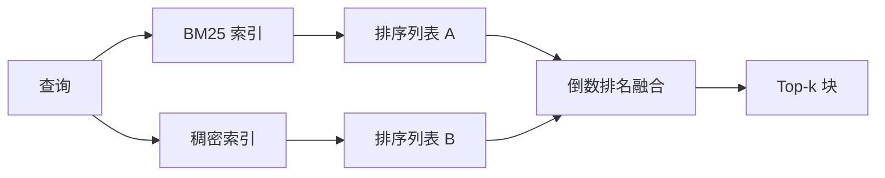

# BM25 与稠密嵌入的混合检索

> 词法检索和语义检索在相反的查询分布上各自失败。基于倒数排名融合的混合检索不做插值——它进行投票，而投票在每个查询类别上都胜出。

**类型：** 构建
**语言：** Python
**前置条件：** 阶段 11 第 04 课（嵌入）、第 06 课（RAG）；阶段 19 Track B 基础（第 20-29 课）；阶段 19 第 64 课（分块策略）
**时长：** ~90 分钟

## 学习目标

- 基于 Robertson 和 Sparck Jones 公式从零实现 BM25，包含字段加权、文档长度归一化以及可调参数 k1 和 b。
- 基于确定性模拟嵌入构建稠密检索器，使循环可离线运行。
- 严格按照 Cormack、Clarke 和 Buettcher 在 2009 年发表的论文实现倒数排名融合，并解释为什么它优于分数加权插值。
- 调优 RRF 常数 k 和每种模态的权重，在小规模固定语料库上观察权衡。

## 问题

词法搜索在查询携带语料库中包含的逐字字面标识符时胜出。查询 `AbortMultipartOnFail` 通过 BM25 在微秒内返回正确的 Go 函数。同样的查询，在嵌入后落在三个相似性簇的边界上，稠密检索器将错误文件排在第一。

稠密搜索在查询偏离语料库的逐字词元时胜出。用户问"如何处理取消的上传"从未输入 abort 或 multipart 这两个词。BM25 返回"上传大文件"的文档块，因为该页面包含单词 uploads。稠密检索找到的是摘要中提到 cancellation 的 abort 函数。

两者之间的选择并非一成不变。查询分布才是变量。生产级 RAG 系统需要在同一个端点处理两类查询，因此检索必须同时处理两者。这就是混合检索。合并步骤才是必须做对的部分。

## 概念



### BM25 一段话讲清

BM25 通过对查询词项求和来对查询-文档对评分：一个逆文档频率因子乘以一个饱和的词频因子，再附加长度归一化修正。两个旋钮。`k1` 控制词频饱和度；默认值 1.5 是已发表的推荐值，没有基准测试就不应改动。`b` 控制文档长度的权重；默认值 0.75 表示较长文档会受到惩罚，但不是线性的。

IDF 公式使用平滑后的 Robertson 和 Sparck Jones 定义：`log((N - df + 0.5) / (df + 0.5) + 1)`。对数内的加一确保当一个词项出现在超过半数语料中时 IDF 仍为正数。这在停用词技术上很罕见的小语料库中尤为重要。

字段加权让你告诉 BM25，符号名称上的匹配比正文中的匹配更重要。实现方式是在索引期间对词项计数乘以系数，而不是在评分时进行。这保持了数学上的一致性，避免了按字段单独评分。

### 稠密检索一段话讲清

用嵌入模型将每个分块编码为固定维度的向量。查询时，对查询进行嵌入，用余弦相似度对所有分块进行排序，返回 top-k。模型是决定质量的可变因素。检索算法本身只有两行：点积和排序。

本课使用基于确定性哈希的嵌入，让你无需网络调用即可理解融合数学。哈希将词元键控偏移量求和到 96 维向量中并归一化。余弦排名在多次运行中保持确定，这正是测试套件所要求的。

### 倒数排名融合，已发表公式

两个排序列表。对于出现在任一列表中的每个候选项，将其倒数排名贡献求和。2009 年的论文使用 `1 / (k + rank)`，默认 k = 60。按总分排序。这就是整个算法。

已发表的常数 k = 60 并非随意选取。当 k = 60 时，排名第 1 的贡献为 1 / 61，排名第 10 的贡献为 1 / 70。贡献衰减缓慢，因此深度候选项仍可投票。较小的 k 使顶部结果占主导。较大的 k 则使贡献曲线更平缓。

我们的实现中有两个可调旋钮。常数 `k`。一对每模态权重，这样当你有先验证据表明某种模态在你的语料库上更优时，可以提升 BM25 或稠密检索。将排名贡献乘以权重是最简单的原则性实现；它保持了排名衰减的形状，且保持无量纲。

### 为什么融合优于分数加权插值

BM25 分数是无界的且依赖语料库。余弦相似度限制在 -1 到 1 之间。线性组合 `alpha * bm25 + (1 - alpha) * cosine` 需要针对每个语料库调优 alpha，并且每次重新索引时都会失效。基于排名的融合则不需要。两个排名在不同模态之间是可比较的。自 2010 年以来，已发表的 RRF 基线在每次公开 TREC 评测中都击败了分数插值。

这与你在 Vespa 和 Weaviate 文档中听到的关于 RankFusion 与 RRF 的论点是相同的。他们得出了相同的结论：除非有非常强的证据支持插值分数，否则坚持基于排名的方法。

## 动手构建

`code/main.py` 实现了：

- `tokenize(text)` - 一个快速的正则表达式分词器。
- `BM25Index` - 支持字段加权，包含 `add` 和 `search` 方法以及可调参数 k1、b。
- `mock_embed`、`DenseIndex` - 与第 64 课相同的确定性嵌入，使分块可比较。
- `rrf(rankings, k, weights)` - 已发表的融合方法，支持多模态权重。
- `HybridRetriever` - 结合 BM25 和稠密检索。
- 一个演示用的 `main()`，加载小型固定语料库，运行三个查询以分别针对每个检索器的优势与劣势，并打印每种模态产生的排名以及融合后的列表。

运行：

```bash
python3 code/main.py
```

将演示输出并排阅读。字面标识符查询在 BM25 中排名第 1，稠密排名第 4，RRF 排名第 1。改写查询在 BM25 中排名第 6，稠密排名第 1，RRF 排名第 1。歧义查询在 BM25 中排名第 3，稠密排名第 3，RRF 排名第 1。融合不是平局决胜器；它是一个在每个查询类别上都胜出的系统。

## 调优旋钮

| 旋钮 | 默认值 | 何时调高 | 何时调低 |
|------|--------|---------|---------|
| BM25 k1 | 1.5 | 词项在文档中重复出现，且你希望词频更重要时 | 文档短小，词项重复是噪声时 |
| BM25 b | 0.75 | 长文档确实每词传达的信息更少时 | 文档长度与主题不相关时 |
| RRF k | 60 | 深度候选项应继续投票时 | 顶部结果应占主导时 |
| BM25 权重 | 1.0 | 语料库包含字面标识符且查询与之匹配时 | 查询是用户改写的时 |
| 稠密权重 | 1.0 | 查询是改写的时 | 查询是字面量时 |

通过在第 68 课的评估框架上对你的预留查询集重新运行来调优，而不是凭直觉。

## 演示不会暴露的失败模式

**词汇表外词元。** BM25 的 IDF 是从语料库计算的，因此仅在查询中出现的词项贡献为零。稠密嵌入则为同一个词项"幻觉"出一个向量。对于语料库外的标识符，稠密模态返回看似合理但错误的邻居。融合能吸收这一问题，因为 BM25 返回空值，排名贡献自然消失——但前提是你按文档去重，而非按分块。

**停用词主导。** 针对单词"the"的 BM25 会在整个语料库上产生均匀排名。在索引器中过滤停用词，或者接受高 IDF 词项自然占主导的事实。

**跨模态相同内容。** 如果你的语料库足够小，以至于 BM25 的 top-1 同时也是稠密的 top-1，RRF 会给出相同的 top-1 和相同的邻居。这是正确行为，并非失败，但它使融合看起来仿佛不存在。在你的评估中增加一对对抗性查询来验证融合是否实际生效。

## 使用方式

生产模式：

- BM25 在进程内索引；瓶颈是词频字典，而非向量。
- 稠密向量存储在独立的存储中（本课使用平面列表；生产环境应使用 HNSW）。
- 并行运行两种查询；融合是对并集进行常数时间的合并。
- 持久化每条检索结果的模态信息，以便下游重排序器查看每项结果由哪种模态投票产生。

## 后续课程

第 66 课将本课融合后的 top-k 结果用交叉编码器进行重排序。第 68 课用精确率、召回率、MRR 和 nDCG 评估整个流水线。本课的混合检索器是第 69 课端到端系统的第一阶段。

## 练习

1. 将 `mock_embed` 替换为你所用提供商的真实模型。重新运行演示，报告稠密单独排名在改写查询上的变化。
2. 添加第三种模态：将分块摘要单独索引，作为第三个排序列表进行融合。测量增益。
3. 在 10、30、60、100、200 范围内扫描 RRF k 值。绘制第 68 课中的 recall@k 曲线。报告在你的语料库上曲线达到峰值的 k 值。
4. 正确实现 BM25F（按字段长度归一化，而非乘数技巧），并在符号匹配最相关的语料库上进行对比。

## 关键术语

| 术语 | 人们怎么说 | 实际含义 |
|------|-----------|---------|
| BM25 | "词法搜索" | 概率排名：idf × 饱和 tf × 长度归一化 |
| RRF | "排名融合" | 跨排序列表对 1 / (k + rank) 求和；默认 k = 60 |
| k1 | "TF 饱和度" | 控制重复词项停止增加分数的速度 |
| b | "长度惩罚" | 0 表示忽略文档长度，1 表示完全归一化 |
| 字段加权 | "符号提升" | 在索引期间重复词元以提升该字段的匹配权重 |
| 基于排名 vs 基于分数融合 | "为什么 RRF 优于线性" | 排名在不同模态间可比；分数则不可比 |

## 延伸阅读

- Cormack, Clarke, Buettcher, "Reciprocal Rank Fusion outperforms Condorcet and individual rank learning methods", SIGIR 2009
- Robertson, Walker, Beaulieu, Gatford, Payne, "Okapi at TREC-3"（BM25 原始论文）
- [Vespa: Hybrid Retrieval with BM25 and Embeddings](https://docs.vespa.ai/en/tutorials/hybrid-search.html)
- [Weaviate: Hybrid Search](https://weaviate.io/developers/weaviate/search/hybrid)
- 阶段 11 第 06 课 - RAG 基础
- 阶段 19 第 64 课 - 输出在此索引的分块器
- 阶段 19 第 66 课 - 消费融合后 top-k 的交叉编码器重排序器
