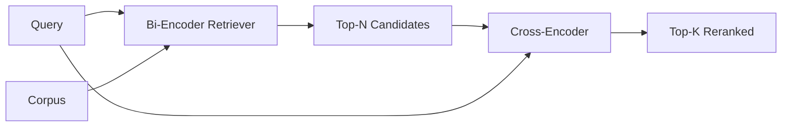

# Çapraz Kodlayıcı Yeniden Sıralayıcısı

> İki kodlayıcı, sorguyu ve belgeyi bağımsız olarak katıştırır. Çapraz kodlayıcı bunları birleştirir ve her ikisini de aynı anda okur. Çapraz kodlayıcı en akıllı okuyucudur ve en yavaş olanıdır. Çift kodlayıcının top-k'sinde ikinci aşama olarak kullanıldığında, kendini amorti eder.

**Tür:** Yapım
**Diller:** Python
**Önkoşullar:** Aşama 11 ders 06 (RAG), Aşama 11 ders 07 (ileri düzey RAG); Aşama 19 Bölüm B'nin temelleri (20-29. dersler); Aşama 19 ders 65 (bu aşamayı besleyen karma erişim)
**Süre:** ~90 dakika

## Öğrenme Hedefleri
- Giriş şekli, parametre sayısı ve sorgu başına maliyete göre iki kodlayıcılı bir alıcıyı çapraz kodlayıcılı yeniden sıralayıcıdan ayırın.
- Paketlenmiş (sorgu, belge) diziyi tüketen ve tek bir alaka skaleri yayan bir transformer bloğu olarak sıfırdan küçük bir çapraz kodlayıcı uygulayın.
- İki aşamalı bir alma ve ardından yeniden sıralama hattı bağlayın: ucuz bir alıcıyla ilk N'yi alın, çapraz kodlayıcıyla N'yi üst K'ye yeniden sıralayın, K'yi döndürün.
- Küçük bir donanım kümesinde gecikme ve kalite arasındaki dengeyi ölçün ve belirli bir gecikme bütçesi için doğru N'yi seçin.

## Sorun

Çift kodlayıcı, sorgu ve belgeyi aynı vektör uzayına eşler ve kosinüse göre sıralar. İki kodlama birbirini asla görmez. Modelin, bir belgeyle ilgili yararlı olan her şeyi, sorguya kör bir şekilde tek bir vektöre sıkıştırması gerekiyor. Bu hızlıdır - dizin zamanında belge başına bir embedding ve sorgu zamanında sorgu başına bir - ve derlem ölçeğinde sıralama yapmanın tek yoludur.

Maliyet kesindir. Genel olarak aynı konuya sahip iki belge, biri sorguyu yanıtlarken diğeri yanıtlamasa bile neredeyse aynı embedding'lara sahip olabilir. Çift kodlayıcı bunları birbirinden ayıramaz.

Çapraz kodlayıcı, sorguyu ve belgeyi birlikte okuyarak bu sorunu çözer. Model, `[query] [SEP] [document]` 'yi tek bir dizi olarak alır, birleştirme boyunca tüm dikkatini çalıştırır ve bir alaka skaleri üretir. Belgenin her token'si, sorgunun her token'sine katılabilir. Model, puana tam bağlamla karar verir.

Maliyet verimdir. Çift kodlayıcının bir kez yerleştirildiği ve sonsuza kadar sorguladığı durumlarda, çapraz kodlayıcı (sorgu, belge) çifti başına bir kez çalışır. 10 milyonluk bir belge topluluğu için sorgu başına 10 milyon ileri geçiş anlamına gelir. İstek bütçesinde çalıştırılamaz.

Çözüm sahnelemek. Üst N'yi almak için çift kodlayıcıyı kullanın. N'yi üst K olarak yeniden sıralamak için çapraz kodlayıcıyı kullanın. N küçüktür (50 ila 200) ve çapraz kodlayıcının kalite artışı önemli olduğu yerde yoğunlaşmıştır. Toplam gecikme istek bütçesinde kalır. Toplam kalite çapraz kodlayıcının kalitesidir ve çift kodlayıcının N'de geri çağrılması ile sınırlandırılmıştır.

## Konsept



### Çapraz kodlayıcının giriş şekli

Standart ambalaj `[CLS] query_tokens [SEP] document_tokens [SEP]`'dır. CLS konumu çıkışı, alaka skaler değerini veren tek bir doğrusal kafaya beslenir. Bazı uygulamalar CLS yerine ortalama havuzlamayı kullanır; fark küçüktür. Önemli olan modelin çift başına bir sayı üretmesidir.

22M parametreli bir çapraz kodlayıcı (yayınlanan `ms-marco-MiniLM-L-6-v2` ağırlık sınıfı) tipik üretim noktasıdır. Daha küçük modeller, gecikmeden tasarruf etmekten ziyade kaliteyi daha hızlı kaybeder. Daha büyük modeller (568M parametrelerde e.g. `bge-reranker-v2-m3` ), çevrimdışı yeniden sıralamaya veya K'nin küçük olduğu ilk sayfa yeniden sıralamasına ayrılmıştır.

### Bu ders neden küçük bir dersi eğitiyor?

Gerçek bir çapraz kodlayıcı, ince ayarlı bir kodlayıcıdır transformer. Üretimde bir kontrol noktası yükler ve onu çalıştırırsınız. Bu derste amaç, son teknolojiye sahip bir sıralamacı yetiştirmek değil, size modelin şeklini ve gecikme kalitesi eğrisinin şeklini göstermektir. Böylece bir transformer blok, çok kafalı dikkat (varsayılan olarak 4 kafa) ve bir regresyon kafası ile küçük bir `nn.Module` oluşturuyoruz. Bir tohumdan deterministik olarak başlatılır, böylece demo diskteki ağırlıklar olmadan tekrarlanabilir.

Oyuncak modeli, doğru şekli fikstür derleminden öğrenir: ilgili sorgu-belge çiftleri ilgisiz çiftlere göre daha yüksek tahmin puanlarına sahiptir. Uçtan uca boru hattı çift kodlayıcının çıktısını yeniden sıralar ve yeniden sıralamanın en üst k'si altın etiketlerle ilişkilendirilir.

### Gecikme ve kalite

İki aşamalı boru hattında ayarlanabilir bir ayar vardır: N. Uzatılmış bir sorgu kümesinde N'yi 5'ten 100'e süpürün ve eğriyi elde edin.

| N | Aşama 2'nin 1'ini geri çağırın | Sorgu başına çapraz kodlayıcı ileri geçişleri | Gecikme |
|---|--------------------|---------------------------------------|---------|
| 5 | 0,62 | 5 | düşük |
| 20 | 0.81 | 20 | orta |
| 50 | 0,86 | 50 | yüksek |
| 100 | 0,86 | 100 | çok yüksek |

Yukarıdaki sayılar bu fikstürden alınan ölçümleri değil, şekli göstermektedir. Şekil gerçektir. Her zaman 20 ila 50 civarında adayın yeniden sıralama yükselişinin doyduğu bir dizi vardır. Dizinizi geçtikten sonra hiçbir şey için para ödüyorsunuz.

Değerlendirme eğrisi artı gecikme bütçesinden N'yi seçin. Çapraz kodlayıcı, çift kodlayıcının N'deki geri çağırma işleminin üzerine geri çağırmayı yükseltemez; bu nedenle, yalnızca gecikme değil, düşük N büyük harf kalitesi de söz konusudur.

## Build It — Kendin Geliştir

`code/main.py` şunu uygular:

- `CrossEncoder` - küçük bir `torch.nn.Module`: token embedding, çok kafalı dikkat ve ileri beslemeli, bir skaler üreten ortalama havuzlu kafaya sahip bir transformer bloğu.
- `tokenize_pair(query, document)` - iki dizeyi, sınırı, deterministik ve stdlib'i işaretleyen tür kimlikleriyle tek bir kimlik dizisi halinde paketler.
- `train_tiny(pairs)` - elle etiketlenmiş (sorgu, belge, alaka) üçlü listede denetimli eğitimin bir geçişi, böylece model fikstür üzerinde anlamlı puanlar üretir.
- `rerank(query, candidates, top_k)` - üretim arayüzü.
- `pipeline(query, retriever, top_n, top_k)` - iki aşamalı akış.
- Ders 65'in düzeninden derlemi yükleyen, ilk N'yi alan, üst K'ye yeniden sıralayan, her iki listeyi yan yana yazdıran ve her aşamanın gecikmesini bildiren bir demo `main()` .

Çalıştır:

```bash
python3 code/main.py
```

Çıktı, çift kodlayıcının üst N'sini, çapraz kodlayıcının üst K'sını ve bir zamanlama özetini gösterir. Çapraz kodlayıcı çağrı başına daha uzun sürer ancak tüm derlemede çalışmaz. İki aşamalı toplam, iki kodlayıcının ikinci veya üçüncü sırada yer aldığı yanıtı seçerken istek bütçesi dahilinde kalır.

## Demonun gizleyeceği arıza modları

**Çapraz kodlayıcı simetrik değildir.** `rerank(q, d)` ve `rerank(d, q)` farklı puanlardır. Her zaman önce sorguyu besleyin. Yanlışlıkla değiştirirseniz geri çağırma çöker.

**N, hatayı ortaya çıkarmak için çok düşük.** N = K'yi ayarlarsanız çapraz kodlayıcı yeniden sıralayamaz; yalnızca yeniden ağırlıklandırılabilir. Asansör sıfır görünüyor. N'yi en az üç kez K'yi seçin.

**Eğitim verileri değerlendirmeye sızıyor.** Elle etiketlenmiş eğitim çiftleri değerlendirme sorgularını içeriyorsa, yeniden sıralama sihirli görünür. Bir fikstürde bile tren ve değerlendirmeyi kesinlikle ayırın.

**Üretim ağırlıkları yoğundur.** 22M parametreli bir çapraz kodlayıcı, float32'de 88 MB'tır. 100 ms'nin altında p95 vaat etmeden önce model sunucunun belleğini planlayın.

**Toplama önemlidir.** Gerçek bir çapraz kodlayıcı, N adayı tek bir grupta çalıştırır. Bu ders bunu, toplu kimlik ve tür kimliği tensörlerini `torch.tensor(...)` ile oluşturan ve bir ileri geçiş çalıştıran `_batch_encode`'da yapar. Toplu işlemi atladığınızda gecikme N ile çarpılır.

## Use It — Hazır Araçla Uygula

Üretim modelleri:

- İki kodlayıcıyı, çapraz kodlayıcıyı ve N'yi birbirine sabitleyin. Herhangi birinin değiştirilmesi değerlendirmeyi geçersiz kılar.
- Yeniden sıralayıcının çıktısını (query, document_id) hash ile önbelleğe alın. Kararlı bir derlem için aynı sorgu aynı sıraya göre yeniden sıralanır; önbellek isabetleri size ücretsiz bir gecikme kesintisi kazandırır.
- Derece-1 çapraz kodlayıcı puanını kaydedin. En yüksek 1 puanı, derlemin belirli bir eşiğinin altında olan bir sorgu, alan dışı isabettir; bunu LLM'ye "kendime güvenmiyorum" olarak gösterin.

## Ship It — Kullanıma Sun

Ders 68 bu iki aşamalı boru hattını uçtan uca değerlendiriyor. Ders 69, bu yeniden sıralamayı ders 65'teki hibrit avlayıcının arkasına ve cevap oluşturucunun önüne bağlar. Yeniden sıralama uçtan uca sistemin ikinci aşamasıdır.

## Egzersizler

1. N'yi 5'ten 50'ye kaydırın ve yeniden sıralanan çıktının geri çağırma@1'ini çizin. Bu fikstürdeki dizini bulun.
2. Çapraz kodlayıcıyı bir yerine on dönem için eğitin. Her dönemde pozitif ve negatif çiftler arasındaki puan marjını ölçün.
3. Ortalama havuzlamayı bir CLS-token başlığıyla değiştirin. Bu fikstürdeki yakınsamayı karşılaştırın.
4. İkili "cevap belgede mi var" etiketini tahmin eden ikinci bir çapraz kodlayıcı kafası ekleyin. inference'da her iki kafayı da kullanın; biri rütbeye, biri eşiğe.
5. Deterministik sahte ikili kodlayıcıyı ders 65'teki kodlayıcıyla değiştirin ve iki aşamayı zincirleyin. Yalnızca çift kodlayıcıya karşı üst K'deki değişimi ölçün.

## Anahtar Terimler

| Dönem | İnsanlar ne diyor | Aslında ne anlama geliyor |
|------|-----------------|------------------------|
| Çift kodlayıcı | "Vektör av köpeği" | Sorguyu ve belgeyi bağımsız olarak kodlar; kosinüs onları sıralıyor |
| Çapraz kodlayıcı | "Yeniden Sıralayan" | Birlikte kodlar (sorgu, belge); bir alaka skaler çıktısı |
| İki aşamalı boru hattı | "Geri al ve yeniden sırala" | Ucuz avlayıcı N'yi döndürür, pahalı yeniden sıralayıcı K'yi korur |
| N (aday bütçesi) | "Havuzu yeniden sırala" | Çapraz kodlayıcının sorgu başına puanladığı aday sayısı |
| Ortalama havuzlama kafası | "En son gizlenenlerin ortalaması" | Kodlayıcının son katman çıktılarını tek bir vektörde ortalama |

## Daha Fazla Okuma

- Nogueira, Cho, "BERT ile Pasajın Yeniden Sıralanması", 2019 - kanonik çapraz kodlayıcı sıralayıcı makalesi
- Reimers, Gurevych, "Cümle-BERT: Siyam BERT-Ağlarını kullanan Cümle Embedding'ler", 2019 - çift kodlayıcılar ve çapraz kodlayıcılar hakkında
- [CümleTransformernin Çapraz Kodlayıcılar belgeleri](https://www.sbert.net/examples/applications/cross-encoder/README.html)
- [BGE Reranker v2 model kartı](https://huggingface.co/BAAI/bge-reranker-v2-m3)
- Aşama 19 ders 65 - bu yeniden sıralama aşamasını besleyen hibrit av köpeği
- Aşama 19 ders 68 - bu yeniden sıralamanın sağladığı artışı ölçen değerlendirme
