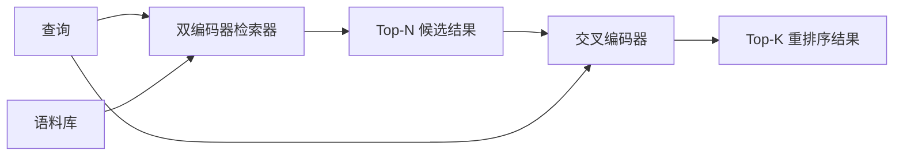

# 交叉编码器重排序器

> 双编码器独立编码查询和文档。交叉编码器将两者拼接起来，一次性读取两者。交叉编码器是最聪明的读者，也是最慢的。将其作为第二阶段应用于双编码器的 top-k 结果上，这个代价是值得的。

**类型：** 构建
**语言：** Python
**前置知识：** 阶段 11 第 06 课（RAG），阶段 11 第 07 课（高级 RAG）；阶段 19 Track B 基础（第 20-29 课）；阶段 19 第 65 课（为当前阶段提供输入的混合检索）
**时长：** ~90 分钟

## 学习目标
- 通过输入形状、参数量和每次查询的成本，区分双编码器检索器与交叉编码器重排序器。
- 从头实现一个小型交叉编码器：作为一个 transformer 模块，接收打包的（查询、文档）序列，输出单个相关性标量。
- 搭建一个两阶段的"检索-然后-重排序"管道：用廉价检索器检索 top-N，用交叉编码器将 N 个结果重排序为 top-K，返回 K 个结果。
- 在小规模固定数据集上测量延迟与质量的权衡，并为给定的延迟预算选择合适的 N。

## 问题

双编码器将查询和文档映射到同一个向量空间，并通过余弦相似度排序。两个编码互不感知。模型必须将文档的所有有用信息压缩到一个向量中，且对查询一无所知。这种方式很快——索引时每个文档一个嵌入，查询时每个查询一个嵌入——并且它是在语料库规模下进行排序的唯一可行方法。

代价是精度。两篇主题相同的文档即使只有一篇能回答查询，它们的嵌入也可能几乎完全相同。双编码器无法区分它们。

交叉编码器通过同时读取查询和文档来解决这个问题。模型接收 `[query] [SEP] [document]` 作为一个单一序列，在整个拼接序列上运行完整的注意力机制，并输出一个相关性标量。文档的每一个词元都可以关注到查询的每一个词元。模型在完整的上下文下决定得分。

代价是吞吐量。双编码器一次嵌入便可无限次查询，而交叉编码器对每个（查询、文档）对都要运行一次。对于一个包含 1000 万文档的语料库，每个查询需要 1000 万次前向传播。这在请求预算内是不可行的。

解决方案是分阶段处理。使用双编码器检索 top-N。使用交叉编码器将 N 个结果重排序为 top-K。N 很小（50 到 200），交叉编码器的质量提升集中在其关键的范围内。总延迟保持在请求预算内。整体质量等同于交叉编码器的质量，但受限于双编码器在 N 处的召回率。

## 概念



### 交叉编码器的输入形状

标准的打包方式是 `[CLS] 查询词元 [SEP] 文档词元 [SEP]`。CLS 位置的输出被送入一个线性层，输出相关性标量。一些实现使用平均池化代替 CLS；两者的差异很小。关键在于模型每对输入只产生一个数值。

一个 22M 参数的交叉编码器（已发布的 `ms-marco-MiniLM-L-6-v2` 权重规模）是典型的生产环境配置。更小的模型质量下降的速度快于延迟节省的速度。更大的模型（例如 568M 参数的 `bge-reranker-v2-m3`）保留用于离线重排序或 K 值很小的首页重排序。

### 为什么本课程训练一个小型模型

真正的交叉编码器是一个微调过的编码器 transformer。在生产环境中，你加载一个检查点并运行它。在本课程中，目标是展示模型的形态以及延迟-质量曲线的形状，而不是训练一个最先进的排序器。因此，我们构建一个小型的 `nn.Module`，包含一个 transformer 模块、多头注意力机制（默认 4 个头）和一个回归头。它通过种子确定性初始化，因此演示无需磁盘上的权重即可复现。

这个玩具模型从固定数据集学习正确的形态：相关的查询-文档对比不相关的查询-文档对具有更高的预测分数。端到端管道对双编码器的输出进行重排序，重排序后的 top-k 结果与黄金标签相关。

### 延迟与质量

两阶段管道有一个可调参数：N。在留出的查询集上从 5 到 100 扫描 N，即可得到曲线。

| N | 阶段2的 Recall@1 | 每次查询的交叉编码器前向传播次数 | 延迟 |
|---|-----------------|--------------------------------|------|
| 5  | 0.62            | 5                              | 低   |
| 20 | 0.81            | 20                             | 中   |
| 50 | 0.86            | 50                             | 高   |
| 100| 0.86            | 100                            | 很高 |

以上数字仅为示意曲线形态，并非来自此固定数据集的实测值。但曲线形态是真实的。通常在 20 到 50 个候选结果之间存在一个拐点，超过该点后重排序的提升趋于饱和。过了拐点，你就是在白花钱。

根据评估曲线和延迟预算选择 N。交叉编码器无法将召回率提升至超过双编码器在 N 处的召回率，因此较低的 N 不仅限制延迟，也限制质量。

## 构建

`code/main.py` 实现了：

- `CrossEncoder` — 一个小型 `torch.nn.Module`：词元嵌入、一个带多头注意力和前馈网络的 transformer 模块、产生一个标量的平均池化头。
- `tokenize_pair(query, document)` — 将两个字符串打包成一个 ID 序列，带标记边界的类型 ID，确定性实现且仅使用标准库。
- `train_tiny(pairs)` — 在手工标注的（查询、文档、相关性）三元组列表上执行一次监督训练，使模型在固定数据集上产生合理的分数。
- `rerank(query, candidates, top_k)` — 生产环境的接口。
- `pipeline(query, retriever, top_n, top_k)` — 两阶段流程。
- 一个演示用的 `main()`，从第 65 课的样式加载语料库，检索 top-N，重排序为 top-K，并排打印两个列表，同时报告每个阶段的延迟。

运行：

```bash
python3 code/main.py
```

输出显示双编码器的 top-N、交叉编码器的 top-K 以及计时摘要。交叉编码器每次调用耗时较长，但不会在整个语料库上运行。两阶段总耗时保持在请求预算内，同时选出被双编码器排在第二或第三的正确答案。

## 演示中隐藏的失败模式

**交叉编码器是非对称的。** `rerank(q, d)` 和 `rerank(d, q)` 的分数不同。始终将查询放在第一位。如果意外交换，召回率会急剧下降。

**N 设置过低无法暴露问题。** 如果你将 N 设置为 K，交叉编码器无法重新排序，只能重新加权。提升看起来为零。N 至少应为 K 的三倍。

**训练数据泄露到评估中。** 如果手工标注的训练对包含评估查询，重排序看起来会很神奇。即使是在固定数据集上，也要严格分离训练集和评估集。

**生产环境的权重是密集的。** 一个 22M 参数的交叉编码器在 float32 下占用 88MB。在承诺亚 100ms 的 p95 延迟之前，请规划好模型服务器的内存。

**批处理至关重要。** 真正的交叉编码器会将 N 个候选结果放在一个批次中运行。本课程在 `_batch_encode` 中实现了这一点，它使用 `torch.tensor(...)` 构建批处理的 ID 和类型 ID 张量，并执行一次前向传播。如果不进行批处理，延迟会乘以 N。

## 使用

生产环境模式：

- 将双编码器、交叉编码器和 N 绑定在一起。更改任何一个都会使评估失效。
- 通过（查询、文档 ID）哈希缓存重排序器的输出。相同查询针对稳定语料库的重排序结果相同；缓存命中可以免费降低延迟。
- 记录排名第一的交叉编码器分数。如果查询的最高分低于特定语料库的阈值，则说明是域外命中；将其标记为"我不确定"呈现给 LLM。

## 交付

第 68 课将端到端评估这个两阶段管道。第 69 课将这个重排序器连接到第 65 课的混合检索器之后、答案生成器之前。重排序器是端到端系统中的第二阶段。

## 练习

1. 将 N 从 5 扫描到 50，绘制重排序输出的 recall@1 图。在此固定数据集上找到拐点。
2. 将交叉编码器训练十个周期而非一个周期。测量每个周期中正负样本对的分数差距。
3. 将平均池化替换为 CLS 词元头。比较在此固定数据集上的收敛速度。
4. 添加第二个交叉编码器头，预测一个二分类的"答案是否在文档中"标签。推理时同时使用两个头：一个用于排序，一个用于阈值判断。
5. 将确定性的模拟双编码器替换为第 65 课中的双编码器，并将两个阶段串联起来。测量 top-K 相对于单独使用双编码器的变化。

## 关键术语

| 术语 | 人们常说的 | 实际含义 |
|------|-----------|---------|
| 双编码器 | "向量检索器" | 独立编码查询和文档；余弦相似度排序 |
| 交叉编码器 | "重排序器" | 联合编码（查询、文档）；输出一个相关性标量 |
| 两阶段管道 | "检索并重排序" | 廉价检索器返回 N 个结果，昂贵重排序器保留 K 个结果 |
| N（候选预算） | "重排序池" | 交叉编码器每次评分的候选结果数量 |
| 平均池化头 | "最后一层隐藏层的均值" | 将编码器最后一层的输出平均为一个向量 |

## 延伸阅读

- Nogueira, Cho, "Passage Re-ranking with BERT", 2019 — 经典的交叉编码器排序论文
- Reimers, Gurevych, "Sentence-BERT: Sentence Embeddings using Siamese BERT-Networks", 2019 — 关于双编码器与交叉编码器的对比
- [SentenceTransformers Cross-Encoders 文档](https://www.sbert.net/examples/applications/cross-encoder/README.html)
- [BGE Reranker v2 模型卡片](https://huggingface.co/BAAI/bge-reranker-v2-m3)
- 阶段 19 第 65 课 — 为本重排序阶段提供输入的混合检索器
- 阶段 19 第 68 课 — 衡量本重排序器带来的提升的评估
