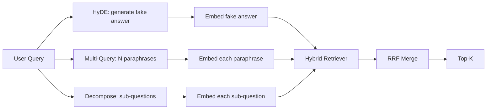

# Sorgu Yeniden Yazma: HyDE, Çoklu Sorgu ve Ayrıştırma

> Kullanıcının yazdığı sorgu, alıcınızın istediği sorgu değil. Yeniden yazma, geri çağırmadan önceki boşluğu doldurur, böylece indeks, cevabın neye benzediğine daha yakın bir şey görür.

**Tür:** Yapım
**Diller:** Python
**Önkoşullar:** Aşama 11 dersleri 04 (embeddings), 06 (RAG); Aşama 19 Bölüm B'nin temelleri (20-29. dersler); Aşama 19 dersleri 64 ve 65
**Süre:** ~90 dakika

## Öğrenme Hedefleri
- Varsayımsal Belge Embedding'leri (HyDE) uygulayın: sahte bir yanıt oluşturun, onu yerleştirin, sorgu vektörü yerine bu vektöre göre alın.
- Çoklu sorgu genişletmeyi uygulayın: bir sorguyu N farklı ifadeyle yeniden yazın, her biriyle alın, birleşimi karşılıklı sıralama füzyonuyla birleştirin.
- Sorgu ayrıştırma uygulayın: karmaşık bir soruyu alt sorulara bölün, alt soru başına alın, birleştirin.
- Üç yeniden yazanı bir fikstür üzerinde başa baş karşılaştırın ve her stratejinin ne zaman kazandığını açıklayın.
- Yeniden yazma döngüsünün çevrimdışı çalışması için deterministik, fikstür üzerinde çıktılar üreten sahte bir LLM'yi bağlayın.

## Sorun

Bir kullanıcı "Yüklemeler başarısız olduğunda ve bütçe tükendiğinde ekibimiz ne yapar?" yazar. Derlem, "AbortMultipartOnFail, uçuş sırasında S3 çok parçalı yüklemeyi iptal eder ve yükleme başarısız olduğunda paket başına yeniden deneme bütçesini azaltır" yazan bir belge içerir. Sorgu ve belge bir isim ifadesini paylaşmıyor. BM25 ıskaladı. İki kodlayıcı belgeyi üçüncü veya dördüncü olarak sıralar çünkü sorgu vektörü, embedding alanının durdurulan yüklemelerle ilgili belgeyi değil, iptal edilen işlerle ilgili belgeyi tercih eden bir bölgesine gelir. 66. dersteki iki aşamalı yeniden sıralama, eğer cevap en üst N'de yer alıyorsa cevabı kurtarabilir, ancak en üst N'ye bile ulaşamıyorsa, yeniden sıralayan kişi onu asla görmez.

Çözüm, sorguyu alıcıya dokunmadan önce yeniden yazmaktır. 2023 tarihli "İlgili Etiketler Olmadan Hassas Sıfır Atış Yoğun Alma" (Gao ve diğerleri) makalesi HyDE'yi tanıttı: Bir LLM'den sorguya cevap verecek belgeyi yazmasını isteyin, bu varsayımsal belgeyi yerleştirin ve onun embedding'sini alma vektörü olarak kullanın. Varsayımsal belge, külliyatın sesinde yazıldığı için embedding alanının sağ bölgesinde yer alır. Sorgu vektörü bunu yapmadı.

HyDE ile iki kuzen tekniği eşleşiyor. Çoklu sorgu genişletme (Microsoft'un GraphRAG terimi kullanılır), sorgunun N farklı ifadesini oluşturur ve her biriyle alır ve ardından birleştirir. Ayrıştırma (2024 Stanford DSPy çalışmasında "alt sorgu ayrıştırması" olarak popüler hale getirilmiştir), "yüklemeler başarısız olduğunda ve bütçe tükendiğinde ekibimiz ne yapar" sorusunu iki soruya ayırır: "bir yükleme başarısız olduğunda ne olur" ve "yeniden deneme bütçesi bittiğinde ne olur". İki alım, birleştirilmiş sonuç, cevabın her iki parçasına da ulaşılabilir.

Bu ders üçünü de uygular ve bunları aynı fikstür derleminde çalıştırır.

## Konsept



### Ayrıntılı olarak HyDE

HyDE, kullanıcının sorgu vektörünü LLM tarafından yazılan varsayımsal belge vektörüyle değiştirir. prompt kısadır:

```
You are a domain expert. Write a one-paragraph passage that answers the question
below. Use the same vocabulary and phrasing the documentation in this domain would
use. Do not refuse. Do not say you do not know.

Question: {user_query}

Passage:
```

LLM'nin cevabı gerçek bir cevap olarak yanlıştır çünkü LLM sizin külliyatınızı bilmemektedir. Bu iyi. Alıcı, olgusal doğrulukla ilgilenmez, yalnızca token dağılımıyla ilgilenir. Varsayımsal pasaj "iptal", "çok parçalı", "kova", "bütçe" kelimelerini içerir, çünkü bu konuyla ilgili bir dokümantasyon pasajı bunu söyler. Bu pasajı gömün. Vektör gerçek geçidin yakınına iner.

Üretimde varsayımsal belgeyi iki veya üç cümleyle sınırlandırırsınız. Daha uzun varsayımlar daha fazla gürültü toplar. Daha kısa olanlar HyDE'nin ihtiyaç duyduğu sözcüksel sinyali kaybeder.

### Ayrıntılı olarak çoklu sorgu genişletmesi

Kullanıcının sorgusunun N farklı ifadesini oluşturun. En basit prompt:

```
Rewrite the following question in {N} different ways. Each rewrite must preserve
the original intent. Number them 1 to {N}. Do not add explanations.
```

Her bir açıklama için üst-k'yi alın. N dereceli listeleri RRF ile birleştirin (65. dersteki algoritmanın aynısı). Ucuz, paralel, deterministik.

Çoklu sorgu, kullanıcının ifadeleri soruyu sormanın eşit derecede geçerli birçok yolundan biri olduğunda ve yeniden yazılanlardan herhangi biri soruyu daha iyi sormuşsa kazanır. Tüm yeniden yazmalar eşit derecede kötü olduğunda kaybeder çünkü orijinali de aynı şekilde kötüydü.

### Ayrıntılı olarak ayrıştırma

Tek bir erişim, çok yönlü bir soruyu tatmin edemez. Ayrıştırma, LLM'den soruyu alt sorulara bölmesini ister ve sistem, her alt soruyu alır. prompt:

```
The following question may require information from multiple distinct topics.
Decompose it into a list of sub-questions. Each sub-question must be answerable
independently. If the question is already atomic, return it unchanged.

Question: {user_query}
```

Alt soru başına alın. Birleştir. Ayrıştırma, bağlaçlar, çok cümleli karşılaştırmalar veya ilgisiz iki konu içeren sorular için doğru araçtır. Atomik sorular için yanlış araç; ayrıştırıcının görevi tek soruyu geri vermek ve sahte alt sorular icat etmemektir.

### Neden üçü de var

Üçü tamamlayıcıdır. HyDE, sorgu kümesi token boşluğunu doldurur. Çoklu sorgu, açıklama varyansını kapsar. Ayrıştırma, çok konulu sorguları kapsar. Bir üretim sistemi bu üçünü de çalıştırır ve sorgu başına stratejiyi seçer (69. dersin uçtan uca sistemi seçiciyi gösterir).

## Sahte Yüksek Lisans

Ders çevrimdışı çalışır. Sahte LLM, kullanıcının sorgusuna göre anahtarlanmış küçük bir arama tablosu ve ayrıca kullanıcının görmediği sorgular için bir geri dönüştür. Arama tablosu şunları içerir:

- Her bir fikstür sorgusu için: yazılı bir varsayımsal pasaj, üç açıklama ve bir ayrıştırma.
- Bilinmeyen bir sorgu için: deterministik bir dönüşüm: sorgunun içerik sözcüklerini alın, bunları eşanlamlı bir harita aracılığıyla genişletin ve sonucu döndürün.

Önemli olan veri değil, modelin şeklidir. Üretimde modeli gerçek bir model çağrısıyla değiştirirsiniz. Alıcı değişmiyor.

## Build It — Kendin Geliştir

`code/main.py` şunu uygular:

- `MockLLM` - yukarıda açıklanan deterministik vekil.
- `HyDERewriter` - varsayımsal belgeyi yazması için LLM'yi çağırır, varsayımsal metin ve alıcının kullanması gereken sorguyla birlikte yeniden yazar çıktısını `RewriteResult` olarak döndürür.
- `MultiQueryRewriter` - N sayıda açıklama için LLM'yi çağırır, sorguların bir listesini döndürür.
- `DecomposeRewriter` - Yüksek Lisans'ı ayrıştırmaya çağırır, alt soruları döndürür.
- `retrieve_with_rewriter` - bir yeniden yazıcı ve bir alıcı alır, yeniden yazma işlemlerini çalıştırır, sonuçları birleştirir.
- Üç yeniden yazıcıyı bir fikstür üzerinde çalıştıran ve hangi stratejinin altın cevap belgesini ilk önce döndürdüğünü yazdıran bir demo.

Av köpeği şekli 65. dersten yeniden kullanılmıştır (hibrit BM25 + yoğun). Füzyon aynı RRF'dir. Tek yeni şekil, küçük olan yeniden yazma arayüzüdür.

Çalıştır:

```bash
python3 code/main.py
```

Çıktı, stratejiye göre bir sıralama ve nihai bir özettir. HyDE, ifade uyumsuzluğu sorgusunda kazanır. Çoklu sorgu, açıklama-varyans sorgusunda kazanır. Çok konulu sorguda ayrıştırma kazanır. Geri dönüş (yeniden yazma yok) üçünden en az birinde kaybeder.

## Demonun gizleyeceği arıza modları

**HyDE, derleme özgü tanımlayıcıları yanlış sanıyor.** Model, bir işlev adı icat ediyor. Varsayımın doğru belgedeki BM25 puanı çöküyor çünkü icat edilen isim artık dizinde görünmeyen yüksek ağırlıklı bir token. Füzyonda varsayımsalın uzunluğunu ve ağırlığını BM25 daha düşük tutun.

**Çoklu sorgu, tüm yakınsaklıkları yeniden yazar.** Zayıf bir model, neredeyse aynı olan üç açıklama üretir. N alımları aynı üst k'yi döndürür. RRF birleştirme, tek bir alımdan daha iyi değildir. prompt yeniden yazma işlemine açık bir çeşitlilik talimatı ekleyin ve Jaccard'ın kopyalarını tespit edin.

**Ayrıştırma aşırı bölmeler.** Ayrıştırıcı atomik bir soruyu listeye dönüştürür. Geri alma işlemlerinin tümü aynı belgeyi döndürür ancak sıralaması düşürülür. Birleştirme orijinalinden daha kötü. Bunu, yayılmadan önce "bu alt sorular yeterince farklı mı?" geçişiyle tespit edin.

**Gecikme artar.** HyDE'nin bir LLM çağrısı ücreti vardır. Çoklu sorgu, N yeniden yazma ve ardından N geri alma işlemi oluşturmak için bir LLM çağrısına mal olur. Ayrıştırma, ayrıştırma için bir LLM çağrısına, ardından M alımına mal olur. Geri alma işlemleri paralel olarak yürütülür; LLM çağrısı kattır.

## Use It — Hazır Araçla Uygula

Üretim modelleri:

- Sorgu uzunluğuna göre her sorgu için strateji seçimi: atomik kısa sorgular çoklu sorgu alır, karmaşık çok yan tümceli sorgular ayrıştırma alır, jargon ağırlıklı sorgular HyDE alır.
- Yeniden yazıcı çıktısını sorgu karmasına göre önbelleğe alın. Birçok sorgu tekrarlanıyor.
- Üçünü de paralel olarak çalıştırın ve üç sonuç kümesini RRF ile tek bir kümede birleştirin. Maliyet üç yüksek lisans görüşmesi ve bir füzyondur; kalite, her üç stratejinin kapsamının birleşimidir.

## Ship It — Kullanıma Sun

Ders 69, bu yeniden yazma aşamasını, ders 65'teki geri getirici ve ders 66'daki yeniden sıralayıcıdan önce bağlar. Ders 68, yeniden yazarın geri çağırma işlemine eklediği artışı değerlendirir.

## Egzersizler

1. Yeniden yazarın açıklamalarının kasıtlı olarak çeşitlendirildiği RAG-Fusion'ı (çoklu sorgunun 2024 versiyonu) uygulayın, ardından yeniden sıralama adımı (ders 66) son listeyi seçer.
2. Dördüncü bir strateji ekleyin: geri adım atma prompt (LLM'den daha genel bir soru isteyin, konuyu tekrar ele alın ve ardından daraltın). Fikstür üzerinde karşılaştırın.
3. Bir "soru atomiktir" başlığı ekleyerek ayrıştırıcıyı atomik sorguları tanıyacak şekilde eğitin. Aşırı bölünme oranını önce ve sonra ölçün.
4. Sahte LLM'yi gerçek bir model çağrısıyla değiştirin. Yığınınızdaki strateji başına gecikmeyi ölçün.
5. Yeniden yazma başına bir güven puanı ekleyin. Yeniden yazma işlemlerini eşiğin altına bırakın. Hatırlama üzerindeki etkiyi ölçün.

## Anahtar Terimler

| Dönem | İnsanlar ne diyor | Aslında ne anlama geliyor |
|------|-----------------|------------------------|
| HyDE | "Sahte belge alımı" | LLM cevabı yazıyor; sorgu yerine bunu gömün ve alın |
| Çoklu sorgu | "Açıklamalı ifade genişletme" | N sorgunun yeniden yazılması; N kez al, RRF ile birleştir |
| Ayrışma | "Alt sorgu bölünmesi" | Çok konulu sorgular alt sorulara bölünmüştür ve ayrı olarak alınır |
| Atomik sorgu | "Tek Konulu" | Sahte alt sorular icat edilmeden ayrıştırılamaz |
| Geri adım | "Sorguyu özetle" | Daha genel soruyu sorun, geri alın ve daraltın |

## Daha Fazla Okuma

- Gao, Ma, Lin, Callan, "İlgili Etiketler Olmadan Hassas Sıfır Atış Yoğun Alma" (HyDE), 2023
- Microsoft Research, "Geri Alma için Çoklu Sorgu Genişletme"
- Stanford DSPy, "Multi-Hop QA için Alt Sorgu Ayrışımı"
- [LlamaIndex sorgu dönüşümleri belgeleri](https://docs.llamaindex.ai/en/stable/optimizing/advanced_retrieval/query_transformations/)
- Aşama 11 ders 07 - gelişmiş RAG modelleri
- Aşama 19 ders 65 - bu yeniden yazarın beslediği av köpeği
- Aşama 19 ders 68 - yeniden yazma artışını ölçen değerlendirme
