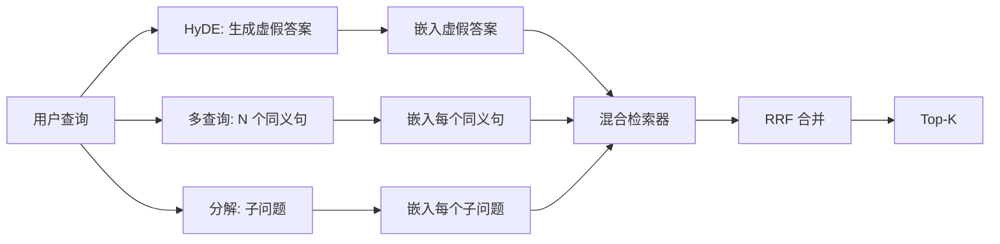

# 查询重写：HyDE、多查询与分解

> 用户输入的查询并非检索器想要的。重写在检索之前架起桥梁，让索引看到更接近答案样子的内容。

**类型：** 构建
**语言：** Python
**前置条件：** 阶段 11 第 04 课（嵌入）、第 06 课（RAG）；阶段 19 Track B 基础（第 20-29 课）；阶段 19 第 64 和 65 课
**时长：** ~90 分钟

## 学习目标
- 实现假设性文档嵌入（HyDE）：生成一个虚假答案，将其嵌入，用该向量而非查询向量进行检索。
- 实现多查询扩展：将一个查询改写为 N 个同义句，分别用每个同义句检索，通过倒数排序融合（RRF）合并结果。
- 实现查询分解：将一个复杂问题拆分为子问题，分别检索每个子问题，再合并结果。
- 在测试数据集上对三种重写器进行头对头比较，并解释每种策略在何种情况下胜出。
- 搭建一个模拟 LLM，使其在测试数据集上产生确定性的可预期输出，使重写循环可离线运行。

## 问题

用户输入"上传失败且预算用尽时我们团队会做什么？"语料库中有一篇文档写道："AbortMultipartOnFail 会在上传失败时中止正在进行的 S3 分块上传并递减每个桶的重试预算。"查询和文档之间没有共享任何名词短语。BM25 检索不到。双编码器将该文档排在第三或第四位，因为查询向量落在了嵌入空间中偏向"已取消作业"文档而非"已中止上传"文档的区域。第 66 课的两阶段重排可以在结果进入 Top-N 时挽救答案，但如果它连 Top-N 都进不了，重排器根本看不到它。

解决办法是在查询到达检索器之前进行重写。2023 年的论文《无需相关性标签的精准零样本稠密检索》（Gao 等人）提出了 HyDE：让 LLM 写出能够回答该问题的文档，对该假设性文档进行嵌入，然后使用该嵌入作为检索向量。假设性文档处于嵌入空间的正确区域，因为它用的是语料库的语言风格。而查询向量做不到这一点。

两种相关的技术与 HyDE 配合使用。多查询扩展（微软 GraphRAG 使用的术语）生成 N 个查询的同义句，分别检索后合并。分解（由 2024 年斯坦福 DSPy 工作推广为"子查询分解"）将"上传失败且预算用尽时我们团队会做什么"拆分为两个问题："上传失败时会发生什么"和"重试预算用尽时会发生什么"。两次检索，一次合并，答案的两部分都可触及。

本课程实现所有三种方法，并在同一个测试语料库上运行它们。

## 概念



### HyDE 详解

HyDE 用 LLM 生成的假设性文档向量替代用户的查询向量。提示词很简短：

```
你是一位领域专家。请写一个段落来回答下面的问题。
使用该领域文档会使用的词汇和表达方式。
不要拒绝回答。不要说不知道。

问题：{user_query}

段落：
```

LLM 的答案作为事实回答是错误的，因为 LLM 不知道你的语料库。这没关系。检索器不关心事实正确性，只关心词元分布。假设性段落包含"abort"、"multipart"、"bucket"、"budget"等词，因为这就是该主题的文档段落会使用的词汇。对该段落进行嵌入。该向量会落在真实段落附近。

在生产环境中，将假设性文档限制在两到三句话。更长的假设性文档会引入更多噪声。更短的则会丢失 HyDE 所需的词汇信号。

### 多查询扩展详解

生成 N 个用户查询的同义句。最简单的提示词：

```
用 {N} 种不同方式改写以下问题。每次改写必须保留原始意图。
按 1 到 {N} 编号。不要添加解释。
```

为每个同义句检索 top-k。用 RRF（与第 65 课相同的算法）合并 N 个排序列表。廉价、可并行、确定性。

当用户的措辞是多种同样有效的提问方式之一时，多查询策略胜出。当所有改写同样糟糕（因为原始查询在同样的方面很糟糕）时，该策略失效。

### 分解详解

单次检索无法满足一个多层面的查询。分解让 LLM 将问题拆分为子问题，系统分别检索每个子问题。提示词：

```
以下问题可能需要来自多个不同主题的信息。
将其分解为一系列子问题。每个子问题必须能够独立回答。
如果问题已经是原子性的，则原样返回。

问题：{user_query}
```

分别检索每个子问题。合并结果。分解适用于包含并列连词、多分句比较或两个不相关主题的问题。不适用于原子性问题；分解器在那种情况下的职责是返回单个问题，而不是编造虚假的子问题。

### 为什么三种方法都存在

这三种方法是互补的。HyDE 弥合了查询与语料库之间的词汇鸿沟。多查询覆盖了同义变体。分解覆盖了多主题查询。生产系统会运行所有三种方法，并根据每个查询选择合适的策略（第 69 课中的端到端系统展示了选择器）。

## 模拟 LLM

本课程离线运行。模拟 LLM 是一个以用户查询为键的小型查找表，外加针对未见过的查询的回退方案。查找表包含：

- 对于每个测试查询：一段手写的假设性段落、三个同义句和一个分解结果。
- 对于未知查询：一个确定性变换——提取查询中的实词，通过同义词映射进行扩展，然后返回结果。

重要的是模拟器的形状，而非数据。在生产环境中，你将模拟器替换为真实的模型调用。检索器保持不变。

## 构建

`code/main.py` 实现了：

- `MockLLM` — 上述确定性的替代实现。
- `HyDERewriter` — 调用 LLM 编写假设性文档，将重写器输出作为 `RewriteResult` 返回，包含假设性文本和检索器应使用的查询。
- `MultiQueryRewriter` — 调用 LLM 生成 N 个同义句，返回查询列表。
- `DecomposeRewriter` — 调用 LLM 进行分解，返回子问题。
- `retrieve_with_rewriter` — 接收一个重写器和一个检索器，执行重写，融合结果。
- 一个演示程序，在测试数据集上运行三种重写器，并打印每种策略首次返回正确答案文档的情况。

检索器的形状复用自第 65 课（混合 BM25 + 稠密检索）。融合算法是相同的 RRF。唯一新增的形状是重写器接口，它很小。

运行方式：

```bash
python3 code/main.py
```

输出是每种策略的排序结果和一个最终总结。HyDE 在措辞不匹配的查询上胜出。多查询在同义变体查询上胜出。分解在多主题查询上胜出。回退方案（不使用重写器）在三个查询中至少有一个上失败。

## 演示会隐藏的失败模式

**HyDE 幻觉出语料库特有的标识符。** 模型编造出一个函数名。假设性文档与正确文档的 BM25 得分崩溃，因为编造的名字成为了一个不存在于索引中的高权重词元。限制假设性文档的长度，并在融合中降低 BM25 的权重。

**多查询改写结果趋同。** 一个弱模型产生三个几乎相同的同义句。N 次检索返回相同的 top-k。RRF 合并与单次检索相比没有改善。在改写提示词中添加明确的分化指令，并通过 Jaccard 相似度检测重复项。

**分解过度拆分。** 分解器将一个原子性问题变成了一个列表。多次检索返回相同的文档，但排序降低。合并结果比原始结果更差。在扇出之前通过"这些子问题是否足够区分"的检查来检测这种情况。

**延迟成倍增加。** HyDE 消耗一次 LLM 调用。多查询消耗一次 LLM 调用以生成 N 个改写，然后进行 N 次检索。分解消耗一次 LLM 调用以分解，然后进行 M 次检索。检索可以并行运行；LLM 调用是最小延迟瓶颈。

## 使用

生产模式：

- 按查询长度进行策略选择：原子性的短查询使用多查询，复杂的多分句查询使用分解，术语密集的查询使用 HyDE。
- 按查询哈希缓存重写器输出。许多查询会重复出现。
- 并行运行所有三种策略，并将三个结果集通过 RRF 融合为一个。代价是三次 LLM 调用和一次融合；质量则是三种策略覆盖范围的并集。

## 发布

第 69 课将这一重写阶段连接到第 65 课的检索器和第 66 课的重排器之前。第 68 课评估重写器对检索召回率的提升。

## 练习

1. 实现 RAG-Fusion（2024 年多查询的一个变体），其中重写器的同义句是刻意多样化的，然后由重排步骤（第 66 课）筛选出最终列表。
2. 增加第四种策略：后退提示（让 LLM 提出更一般的问题，以此检索，然后缩小范围）。在测试数据集上进行比较。
3. 训练分解器识别原子性问题，添加一个"问题是否是原子性的"判断头。测量过度拆分率在训练前后的变化。
4. 将模拟 LLM 替换为真实模型调用。测量每种策略在你的技术栈上的延迟。
5. 为每次重写添加一个置信度分数。丢弃低于阈值的重写。测量对召回率的影响。

## 关键术语

| 术语 | 人们常说的 | 实际含义 |
|------|-----------|----------|
| HyDE | "虚假文档检索" | LLM 写出答案；对该答案进行嵌入和检索，而非查询本身 |
| 多查询 | "同义句扩展" | N 个查询改写；检索 N 次，通过 RRF 合并 |
| 分解 | "子查询拆分" | 多主题查询拆分为子问题，分别检索 |
| 原子性查询 | "单一主题" | 无法分解，否则会编造出虚假子问题 |
| 后退提示 | "抽象查询" | 提出更一般的问题，检索，然后缩小范围 |

## 延伸阅读

- Gao, Ma, Lin, Callan, 《无需相关性标签的精准零样本稠密检索》(HyDE)，2023
- 微软研究院，《面向检索的多查询扩展》
- 斯坦福 DSPy，《面向多跳 QA 的子查询分解》
- [LlamaIndex 查询变换文档](https://docs.llamaindex.ai/en/stable/optimizing/advanced_retrieval/query_transformations/)
- 阶段 11 第 07 课——高级 RAG 模式
- 阶段 19 第 65 课——本重写器所服务的检索器
- 阶段 19 第 68 课——衡量重写器提升效果的评估
