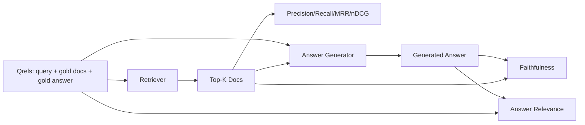

# RAG Değerlendirmesi: Kesinlik, Geri Çağırma, MRR, nDCG, Doğruluk, Yanıt Uygunluğu

> Alma işleminize ve cevabınıza aynı anda not veremezseniz sistemi gönderemezsiniz. İkisi aynı metrik değildir ve aynı prompt farklı eksenlerde başarısız olur.

**Tür:** Yapım
**Diller:** Python
**Önkoşullar:** Aşama 11 dersleri 06 (RAG), 10 (değerlendirme); Aşama 19 Bölüm B'nin temelleri (20-29. dersler); Aşama 19 dersleri 64, 65, 66, 67
**Süre:** ~90 dakika

## Öğrenme Hedefleri
- Altın qrel'lerden dört alma ölçütünü hesaplayın: Precision@k, Recall@k, MRR (ortalama karşılıklı sıralama) ve nDCG@k.
- İki cevap notu ölçütünü hesaplayın: doğruluk (her iddianın geri getirilen bağlama dayanması) ve cevap alaka düzeyi (cevap soruyu ele alır).
- Değerlendirmenin uçtan uca okuduğu bir fikstür qrels dosyası (sorgular, altın belge kimlikleri, altın cevap metni) oluşturun.
- Bir boru hattının nerede başarısız olduğunu teşhis etmek için metrik değerleri okuyun: alma, sıralama, oluşturma veya topraklama.

## Sorun

Bir RAG sisteminde en az dört hareketli parça bulunur: parçalayıcı, toplayıcı, yeniden sıralayıcı, jeneratör. Bunlardan herhangi biri yanlış cevabın nedeni olabilir. Aşama başına ölçümler olmadan kör uçarsınız.

Bir kullanıcı yanlış bir yanıt bildirir. Bunun nedeni parçalayıcının cevap aralığını kesmesi mi? Bunun nedeni, alıcının top-k'deki parçayı içermemesi mi? Bunun nedeni, yeniden sıralayıcının sağ parçayı birinci pozisyonun ötesine itmesi mi? Jeneratörün parçayı görmezden gelip bir şeyler uydurduğu için mi? Sadece cevaptan bunu anlayamazsınız. İhtiyacınız var:

- Alıcıdan çıkanları derecelendirmek için geri alma ölçümleri.
- Sıralamada doğru parçanın bulunduğu yere göre sıralama metrikleri.
- Oluşturucunun alınan bağlamın içinde kalıp kalmadığına göre not verme doğruluğu.
- Cevabın soruyu ele alıp almadığı notla alakası.

Bu ders altısını da fikstür qrels dosyasının üzerine inşa eder. Değerlendirme çevrimdışı ve deterministiktir; Prodüksiyonda, sahte yüksek lisans jürisini gerçek bir yargıçla değiştirirsiniz.

## Konsept



### Hassas@k

Avcının getirdiği en iyi belgelerden altın setin içinde ne kadarı var? Altının üç belgesi varsa ve ilk 3 bunlardan ikisini ve bir yanlış olanı döndürürse, kesinlik@3 2/3 olur. Alakasız bir parçanın maliyeti yüksek olduğunda kesinliği kullanın (üretici token'lari boşa harcar veya parça yanıtı zehirler).

### Geri Çağırma@k

Altın belgelerin hangi kısmı ilk-k'de yer alıyor? Altının üç belgesi varsa ve ilk 5'te üç belge de varsa, geri çağırma@5 1,0'dır. Kaçırılan bir cevabın maliyeti yüksek olduğunda hatırlamayı kullanın (cevap kısmını tamamen kaçırmak yerine fazladan bir yanlış kısım görmeyi tercih edersiniz).

RAG üretiminde insanların genellikle alıntı yaptığı metrik geri çağırma@k'dir. Nesil, ilgisiz parçaları kolayca bırakabilir; hiç görmediği bir yığından bir yanıt icat edemez.

### MRR (Ortalama Karşılıklı Sıra)

Her sorgu için, sıralanan listedeki ilk ilgili belgenin konumunu bulun. Karşılıklı sıralama 1 / konumdur. Sorgu kümesi genelinde ortalama. MRR, avcının en iyi yanıtı en üst sıraya ne kadar iyi yerleştirdiğinin tek rakamlı bir özetidir.

MRR, pozisyon-1'i ağır bir şekilde ağırlıklandırıyor. Altın belgenin 1. sırada olduğu bir sorgu 1,0 katkıda bulunur. Sıra 2 0,5 katkıda bulunur. Sıra 10'un katkısı 0,1'dir. Metriğin en üstünde listenin başı hakimdir.

### nDCG@k

Normalleştirilmiş İndirimli Kümülatif Kazanç. Tam formül, alınan her belgeye bir kazanç (genellikle ilgili için 1, uygun olmayan için 0), konum günlüğüne göre indirimler, toplamlar ve ideal DCG'ye (mükemmel sıralamada sahip olacağınız DCG) böler. 0 ila 1 aralığı.

nDCG dereceli alaka düzeyini barındırır: altın "belge A 3, belge B 2, belge C 1" diyebilir. MRR ve recall@k her şeyi ikiliye düzleştirir. Derlemde sorgu başına kısmen alakalı birden fazla belge olduğunda nDCG'yi kullanın.

### Sadakat

Oluşturulan yanıttaki her iddia için, talebin alınan bağlam tarafından desteklenip desteklenmediğini kontrol edin. Standart uygulama, (iddia, bağlam) alan ve evet veya hayır döndüren bir yargıç olarak Yüksek Lisans prompt kullanır. Metrik, geçerli olan taleplerin oranıdır.

Sadakat, modelin içeriği icat ettiği jeneratör arıza modunu yakalar. Avcı doğru parçaları geri getirse bile halüsinasyon gören jeneratör bozulmuştur. Sadakat aynı zamanda temellilik, destek, atıf olarak da adlandırılır.

Bu ders, her iddianın token'larinin alınan bağlamla bir eşik kadar örtüşüp örtüşmediğini kontrol eden deterministik bir sahte yargıçla sadakati uygular. Üretimde gerçek bir model çağrısına geçersiniz. Metriğin şekli aynıdır.

### Cevap alaka düzeyi

Cevap aslında soruyu ele alıyor mu? Sadakat "cevap bağlama dayalı mı?" diye sorar. Cevap alaka düzeyi "cevap soruya mı dayanıyor?" diye sorar. Aslına uygun ancak konu dışı bir yanıt, doğruluk açısından yüksek, alaka düzeyi açısından ise düşük puan alır. Bağlamı göz ardı eden, konuyla ilgili kısa bir yanıt, alaka açısından yüksek, sadakat açısından ise düşük puan alır.

Standart uygulama ayrıca yargıç olarak Yüksek Lisans'ı kullanır: al (soru, cevap) ve cevabın soruyu ele alıp almadığını sorun. Bu ders bir token-overlap-plus-judge vekilini uygular.

## Fikstür qrel'leri

```python
{
  "qid": "q1",
  "query": "what is the abort threshold for multipart uploads",
  "gold_doc_ids": ["d1", "d3"],
  "gold_answer_substring": "three failed parts",
  "graded_relevance": {"d1": 3, "d3": 2},
}
```

Her sorgu şunları taşır:
- sorgu dizesi,
- bir dizi altın belge kimliği (hassasiyet / geri çağırma / MRR için),
- derecelendirilmiş bir alaka düzeyi ifadesi (nDCG için),
- altın yanıt alt dizesi (her qrel'de referans meta verileri olarak tutulur; bu dersteki doğruluk, çıkarılan iddiaların bu alt dizeye göre değil, alınan bağlama göre değerlendirilmesiyle hesaplanır).

Üretimde bunları etiketlersiniz. Bu ders, değerlendirmenin kutudan çıkması için el yapımı bir donanım gönderir.

## Build It — Kendin Geliştir

`code/main.py` şunu uygular:

- `precision_at_k(retrieved, gold, k)` - gerçek tanım.
- `recall_at_k(retrieved, gold, k)` - gerçek tanım.
- `mean_reciprocal_rank(retrieved_list_of_lists, gold_list)` - sorguların ortalaması.
- `ndcg_at_k(retrieved, graded_relevance, k)` - İkili veya kademeli kazançlı DCG / IDCG.
- `extract_claims(answer)` - yanıtı cümle şeklindeki iddialara böler.
- `faithfulness(claims, context_texts, judge)` - desteklendiğine karar verilen taleplerin oranı.
- `answer_relevance(question, answer, judge)` - cevabın soruyu ele alıp almadığına karar verin.
- `MockJudge` - deterministik token-örtüşme yargısı, böylece değerlendirme çevrimdışı çalışır.
- `evaluate_pipeline(pipeline_fn, qrels, ks)` - her ölçümü çalıştıran orkestratör.
- Qrel'lere karşı üç ardışık düzen varyantını (yığın temel çizgisi, hibrit alma, hibrit + yeniden sıralama) çalıştıran ve bir metrik tablosu yazdıran bir demo.

Çalıştır:

```bash
python3 code/main.py
```

Çıktı, tek bir metrik tablosunda her değişken için kesinlik@k, geri çağırma@k, MRR, nDCG@k, doğruluk ve yanıt alaka düzeyini gösterir. Hibrit geri alma sırası, geri çağırma sırasında yığınlayıcı temel çizgisini geçiyor; yeniden sıralama sırası MRR'de hibriti yener.

## Arızaları teşhis etmek için ölçümleri okuma

| Belirti | Olası neden | Ne düzeltilmeli |
|---------|-------------|-------------|
| Düşük geri çağırma@k, düşük hassasiyet@k | Chunker cevabı kesti yoksa avcı onu bulamıyor | Parça sınırları (ders 64) veya geri alma yöntemi (ders 65) |
| İyi geri çağırma@k, düşük MRR | Sağ parça üst-k'de ancak 1. konumda değil | Yeniden Sıralayan (ders 66) |
| Yüksek MRR, düşük doğruluk | Generator, doğru bağlama rağmen içerik icat ediyor | Nesil prompt; zorla alıntı yap ya da reddet |
| Yüksek sadakat, düşük alaka düzeyi | Yanıt temellendirilmiş ancak konu dışı | Sorgu yeniden yazıcısı (ders 67) veya nesil prompt |
| Dördü de yüksek, kullanıcılar hâlâ şikayet ediyor | Eval kümesi temsili değildir | Qrel'leri gerçek kullanıcı sorgularıyla genişletin |

## Demonun gizleyeceği arıza modları

**Yargıç olarak yüksek lisans önyargısı.** Bir model, kendi çıktılarının olduğundan daha sadık olduğuna karar verir. Hakim için jeneratörden farklı bir model ailesi kullanın veya bir numuneyi elle derecelendirin.

**Qrel'ler çürüyor.** Altın yanıtları, gövde değiştikçe sürükleniyor. Ekip, işlevi yeniden adlandırdığı için, Ocak 2024'te birinci çeyrekte altın olan bir belge, Ekim 2024'te artık doğru yanıt değil. Üç ayda bir qrels incelemesi planlayın.

**Mikro doğruluk kontrolleri makro iddiaları gözden kaçırır.** Genel yanıtın yapısı yanıltıcı olsa da cümle bazında doğruluk geçebilir. Otomatik metriğin üstüne örnek düzeyinde niteliksel bir inceleme ekleyin.

**Recall@k, sorgu başına hataları maskeler.** Ortalama %90'lık bir geri çağırma, bir sorgu sınıfının her zaman kaçırdığını gizleyebilir. Qrel'leri sorgu sınıfına (literal, başka kelimelerle yazılmış, çok konulu) göre dilimleyin ve dilim başına rapor verin.

## Use It — Hazır Araçla Uygula

Üretim modelleri:

- Değerlendirmeyi her alıcı veya jeneratör değişikliğinde çalıştırın. Recall@k regresyonunu bir test başarısızlığı gibi ele alın.
- Sorgu başına metrik izlemeyi sürdürün. Bir kullanıcı şikayette bulunduğunda eşleşen qrels girişine bakın ve yakalanıp yakalanmadığına bakın.
- Qrel'leri katmanlandırın: CI'da çalışan 20 sorgudan oluşan bir duman kümesi; her gece çalışan 200'lük bir regresyon seti; haftalık olarak çalışan 2000'lik derin bir set.

## Ship It — Kullanıma Sun

Ders 69, tüm boru hattını (yığınlayıcı, toplayıcı, yeniden sıralayıcı, oluşturucu) kablolar ve bu değerlendirmeyi uçtan uca sisteme göre çalıştırır.

## Egzersizler

1. Beşinci bir erişim ölçüsü ekleyin: hit-rate@k. Recall@k ile karşılaştırın. Ne zaman farklı olduklarını açıklayın.
2. Kademeli bir sadakat uygulayın: 0 (desteklenmiyor), 1 (kısmen destekleniyor), 2 (tamamen destekleniyor). Metriği uygun şekilde güncelleyin.
3. Sahte hakemi gerçek bir model çağrısıyla değiştirin. Fikstürde sahte ve gerçek hakem arasındaki anlaşmazlığı ölçün.
4. Bir sorgu sınıfı dilimi ekleyin ("literal", "başka kelimelerle ifade edilmiş", "çok konulu"). Dilim başına ölçümleri raporlayın.
5. Bir "cevap uzunluğu" ölçüsü ekleyin ve bunu doğrulukla ilişkilendirin. Eğriyi çizin.

## Anahtar Terimler

| Dönem | İnsanlar ne diyor | Aslında ne anlama geliyor |
|------|-----------------|------------------------|
| Hassas@k | "İsabet oranı alındı" | Top-k'nin altın olan kısmı |
| Geri çağırma@k | "Altın üzerinden isabet oranı" | Top-k'de altın oranı |
| MRR | "İlk vuruş konumu" | 1 ortalaması / ilgili ilk belgenin sırası |
| nDCG@k | "Kademeli sıralama kalitesi" | Üst-k üzerinden DCG ideal DCG'ye bölünür |
| Sadakat | "Temellilik" | Alınan bağlam tarafından desteklenen yanıt taleplerinin bir kısmı |
| Cevap alaka düzeyi | "Soruya değindi mi?" | Yanıtın sorunun amacına uyup uymadığı |
| Qrel'ler | "Altın etiketler" | Etiketli sorgu seti ve bunların altın belgeleri ve yanıtları |

## Daha Fazla Okuma

- Buckley, Voorhees, "Değerlendirme Ölçüsü Stabilitesinin Değerlendirilmesi", SIGIR 2000 - sıralama ölçümlerine ilişkin kanonik makale
- Jarvelin, Kekalainen, "IR Tekniklerinin Kümülatif Kazanca Dayalı Değerlendirmesi" - nDCG makalesi
- [Ragas: RAG Boru Hatlarının Otomatik Değerlendirmesi](https://docs.ragas.io)
- [Antropik, RAG'yi Değerlendiriyor](https://www.anthropic.com/news/evaluating-rag)
- Aşama 11 ders 10 - değerlendirme framework temelleri
- Aşama 19 dersleri 64-67 - burada değerlendirilen bileşenler
- Aşama 19 ders 69 - bu değerlendirmenin notlandırdığı uçtan uca işlem hattı
