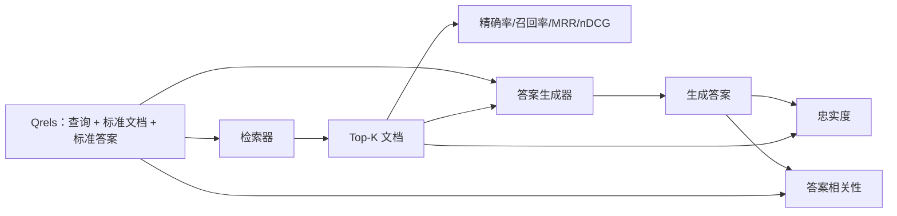

# RAG 评估：精确率、召回率、MRR、nDCG、忠实度、答案相关性

> 如果你无法同时评估检索和答案，你就无法交付系统。这两者不是同一个指标，同一个提示词在不同维度上会失效。

**类型：** 构建
**语言：** Python
**前置条件：** 阶段 11 第 06 课（RAG）、第 10 课（评估）；阶段 19 Track B 基础（第 20-29 课）；阶段 19 第 64、65、66、67 课
**时长：** 约 90 分钟

## 学习目标

- 基于 gold qrels 计算四个检索指标：precision@k、recall@k、MRR（平均倒数排名）和 nDCG@k。
- 计算两个答案质量指标：忠实度（每项声明都有检索上下文支撑）和答案相关性（答案是否回应了问题）。
- 构建一个 fixture qrels 文件（查询、标准文档 ID、标准答案文本），评估系统端到端读取该文件。
- 通过指标值诊断流水线的故障环节：检索、排序、生成还是接地。

## 问题

一个 RAG 系统至少包含四个活动部件：分块器、检索器、重排序器、生成器。其中任何一个都可能是错误答案的根源。没有分阶段指标，你就是盲飞。

用户报告了一个错误答案。是因为分块器切掉了答案片段？是因为检索器没有将该分块纳入 top-k？是因为重排序器将正确的分块推到了位置一之后？是因为生成器忽略了该分块并自行编造？仅凭答案本身你无法判断。你需要：

- **检索指标** —— 评估检索器返回了什么。
- **排序指标** —— 评估正确分块在顺序中的位置。
- **忠实度** —— 评估生成器是否保持在检索到的上下文内。
- **答案相关性** —— 评估答案是否基本上回应了问题。

本课程在单个 fixture qrels 文件之上构建了全部六个指标。评估是离线且确定性的；生产环境中，你将模拟的 LLM-as-judge 替换为真实的。

## 概念



### Precision@k

在检索器返回的前 k 个文档中，属于标准集合的比例是多少？如果标准集合有三个文档，top-3 返回了其中两个加一个错误文档，那么 precision@3 就是 2 / 3。当不相关检索块的代价很高时（生成器在其上浪费 token，或者该块毒害了答案），应使用精确率。

### Recall@k

在标准文档中，出现在前 k 个中的比例是多少？如果标准集合有三个文档，top-5 包含全部三个，那么 recall@5 就是 1.0。当遗漏答案的代价很高时（你宁愿多看到一个错误块，也不愿完全错过答案块），应使用召回率。

在生产 RAG 中，人们通常引用的指标是 recall@k。生成器可以轻易丢弃不相关的块；但它无法从未见过的块中凭空编造出答案。

### MRR（平均倒数排名）

对于每个查询，在排序列表中找到第一个相关文档的位置。倒数排名是 1 / 位置。对所有查询取均值。MRR 是衡量检索器将最佳答案置于顶部效果的一个单一数值总结。

MRR 对位置 1 赋予很高权重。标准文档排在 rank 1 的查询贡献 1.0；rank 2 贡献 0.5；rank 10 贡献 0.1。该指标由列表顶部主导。

### nDCG@k

归一化折损累计增益。完整公式为每个检索到的文档分配一个增益（通常相关为 1，不相关为 0），按位置的 log 折损，求和，再除以理想 DCG（即完美排序时的 DCG）。范围 0 到 1。

nDCG 支持分级相关性：标准可以规定"文档 A 为 3，文档 B 为 2，文档 C 为 1"。MRR 和 recall@k 将所有结果扁平化为二值。当语料库中每个查询有多个部分相关的文档时，应使用 nDCG。

### 忠实度

对于生成答案中的每一项声明，检查该声明是否得到检索上下文的支持。标准实现使用一个 LLM-as-judge 提示词，输入（声明，上下文）并返回是或否。该指标即通过检查的声明占比。

忠实度捕捉的是生成器的故障模式——模型编造内容。即使检索器返回了正确的块，一个产生幻觉的生成器仍然是坏的。忠实度也被称为接地性、支撑性、归因。

本课程使用一个确定性的模拟判断器来实现忠实度，该判断器检查每项声明的 token 是否以某个阈值与检索上下文重叠。在生产环境中，你将其替换为真实的模型调用。指标的形态是相同的。

### 答案相关性

答案是否真正回应了问题？忠实度问的是"答案是否扎根于上下文？"，答案相关性问的是"答案是否扎根于问题？"。一个忠实但离题的答案在忠实度上得分高，在相关性上得分低。一个简短、切题但忽略上下文的答案在相关性上得分高，在忠实度上得分低。

标准实现同样使用 LLM-as-judge：输入（问题，答案）并判断答案是否回应了问题。本课程实现了一个 token 重叠加判断器的替代方案。

## Fixture qrels

```python
{
  "qid": "q1",
  "query": "multipart upload 的中止阈值是多少",
  "gold_doc_ids": ["d1", "d3"],
  "gold_answer_substring": "三个失败的分片",
  "graded_relevance": {"d1": 3, "d3": 2},
}
```

每个查询携带：

- 查询字符串，
- 一组标准文档 ID（用于精确率 / 召回率 / MRR），
- 一个分级相关性字典（用于 nDCG），
- 标准答案子串（作为每个 qrel 的参考元数据保留；本课程中的忠实度是通过判断提取的声明与检索上下文来计算，而非与此子串比较）。

生产环境中你手动标注这些数据。本课程附带了一个手工构建的 fixture，以便评估开箱即用。

## 构建

`code/main.py` 实现了：

- `precision_at_k(retrieved, gold, k)` —— 字面定义。
- `recall_at_k(retrieved, gold, k)` —— 字面定义。
- `mean_reciprocal_rank(retrieved_list_of_lists, gold_list)` —— 所有查询的均值。
- `ndcg_at_k(retrieved, graded_relevance, k)` —— 使用二值或分级增益的 DCG / IDCG。
- `extract_claims(answer)` —— 将答案拆分成句子状的声明。
- `faithfulness(claims, context_texts, judge)` —— 被判为有支撑的声明占比。
- `answer_relevance(question, answer, judge)` —— 判断答案是否回应了问题。
- `MockJudge` —— 确定性的 token 重叠判断器，使评估可离线运行。
- `evaluate_pipeline(pipeline_fn, qrels, ks)` —— 运行所有指标的编排器。
- 一个演示程序，针对 qrels 运行三种流水线变体（分块器基线、混合检索、混合 + 重排序）并打印指标表格。

运行：

```bash
python3 code/main.py
```

输出在单个指标表格中展示了每种变体的 precision@k、recall@k、MRR、nDCG@k、忠实度和答案相关性。混合检索行在召回率上优于分块器基线；重排序行在 MRR 上优于混合检索。

## 通过指标诊断故障

| 症状 | 可能原因 | 修复方向 |
|------|----------|----------|
| recall@k 低，precision@k 低 | 分块器切掉了答案，或检索器无法找到它 | 分块器边界（第 64 课）或检索器模态（第 65 课） |
| recall@k 尚可，MRR 低 | 正确分块在 top-k 内但不在位置 1 | 重排序器（第 66 课） |
| MRR 高，忠实度低 | 生成器在拥有正确上下文时仍编造内容 | 生成提示词；强制引用或拒绝回答 |
| 忠实度高，相关性低 | 答案有依据但离题 | 查询重写器（第 67 课）或生成提示词 |
| 四项指标都高，用户仍然投诉 | 评估集不具代表性 | 用真实用户查询扩展 qrels |

## 演示会隐藏的故障模式

**LLM-as-judge 偏见。** 模型评判自己的输出时，会认为比实际更忠实。请为判断器使用与生成器不同的模型族，或人工抽样评分。

**Qrels 腐化。** 标准答案随语料库变化而漂移。2024 年 1 月时 q1 的标准文档，到 2024 年 10 月可能不再是正确答案，因为团队重命名了函数。请安排每季度一次 qrels 审查。

**忠实度的微观检查遗漏宏观声明。** 逐句忠实度可能通过，但整体答案的结构却具有误导性。在自动化指标之上增加样本级的定性审查。

**Recall@k 掩盖了逐查询的失败。** 90% 的平均召回率可能隐藏了某一类查询总是失败的事实。请按查询类别（字面、释义、多主题）对 qrels 分片，并报告每个分片的指标。

## 使用

生产模式：

- 每次检索器或生成器变更时运行评估。将 recall@k 的回退视为测试失败。
- 按查询持久化指标轨迹。当用户投诉时，查找匹配的 qrels 条目，看它是否会被捕捉到。
- 对 qrels 分层：20 个查询的冒烟集（在 CI 中运行）；200 个查询的回归集（每晚运行）；2000 个查询的深度集（每周运行）。

## 交付

第 69 课将连接整个流水线（分块器、检索器、重排序器、生成器），并针对端到端系统运行本评估。

## 练习

1. 添加第五个检索指标：hit-rate@k。将其与 recall@k 进行比较，并解释它们何时不同。
2. 实现分级忠实度：0（无支撑）、1（部分支撑）、2（完全支撑）。相应更新指标。
3. 将模拟判断器替换为真实的模型调用。在 fixture 上测量模拟判断器与真实判断器之间的不一致程度。
4. 添加一个查询类别分片（"字面"、"释义"、"多主题"）。报告每个分片的指标。
5. 添加一个"答案长度"指标，并计算其与忠实度的相关性。绘制曲线。

## 关键术语

| 术语 | 人们常说 | 实际含义 |
|------|----------|----------|
| Precision@k | "检索上的命中率" | top-k 中属于标准文档的比例 |
| Recall@k | "标准上的命中率" | 标准文档在 top-k 中的比例 |
| MRR | "首次命中位置" | 第一个相关文档排名的倒数之均值 |
| nDCG@k | "分级排序质量" | top-k 的 DCG 除以理想 DCG |
| 忠实度 | "接地性" | 答案声明中被检索上下文支持的占比 |
| 答案相关性 | "是否回应了问题？" | 答案是否匹配问题的意图 |
| Qrels | "标准标签" | 标注好的查询集合及其标准文档和答案 |

## 延伸阅读

- Buckley, Voorhees, "Evaluating Evaluation Measure Stability", SIGIR 2000 —— 排序指标的经典论文
- Jarvelin, Kekalainen, "Cumulated Gain-based Evaluation of IR Techniques" —— nDCG 论文
- [Ragas: RAG 流水线的自动化评估](https://docs.ragas.io)
- [Anthropic, 评估 RAG](https://www.anthropic.com/news/evaluating-rag)
- 阶段 11 第 10 课 —— 评估框架基础
- 阶段 19 第 64-67 课 —— 此处评估的组件
- 阶段 19 第 69 课 —— 本评估所评分的端到端流水线
