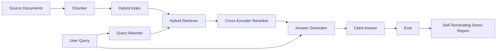

# Uçtan Uca RAG Sistemi

> Altı ders bileşen. Tek boru hattı. Bir değerlendirme döngüsü. Kendi kendini sonlandıran bir demo. Gönderdiğiniz sistem bu.

**Tür:** Yapım
**Diller:** Python
**Önkoşullar:** Aşama 11 dersleri 06 (RAG), 10 (değerlendirme); Aşama 19 Bölüm B'nin temelleri (20-29. dersler); Aşama 19 dersleri 64, 65, 66, 67, 68
**Süre:** ~90 dakika

## Öğrenme Hedefleri
- Parçalayıcıyı, karma alıcıyı, sorgu yeniden yazıcısını, kodlayıcılar arası yeniden sıralayıcıyı ve yanıt oluşturucuyu tek bir uçtan uca ardışık düzende birleştirin.
- Düşük güven durumunda reddetme geri dönüşüyle, iddialarını öbek çapasına göre aktaran bir yanıt oluşturucu uygulayın.
- Birleştirilmiş işlem hattına karşı ders 68 değerlendirmesini çalıştırın ve aşamalı derlemenin, aynı bileşenler üzerinde ayrı ayrı her ölçümde kazandığını kanıtlayın.
- Bir fikstür derlemini alan, sabit bir sorgu kümesi çalıştıran ve bir özet raporuyla sıfırdan çıkan, kendi kendini sonlandıran bir CLI demosu oluşturun.

## Sorun

Altı bileşen tek başına hiçbir şeyi kanıtlamaz. Parçalayıcı, topluluğa karşı geri çağırma@5'te kazanabilir ve sistemin geri çağırma@5'inde kaybedebilir çünkü toplayıcı, parçalayıcının yaydığı şeyleri sıralayamaz. Yeniden sıralayıcı, sentetik bir aday havuzunda MRR'yi yükseltebilir ve gerçek çift kodlayıcı adaylarında başarısız olabilir çünkü çift kodlayıcının yeniden sıralama bütçesindeki geri çağırma oranı çok düşüktür. Sorgu yeniden yazıcısı, altın belgeyi tek bir sorguda yükseltebilir ve bir sonraki sorguda kesintiye uğrayabilir çünkü LLM taklidi dejenere bir varsayımsal döndürür.

Entegrasyon testi, her şeyi birbirine bağlayan tek bir orkestratör dosyasıyla, aynı ölçümle, aynı fikstür karelerine karşı tüm boru hattının uçtan uca çalıştırılmasıdır. Bu dersin inşa ettiği şey budur. Entegre boru hattındaki metrikler, her aşamanın yalıtılmış demosundaki metrikleri geçiyorsa, sistemi kanıtlamışsınız demektir.

## Konsept



### Kablolama seçenekleri

Boru hattı küçük bir grafiktir. Her aşama açık bir imzaya sahip bir işlevdir.

| Sahne | Giriş | Çıkış |
|-------|-------|--------|
| Tıknaz | Belge metni | Parça kayıtlarının listesi |
| Alıcı | Sorgu dizesi | Top-N Chunk kayıtları |
| Yeniden Yazar (isteğe bağlı) | Sorgu dizesi | Yeniden yazma listesi + varsayımsal |
| Yeniden Sıralayan | Sorgu, adaylar | Çapraz puanlarla Top-K Chunk kayıtları |
| Jeneratör | Sorgu, üst K Parça kayıtları | Alıntı içeren yanıt dizesi |

Her imza kararlı olduğunda kompozisyon basittir. Dersin `Pipeline` sınıfı beş aşamayı ve bunları sırayla çalıştıran bir `query` yöntemini içerir. Her aşama değiştirilebilir: farklı bir parçalayıcı, alıcı, yeniden yazıcı, yeniden sıralayıcı veya oluşturucuyu geçerseniz işlem hattı çalışmaya devam eder.

### Alıntılarla cevap oluşturucu

Jeneratör son aşamadır ve kırılması en kolay olanıdır. Ders, aşağıdakileri sağlayan deterministik bir sahte oluşturucu sunar:

1. En üstteki yeniden sıralanan parçaları alır.
2. Metni sorguyla en yüksek içeriği token örtüşen içeren en fazla iki parçayı seçer.
3. Her bir cümlenin ardından bir `[doc_id:chunk_index]` çapasının geldiği, seçilen her parçadan bir cümlenin birleşiminden oluşan bir yanıt yayınlar.
4. Hiçbir parça reddetme eşiğinin üzerinde örtüşmüyorsa, alıntı yapmadan "Bilmiyorum" ifadesini verir.

Üretimde, modeli prompt şablonuyla gerçek bir LLM çağrısıyla değiştirirsiniz:

```
You are answering a question using only the snippets below.
Cite every claim with the anchor in parentheses.
If the snippets do not answer the question, say "I do not know".

Question: {query}

Snippets:
{enumerated chunks with anchors}

Answer:
```

Düşük güven durumunda reddetme yolu, çapraz kodlayıcı derece 1 puanının günlüğe kaydedilmesinin tam nedenidir. Eğer korpus eşiğinin altındaysa jeneratör reddeder. Bu, halüsinasyonlu cevaplara karşı emniyet valfidir.

### Kendi kendini sonlandıran demo

Demo her şeyi uçtan uca çalıştırır. Bir sorgunun aşama bazında dökümünü yazdırır, değerlendirmeyi dört fikstür qrel'i üzerinde çalıştırır, bir metrik tablosu yazdırır ve ders 68 metriklerinin tümü demoda belirlenen eşikleri karşılarsa sıfır durumuyla çıkar. Herhangi bir metrik eşiğin altındaysa demo, sıfır olmayan bir durumla ve başarısız olan metriği adlandıran bir mesajla çıkar.

Bu, CI duman testinin aldığı şekildir. İşlem hattı çevrimdışı, hızlı ve belirleyici bir şekilde çalışır. Fikstürdeki eşikler kasıtlı olarak dar olduğundan, altı dersten herhangi birinde meydana gelen bir gerileme demoyu başarısız kılar.

## Build It — Kendin Geliştir

`code/main.py` şunu uygular:

- `Chunk` - tüm aşamalar boyunca taşınan kayıt (ders 64'ün şeklini bir chunk_index ve kaynak doc_id ile genişletir).
- `Chunker` - 64. dersten bir strateji seçer (varsayılan özyinelemeli bölme).
- `HybridIndex` - 65. dersten BM25 + yoğun + RRF'yi paketler.
- `Rewriter` (isteğe bağlı) - sorgu uzunluğuna ve bağlaçların varlığına göre HyDE, çoklu sorgu, ders 67'den ayrıştırma seçeneklerinden birini seçer.
- `Reranker` - 66. dersten eğitimli çapraz kodlayıcı, saniyeler içinde yakınsaması için daha küçük bir fikstür eğitim seti ile.
- `Generator` - alıntılar ve düşük güven durumunda reddetme özelliğine sahip deterministik sahte oluşturucu.
- `Pipeline` - beş aşamayı `Result(answer, top_k, latency_ms_per_stage)` döndüren bir `query(question)` yöntemiyle oluşturur.
- `run_demo()` - derlemi alır, üç fikstür sorgusu çalıştırır, değerlendirmeyi çalıştırır, sonuçları yazdırır, çıkış kodunu eşiğe göre ayarlar.

Çalıştır:

```bash
python3 code/main.py
```

Çıktı, yazdırılmış bir sorgu izi, tam değerlendirme tablosu ve son başarılı/başarısız durumudur. Fikstürdeki 0 çıkış kodunu döndürür.

## Demonun gizleyeceği arıza modları

**Chunker sınır kayması.** Chunker stratejisini değerlendirme qrels etiketleme geçişi ve demo arasında değiştirirseniz, altın belge kimlikleri artık sıralanmaz. Chunker stratejisini qrels dosyasında kilitleyin. Demo, parçalayıcıyı adlandıran bir başlık içerir.

**Yeniden sıralama eğitim seti değerlendirmeye sızıyor.** 66. dersteki 14 eğitim üçlüsü, değerlendirme sorgularına benzeyen sorgular içerir. Üretimde değerlendirme sorgularına kesinlikle uyun. Demonun değerlendirme sorguları kasıtlı olarak yeniden sıralama eğitim setinden ayrıdır.

**Sahte oluşturucu halüsinasyon riskini gizler.** Sahte, yalnızca alınan parçalardan metin yaydığı için halüsinasyon göremez. Ders bunu not ediyor ve üretim takas yolunu gerçek bir modele işaret ediyor.

**Akış yok.** İşlem hattı, her aşamanın sonunda tam yanıtı döndürür. Bir üretim sistemi jeneratörün çıktısını aktaracaktır. Akış kapsam dışında; cevap notu ölçümleri her iki durumda da son dize üzerinde çalışır.

**Gecikme çevrimdışıdır.** Sahte LLM çağrıları sabit zamandır. Gerçek LLM çağrıları hakimdir. İstek kapsamında bir gecikme bütçesi planlayın; dersin aşama başına zamanlaması yalnızca CPU çalışmasını ölçer.

## Use It — Hazır Araçla Uygula

Üretim modelleri:

- İşlem hattı dosyasını açık sahne alanı arayüzlerine sahip tek bir orkestratör altında gönderin. Kabloları depoya yaymaktan kaçının.
- Bir aşamaya dokunan her birleştirmeden önce değerlendirmeyi çalıştırın. Değerlendirme düşerse birleştirme gerçekleşmez.
- Regresyonları bir aşama değişimine bağlayabilmeniz için CI çalıştırması başına metrik izlemeyi sürdürün.
- 30 saniyeden kısa sürede çalışan 20 sorgudan oluşan bir duman kümesi (regresyon kümesinin alt kümesi) ekleyin; tam regresyon seti her gece çalışır.

## Ship It — Kullanıma Sun

Bu dersteki işlem hattı dosyası, Aşama 19'un Track F derslerinin geri kalanının varsaydığı şekildir. Sonraki derslerde besleme otomasyonu, artımlı yeniden indeksleme, telemetri ve bunun üzerine bir sunum katmanı eklenecektir. Geri alma, yeniden sıralama, yeniden yazma ve değerlendirme yarıları burada tamamlanır.

## Egzersizler

1. Yeniden yazıcının içine her sorgu için bir strateji seçici ekleyin: 67. dersteki buluşsal bilgiler (uzunluk, bağlaçlar, jargon oranı) HyDE'yi, çoklu sorguyu veya ayrıştırmayı seçin.
2. Env bayrağının arkasına jeneratör için gerçek bir LLM çağrısı ekleyin. Sahte için varsayılan. Gecikme deltasını ölçün.
3. Demoyu, gerçek bir derlem yükleyen bir `--corpus path` bayrağını alacak şekilde genişletin. Değerlendirmeyi ve eşik kontrolünü yeniden çalıştırın.
4. Parçalayıcıya bir `--strategy` bayrağı ekleyin. Her stratejinin uçtan uca hatırlamaya katkısını ölçün.
5. Bir akış oluşturucu arayüzü ekleyin ve onu değerlendirmeye besleyin. Doğruluğun akış önekine göre değil, son dizeye göre hesaplandığını doğrulayın.

## Anahtar Terimler

| Dönem | İnsanlar ne diyor | Aslında ne anlama geliyor |
|------|-----------------|------------------------|
| Boru hattı | "RAG boru hattı" | Beslemeden alıntı yapılan cevaba kadar oluşan aşamalar |
| Alıntı çapası | "Kaynak bağlantısı" | Her talebe eklenen (doc_id, chunk_index) referansı |
| Güven eksikliğini reddet | "Bilmiyorum" | Yeniden sıralamada ilk 1 puanı eşiğin altına düştüğünde Jeneratör yanıt vermiyor |
| Duman seti | "CI değerlendirmesi" | Her PR kontrolünde çalışan minimum qrels alt kümesi |
| Sahne arayüzü | "İşlev imzası" | Her boru hattı aşamasının kararlı giriş ve çıkış türü |

## Daha Fazla Okuma

- [Antropik, Bina arama ve erişim](https://www.anthropic.com/news/contextual-retrieval)
- [Pinterest, MCP dahili araması](https://medium.com/pinterest-engineering) - referans üretim mimarisi
- [Ragas: RAG Boru Hatlarının Otomatik Değerlendirmesi](https://docs.ragas.io)
- Aşama 11 ders 06 - RAG temelleri
- Aşama 19 dersleri 64-68 - burada oluşturulan bileşenler
