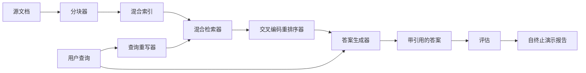

# 端到端 RAG 系统

> 六个组件模块。一条流水线。一次评估循环。一个可自终止的演示。这就是你要交付的系统。

**类型：** 构建
**语言：** Python
**前置条件：** 阶段 11 第 06 课（RAG）、第 10 课（评估）；阶段 19 Track B 基础（第 20-29 课）；阶段 19 第 64、65、66、67、68 课
**时间：** ~90 分钟

## 学习目标

- 将分块器、混合检索器、查询重写器、交叉编码重排序器和答案生成器组合成一条完整的端到端流水线。
- 实现一个答案生成器，能够通过块锚点引用其主张，并具备低置信度拒绝回退机制。
- 针对组装完成的流水线运行第 68 课的评估，证明分阶段构建在每个指标上都优于各组件单独运行的效果。
- 构建一个可自终止的命令行演示，该演示摄入一个固定语料库，运行一组固定的查询，并以零退出码和一份摘要报告退出。

## 问题

六个孤立的组件证明不了什么。分块器可以在语料库上赢得 recall@5，但在系统的 recall@5 上却可能失败，因为检索器无法对分块器输出的内容进行排序。重排序器可以在合成候选集上提升 MRR，但在真实的双编码器候选集上却可能失败，因为双编码器在重排序预算下的召回率太低。查询重写器可以在单个查询上提升目标文档的排名，但在下一个查询上却可能失效，因为 LLM 模拟返回了退化的假设查询。

集成测试就是让整条流水线使用相同的固定 qrels、相同的指标、通过一个将一切连接起来的编排文件进行端到端运行。这就是本课所要构建的内容。如果集成流水线的指标超过了每个阶段独立演示的指标，你就证明了系统的有效性。

## 概念



### 编排选择

流水线是一个小型图。每个阶段都是一个具有清晰签名的函数。

| 阶段 | 输入 | 输出 |
|-------|-------|--------|
| 分块器 | 文档文本 | Chunk 记录列表 |
| 检索器 | 查询字符串 | 前 N 条 Chunk 记录 |
| 重写器（可选） | 查询字符串 | 重写列表 + 假设文档 |
| 重排序器 | 查询、候选集 | 带交叉分数的前 K 条 Chunk 记录 |
| 生成器 | 查询、前 K 条 Chunk 记录 | 带引用的答案字符串 |

当每个阶段的签名稳定时，组合方式就很简单。本课的 `Pipeline` 类持有这五个阶段和一个按顺序运行它们的 `query` 方法。每个阶段都是可替换的：传入不同的分块器、检索器、重写器、重排序器或生成器，流水线仍然可以运行。

### 带引用的答案生成器

生成器是最后一个阶段，也是最容易出问题的阶段。本课提供了一个确定性的模拟生成器，其功能如下：

1. 获取重排序后的前 K 个块。
2. 选择最多两个其文本包含与查询最高内容令牌重叠的块。
3. 输出一个答案，该答案是每个选定块中各取一个句子的拼接结果，每个句子后跟一个 `[doc_id:chunk_index]` 锚点。
4. 如果没有块的令牌重叠度超过拒绝阈值，则输出"我不知道"，不带任何引用。

在生产环境中，你可以将模拟生成器替换为真实的 LLM 调用，使用以下提示模板：

```
你只使用下面的片段来回答问题。
每条主张都要用括号内的锚点标注来源。
如果这些片段无法回答问题，请说"我不知道"。

问题：{query}

片段：
{带锚点的枚举块}

答案：
```

低置信度拒绝路径正是记录交叉编码器排名第一得分的全部原因。如果该得分低于语料库阈值，生成器就会拒绝回答。这是防止产生幻觉答案的安全阀。

### 自终止演示

演示端到端地运行一切。它会打印单个查询的逐阶段分解、对四个固定 qrels 运行评估、打印指标表，并在第 68 课的所有指标满足演示中设定的阈值时以状态码零退出。如果有任何指标低于阈值，演示将以非零状态退出，并附带一条指出未达标指标的消息。

这就是 CI 烟雾测试的形式。流水线离线运行，速度快，结果是确定性的。阈值在固定语料库上是刻意收紧的，因此六个课程中任何一个的回归都会导致演示失败。

## 构建

`code/main.py` 实现了以下内容：

- `Chunk` - 在所有阶段中传递的记录（在第 64 课的数据结构基础上扩展了 chunk_index 和 source doc_id）。
- `Chunker` - 从第 64 课中选择一种策略（默认为递归分割）。
- `HybridIndex` - 打包了第 65 课中的 BM25 + 稠密检索 + RRF。
- `Rewriter`（可选）- 根据查询长度和连词存在情况，从第 67 课中选择 HyDE、多查询或分解策略。
- `Reranker` - 第 66 课中训练好的交叉编码器，使用较小的固定训练集以便在数秒内收敛。
- `Generator` - 确定性的模拟生成器，支持引用和低置信度拒绝。
- `Pipeline` - 组合五个阶段，提供一个 `query(question)` 方法，返回 `Result(answer, top_k, latency_ms_per_stage)`。
- `run_demo()` - 摄入语料库，运行三个固定查询，运行评估，打印结果，根据阈值设置退出码。

运行方式：

```bash
python3 code/main.py
```

输出是一个打印的查询追踪、完整的评估表以及最终的通过/失败状态。在固定语料库上以退出码 0 返回。

## 演示可能掩盖的失败模式

**分块器边界漂移。** 如果你在评估 qrels 标注过程和演示之间切换了分块器策略，黄金文档 ID 就不再对应。请在 qrels 文件中锁定分块器策略。演示包含一个标明分块器名称的头部。

**重排序器训练集泄露到评估中。** 第 66 课中的 14 个训练三元组包含与评估查询相似的查询。在生产环境中，严格将评估查询排除在外。演示的评估查询特意与重排序训练集不重叠。

**模拟生成器掩盖了幻觉风险。** 模拟器不可能产生幻觉，因为它只输出检索到的块中的文本。本课指出了这一点，并指明了切换到真实模型的生产路径。

**不支持流式输出。** 流水线在每个阶段结束时返回完整的答案。生产系统会对生成器的输出进行流式处理。流式处理不在本课范围内；无论哪种方式，答案评估指标都是基于最终字符串计算的。

**延迟是离线的。** 模拟 LLM 调用是常数时间。真实 LLM 调用占主导地位。请在请求范围内规划延迟预算；本课的逐阶段计时仅衡量 CPU 工作。

## 使用方法

生产模式：

- 将流水线文件放在一个编排器下，并明确每个阶段的接口。避免将编排逻辑散布到整个代码库中。
- 在每次涉及某个阶段的合并之前运行评估。如果评估指标下降，该合并不予通过。
- 每次 CI 运行都持久化指标追踪记录，以便将回归归因于某个阶段的替换。
- 添加一个 20 个查询的烟雾测试集（回归测试集的子集），要求在 30 秒内完成；完整的回归测试集在夜间运行。

## 交付

本课中的流水线文件是阶段 19 Track F 后续课程所假设的基本形态。后续课程将添加摄入自动化、增量重新索引、遥测和上层的服务层。检索、重排序、重写和评估在这部分已经完成。

## 练习

1. 在重写器内部添加一个按查询的策略选择器：使用第 67 课的启发式规则（长度、连词、术语比率）来选择 HyDE、多查询或分解策略。
2. 通过环境变量开关为生成器添加真实的 LLM 调用。默认使用模拟生成器。测量延迟差异。
3. 扩展演示，添加一个 `--corpus path` 标志以加载真实语料库。重新运行评估和阈值检查。
4. 为分块器添加一个 `--strategy` 标志。测量每种策略对端到端召回率的贡献。
5. 添加一个流式生成器接口，并将其接入评估系统。确认忠实度是基于最终字符串计算的，而不是基于流式前缀。

## 关键术语

| 术语 | 人们通常说的 | 实际含义 |
|------|-----------------|------------------------|
| 流水线 | "RAG 流水线" | 从摄入到带引用答案的各组合阶段 |
| 引用锚点 | "来源链接" | 附加到每条主张上的 (doc_id, chunk_index) 引用 |
| 低置信度拒绝 | "我不知道" | 当重排序器排名第一的得分低于阈值时，生成器不返回答案 |
| 烟雾测试集 | "CI 评估" | 每次 PR 检查中运行的最小 qrels 子集 |
| 阶段接口 | "函数签名" | 每个流水线阶段的稳定输入和输出类型 |

## 延伸阅读

- [Anthropic, Building search and retrieval](https://www.anthropic.com/news/contextual-retrieval)
- [Pinterest, MCP internal search](https://medium.com/pinterest-engineering) - 参考生产架构
- [Ragas: Automated Evaluation of RAG Pipelines](https://docs.ragas.io)
- 阶段 11 第 06 课 - RAG 基础
- 阶段 19 第 64-68 课 - 此处组合的各组件
