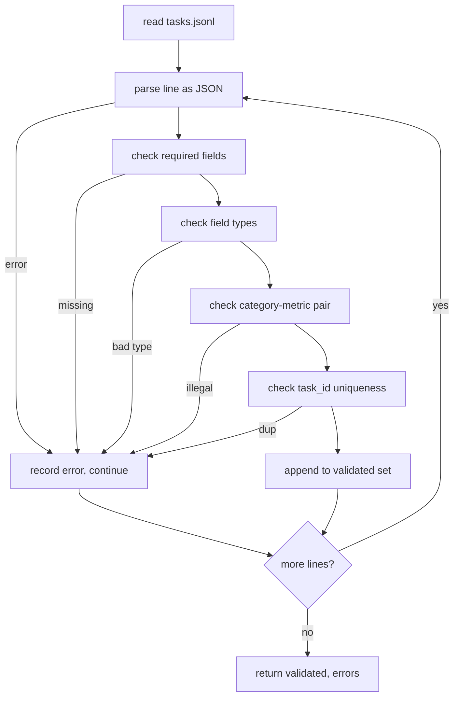

# Görev Spesifikasyon Formatı

> Bir değerlendirme koşum takımı ancak sözleşmenin görevlerine saygı duyması kadar iyidir. Tek bir puanlama işlevi yazmadan önce JSONL şeklini ve metrik kelime dağarcığını dondurun.

**Tür:** Yapım
**Diller:** Python
**Önkoşullar:** Aşama 19 B Yolunun temelleri
**Süre:** ~90 dk

## Öğrenme hedefleri

- Aritmetik, çoktan seçmeli, kod yürütme, sınıflandırma ve serbest metin özetlemeyi tek bir şekilde kapsayan bir JSONL görev kaydı şeması tanımlayın.
- Aşağı yöndeki derslerin (71-73) tek bir alana gönderilebilmesi için metrik adlarından oluşan kapalı bir sözlük oluşturun.
- Birkaç atışlı örnekleri ve işlem sonrası kuralları koşucunun değil görevin parçası olarak belirtin, böylece aynı prompt modeller arasında aynı hedefi üretir.
- Hatalı biçimlendirilmiş kayıtları koşucuya ulaşmadan önce reddeden katı bir doğrulayıcı uygulayın.
- Doğrulayıcının üzerinde çalışabileceği gerçek bir şey olması için spesifikasyonun her dalını uygulayan 10 görevlik bir fikstür seti gönderin.

## Neden donmuş bir spesifikasyon

Bir araştırma kod tabanı, değerlendirme komut dosyalarını testleri biriktirdiğinden daha hızlı toplayacaktır. Altı ay içinde her not defterinin kendi JSON şekli vardır, her ölçüm iki kez yeniden uygulanır ve hiçbir şey çalıştırmalar arasında karşılaştırılamaz. Düzeltme sıkıcı. Bir şema seçin. Bir doğrulayıcı yazın. Diğer her şeyi reddet. Bu dersin yaptığı budur.

Şekil, BIG-bench, HELM ve lm-eval tarzı koşum takımlarından fikirler almıştır, ancak alan adları bize aittir. Her alanın tek bir sahibi vardır. Koşucu görevi okur. Metrik hedefleri okur. İşlem sonrası adım üretimi normalleştirir. Hiçbir alan boru hattının ortasında değiştirilebilir değildir.

## Kayıt şekli

Görev, tek satırdaki bir JSON nesnesidir. Kablo demeti `tasks.jsonl` değerini okur ve her satırı bağımsız olarak doğrular. Kötü bir çizgi, koşuyu değil, o kaydı iptal eder.

```json
{
  "task_id": "arith_001",
  "category": "arithmetic",
  "prompt": "Compute the result. Question: 17 + 24\nAnswer:",
  "targets": ["41"],
  "metric_name": "exact_match",
  "few_shot_examples": [
    {"prompt": "Question: 2 + 2\nAnswer:", "completion": "4"}
  ],
  "post_process": "strip_whitespace",
  "metadata": {"difficulty": "easy"}
}
```

Gerekli alanlar şunlardır: `task_id`, `category`, `prompt`, `targets`, `metric_name`, `post_process`. `few_shot_examples` ve `metadata` isteğe bağlıdır. Bilinmeyen üst düzey alanlar doğrulamada başarısız oluyor.

## Alan kuralları

`task_id` boşluk içermeyen bir dizedir. Doğrulayıcı, dosya genelinde benzersizliği zorlar.

`category` , `arithmetic`, `mcq`, `code_exec`, `classification`, `summary`'den biridir. Kategori, hangi metrik ve işlem sonrası çiftinin yasal olduğunu kısıtlar. Tek harfli bir hedefe karşı bir `code_exec` görevi `metric_name = code_exec` kullanmalı ve bir `mcq` görevi `metric_name = exact_match` kullanmalıdır.

`prompt` boş olmayan bir dizedir. Doğrulayıcı, sondaki boşlukları yasaklar ve prompt gövdesinde zaten birkaç adımlık blok içeren kayıtları reddeder. Birkaç çekimin oluşturulması yazarda değil koşucuda gerçekleşir.

`targets` boş olmayan bir dize listesidir. `exact_match` için eşleşen herhangi bir öğe sayılır. `f1` ve `rouge_l` için en yüksek puanı alan hedef kazanır. `mcq` için listede tam olarak bir öğe bulunmaktadır.

`metric_name` , `exact_match`, `f1`, `bleu_4`, `rouge_l`, `accuracy`, `code_exec`'dan biridir. Kelime dağarcığı kapandı. Yeni bir ölçüm, yeni bir ders ve buraya yeni bir giriş gerektirir.

`few_shot_examples` , `{prompt, completion}` çiftinden oluşan bir listedir. Doğrulayıcı, prompt'ları sınırlı tutmak için listeyi sekiz girişle sınırlandırır.

`post_process` , `none`, `strip_whitespace`, `lower`, `extract_letter`, `extract_code_block`, `extract_first_line`'dan biridir. Her kuralın tek bir deterministik davranışı vardır. Doğrulayıcı kuralları birleştirmeyi yasaklar.

## Doğrulayıcı davranışı



Doğrulayıcı iki liste döndürür: doğrulanmış kayıtlar ve rahatsız edici satırı, ihlal edilen kuralı ve hatalı alanı içeren hata kayıtları. Açık bir `--allow-bad-tasks` bayrağı ayarlanmadıkça hata listesi boş değilse koşucu başlamayı reddeder.

## Birkaç çekimde oluşturma

Koşucu, birkaç çekimlik örnekleri prompt'un önünde boş bir satır ayırıcıyla birleştirir. Her model için aynı kod yolu çalışır, dolayısıyla tek fark kaynağı modelin kendisidir. Yazarlar örnekleri sağlayıcı başına bir kez değil, bir kez yazar.

```python
def render(task):
    parts = []
    for ex in task.get("few_shot_examples", []):
        parts.append(ex["prompt"] + " " + ex["completion"])
    parts.append(task["prompt"])
    return "\n\n".join(parts)
```

## İşlem sonrası kurallar

İşlem sonrası adım, üretimden sonra, ölçümden önce çalışır. Deterministik ve durumsuzdur.

- `none` dizeyi değişmeden döndürür.
- `strip_whitespace` baştaki ve sondaki boşlukları çıkarır.
- `lower` dizeyi küçük harfe çevirir.
- `extract_letter` , ÇSS için kullanılan `[A-E]` ile eşleşen ilk karakteri döndürür.
- `extract_code_block` , code-exec için kullanılan ilk üçlü geri tıklama çitli bloğun gövdesini döndürür.
- `extract_first_line` , özet sınıflandırma için kullanılan, boş olmayan ilk satırı döndürür.

Bu listenin dışında kural gerektiren bir görev yeni bir derse aittir.

## Bu ders ne yapmaz

Puan vermiyor. Bir model çağırmaz. Kod çalıştırmaz. Bunlar 71, 72 ve 75. derslerde geliyor. Bu ders, hepsinin saygı duyduğu sözleşmeyi donduruyor.

10 görevden oluşan fikstür, iki aritmetik öğeyi, iki MCQ öğesini, iki code-exec öğesini, iki sınıflandırma öğesini ve iki özetleme öğesini kapsar. Doğrulayıcı 10'un tamamını iletir. Ayrı bir fikstür (`tasks_bad.jsonl`) her kuralı tetikler ve doğrulayıcı tam olarak bu kadar çok hata döndürür.

## Kod nasıl okunur

`main.py` , `TaskSpec`, `validate_task`, `validate_file` ve bir CLI giriş noktasını tanımlar. Fikstür yükleyicisi: `load_fixtures`. İşleme ve işlem sonrası yardımcılar doğrulamanın yanında bulunur, böylece 75. dersteki çalıştırıcı tek bir modülü içe aktarır.

`main.py` 'u yukarıdan aşağıya doğru okuyun. Sonra `code/tests/test_spec.py`'yi okuyun. Testler her doğrulama kuralını ve her işlem sonrası davranışı sabitler. `main.py` 'nin altındaki demo, birlikte verilen fikstürü doğrular ve bir özet yazdırır.

## Daha ileri gidiyoruz

Gerçek değerlendirme paketleri, şemaların sütunları büyütmesi gibi kategorileri de büyütür. Ayık hareket, bir metrik, bir süreç sonrası kuralı ve en az bir fikstür görevi eklemeden bir kategori eklemeyi reddetmektir. Spesifikasyona veritabanı geçişi gibi davranın. Her değişiklik gözden geçirilir, versiyonlanır ve testlerle birlikte sunulur. Bu dersteki doğrulayıcı kapıdır.
