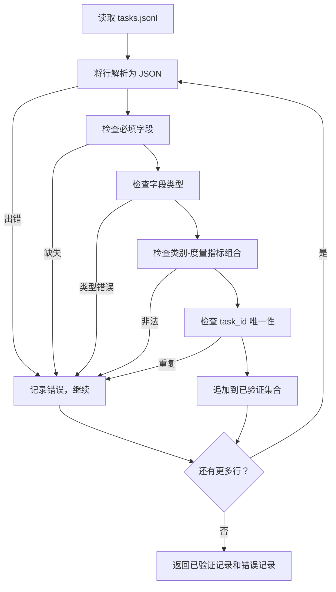

# 任务规范格式

> 评估框架的质量取决于其任务所遵守的契约。在编写任何评分函数之前，先冻结 JSONL 的数据结构和度量术语表。

**类型：** 构建
**语言：** Python
**前置条件：** 阶段 19 Track B 基础
**时长：** ~90 分钟

## 学习目标

-   定义一种 JSONL 任务记录模式，使其能够统一涵盖算术、多选题、代码执行、分类和自由文本摘要等多种类型。
-   固定一组封闭的度量名称术语表，使后续课程（71-73）能够基于单个字段进行分发处理。
-   将少样本示例和后处理规则作为任务的一部分（而非运行器的一部分）来指定，从而确保同一提示在不同模型下产生相同的目标结果。
-   实现一个严格的验证器，在记录到达运行器之前拒绝格式错误的记录。
-   交付一套包含 10 个任务的测试夹具集，覆盖规范中的每个分支，让验证器有实际可用的检验素材。

## 为什么要冻结规范

研究代码库中评估脚本的增长速度会远超测试脚本。六个月后，每个笔记本都有自己的 JSON 格式，每个度量指标都被重复实现两次，且任何运行结果之间都无法进行对比。解决办法很无趣：选择一个模式，编写一个验证器，拒绝其他所有格式。这就是本节课程要做的事情。

该模式借鉴了 BIG-bench、HELM 和 lm-eval 风格框架的思想，但字段名称是我们自己的。每个字段只有单一的拥有者。运行器读取任务，度量指标读取目标值，后处理步骤对生成结果进行规范化。流水线中没有任何字段是可变的。

## 记录结构

一个任务是一个单行 JSON 对象。框架读取 `tasks.jsonl` 并独立验证每一行。格式错误的行只会中止该条记录，而不会影响整个运行。

```json
{
  "task_id": "arith_001",
  "category": "arithmetic",
  "prompt": "Compute the result. Question: 17 + 24\nAnswer:",
  "targets": ["41"],
  "metric_name": "exact_match",
  "few_shot_examples": [
    {"prompt": "Question: 2 + 2\nAnswer:", "completion": "4"}
  ],
  "post_process": "strip_whitespace",
  "metadata": {"difficulty": "easy"}
}
```

必填字段为 `task_id`、`category`、`prompt`、`targets`、`metric_name`、`post_process`。`few_shot_examples` 和 `metadata` 为可选字段。顶层出现未知字段将导致验证失败。

## 字段规则

`task_id` 是一个不含空白字符的字符串。验证器会强制执行文件内的唯一性。

`category` 必须是以下之一：`arithmetic`、`mcq`、`code_exec`、`classification`、`summary`。类别决定了哪些度量指标和后处理组合是合法的。`code_exec` 任务必须使用 `metric_name = code_exec`，`mcq` 任务必须使用 `metric_name = exact_match`，且目标值为单个字母。

`prompt` 是一个非空字符串。验证器禁止末尾空白字符，并拒绝提示正文中已包含少样本块（few-shot block）的记录。少样本的渲染在运行器中进行，而非由作者处理。

`targets` 是一个非空字符串列表。对于 `exact_match`，匹配任意一个元素即算命中。对于 `f1` 和 `rouge_l`，取评分最高的目标值。对于 `mcq`，列表中只包含一个元素。

`metric_name` 必须是以下之一：`exact_match`、`f1`、`bleu_4`、`rouge_l`、`accuracy`、`code_exec`。该术语表是封闭的。新增度量指标需要新开一课并在此添加新条目。

`few_shot_examples` 是一个 `{prompt, completion}` 对组成的列表。验证器将列表上限设为 8 条，以保持提示长度可控。

`post_process` 必须是以下之一：`none`、`strip_whitespace`、`lower`、`extract_letter`、`extract_code_block`、`extract_first_line`。每条规则具有单一的确定性行为。验证器禁止组合使用多个规则。

## 验证器行为



验证器返回两个列表：已验证的记录列表和错误记录列表（包含出错的行、违反的规则以及出错的字段）。如果错误列表非空，运行器将拒绝启动，除非设置了显式的 `--allow-bad-tasks` 标志。

## 少样本渲染

运行器将少样本示例以空行分隔拼接在提示之前。所有模型都走同一套代码路径，因此唯一的差异来源就是模型本身。作者只需编写一次示例，无需为每个提供商分别编写。

```python
def render(task):
    parts = []
    for ex in task.get("few_shot_examples", []):
        parts.append(ex["prompt"] + " " + ex["completion"])
    parts.append(task["prompt"])
    return "\n\n".join(parts)
```

## 后处理规则

后处理步骤在模型生成之后、度量计算之前运行。它是确定性的且无状态的。

-   `none`：返回原字符串，不做任何修改。
-   `strip_whitespace`：去除首尾空白字符。
-   `lower`：将字符串转换为小写。
-   `extract_letter`：返回第一个匹配 `[A-E]` 的字符，用于多选题。
-   `extract_code_block`：返回第一个三重反引号围栏代码块的内容，用于代码执行任务。
-   `extract_first_line`：返回第一个非空行，用于摘要分类。

如果一个任务需要的规则不在此列表中，则应在新的课程中添加。

## 本节课程不涉及的内容

本节课程不进行评分，不调用模型，也不执行代码。这些内容将在课程 71、72 和 75 中讲解。本节课程冻结的是所有后续课程都将遵守的契约。

包含 10 个任务的测试夹具涵盖两个算术项、两个多选题项、两个代码执行项、两个分类项和两个摘要项。验证器对这 10 个任务全部通过。另一个夹具文件（`tasks_bad.jsonl`）会触发每一条规则，验证器将返回相应数量的错误。

## 如何阅读代码

`main.py` 定义了 `TaskSpec`、`validate_task`、`validate_file` 以及一个 CLI 入口点。夹具加载器为 `load_fixtures`。渲染和后处理辅助函数与验证逻辑放在一起，方便课程 75 中的运行器通过导入单个模块来使用。

从上到下阅读 `main.py`，然后阅读 `code/tests/test_spec.py`。这些测试固定了每条验证规则和每个后处理行为。`main.py` 底部的演示会验证附带的夹具并打印摘要。

## 深入进阶

真实的评估套件新增类别的方式类似于数据库模式新增列。明智的做法是：拒绝添加任何没有同时配备度量指标、后处理规则和至少一个夹具任务的类别。将规范视为一次数据库迁移。每一次变更都要经过审查、版本控制，并附带相应的测试。本节课程中的验证器就是这道关卡。
