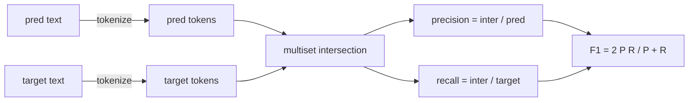
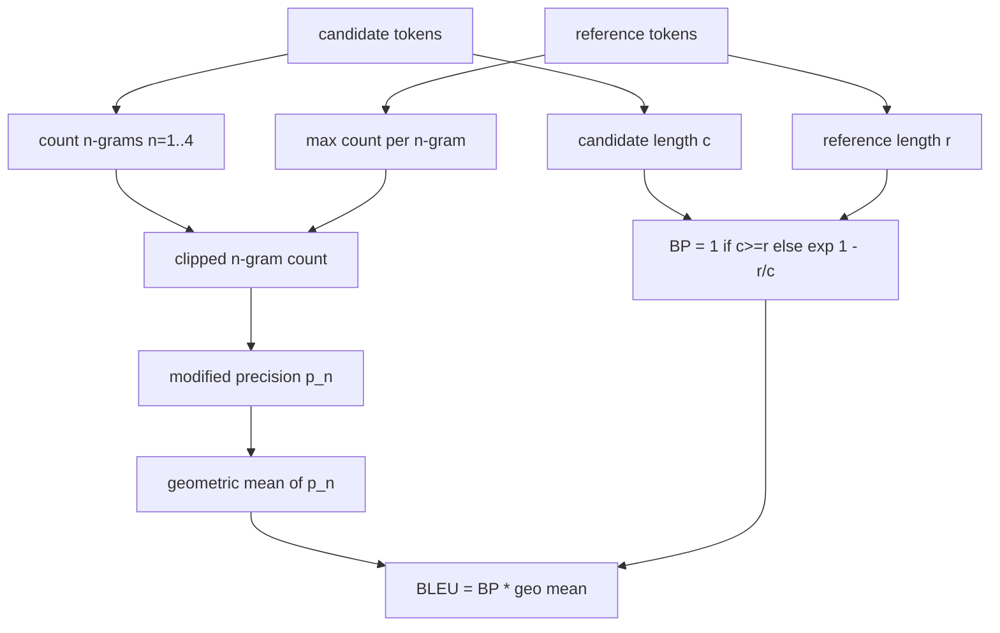

# Klasik Metrikler

> BLEU, ROUGE-L, F1, tam eşleşme, doğruluk. Yayınlanan LLM değerlendirme sayılarının çoğunu hâlâ açıklayan beş ölçüm. Her birini ilk prensiplerden başlayarak uygulayın, böylece sayının ne anlama geldiğini bilirsiniz.

**Tür:** Yapım
**Diller:** Python
**Önkoşullar:** Aşama 19 B Yolunun temelleri, ders 70
**Süre:** ~90 dk

## Öğrenme hedefleri

- Açık tokenizasyon kurallarıyla token düzeyinde tam eşleşme, F1 ve doğruluk uygulayın.
- BLEU-4'ü sıfırdan uygulayın: değiştirilmiş n-gram hassasiyeti, n'nin 1'den 4'e eşit olduğu geometrik ortalama, kısalık cezası.
- Hassasiyet ve geri çağırmanın F-beta kombinasyonu ile en uzun ortak alt diziyi kullanarak ROUGE-L'yi uygulayın.
- Koşucunun metrikten bağımsız kalması için 70. dersten metrik_adı alanına gönderim yapın.
- Davranışı, üçüncü taraf bir kitaplıktan değil, çalışılmış örneklerden alınan referans vektörleriyle sabitleyin.

## Neden yeniden uygulama

BLEU 28.3'ü bildiren makaleleri ve BLEU 0.283'ü bildiren başka makaleleri okuyacaksınız. ROUGE-L puanlarının iki kitaplık arasında on puanlık farklılık gösterdiğini göreceksiniz çünkü biri küçük harfe dönüşüyor, diğeri ise kesilmiyor. Kafanızın karışmasını önlemenin en hızlı yolu, metrikleri kendiniz yazmak, ardından tokenizer'ye karar verilen çizgiyi ve yumuşatmanın uygulandığı çizgiyi işaret etmektir. Bundan sonra, sayıları makaleler arasında karşılaştırmak, kütüphaneler hakkında tartışmak değil, ölçüm düzenini okumak meselesi haline gelir.

Stdlib artı numpy yeterlidir. BLEU sayıyor ve bir kelepçe. ROUGE-L dinamik programlamadır. F1, token'ler üzerinde belirlenmiş bir kavşaktır. En zor kısım bir tokenizer seçmek ve ona bağlı kalmaktır.

## Tokenizasyon

tokenizer, `re.findall(r"\w+", text.lower())`'dir. Küçük harf, alfanümerik gösterimler, noktalama işaretleri. Bu dersteki her metrik tam olarak bu tokenizer'yi kullanır. Koşucunun seçim hakkı yoktur. tokenizer'leri değiştirirseniz farklı bir benchmark çalıştırıyorsunuz demektir.

```python
TOKEN_RE = re.compile(r"\w+", re.UNICODE)
def tokenize(text):
    return TOKEN_RE.findall(text.lower())
```

Bu kasıtlı bir basitleştirmedir. Üretim kurulumları CJK'ye, kısaltmalara ve kod tanımlayıcılara önem verecektir. Dersin amacı tokenizer'nin bir düğme değil, bir sözleşme olduğudur.

## Tam eşleşme

```python
def exact_match(pred, targets):
    return float(any(pred.strip() == t.strip() for t in targets))
```

Görev başına 1,0 veya 0,0 değerini döndürür. dataset üzerinden toplam ortalamadır. Bu, aritmetik, MCQ ve kısa sınıflandırma görevleri için en güçlü araçtır.

## Token düzeyi F1

Tahmin ve hedef için token çoklu kümesini kurun. Hassasiyet, tahminin çoklu kümesine bölünen çoklu küme kesişimidir. Geri çağırma, hedefin çoklu kümesine bölünen aynı kesişimdir. F1 harmonik ortalamadır. Uygulama, boş tahmin ve boş hedef uç durumlarını ele alır.



Çok hedefli görevler için hedef listesi üzerinden en iyi F1'i alıyoruz. Bu, literatürde yaygın olarak bildirilen SQuAD tarzı davranışla eşleşiyor.

## BLEU-4

BLEU kanonik makine çevirisi ölçütüdür ve özetleme çalışmalarında hala karşımıza çıkmaktadır. Kullandığımız formülasyon, standart kısalık cezası ve değiştirilmiş n-gram sayımlarında ilave bir düzeltme ile birlikte korpus düzeyinde BLEU-4'tür, böylece tek bir eksik 4 gram, puanı sıfıra itmez.

Her aday-referans çifti için, n eşittir 1, 2, 3, 4 için değiştirilmiş n-gram kesinliğini sayarız. Değiştirilmiş hassaslık, aday n-gram sayısını herhangi bir referanstaki o n-gramın maksimum sayısına göre keser, böylece aday bir cümleyi tekrarlayarak şişirilemez. Dört hassasiyetin geometrik ortalaması, kısalık cezasıyla sarılır.



Yumuşatma kuralı, Lin ve Och'un yöntem 1 olarak adlandırdığı kuraldır: günlüğü almadan önce her n-gram hassasiyetinin hem payına hem de paydasına bir ekleyin. Bu, bir referansın eşleşen 4 gramı olmadığında ve uzun adaylarda yumuşatılmamış değere yakın kaldığında `log 0`'yi önler.

## ROUGE-L

ROUGE-L aday ve referans token dizilerinin en uzun ortak alt dizisini karşılaştırır. LCS, bitişikliği zorlamadan kelime sırasını yakalar; bu nedenle varsayılan özetleme ölçüsüdür. LCS uzunluğunu standart bir dinamik programlama tablosuyla hesaplıyoruz, ardından `lcs / reference length` olarak geri çağırmayı, `lcs / candidate length` olarak hassasiyeti türetiyoruz ve betanın simetrik F1 formu için bire eşit olduğu F-beta ile birleştiriyoruz.

```python
def lcs_length(a, b):
    n, m = len(a), len(b)
    dp = numpy.zeros((n + 1, m + 1), dtype=int)
    for i in range(n):
        for j in range(m):
            if a[i] == b[j]:
                dp[i+1, j+1] = dp[i, j] + 1
            else:
                dp[i+1, j+1] = max(dp[i+1, j], dp[i, j+1])
    return int(dp[n, m])
```

Numpy tablosu uygulamayı okunaklı hale getirir; saf Python listeleri de işe yarayacaktır. ROUGE-L'yi tercih eden görevler, görev başına O(n m) maliyetini öder. Bir milisaniyenin altında kalan tipik özet uzunlukları için.

## Doğruluk

Çok hedefli sınıflandırma görevlerinde doğruluk, tek bir normalleştirilmiş hedefe karşı tam eşleşmeye indirgenir. Göndericinin, koşucunun içindeki dize karşılaştırmalarına girmeden `metric_name` üzerinden gönderim yapabilmesi için bunu ayrı bir işlev olarak kullanıma sunuyoruz.

## Sevkiyat sözleşmesi

Tek giriş noktası `score(metric_name, prediction, targets)`'dir. `[0, 1]`'de bir kayan nokta döndürür. Koşucu metrik adına göre dallanmaz. Aramayı bırakır ve sonucu yazar. Bu, 75. dersin 70. dersteki görev spesifikasyonuna yapıştıracağı yüzeydir.

```python
def score(metric_name, pred, targets):
    if metric_name == "exact_match":
        return exact_match(pred, targets)
    if metric_name == "f1":
        return max(f1_score(pred, t) for t in targets)
    if metric_name == "bleu_4":
        return max(bleu4(pred, t) for t in targets)
    if metric_name == "rouge_l":
        return max(rouge_l(pred, t) for t in targets)
    if metric_name == "accuracy":
        return accuracy(pred, targets)
    raise ValueError(f"unknown metric_name: {metric_name}")
```

`code_exec` 72. derste işlenir ve oradaki dağıtıcıya yerleştirilir.

## Bu ders ne yapmaz

Bir model çağırmaz. Bu, 70. dersteki süreç sonrası kuralların zaten yaptığının ötesinde nesilleri normalleştirmez. Güven aralıklarını hesaplamaz. BLEURT veya BERTScore (modele ihtiyaç duyan ve farklı bir ders yaşayanlar) yapmaz. Önemli olan tabandır: beş ölçüm, bir tokenizer, bir sevk tablosu.

## Kod nasıl okunur

`main.py`, her ölçümü serbest bir işlev artı dağıtıcı olarak tanımlar. Referans vektörleri dosyanın altındaki `_reference_examples` bloğunda bulunur. Demo, dağıtıcıyı sekiz örnekle çalıştırıyor ve metrik başına puanları yazdırıyor. `code/tests/test_metrics.py`'deki testler referans vektörlerini sabitler ve her uç durumu vurgular (boş tahmin, boş referans, paylaşılan token yok, tam eşleşme, tekrarlanan ifade kırpma).

`main.py`'yi yukarıdan aşağıya okuyun. İşlevler karmaşıklığa göre sıralanır. kesin_eşleşme ve doğruluk her biri birer satırdır. F1 altı satırdır. BLEU ve ROUGE-L ağır parçalardır ve yumuşatma kuralı ve LCS yinelemesi hakkında ayrıntılı yorumlar içerirler.

## Daha ileri gidiyoruz

Klasik ölçüler gerekli, yeterli değil. Yüzey örtüşmesini ödüllendirirler ve anlamı kaçırırlar. Çözüm, klasik zemine güvendiğinizde model tabanlı metrikleri (BLEURT, BERTScore, GEval) en üstte katmanlandırmaktır. Bu daha sonraki bir derstir. Şimdilik: Bu beşinin çalışmasını sağlayın, testlerle sabitleyin; denetlenebilir, hızlı ve tekrarlanabilir bir metrik yığınınız var.
