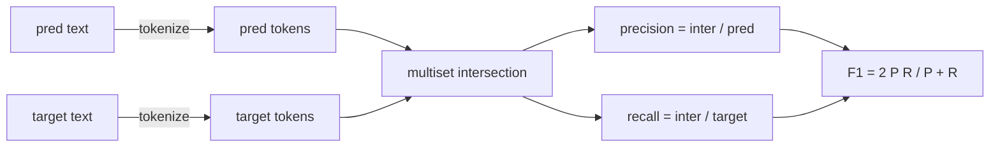
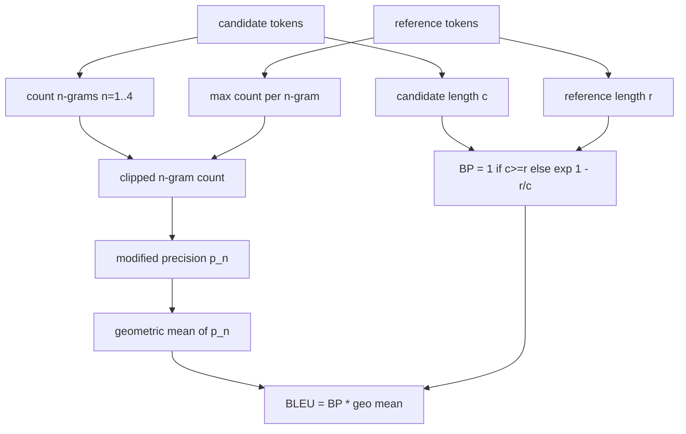

# 经典指标

> BLEU、ROUGE-L、F1、精确匹配、准确率。这五个指标仍然占据已发表 LLM 评估结果的大部分。从头实现每一个指标，让你真正理解数字背后的含义。

**类型：** 构建
**语言：** Python
**前置要求：** 阶段 19 轨道 B 基础，第 70 课
**时间：** ≈90 分钟

## 学习目标

- 实现基于分词规则的词元级精确匹配、F1 和准确率。
- 从头实现 BLEU-4：修正 n-gram 精确率、n=1 到 4 的几何平均、简短惩罚。
- 使用最长公共子序列实现 ROUGE-L，并结合 F-beta 综合精确率与召回率。
- 根据第 70 课的 `metric_name` 字段进行分发，使运行器与指标无关。
- 使用来自手工计算示例的参考向量来固定行为，而非依赖第三方库。

## 为什么重新实现

你会读到一篇论文报告 BLEU 28.3，而另一篇报告 BLEU 0.283。你会发现同一个 ROUGE-L 分数在两个库之间相差十分，因为一个库转了小写而另一个没有。消除困惑最快的方法就是自己编写指标，然后在代码中指出分词器在哪一行决定、平滑在哪一行应用。之后，跨论文比较数字就变成了阅读指标配置的问题，而不是争论库的问题。

标准库加 numpy 就足够了。BLEU 只是计数和裁剪。ROUGE-L 是动态规划。F1 是对词元集合求交集。最难的部分是选择一个分词器并坚持使用它。

## 分词

分词器是 `re.findall(r"\w+", text.lower())`。转换为小写，匹配字母数字序列，丢弃标点符号。本课中的所有指标都使用这个完全相同的方法。运行器无权选择。如果你更换了分词器，你运行的就不是同一个基准了。

```python
TOKEN_RE = re.compile(r"\w+", re.UNICODE)
def tokenize(text):
    return TOKEN_RE.findall(text.lower())
```

这是一个刻意的简化。生产环境会关注中日韩文字、缩约词和代码标识符。本课的重点在于：分词器是一份契约，而不是一个可调节的旋钮。

## 精确匹配

```python
def exact_match(pred, targets):
    return float(any(pred.strip() == t.strip() for t in targets))
```

每个任务返回 1.0 或 0.0。整个数据集上的聚合结果是平均值。这是算术题、多项选择题和短文本分类任务的主力。

## 词元级 F1

为预测和目标分别构建词元多重集。精确率是多重集交集除以预测的多重集。召回率是同一个交集除以目标的多重集。F1 是调和平均数。实现需要处理空预测和空目标这两种边界情况。



对于多目标任务，我们在目标列表中取最佳的 F1 值。这与文献中广泛报道的 SQuAD 风格行为一致。

## BLEU-4

BLEU 是经典的机器翻译指标，至今仍出现在摘要任务中。我们使用的公式是语料级 BLEU-4，采用标准的简短惩罚和对修正 n-gram 计数的加一平滑，这样单个 4-gram 的缺失不会将分数推到零。

对于每对候选-参考，我们计算 n=1、2、3、4 的修正 n-gram 精确率。修正精确率将候选 n-gram 计数裁剪为该 n-gram 在任何参考中的最大计数，从而防止候选通过重复一个短语来虚增分数。四个精确率的几何平均由简短惩罚包裹。



平滑规则是 Lin 和 Och 称之为方法一的方法：在取对数之前，先将每个 n-gram 精确率的分子和分母都加一。这避免了当参考中没有匹配的 4-gram 时出现 `log 0`，且在长候选上保持接近未平滑的值。

## ROUGE-L

ROUGE-L 比较候选和参考词元序列的最长公共子序列。LCS 能捕捉词序但不要求连续，因此它是默认的摘要指标。我们通过标准的动态规划表计算 LCS 长度，然后推导出召回率为 `lcs / reference length`、精确率为 `lcs / candidate length`，并用 beta=1 的 F-beta 将它们组合为对称的 F1 形式。

```python
def lcs_length(a, b):
    n, m = len(a), len(b)
    dp = numpy.zeros((n + 1, m + 1), dtype=int)
    for i in range(n):
        for j in range(m):
            if a[i] == b[j]:
                dp[i+1, j+1] = dp[i, j] + 1
            else:
                dp[i+1, j+1] = max(dp[i+1, j], dp[i, j+1])
    return int(dp[n, m])
```

使用 numpy 表格使实现清晰易读；纯 Python 列表也可以。选择 ROUGE-L 的任务需要为每个任务支付 O(n m) 的代价。对于典型的摘要长度，这保持在 1 毫秒以下。

## 准确率

对于多目标分类任务，准确率简化为针对单一规范化目标的精确匹配。我们将其作为一个独立的函数暴露出来，这样分发器就可以根据 `metric_name` 进行分发，而无需在运行器内部进行字符串比较。

## 分发契约

唯一的入口点是 `score(metric_name, prediction, targets)`。它返回 `[0, 1]` 范围内的浮点数。运行器不对指标名称进行分支判断，它只是将调用传递出去并记录结果。这是第 75 课将对接第 70 课任务规范的接口。

```python
def score(metric_name, pred, targets):
    if metric_name == "exact_match":
        return exact_match(pred, targets)
    if metric_name == "f1":
        return max(f1_score(pred, t) for t in targets)
    if metric_name == "bleu_4":
        return max(bleu4(pred, t) for t in targets)
    if metric_name == "rouge_l":
        return max(rouge_l(pred, t) for t in targets)
    if metric_name == "accuracy":
        return accuracy(pred, targets)
    raise ValueError(f"unknown metric_name: {metric_name}")
```

`code_exec` 在第 72 课中处理，并在那里接入分发器。

## 本课不涉及的内容

本课不调用模型。不进行超出第 70 课后处理规则之外的生成结果规范化。不计算置信区间。不涉及 BLEURT 或 BERTScore（这些需要模型，属于不同的课程）。重点在于基础层：五个指标、一个分词器、一张分发表。

## 如何阅读代码

`main.py` 将每个指标定义为独立函数加分发器。参考向量位于文件底部的 `_reference_examples` 块中。演示程序对八个示例运行分发器并打印每个指标的分数。`code/tests/test_metrics.py` 中的测试固定了参考向量，并覆盖了所有边界情况（空预测、空参考、无共享词元、精确匹配、重复短语裁剪）。

从上到下阅读 `main.py`。函数按复杂度排序。`exact_match` 和 `accuracy` 各只有一行。F1 是六行。BLEU 和 ROUGE-L 是较重的部分，它们包含关于平滑规则和 LCS 递推的详细注释。

## 延伸阅读

经典指标是必要的，但不充分。它们奖励的是表层重叠，而忽略了含义。解决的办法是在你信任经典基础层之后，在其上叠加基于模型的指标（BLEURT、BERTScore、GEval）。那是后面课程的内容。现在，让这五个指标正常工作，用测试固定它们，你就拥有了一个可审计、快速且可复现的指标栈。
