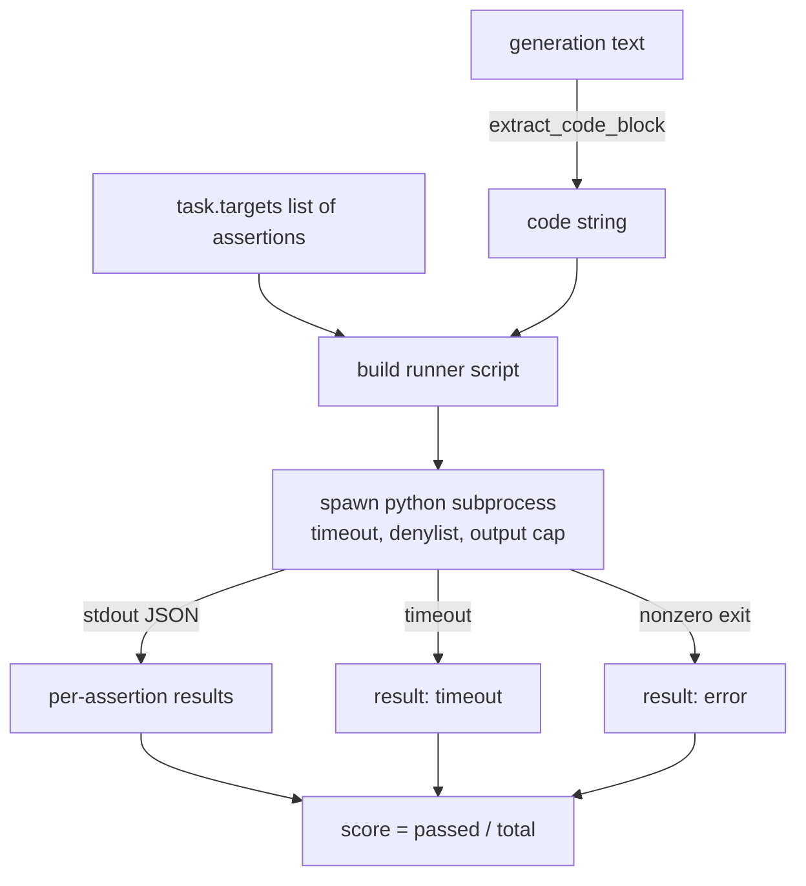
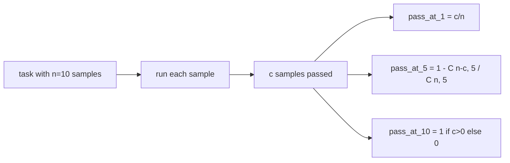

# Kod Yürütme Metriği

> Oluşturulan kod testleri geçtiğinde doğrudur. Değerlendirme donanımının kodu çıkartması, ana bilgisayarı çökertmeden çalıştırması ve geçiş oranlarını dürüstçe hesaplaması gerekir. Bu ders bu yüzeyi oluşturur.

**Tür:** Yapım
**Diller:** Python
**Önkoşullar:** Aşama 19 B Bölümü temelleri, dersler 70 ve 71
**Süre:** ~90 dk

## Öğrenme hedefleri

- Serbest biçimli bir nesilden bir kod bloğunu, 70. dersteki işlem sonrası kuralıyla eşleşecek şekilde çıkarın.
- Aday kodunu, duvar saati zaman aşımı, çıkış sınırı ve içe aktarma red listesiyle yalıtılmış bir alt süreçte yürütün.
- Adayın aleyhine geçen, sağlanan iddia dizelerinin oranı olarak bir görevi puanlayın.
- Tek bir modelden birden fazla nesli örnekleyen görevler için geçiş-k'yi hesaplayın.
- Koşucunun günlüğe kaydedebileceği farklı çıkış kodlarıyla sanal alan çökmelerini, sözdizimi hatalarını ve zaman aşımlarını birinci sınıf hata modları olarak değerlendirin.

## Neden yalıtılmış bir alt süreç

Satır içi `exec` bir güvenlik ve istikrar tehlikesidir. Oluşturulan bir `while True: pass` , değerlendirmeyi sonsuza kadar engeller. Oluşturulan bir `import shutil; shutil.rmtree('/')` tam olarak göründüğü kadar felakettir. Çözüm, aday başına yeni bir Python yorumlayıcısı oluşturmak, kodu stdin'e aktarmak, iddia sonuçlarını stdout'a yazmak ve taşması durumunda süreci sonlandırmaktır. Ana bilgisayar değerlendirme süreci çalışmaya devam ediyor.

HumanEval, MBPP, BigCodeBench ve LiveCodeBench gibi gerçek değerlendirmelerin tümü bir alt süreç sanal alanı kullanır. Üstte bir miktar Docker katmanı var. Alt süreçte durmamızın bir nedeni var: Taşınabilirdir, stdlib'dir ve eğitimsel değerlendirme için önemli olan başarısızlık türlerini yakalar. Üretim deployment'ler seccomp, ağ izolasyonu ve salt okunur bir dosya sistemi ekler. Sertleşmeyle ilgili bir sonraki ders bu yolun dışında yaşıyor.

## Code-exec görevinin şekli

Bir `code_exec` görevi, `targets` içindeki iddia dizelerini taşır. Koşucu, nesilden çitlerle çevrili bir kod bloğu çıkarır, etrafına bir test donanımı kurar ve sonucu çalıştırır.



Puan `[0, 1]` cinsinden bir kesirdir. İki geçişin 0,667 puan aldığı üç iddialı bir görev. Koşucu, ne başarısız olursa olsun aynı şekli döndürür: alt süreç çökmeleri, koşuma kadar köpüren bir Python geri izlemesiyle değil, normalleştirilmiş bir hata koduyla eşlenir.

## Red listesi

Red listesi içe aktarmaya dayalıdır. Aday kodu çalıştırmadan önce, koşucu betiği, tehlikeli modüllerin içe aktarımını `ImportError("denied")` yükselten bir saplamaya yeniden yazar. Liste kasıtlı olarak muhafazakardır: `os.system`, `subprocess`, `socket`, `requests`, `urllib`, `urllib.request`, `urllib.error`, `urllib.parse`, `ctypes`, `shutil`, `http.client`, `asyncio.subprocess`.

Bunun kurşun geçirmez olduğunu iddia etmiyoruz. Belirlenen rakip kod, Python'daki herhangi bir işlem içi sanal alandan kaçabilir. İnkar listesi bir geri adımdır. Duvar saati zaman aşımı ve çıkış kapağı, yük taşıyan kontrollerdir.

```python
DENIED = {
    "os.system": True,
    "subprocess": True,
    "socket": True,
    "shutil": True,
    "requests": True,
    "urllib": True,
    "ctypes": True,
}
```

Adayı, başına `import sys` ve yükseltmek için `os.system` maymun yamaları yapan bir koruma ekleyerek sarıyoruz. Şablonun tamamı `main.py` içindedir.

## Duvar saati zaman aşımı

Her alt süreç, üç duvar saati saniyelik varsayılan bir bütçe alır. Koşucu `subprocess.run(..., timeout=t)` kullanıyor. Zaman aşımı gerçekleşirse, koşucu `TimeoutExpired`'yi yakalar, süreci sonlandırır ve görev için bir `timeout` çıkış nedeni kaydeder. Bu görevin puanı sıfırdır. Koşucu yoluna devam ediyor.

Zaman aşımı, `task.metadata.timeout_s` aracılığıyla göreve göre yapılandırılabilir. Uzun süren birim testleri daha fazlasını isteyebilir; 70. dersteki doğrulayıcı, paketi sınırlı tutmak için değeri otuz saniyeyle sınırlıyor.

## Çıkış kapağı

Alt süreç, ana bilgisayar belleğini tüketerek stdout'a taşabilir. Koşucu stdout'u bir ara belleğe aktarır ve toplam toplam 256 KB'yi geçer geçmez çocuğu öldürür. Sonuç, `"output overflow"` ayrıntı dizisiyle `exit_code = error` olarak kaydedilir. Bu, bir neslin yanlışlıkla yazdırılan sonsuz bir döngü yazması durumunda pratikte ortaya çıkar.

## K'da geçiş

Pass-at-k, HumanEval ve arkadaşları tarafından kullanılan tarafsız tahmin edicidir. Görev başına `n` bağımsız örnek ve bunların `c` tanesinin başarılı olduğu göz önüne alındığında, `n` 'den `k` boyutunda bir örneğin en az bir geçiş çözümü içerme olasılığı:

```
pass_at_k(n, c, k) = 1 - C(n - c, k) / C(n, k)
```

`n - c < k` olduğunda pay tanımsızdır ve değer `1`'dir. Uygulama uç durumu doğrudan ele alır. 74. derste skor tablosu katmanı tarafından kullanılmak üzere `pass_at_k(n, c, k)` 'yi kullanıma sunuyoruz.



## Çıkış kodları

Koşucu, görev başına beş sonuçtan birini döndürür:

- `pass` her iddia geçtiğinde.
- `assertion_fail` kod çalıştırıldığında ancak en az bir onaylama işlemi başarısız olduğunda.
- Kod içe aktarılmadığında veya SyntaxError hatasına sahip olduğunda `syntax_error` .
- Duvar saatinin süresi dolduğunda `timeout` .
- Reddedilenler listesi isabetleri ve çıktı taşması da dahil olmak üzere diğer tüm kilitlenmeler için `error` (ayrıntılı `"output overflow"` içeren taşma yüzeyleri).

Skor hâlâ çok küçük. Çıkış kodu meta veridir. Aşağı akış dersleri, zaman aşımının sıfır olarak mı yoksa eksik veri olarak mı sayılacağına karar verebilir.

## Bu ders ne yapmaz

Size gerçek bir sanal alan sağlamaz. Açık webden güvenilmeyen kod çalıştırmaz. Dosya G/Ç veya ağ çağrıları gibi durum bilgisi olan görevleri yerine getirmez. Bunların bir konteynere veya mikroVM'ye ihtiyacı var. Bu dersin amacı sözleşmedir: yalıtılmış bir alt süreç, bir reddetme listesi, bir zaman aşımı, bir çıktı sınırı, temiz bir çıkış kodu sözlüğü ve geçiş-at-k matematiği.

## Kod nasıl okunur

`main.py` , `extract_code`, `run_candidate`, `score_code_exec` ve `pass_at_k`'yi tanımlar. Alt süreç çalıştırıcısı betiği bir dize olarak oluşturulur ve yeni bir Python yorumlayıcısına `-c` olarak aktarılır. `code/tests/test_exec.py` 'daki testler, HumanEval tarzından alınan çalışılmış örneklere karşı dört çıkış kodunun yanı sıra pass-at-k'yi uygular.

`main.py` 'u yukarıdan aşağıya doğru okuyun. Yolluk şablonu taşıyıcı parçadır. Ana işleme geri yazdığı JSON zarfını tahmin edene kadar iddia döngüsüne bakın.

## Daha ileri gidiyoruz

Alt süreç şekli çalıştığında bir sonraki endişe taşınabilirliktir. Farklı Python sürümleri SIGKILL'i Windows'ta farklı şekilde işler. En temiz düzeltme, koşucuyu Docker görüntüsüne yerleştirmektir. Bundan sonraki adım, değerlendirmenin üretim CI'sının yaptığıyla eşleşmesi için iddia dizelerini gerçek birim test dosyalarıyla değiştirmektir. Bu noktada iddia dizesi testlerini çağırmayı bırakın; bunlar oyuncak testleridir ve oyuncak arıza modları vardır.
