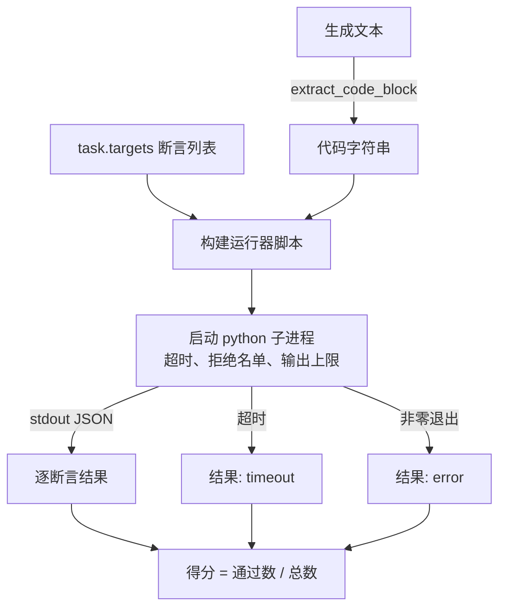

# 代码执行指标 Code Exec Metric

> 生成的代码只要能通过测试就是正确的。评估框架需要提取代码、在不搞崩宿主环境的前提下执行它，并诚实统计通过率。本节课构建这一层能力。

**类型：** 构建
**语言：** Python
**前置要求：** 第 19 阶段 Track B 基础，第 70 课和第 71 课
**时长：** ~90 分钟

## 学习目标

- 以匹配第 70 课后处理规则的方式，从自由形式的生成内容中提取代码块。
- 在隔离的子进程中执行候选代码，设置墙钟超时、输出上限和导入拒绝名单。
- 将任务的得分计算为提供的断言字符串中通过的比例。
- 对从一个模型采样多个生成结果的任务计算 pass-at-k。
- 将沙箱崩溃、语法错误和超时作为一等失败模式处理，并赋予运行器可记录的独立退出码。

## 为什么用隔离子进程

内联 `exec` 既存在安全风险，也存在稳定性风险。生成的 `while True: pass` 会永远阻塞评估。生成的 `import shutil; shutil.rmtree('/')` 的破坏性正如其字面意思那样。解决办法是：为每个候选代码启动一个全新的 Python 解释器，通过 stdin 传入代码，将断言结果写入 stdout，如果进程超时就杀死它。宿主评估进程则继续运行。

像 HumanEval、MBPP、BigCodeBench 和 LiveCodeBench 这样的真实评估框架都使用子进程沙箱。有些会在上层叠加 Docker。我们停在子进程这一层是有原因的：它可移植、属于标准库，并且能捕获对教育评估而言重要的失败模式。生产部署会额外添加 seccomp、网络隔离和只读文件系统。下一节关于加固的内容不在本 Track 的范围内。

## 代码执行任务的结构

一个 `code_exec` 任务在 `targets` 中携带断言字符串。运行器从生成内容中提取围栏代码块，构建测试框架，然后执行结果。



得分是一个 `[0, 1]` 区间的小数。三个断言通过两个的任务得分为 0.667。无论什么失败，运行器都返回相同的形式：子进程崩溃会被映射为标准化错误码，而不是让 Python 回溯冒泡到框架中。

## 拒绝名单

拒绝名单基于导入。在运行候选代码之前，运行器脚本会将危险模块的导入重写为一个桩函数，该桩函数抛出 `ImportError("denied")`。该名单有意保持保守：`os.system`、`subprocess`、`socket`、`requests`、`urllib`、`urllib.request`、`urllib.error`、`urllib.parse`、`ctypes`、`shutil`、`http.client`、`asyncio.subprocess`。

我们并不声称这是万无一失的。具有对抗性的恶意代码可以逃脱 Python 中的任何进程内沙箱。拒绝名单只是一道后手防线。墙钟超时和输出上限才是真正承重的控制措施。

```python
DENIED = {
    "os.system": True,
    "subprocess": True,
    "socket": True,
    "shutil": True,
    "requests": True,
    "urllib": True,
    "ctypes": True,
}
```

我们通过在候选代码前预置 `import sys` 和一个将 `os.system` 猴子补丁为抛出的守卫来包装它。完整模板在 `main.py` 中。

## 墙钟超时

每个子进程的默认预算为三秒钟墙钟时间。运行器使用 `subprocess.run(..., timeout=t)`。如果超时触发，运行器捕获 `TimeoutExpired`，杀死进程，并将该任务的退出原因记录为 `timeout`。该任务得分为零。运行器继续下一个任务。

超时时间可通过 `task.metadata.timeout_s` 按任务配置。长时间运行的单元测试可以要求更多时间；第 70 课的验证器将该值上限设为 30 秒，以保持测试集有界。

## 输出上限

子进程可能会大量输出 stdout，耗尽宿主内存。运行器将 stdout 流式读入缓冲区，并在累计总量超过 256 KB 时立即杀死子进程。结果记录为 `exit_code = error`，详情字符串为 `"output overflow"`。这在实践中通常出现在生成内容意外写出了带有打印语句的死循环时。

## Pass-at-k

Pass-at-k 是 HumanEval 等评估框架使用的无偏估计量。对于每个任务的 `n` 个独立样本，其中 `c` 个通过，从 `n` 个样本中抽取大小为 `k` 的样本至少包含一个通过解的概率为：

```
pass_at_k(n, c, k) = 1 - C(n - c, k) / C(n, k)
```

当 `n - c < k` 时分子未定义，值为 `1`。实现直接处理了这一边界情况。我们暴露 `pass_at_k(n, c, k)` 供第 74 课的排行榜层使用。

```mermaid
flowchart LR
    A[任务有 n=10 个样本] --> B[执行每个样本]
    B --> C[c 个样本通过]
    C --> D[pass_at_1 = c/n]
    C --> E[pass_at_5 = 1 - C(n-c,5) / C(n,5)]
    C --> F[pass_at_10 = 1 若 c>0 否则 0]
```

## 退出码

运行器对每个任务返回以下五种结果之一：

- `pass` —— 每个断言都通过。
- `assertion_fail` —— 代码运行了，但至少有一个断言失败。
- `syntax_error` —— 代码未能导入或存在 SyntaxError。
- `timeout` —— 墙钟时间耗尽。
- `error` —— 其他任何崩溃，包括命中拒绝名单和输出溢出（溢出时详情为 `"output overflow"`）。

得分仍然是一个小数。退出码是元数据。后续课程可以自行决定是将超时计为零分还是缺失数据。

## 本节课没有涵盖的内容

它不会给你一个真正的沙箱。它不运行来自开放网络的不可信代码。它不处理有状态的任务，如文件 I/O 或网络调用。那些需要容器或微虚拟机。本节课的重点是这个契约：一个隔离的子进程、一个拒绝名单、一个超时、一个输出上限、一套干净的退出码词汇表，以及 pass-at-k 的数学计算。

## 如何阅读代码

`main.py` 定义了 `extract_code`、`run_candidate`、`score_code_exec` 和 `pass_at_k`。子进程运行器脚本被构建为一个字符串，并通过 `-c` 参数传递给一个新的 Python 解释器。`code/tests/test_exec.py` 中的测试针对 HumanEval 风格的示例，对四种退出码和 pass-at-k 进行了验证。

从上到下阅读 `main.py`。运行器模板是承重部分。仔细审视断言循环，直到你能预测它写回父进程的 JSON 信封格式。

## 进一步探索

一旦子进程架构运行正常，下一个关注点是可移植性。不同 Python 版本在 Windows 上处理 SIGKILL 的方式不同。最干净的解决方案是将运行器放入 Docker 镜像中。在那之后，下一步是用真实的单元测试文件替换断言字符串，使评估与生产 CI 的工作方式一致。到那时就不要再把断言字符串称为测试了；它们只是玩具测试，具有玩具级别的失败模式。
