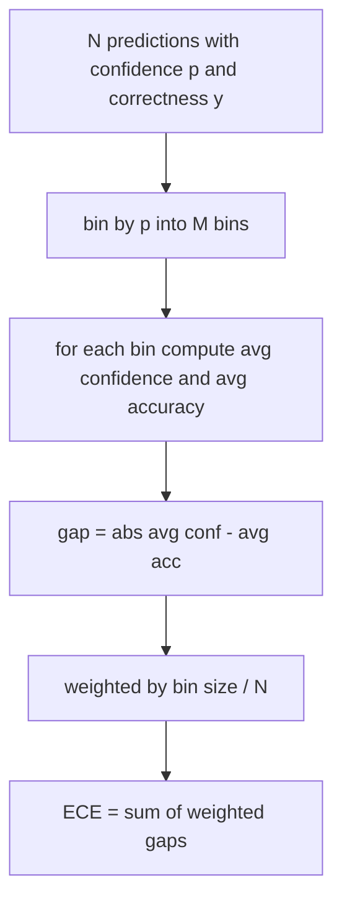
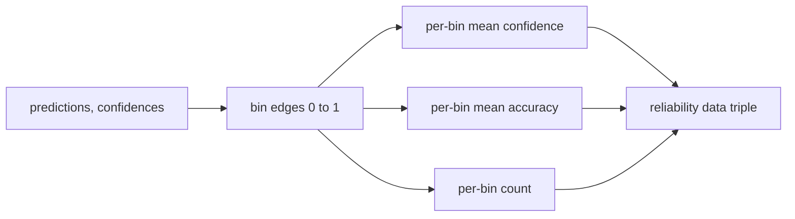

# Şaşkınlık ve Kalibrasyon

> Modeliniz bin yanıtta yüzde 90 kendinden emin olduğunu söylüyor ve altı yüz doğru alıyorsa, iyi kalibre edilmemiş demektir. Kalibrasyon güvenilir değerlendirmenin yarısıdır. Diğer yarısı ise modelin uzatılan metnin makul olup olmadığını size bildiren şaşkınlıktır.

**Tür:** Yapım
**Diller:** Python
**Önkoşullar:** Aşama 19 B Bölümü temelleri, dersler 70 ve 71
**Süre:** ~90 dk

## Öğrenme hedefleri

- Model bağdaştırıcısı tarafından sağlanan token negatif günlük olasılıklarından, uzatılmış bir derlem üzerinde token düzeyindeki karışıklığı hesaplayın.
- Bir sınıflandırıcının beklenen kalibrasyon hatasını (ECE) veya ikili tahmin olasılıklarından çoktan seçmeli değerlendirmeyi hesaplayın.
- Brier puanını hesaplayın (doğruluk göstergesine karşı ortalama hatanın karesi) ve ECE'nin yapmadığını ne zaman yaptığını açıklayın.
- Güven-doğruluk eğrisini çizmek için gereken güvenilirlik diyagramı verilerini oluşturun.
- Koşucunun bir model raporuna `perplexity`, `ece` ve `brier` numaralarını ekleyebilmesi için üçünü de değerlendirme donanımına bağlayın.

## Şaşkınlık sana ne söylüyor

Şaşkınlık, token başına üstelleştirilmiş ortalama negatif log-olasılığıdır. Daha düşük olması daha iyidir. Bir'lik bir şaşkınlık, modelin her gerçek token'a bir olasılık atadığı anlamına gelir. Kelime dağarcığının büyüklüğünün karışıklığı, modelin tekdüze olduğu ve hiçbir şey öğrenmediği anlamına gelir. Gerçek sayılar bu ikisinin arasında kalıyor: WikiText-103'teki güçlü 2026 temel modeli sekiz ile on iki arasında yer alıyor. Aynı metindeki kötü bir yazı elli artı değerindedir.

Kablo demeti log olasılıklarını kendisi hesaplamaz. Bunlar model adaptöründen geliyor. Kablo demeti toplanır: token günlük olasılıklarının bir listesini, dizi başına token sayımlarının bir listesini alır ve derlem karışıklığını döndürür.

```python
def perplexity(neg_log_probs, token_counts):
    total_nll = sum(neg_log_probs)
    total_tokens = sum(token_counts)
    return math.exp(total_nll / total_tokens)
```

Uygulama sıfır-token kenar durumlarını ele alır ve negatif log olasılıklarının negatif olmadığını ileri sürer. Olumsuzlamayı unutmak yaygın bir hatadır: `-log p` yerine `log p` döndüren bir bağdaştırıcı, birin altında bir şaşkınlık yaratır ki bu imkansızdır. İşlev bunu bir sözleşme ihlali olarak algılar.

## EÇE neleri ölçer

Beklenen kalibrasyon hatası, tahminleri güvenlerine göre sabit sayıda kutuya gruplandırır, ardından kutu boyutuna göre ağırlıklandırılmış olarak kutular arasındaki güven ve doğruluk arasındaki ortalama boşluğu ölçer.



Standart formülasyon, `[0, 1]` üzerinde on eşit genişlikte bölme kullanır. Uygulama herhangi bir pozitif tamsayı sayısını destekler. Koşucunun yayınlama kuralı (10) ile karşılaştırma kuralı (15) arasında seçim yapabilmesi için bir `bins` parametresini açığa çıkarıyoruz.

ECE, kutu sayısı ve örnek boyutuna göre önyargılıdır. On kutu ve yüz tahminle 0,02 ECE'yi rastgele gürültüden ayırt edemezsiniz. Uygulama, ECE ile birlikte doldurulmuş kutu sayısını döndürür, böylece koşucu çok az örnek için tek bir sayı bildirmeyi reddedebilir.

## ECE'nin yapamadığı Brier puanı nedir

ECE yalnızca ortalama farklarla ilgilenir. Siloların yarısına aşırı güvenen, diğer yarısına ise az güvenen bir model, yerel olarak zayıf kalibre edilmiş olmasına rağmen düşük ECE'ye sahip olabilir. Brier puanı, tahmin başına gerçek sonuca göre hatanın karesini ölçer, dolayısıyla yayılmayı doğrudan cezalandırır.

İkili sonuçlar için Brier `mean((p_i - y_i)^2)`'dır. Güvenilirlik, çözünürlük ve belirsizlik olarak ayrışır. Skoru ve ayrıştırmayı hesaplıyoruz. Koşucu skaleri bildirir ancak gösterge tablosu için ayrıştırmayı günlüğe kaydeder.

```python
def brier(p, y):
    return float(np.mean((p - y) ** 2))
```

## Güvenilirlik diyagramı verileri

Bir güvenilirlik diyagramı, her bir kutudaki ampirik doğruluğa karşı tahmin edilen güveni gösterir. Çapraz mükemmel kalibrasyondur. İşlev üç dizi döndürür: kutu başına ortalama güven, kutu başına ortalama doğruluk ve kutu başına sayım. Çizim kodu aşağı yönde yaşar; Bu ders veri şekli üzerinde durmaktadır.



Döndürülen demet, çağıran katmanın çizimi çizmesi veya özel bir ECE değişkenini (uyarlanabilir ECE, süpürme ECE, vb.) hesaplaması için ihtiyaç duyduğu şeydir. Aşağı akış kodunun dönüştürülmesine gerek kalmaması için numpy dizileri döndürüyoruz.

## Güven kaynakları

Emniyet kemeri, güvenin softmax'tan geldiğini varsaymaz. Tahmin başına `[0, 1]` cinsinden herhangi bir sayıyı kabul eder. Çoktan seçmeli görevler için doğal güven `softmax over option log-likelihoods`'dir. Serbest metin için doğal güven, modelin kendi bildirdiği olasılık veya ortalama log olasılığının üstel değeridir. Eval sadece sayıyı tüketir. Nereden geldiği adaptörün işidir.

## Kenar kasaları

- Tüm tahminler yanlış: ECE ortalama güvendir, Brier yüksektir, şaşkınlık ise modelin metin hakkında ne düşündüğüdür.
- Tüm tahminler yüksek güvenle doğru: ECE sıfıra yakın, Brier sıfıra yakın.
- P=0,5'te tamamen belirsiz öngörücü: ECE 0,5 eksi doğruluktur, Brier ise 0,25 eksi bir düzeltme terimidir.
- Boş giriş: ECE, Brier ve güvenilirlik dönüşü `0.0` (veya sıfır dolu diziler). Şaşkınlık, sıfır-token durumu için `NaN` değerini döndürür. Bu yolların hiçbiri uyarı vermez; koşucu değerleri inceler ve rapor edip etmeyeceğine veya atlayacağına karar verir.

Bu vakalar testlere dahil edilir. Gerçek bir benchmark üzerindeki gerçek bir model onlara çarpmayacaktır, ancak hatalı bir adaptör veya küçük bir örnek çarpacaktır ve koşucunun çarpmaması gerekir.

## Sevk etmek

Kalibrasyon, F1 gibi göreve özel bir ölçüm değildir. Her modele özel bir rapordur. Koşucu tüm değerlendirme boyunca `(confidence, correct)` çiftini biriktirir ve ECE, Brier ve güvenilirlik verilerini bir kez hesaplar. Şaşkınlık, görev bazında puanlamadan ayrı olarak, uzatılmış bir metin külliyatı üzerinden hesaplanır.

Arayüz:

```python
report = CalibrationReport.from_predictions(confidences, correct)
report.ece          # float
report.brier        # float
report.reliability  # tuple of three numpy arrays
report.populated_bins  # int
```

`PerplexityResult.from_token_nll(neg_log_probs, token_counts)` , token başına karışıklığı ve ortalama negatif log olasılığını döndürür.

## Bu ders ne yapmaz

Bir model çağırmaz. Softmax'ı uygulamaz. tokens çıkışından elde edilen güveni tahmin etmez; bu adaptörün işidir. Sıcaklık ölçeklendirmesi veya Platt ölçeklendirmesi yapmaz; bunlar farklı bir derste yaşayan post-hoc düzeltmelerdir. Bu dersin amacı üç sayıyı (şaşkınlık, ECE, Brier) güvenilir ve tekrarlanabilir kılmaktır.

## Kod nasıl okunur

`main.py` , `perplexity`, `expected_calibration_error`, `brier_score`, `reliability_diagram` ve `CalibrationReport` / `PerplexityResult` veri sınıflarını tanımlar. Demo, temel gerçeğin bilindiği sentetik tahminler üzerinde çalışıyor: iyi kalibre edilmiş bir model, kendine aşırı güvenen bir model ve kendine az güvenen bir model. `code/tests/test_calibration.py` 'deki testler her uç durumu artı sentetik tahminciler için referans değerlerini sabitler.

`main.py` 'u yukarıdan aşağıya doğru okuyun. Fonksiyon sıralaması raporlamak için skalerden vektöre gider. Her fonksiyonun matematik ve sözleşmeyi içeren kısa bir dokümanı vardır.

## Daha ileri gidiyoruz

Kalibrasyon, yayınlanan değerlendirmelerde en çok göz ardı edilen eksendir. Çoğu skor tablosu tek bir doğruluk numarası bildirir ve bunu tamam olarak adlandırır. Doğruluk açısından kazanan ve Brier konusunda kaybeden bir model, doğruluk açısından birkaç puan daha düşük puan alan ancak belirsizliğini güvenilir bir şekilde bildiren bir modelden daha kötü bir üretimdir deployment. Kalibrasyon tesisatını yerleştirdikten sonra, uzatılmış bir doğrulama dilimine sıcaklık ölçeklendirmesi ekleyin, ECE'yi yeniden hesaplayın ve boşluğun daralmasını izleyin. Bu ayrı bir ders ama zemin burada yaşıyor.
