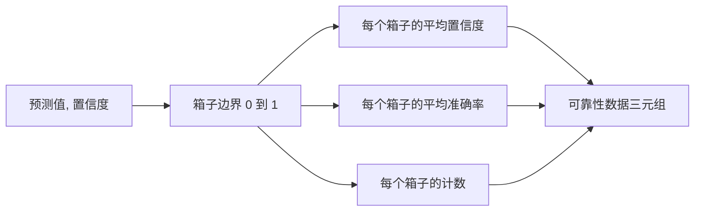

# 困惑度与校准

> 如果你的模型在一千个答案上声称 90% 的置信度，却只答对了六百个，那它就没有得到良好的校准。校准是可信评估的一半。另一半是困惑度，它告诉你模型是否认为保留文本在整体上是合理的。

**类型：** 构建
**语言：** Python
**前置要求：** 阶段 19 Track B 基础课程，第 70 课和第 71 课
**时长：** ~90 分钟

## 学习目标

- 根据模型适配器提供的逐 token 负对数概率，计算保留语料库上的 token 级困惑度。
- 根据分箱后的预测概率，计算分类器或多选评估的期望校准误差（ECE）。
- 计算 Brier 分数（相对于正确性指示符的均方误差），并解释它在哪些情况下能弥补 ECE 的不足。
- 构建绘制置信度-准确率曲线所需的可靠性图数据。
- 将所有三个指标接入评估框架，使运行器能够将 `perplexity`、`ece` 和 `brier` 指标附加到模型报告中。

## 困惑度告诉了你什么

困惑度是每个 token 的平均负对数似然的指数。越低越好。困惑度为 1 意味着模型对每个实际 token 都分配了概率 1。困惑度等于词汇表大小意味着模型是均匀分布的且什么都没学到。实际数值介于两者之间：一个强大的 2026 年基础模型在 WikiText-103 上的困惑度大约在 8 到 12 之间。同一个文本上表现差的模型则达到 50 以上。

评估框架本身不计算对数概率。这些由模型适配器提供。评估框架负责聚合：它接收逐 token 的对数概率列表、每个序列的 token 计数列表，然后返回语料库困惑度。

```python
def perplexity(neg_log_probs, token_counts):
    total_nll = sum(neg_log_probs)
    total_tokens = sum(token_counts)
    return math.exp(total_nll / total_tokens)
```

实现中处理了零 token 的边界情况，并断言负对数概率是非负的。一个常见错误是忘记取负：适配器返回 `log p` 而不是 `-log p` 会导致困惑度小于 1，这是不可能的。该函数将其捕获为契约违反。

## ECE 衡量什么

期望校准误差将预测结果按其置信度分组到固定数量的箱子中，然后衡量每个箱子的置信度与准确率之间的平均差距，并按箱子大小加权。

```mermaid
flowchart TD
    A[具有置信度 p 和正确性 y 的 N 个预测] --> B[按 p 分入 M 个箱子]
    B --> C[对每个箱子计算平均置信度和平均准确率]
    C --> D[差距 = abs(平均置信度 - 平均准确率)]
    D --> E[按箱子大小 / N 加权]
    E --> F[ECE = 加权差距之和]
```

标准公式在 `[0, 1]` 上使用十个等宽箱子。实现支持任意正整数计数。我们暴露了一个 `bins` 参数，以便运行器可以在发布惯例（10）和比较惯例（15）之间选择。

ECE 受箱子数量和样本量的影响而有偏差。使用十个箱子和一百个预测时，你无法将 0.02 的 ECE 与随机噪声区分开来。实现会返回已填充的箱子数量以及 ECE，以便运行器在样本太少时拒绝报告单一数字。

## Brier 分数能做到而 ECE 做不到的

ECE 只关心平均差距。一个在半数箱子上过度自信而在另一半箱子上信心不足的模型，可能具有较低的 ECE，但局部校准很差。Brier 分数衡量每个预测相对于真实结果的平方误差，因此它直接惩罚离散度。

对于二分类结果，Brier 为 `mean((p_i - y_i)^2)`。它可以分解为可靠性、分辨率和不确定性三个部分。我们计算分数及其分解结果。运行器报告标量值，但将分解结果记录到仪表板。

```python
def brier(p, y):
    return float(np.mean((p - y) ** 2))
```

## 可靠性图数据

可靠性图将预测置信度与每个箱子中的经验准确率进行对比绘制。对角线表示完美校准。该函数返回三个数组：每个箱子的平均置信度、每个箱子的平均准确率和每个箱子的计数。绘图代码位于下游；本课程只讲到数据形状这一层。



返回的元组是调用层绘制图形或计算自定义 ECE 变体（自适应 ECE、扫描 ECE 等）所需的全部数据。我们返回 numpy 数组，这样下游代码无需再进行转换。

## 置信度来源

评估框架不假设置信度来自 softmax。它接受每个预测的 `[0, 1]` 范围内的任意数值。对于多选任务，自然的置信度是 `softmax over option log-likelihoods`。对于自由文本，自然的置信度是模型自我报告的概率或平均对数似然的指数。评估只消费这个数值。它来自哪里是适配器的工作。

## 边界情况

- 所有预测都错误：ECE 等于平均置信度，Brier 较高，困惑度取决于模型对文本的看法。
- 所有预测都正确且置信度高：ECE 接近零，Brier 接近零。
- 完全不确定的预测器，p=0.5：ECE 为 0.5 减去准确率，Brier 为 0.25 减去一个修正项。
- 空输入：ECE、Brier 和可靠性返回 `0.0`（或零填充数组）。困惑度在零 token 情况下返回 `NaN`。这些路径都不会发出警告；运行器检查这些值并决定是报告还是跳过。

这些情况都已写入测试中。真实模型在真实基准上不会遇到它们，但一个有缺陷的适配器或一个极小的样本集可能会遇到，运行器不应崩溃。

## 调度

校准不像 F1 那样是每个任务的指标。它是每个模型的报告。运行器在整个评估过程中累积 `(置信度, 正确性)` 对，然后一次性计算 ECE、Brier 和可靠性数据。困惑度是在一个保留的文本语料库上计算的，与逐任务评分分开。

接口如下：

```python
report = CalibrationReport.from_predictions(confidences, correct)
report.ece          # float
report.brier        # float
report.reliability  # tuple of three numpy arrays
report.populated_bins  # int
```

`PerplexityResult.from_token_nll(neg_log_probs, token_counts)` 返回困惑度和每个 token 的平均负对数似然。

## 本课程不涉及的内容

本课程不调用模型。不实现 softmax。不根据输出 token 估计置信度——那是适配器的工作。不进行温度缩放或 Platt 缩放——那些是后处理修正，属于另一门课程。本课程的重点是让这三个数值（困惑度、ECE、Brier）可信且可复现。

## 如何阅读代码

`main.py` 定义了 `perplexity`、`expected_calibration_error`、`brier_score`、`reliability_diagram` 以及 `CalibrationReport` / `PerplexityResult` 数据类。演示在合成预测上运行，其真实结果是已知的：一个良好校准的模型、一个过度自信的模型和一个信心不足的模型。`code/tests/test_calibration.py` 中的测试覆盖了每个边界情况以及合成预测器的参考值。

从头到尾阅读 `main.py`。函数的顺序是从标量到向量再到报告。每个函数都有一个简短的文档字符串，包含数学公式和契约。

## 拓展阅读

校准是已发表评估中最被忽视的维度。大多数排行榜报告一个单一的准确率数字就结束了。一个在准确率上获胜但在 Brier 分数上失利的模型，在生产部署中比一个准确率低几分但能可靠报告其不确定性的模型更差。一旦你搭建好校准的基础设施，就在一个保留的验证集上添加温度缩放，重新计算 ECE，观察差距的缩小。那是另一门课程的内容，但基础就在这里。
