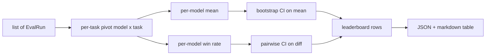
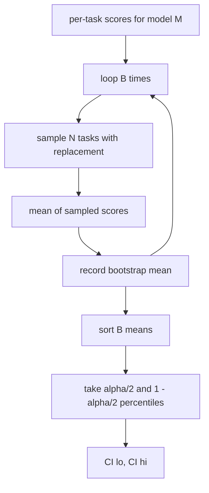

# Skor Tablosu Toplama

> Görev başına puanlar kolaydır. Heterojen görevler arasında model başına sıralamalar daha zordur. Bin tahminli skor tablosunda istatistiksel önem herkesin atladığı kısımdır. Bu ders onu atlamaz.

**Tür:** Yapım
**Diller:** Python
**Önkoşullar:** Aşama 19 B Bölümü temelleri, dersler 70, 71, 73
**Süre:** ~90 dk

## Öğrenme hedefleri

- Birden fazla modeldeki ve birden fazla görevdeki görev başına puanları, model başına düzenli bir satırda toplayın.
- Geçiş oranlarının ve BLEU değerlerinin toplamı aşırı etkilememesi için heterojen puanları normalleştirin.
- Modelleri ortalamaya ve kazanma oranına göre sıralayın ve her birinin doğru özet olduğunu açıklayın.
- Model başına ortalama puan ve ikili farklar üzerinden önyükleme güven aralıklarını hesaplayın.
- Skor tablosunu bir JSON raporu olarak ve 75. dersteki koşucunun bir CI yorumuna yapıştırabileceği bir işaretleme tablosu olarak çıktılayın.

## Giriş şekli

Toplayıcı, `EvalRun` kaydının bir listesini tüketir:

```python
@dataclass
class EvalRun:
    model_id: str
    task_id: str
    metric_name: str
    score: float          # in [0, 1]
    category: str
```

75. dersteki koşucu, `(model, task)` çifti başına bir kayıt yayınlar. Toplayıcı, puanın nasıl üretildiğiyle ilgilenmez. Normalleşmenin zaten gerçekleşmiş olmasını bekliyor: her puan `[0, 1]` cinsindendir.

## Çıktı

Üç tablo çıkıyor:



Skor tablosu satırı şunları içerir: `model_id`, `mean_score`, `mean_ci_lo`, `mean_ci_hi`, `win_rate`, `tasks_completed` ve kategori başına ortalama için isteğe bağlı bir `categories` haritası.

## Normalleştirme

Eğer bir görev `[0, 1]` ve diğeri de `[0, 100]` puan alırsa, ikincisi sessizce ortalamaya hakim olur. Toplayıcı, her giriş puanının `[0, 1]` 'de bulunduğunu doğrular ve aksi takdirde çalışmayı reddeder. Düzeltme yukarı yönde çalışıyor: ölçüm zaten bir kesir döndürmelidir. 71'den 73'e kadar olan dersler bu sözleşmeyi uygular.

## Ortalama ve kazanma oranı

İki sıralama şeması farklı hedeflere hizmet eder.

Ortalama puan, bir model için görev başına puanların ortalamasıdır. Başlık numarası lider tabloları raporudur. Aykırı değerlere ve görev dengesizliğine karşı duyarlıdır.

Kazanma oranı, bir modelin aynı görevde diğer tüm modelleri ne sıklıkla yendiğini sayar. Her görev için en yüksek puanı alan model kazanır (berabereler bölünür). Kazanma oranı, kazançların modelin puan aldığı görev sayısına bölünmesiyle elde edilir. Aykırı değerlere ve ölçek farklılıklarına karşı daha az duyarlıdır ancak bilgi kaybeder.

```python
def win_rate(model_id, runs_by_task, all_models):
    wins, total = 0, 0
    for task_id, runs in runs_by_task.items():
        scores = {r.model_id: r.score for r in runs if r.model_id in all_models}
        if model_id not in scores:
            continue
        total += 1
        best = max(scores.values())
        if scores[model_id] >= best:
            wins += 1
    return wins / total if total else 0.0
```

Emniyet kemeri her ikisini de rapor ediyor. 75. dersteki koşucu ortalama olarak varsayılan olarak sıralanır; Kullanıcının tercih etmesi durumunda kazanma oranına ilişkin işaretleme sütunu tam oradadır.

## Önyükleme güven aralıkları

Model başına araçlar, görevler üzerinden önyükleme yeniden örneklemesi tarafından tahmin edilen bir güven aralığıyla birlikte gelir. Görev kimliklerini değiştirmeyle yeniden örnekliyoruz, yeniden örneklenen küme üzerinden ortalamayı hesaplıyoruz, `B` kez tekrarlıyoruz ve `alpha` seviyesindeki yüzdelik aralığını alıyoruz.



İkili karşılaştırmalar için görev başına farkı `score_A - score_B` önyükleriz, yüzdelik aralığını alırız ve rapor ederiz. Kullanıcı aralığın sıfırı hariç tutup tutmadığını okur. Eğer öyleyse, fark alfa düzeyinde önemlidir. Aksi takdirde sıralama tablosu modelleri berabere kalmış olarak değerlendirir.

Düşük seviyeli yardımcılar (`bootstrap_mean_ci`, `bootstrap_pairwise_diff`) varsayılan olarak `B=1000`'dır; genel toplayıcılar (`aggregate`, `pairwise_diffs`) varsayılan olarak `b=500` olarak ayarlanır, böylece demo ve testler hızlı kalır. Varsayılan alfa 0,05'tir. Ders, önyüklemeyi tamamen uyuşuk tutuyor, hiçbir şekilde scipy değil.

## Kategoriler

`EvalRun.category` ayarlanırsa toplayıcı ayrıca kategori başına ortalamayı da rapor eder. Bu, her skor tablosunda `math`, `reasoning`, `code`, `safety` yazan sütundur. Koşucunun, bir modelin genel olarak iyi olup olmadığını ancak kod açısından zayıf olup olmadığını tespit etmesini sağlar; bu, manşetin anlamının gizlediği bilgidir.

## İşaretleme oluşturma

Skor tablosu bir işaretleme tablosu olarak oluşturulur:

```text
| Rank | Model | Mean | 95% CI | Win rate | Tasks |
|------|-------|------|--------|----------|-------|
| 1    | gpt   | 0.78 | 0.74-0.82 | 0.62 | 50 |
| 2    | claude| 0.75 | 0.71-0.79 | 0.34 | 50 |
| 3    | random| 0.10 | 0.07-0.13 | 0.04 | 50 |
```

Tablo ortalama puana göre sıralanmıştır. CI iki ondalık basamağa dönüştürülür. Uzun model kimlikleri yirmi karaktere kısaltılmıştır.

## Bu ders ne yapmaz

Modelleri çalıştırmaz. Metrik katmanı çağırmaz. Uyarlanabilir ECE veya diğer kalibrasyon çeşitlerini uygulamaz; bunlar 73. derstir. Görev ağırlıklandırmayı uygulamaz. Burada her görev aynı sayılır. Üretim skor tablolarının ağırlık görevleri; bu kancayı `weight` alanı boyunca açık bırakıyoruz ancak toplayıcıda onu yok sayıyoruz. İhtiyacınız olursa bir takip dersinde ağırlık ekleyin.

## Kod nasıl okunur

`main.py` , `EvalRun`, `LeaderboardRow`, `aggregate`, `bootstrap_mean_ci`, `bootstrap_pairwise_diff` ve `render_markdown`'yi tanımlar. Demo, üç model ve on iki görevden oluşan sentetik bir paket oluşturur, birleştirir ve lider tablosu ile ikili fark tablosunu yazdırır. `code/tests/test_leaderboard.py` 'deki testler önyüklemeyi, işaretleme oluşturmayı, kazanma oranı uç durumlarını ve boş giriş davranışını sabitler.

`main.py` 'u yukarıdan aşağıya doğru okuyun. Veri şekli (EvalRun, LeaderboardRow) önce gelir, toplayıcı daha sonra, önyükleme üçüncü, oluşturma ise son sırada gelir. Her fonksiyonun odaklanmış bir sözleşmesi vardır.

## Daha ileri gidiyoruz

Doğal bir sonraki adım, eşleştirilmemiş önyükleme yerine eşleştirilmiş görev önemidir. A ve B modelinin her ikisi de aynı yüz görevi yürütüyorsa uygun test, uyguladığımız görev bazında farklılıklara ilişkin eşleştirilmiş önyüklemedir. Bunun ötesinde, görev ailelerine saygı duyan hiyerarşik bir önyükleme istiyorsunuz (matematik problemleri birbirinden bağımsız değildir; aritmetik hata modeli bunlardan on tanesini etkiler). Bu bir takiptir. Bu dersin amacı, değerlendirmenin savunabileceğiniz bir sayıyı rapor etmesi için zemini doğru bir şekilde oluşturmaktır.
