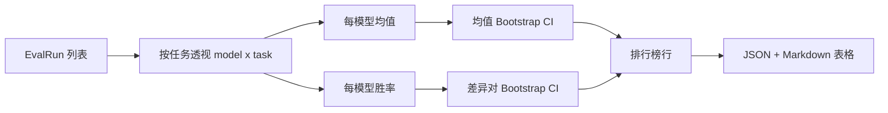
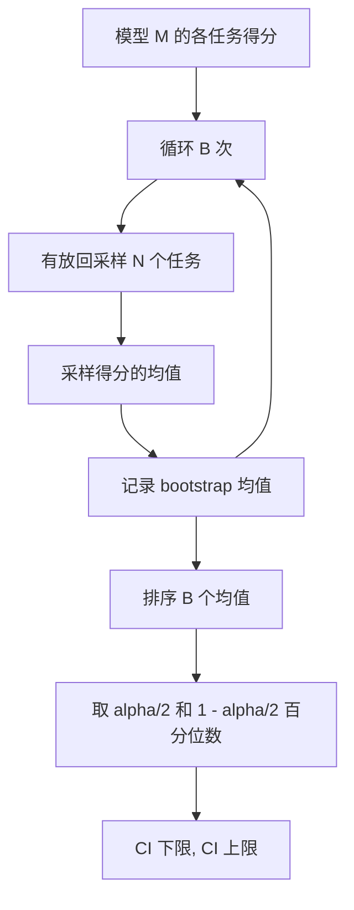

# 排行榜聚合

> 各任务得分很容易。跨异构任务对模型排名则更难。在一个包含上千预测的排行榜上统计显著性——这部分大家通常都跳过。本课不跳过。

**类型：** 构建  
**语言：** Python  
**前置要求：** 第 19 阶段 Track B 基础、第 70、71、73 课  
**时长：** ~90 分钟

## 学习目标

- 将多个模型在多个任务上的各任务得分聚合为整洁的每模型一行。
- 标准化异构得分，使通过率和 BLEU 值不会过度影响聚合结果。
- 按均值与胜率对模型排序，并解释何时使用哪种摘要更合适。
- 计算每个模型均值及两两差异的 Bootstrap 置信区间。
- 以 JSON 报告和 Markdown 表格的形式输出排行榜，供第 75 课的 runner 粘贴到 CI 评论中。

## 输入格式

聚合器接收一个 `EvalRun` 记录列表：

```python
@dataclass
class EvalRun:
    model_id: str
    task_id: str
    metric_name: str
    score: float          # 取值范围 [0, 1]
    category: str
```

第 75 课的 runner 为每个 `(model, task)` 对输出一条记录。聚合器不关心得分是如何产生的，它期望标准化已经完成：每个得分都在 `[0, 1]` 范围内。

## 输出结果

输出三张表：



排行榜行包含：`model_id`、`mean_score`、`mean_ci_lo`、`mean_ci_hi`、`win_rate`、`tasks_completed`，以及一个可选的按类别均值的 `categories` 映射。

## 标准化

如果一个任务得分在 `[0, 1]` 范围内，而另一个在 `[0, 100]` 范围内，后者会悄无声息地主导均值。聚合器会验证每个输入得分是否在 `[0, 1]` 范围内，否则拒绝运行。修复工作在上游：指标应已返回一个分数。第 71 到 73 课强制执行了这一约定。

## 均值与胜率

两种排序方案服务于不同目标。

**均值得分** 是一个模型在各任务上得分的平均值。这是排行榜报告的 headline 数字。它对异常值和任务不平衡比较敏感。

**胜率** 统计一个模型在同一任务上击败其他所有模型的频率。对于每个任务，得分最高的模型获胜（平局平分）。胜率等于获胜次数除以该模型有得分的任务数量。它对异常值和尺度差异不太敏感，但会丢失信息。

```python
def win_rate(model_id, runs_by_task, all_models):
    wins, total = 0, 0
    for task_id, runs in runs_by_task.items():
        scores = {r.model_id: r.score for r in runs if r.model_id in all_models}
        if model_id not in scores:
            continue
        total += 1
        best = max(scores.values())
        if scores[model_id] >= best:
            wins += 1
    return wins / total if total else 0.0
```

评测框架同时报告两者。第 75 课的 runner 默认按均值排序；胜率的 Markdown 列就在旁边，供用户按需取用。

## Bootstrap 置信区间

每个模型的均值都带有一个通过 Bootstrap 重采样（按任务）估计的置信区间。我们对任务 ID 进行有放回采样，计算重采样集上的均值，重复 `B` 次，然后取 `alpha` 水平上的百分位数区间。



对于两两比较，我们对每个任务的差值 `score_A - score_B` 做 bootstrap，取百分位数区间并报告出来。用户可以直接判断该区间是否包含零。如果不包含，则差异在 `alpha` 水平上显著；如果包含，排行榜将这两个模型视为平局。

底层辅助函数（`bootstrap_mean_ci`、`bootstrap_pairwise_diff`）默认 `B=1000`；公开的聚合器（`aggregate`、`pairwise_diffs`）默认 `b=500`，以便演示和测试保持快速。默认 `alpha` 为 0.05。本课保持 bootstrap 纯 numpy 实现，不依赖 scipy。

## 类别

如果设置了 `EvalRun.category`，聚合器还会报告按类别的均值。这就是每个排行榜上标有 `math`、`reasoning`、`code`、`safety` 的那一列。它让 runner 能够发现某个模型整体表现良好但在代码方面薄弱的情况——这些信息是 headline 均值所掩盖的。

## Markdown 渲染

排行榜以 Markdown 表格形式呈现：

```text
| 排名 | 模型   | 均值  | 95% 置信区间  | 胜率  | 任务数 |
|------|--------|-------|---------------|-------|--------|
| 1    | gpt    | 0.78  | 0.74-0.82     | 0.62  | 50     |
| 2    | claude | 0.75  | 0.71-0.79     | 0.34  | 50     |
| 3    | random | 0.10  | 0.07-0.13     | 0.04  | 50     |
```

表格按均值得分排序。置信区间保留两位小数。过长的模型 ID 会被截断到二十个字符。

## 本课不涉及的内容

本课不运行模型，不调用指标层，不实现自适应 ECE 或其他校准变体（这些在第 73 课），不实现任务加权。这里的每个任务权重相同。生产环境中的排行榜会对任务加权；我们通过 `weight` 字段留下扩展钩子，但在聚合器中忽略它。如果需要，可以在后续课程中添加加权功能。

## 如何阅读代码

`main.py` 定义了 `EvalRun`、`LeaderboardRow`、`aggregate`、`bootstrap_mean_ci`、`bootstrap_pairwise_diff` 和 `render_markdown`。demo 构建了一个包含三个模型和十二个任务的合成套件，进行聚合，然后打印排行榜及两两差异表。`code/tests/test_leaderboard.py` 中的测试对 bootstrap、Markdown 渲染、胜率边缘情况以及空输入行为进行了验证。

从头到尾阅读 `main.py`。首先是数据结构（EvalRun、LeaderboardRow），接着是聚合器，然后是 bootstrap，最后是渲染。每个函数都有明确的职责。

## 进一步探索

自然的下一步是用配对任务显著性代替非配对 bootstrap。如果模型 A 和模型 B 都运行了相同的 100 个任务，合适的检验方法是基于逐任务差异的配对 bootstrap——我们已经实现了这一点。更进一步，你可能需要分层 bootstrap，以尊重任务族（数学问题之间并非相互独立；一个算术错误模式可能影响其中的十个问题）。这是后续内容。本课的重点是把基础打牢，让评测报告给出一个你能够捍卫的数字。
