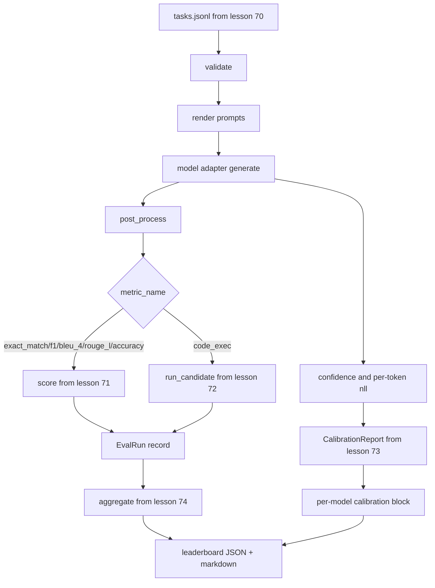

# Uçtan Uca Değerlendirme Koşucusu

> Beş ders sıhhi tesisat, bir ders yapıştırma. Koşucu 70. dersteki görev spesifikasyonunu okur, bir adaptör aracılığıyla bir modeli çağırır, 71. ve 72. dersleri puanlar, 73. dersteki kalibrasyon raporunu ekler ve 74. dersteki skor tablosunu yayınlar. Demo kendi kendine sona erer.

**Tür:** Yapım
**Diller:** Python
**Önkoşullar:** Aşama 19 B Bölümü temelleri, 70'den 74'e kadar dersler
**Süre:** ~90 dk

## Öğrenme hedefleri

- Küçük bir yöntem yüzeyi ile herhangi bir modelin (sahte, yerel, API) karşılayabileceği bir `ModelAdapter` arayüzü tanımlayın.
- Değerlendirmeyi, bir çalışan havuzunda paralel görev yürütme ile bir fikstür JSONL dosyası üzerinde çalıştırın.
- Metrik katmanını (exact_match, F1, BLEU-4, ROUGE-L, code_exec) kalibrasyon katmanıyla tek geçişte oluşturun.
- Model başına `EvalRun` kayıt yayınlayın ve bunları doğrudan skor tablosu toplayıcıya besleyin.
- Hem bir JSON raporunun hem de bir işaretleme tablosunun çıktısını alın; temiz çalıştırmada sıfır çıkışla, doğrulama veya çalışma zamanı arızasında sıfırdan farklı bir çıkışla kendi kendini sonlandırır.

## Boru hattı



Koşucu entegrasyon noktasıdır. 70'den 74'e kadar her ders, koşucunun oluşturduğu bir modüle sahiptir. Çalıştırıcı bu modüllerdeki herhangi bir mantığı kopyalamaz: onları içe aktarır.

## Adaptör arayüzü

Adaptör, koşucu ile herhangi bir model arasındaki dikiştir. Arayüz kasıtlı olarak küçüktür.

```python
class ModelAdapter:
    model_id: str

    def generate(self, prompt: str, task: TaskSpec) -> Generation: ...
```

`Generation` aşağıdaki özelliklere sahip bir veri sınıfıdır:

- `text`: modelin serbest biçimli çıktısı
- `confidence`: `[0, 1]` 'de modelin cevap için kendi bildirdiği olasılığını temsil eden bir kayan nokta
- `token_nll`: oluşturulan token'lar üzerinden negatif günlük olasılıklarının isteğe bağlı toplamı
- `token_count`: isteğe bağlı olarak oluşturulan token sayısı

Koşucudaki sahte adaptörler üç çeşit sağlar: `RuleBasedAdapter` (deterministik, mükemmele yakın), `NoisyAdapter` (aşırı güvenli, çoğu zaman yanlış) ve `BiasedAdapter` (bir kategoride iyi, diğerinde berbat). Demo, ders 70 fikstürünün üçünü de çalıştırıyor.

## Paralel yürütme

Çalıştırıcı, görevleri model başına paralel olarak çalıştırmak için `concurrent.futures.ThreadPoolExecutor` öğesini kullanır. Çalışan sayısı varsayılan olarak sekizden ve görev sayısından küçük olacaktır. Gerçek model çağrıları için darboğaz ağ G/Ç olduğundan iş parçacıkları yeterlidir. Code-exec yolu, görev içinde kendi alt sürecini oluşturur ve yürütücü yalnızca beklemeyi planlar.

Deterministik testler için, çalıştırıcı `run_eval(adapters, tasks, parallel=False)` 'yi ortaya çıkarır, böylece testler yürütme sırasını sabitleyebilir.

## Tek geçişli puanlama döngüsü

Her görev için:

1. prompt'u (birkaç çekim öneki artı prompt gövdesi) işleyin.
2. Bağdaştırıcıyı arayın ve aramanın zamanını belirleyin.
3. Oluşturmayı görevin kuralına göre son işlemden geçirin.
4. Metrik katmana gönderin.
5. Puan ve metrik meta verileriyle bir `EvalRun` kaydı oluşturun.
6. `(confidence, correct)` çiftini kalibrasyon arabelleğine ekleyin.

`correct` sinyali, tam eşleşme tarzı metrikler için `score >= 1.0` (`exact_match`, `accuracy`, `code_exec`) ve dereceli metrikler için `score >= 0.5` 'tır. Eşik `_correct_from_score` 'da bulunur ve koşucu genel bir geçersiz kılmayı açığa çıkarmaz.

## Toplama

Her görevin bir sonucu olduktan sonra, koşucu 74. dersten `aggregate` ve `pairwise_diffs` 'yi ve 73. dersten `CalibrationReport.from_predictions` 'yi çağırır. Çıktı tek bir JSON zarfıdır:

```json
{
  "leaderboard": [...],
  "pairwise": [...],
  "calibration": {
    "model_id_a": {"ece": 0.04, "brier": 0.10, "populated_bins": 8, ...},
    ...
  },
  "summary": {
    "tasks": 10,
    "models": 3,
    "wall_seconds": 1.2
  }
}
```

Koşucu ayrıca stdout'a bir işaretleme tablosu yazar, böylece kullanıcı sonucu bir PR incelemesine yapıştırabilir.

## Kendiliğinden sonlanan demo

Demo, 70. dersteki on fikstür görevi üzerinde üç sahte adaptör çalıştırıyor. Duvar süresi on saniyenin altında kalmalı. Temiz çalıştırmada çıkış kodu sıfırdır.

Temiz çalışma kriterleri şunlardır:

- Her görev 70. ders kapsamında doğrulandı.
- Her görev 71 ve 72. dersler kapsamında puanlanır.
- Kalibrasyon raporu ders 73 kapsamında hatasız olarak toplanmıştır.
- Sıralamada kural tabanlı bağdaştırıcı, rastgele bağdaştırıcının kesinlikle üzerinde yer aldı.

Bunlardan herhangi biri bozulursa koşucu, JSON zarfında yapılandırılmış bir hatayla sıfırdan farklı bir şekilde çıkar.

## Bu ders ne yapmaz

Gerçek bir model demiyor. Bir API anahtar akışı veya hız sınırı işleme uygulamaz. Akışı veya kısmi oluşturmayı uygulamaz; bağdaştırıcı çağrı başına bir nesil döndürür. Yeniden deneme veya önbelleğe alma işlemi yapmaz. Bu endişeler bağdaştırıcı katmanında mevcuttur; koşucu metrik-agnostik ve sağlayıcı-agnostiktir.

## Kod nasıl okunur

`main.py` entegrasyondur. Diğer beş ders modülünden bunları göreceli yolla çözen küçük bir `_load_sibling` yardımcı aracılığıyla içe aktarır. `Generation`, `EvalReport` ve `ModelAdapter` veri sınıfları yerel olarak tanımlanır. Sahte bağdaştırıcılar dosyanın altındadır.

`main.py` 'u yukarıdan aşağıya doğru okuyun. İçe aktarmalara göz atın, ardından `run_eval`'ye, ardından `_score_one`'ye ve ardından adaptörlere bakın. Sondaki demo giriş noktasıdır.

`code/tests/test_runner.py` 'daki testler adaptör arayüzünü, tek geçişli döngüyü, paralel-sıralı eşdeğerliği, kalibrasyon arabelleğini ve JSON zarf şeklini sabitler.

## Daha ileri gidiyoruz

Bu koşucu zemindir. Bir üretim değerlendirme sistemi şunu ekler: `(task_id, model_id, model_version)` tarafından anahtarlanan bir sonuç önbelleği, çalıştırma başına dolarları ve token'ları izleyen bir maliyet defteri, hız limitlerini geri alan bir yeniden deneme katmanı, geçişli görevler için bir örnekleme politikası ve uzun paketler için bir akış çıktı formatı. Bunların her biri, metrik veya toplama katmanlarını değiştirmeden koşucuyu saran tek bir endişedir. Bu ayrılık sözleşmenin amacıdır.

Taklitleri çalıştırdıktan sonra gerçek bir sağlayıcı için bir adaptör ekleyin. Ücretsiz seviyeli birini seçin, otuz satır yapıştırıcı yazın, skor tablosunun yanmasını izleyin. Daha sonra ikinci sağlayıcıyı ekleyin ve işi koşumun yapmasına izin verin.
