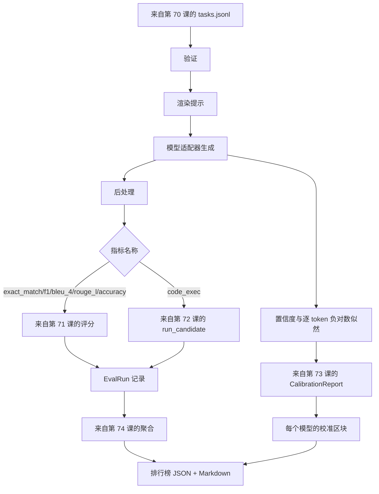

# 端到端评估运行器

> 五课管道铺设，一课将它们粘合。该运行器从第 70 课读取任务规范，通过适配器调用模型，使用第 71 课和第 72 课的指标进行评分，附加第 73 课的校准报告，并输出第 74 课的排行榜。演示程序运行完毕后自动退出。

**类型：** 构建
**语言：** Python
**前置条件：** 第 19 阶段 Track B 基础，第 70 至 74 课
**时长：** ~90 分钟

## 学习目标

- 定义一个 `ModelAdapter` 接口，任何模型（模拟、本地、API）只需少量方法即可满足该接口。
- 在包含工作线程池的并行任务执行环境中，对给定的 JSONL 测试数据文件运行评估。
- 将指标层（exact_match、F1、BLEU-4、ROUGE-L、code_exec）与校准层在一次遍历中组合。
- 输出每个模型的 `EvalRun` 记录，并直接馈送给排行榜聚合器。
- 输出 JSON 报告和 Markdown 表格；运行正常时以退出码 0 自动终止，验证或运行失败时以非零退出码终止。

## 管道结构



运行器是集成点。第 70 至 74 课各自拥有一个模块，由运行器组合使用。运行器不重复这些模块中的任何逻辑——它直接导入它们。

## 适配器接口

适配器是运行器与任何模型之间的接缝。该接口有意设计得足够小。

```python
class ModelAdapter:
    model_id: str

    def generate(self, prompt: str, task: TaskSpec) -> Generation: ...
```

`Generation` 是一个数据类，包含：

- `text`：模型的自由格式输出
- `confidence`：一个 `[0, 1]` 范围内的浮点数，表示模型自报的答案概率
- `token_nll`：可选，生成 token 的负对数似然之和
- `token_count`：可选，生成的 token 数量

运行器中的模拟适配器提供三种风格：`RuleBasedAdapter`（确定性，近乎完美）、`NoisyAdapter`（过度自信，经常出错）和 `BiasedAdapter`（在一个类别上表现良好，在另一个类别上表现极差）。演示程序会在第 70 课的测试数据上运行所有三种适配器。

## 并行执行

运行器使用 `concurrent.futures.ThreadPoolExecutor` 对每个模型并行执行任务。工作线程数默认为 8 与任务数两者中的较小值。线程已经足够，因为真实模型调用的瓶颈在于网络 I/O。code_exec 路径会在任务内部自建子进程，执行器仅负责调度等待。

对于确定性测试，运行器暴露 `run_eval(adapters, tasks, parallel=False)` 参数，以便测试可以固定执行顺序。

## 单遍评分循环

对每个任务：

1. 渲染提示（少样本前缀加提示正文）。
2. 调用适配器并计时。
3. 根据任务的规则对生成结果进行后处理。
4. 分发给指标层。
5. 构建包含分数和指标元数据的 `EvalRun` 记录。
6. 将 `(confidence, correct)` 对追加到校准缓冲区。

`correct` 信号对于精确匹配类指标（`exact_match`、`accuracy`、`code_exec`）为 `score >= 1.0`，对于分级指标为 `score >= 0.5`。该阈值定义在 `_correct_from_score` 函数中，运行器不暴露公共覆盖方法。

## 聚合

每个任务都有了结果后，运行器调用第 74 课的 `aggregate` 和 `pairwise_diffs`，以及第 73 课的 `CalibrationReport.from_predictions`。输出为一个 JSON 信封：

```json
{
  "leaderboard": [...],
  "pairwise": [...],
  "calibration": {
    "model_id_a": {"ece": 0.04, "brier": 0.10, "populated_bins": 8, ...},
    ...
  },
  "summary": {
    "tasks": 10,
    "models": 3,
    "wall_seconds": 1.2
  }
}
```

运行器还会将 Markdown 表格输出到标准输出，方便用户将结果粘贴到 PR 审查中。

## 自动终止的演示

演示程序在第 70 课的十条测试数据上运行三种模拟适配器。实际运行时间应控制在十秒以内。正常运行时退出码为零。

正常运行的判定标准：

- 每个任务均通过第 70 课的验证。
- 每个任务均通过第 71 课和第 72 课的评分。
- 校准报告在第 73 课中聚合且无错误。
- 排行榜中将基于规则的适配器严格排在随机适配器之上。

如果其中任何一项出现问题，运行器将以非零退出码退出，并在 JSON 信封中包含结构化的错误信息。

## 本课不涵盖的内容

本课不会调用真实模型。不实现 API 密钥流程或速率限制处理。不实现流式传输或部分生成；适配器每次调用只返回一次生成结果。不实现重试或缓存。这些关注点归属于适配器层；运行器本身与指标无关，也与提供者无关。

## 如何阅读代码

`main.py` 是集成入口。它通过一个小的 `_load_sibling` 辅助函数（按相对路径解析）从其他五个课程模块导入。数据类 `Generation`、`EvalReport` 和 `ModelAdapter` 在本地定义。模拟适配器位于文件底部。

从上到下阅读 `main.py`。先浏览导入部分，然后查看 `run_eval`，接着是 `_score_one`，最后是适配器。底部的演示是入口点。

`code/tests/test_runner.py` 中的测试覆盖了适配器接口、单遍循环、并行与串行的等价性、校准缓冲区以及 JSON 信封的结构。

## 扩展方向

这个运行器只是一个起点。一个生产级的评估系统还需要增加：以 `(task_id, model_id, model_version)` 为键的结果缓存、记录每次运行的美元和 token 成本台账、在遇到速率限制时退避的重试层、用于 pass-at-k 任务的采样策略，以及适用于长测试集的流式输出格式。这些每一个都是独立关注点，它们包裹运行器而不改变指标或聚合层。这种分离正是合约的意义所在。

在模拟适配器正常工作后，为真实的提供者添加适配器。选择一个有免费套餐的提供者，编写三十行胶水代码，然后看着排行榜亮起来。接着添加第二个提供者，让测试框架为你完成余下的工作。
