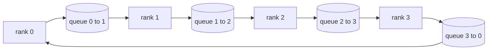

# Sıfırdan Toplu Operasyonlar

> Dağıtılmış eğitimi bir arada tutan dört ortak operasyon şunlardır: Allreduce, Broadcast, Allgather ve Reduce_Scatter. framework eğitiminin sunduğu diğer her ilkel, bunların etrafında bir sarmalayıcıdır. Bunları bir `multiprocessing.Queue` ağı üzerinde bir kez oluşturun, bunları bir referans uygulamasına göre doğrulayın ve yolun geri kalanı tesisat haline gelir.

**Tür:** Yapım
**Diller:** Python
**Önkoşullar:** Aşama 19 Bölüm C dersleri 42-49
**Süre:** ~90 dk

## Öğrenme Hedefleri

- Halkanın tamamını azaltma işlemini iki geçişte uygulayın (azalt-dağıt, sonra hepsini topla) ve sıra başına iletişim hacminin öğe başına 2(N-1)/N bayt olduğunu kanıtlayın.
- `multiprocessing.Queue` üzerinden noktadan noktaya gönderimlerin üzerine yayın, tümünü topla ve azalt_dağılımı oluşturun.
- Aynı giriş için her temel öğeyi bir `torch.distributed` gloo referansına göre doğrulayın.
- Küme şekli, gecikme tabanı ve bant genişliği tavanında halka veya ağaç seçimini savunun.

## Sorun

Naif bir allreduce over N rütbesi, tensörün N katını bir köke gönderir ve N defa geriye yayın yapar. Bant genişliği sıra başına O(N) olarak ölçeklenir, kök bir darboğaz haline gelir ve duvar saati tabanı en yavaş bağlantı süreleri N'dir. Halkaların tümü bunu T/N boyutunda 2(N-1) parçaya düzleştirir, böylece sıra başına baytlar küme boyutundan bağımsız olarak 2T(N-1)/N'ye düşer. Ağaç, küçük N ve yüksek gecikmeli bağlantılarda kazancı azaltır çünkü derinlik 2(N-1) yerine log2(N) atlamadır. Küme şekli için yanlış topolojiyi seçtiğinizde en yavaş GPU adım süresini belirler.

Bu parçayı okuyacağınız her dağıtılmış eğitim framework bu dört ilkeye bağlıdır. PyTorch DDP, gradient'leri parametre grubu başına bir allreduce ile senkronize eder. Zero shards optimizasyon durumu,reduc_scatter ile gerçekleşir ve güncellenen parametreler allgather tarafından yayınlanır. FSDP, tam ileriyi allgather artı azalt_scatter'a dönüştürür. İşlem hattı paralelinin sahne grupları arasındaki aktivasyonlar için yayına ihtiyacı var. Dört kolektifi uygulayamazsanız, eğitimin neden durduğunu, gradient uyumsuzluğunun neden 3. sırada göründüğünü veya topolojileri değiştirdiğinizde boru hattı balonunun neden iki katına çıktığını açıklayamazsınız.

## Konsept



### Zil sesini iki geçişte azaltın

Tensörü 0..N-1 indeksli N eşit parçaya bölün. Her rütbe kendi derecesine eşit yığın indeksine sahiptir. 1'i geçin, saçılımı azaltın, N-1 adımı çalıştırın. S adımında, rütbe r, yığın (r - s) mod N'yi rütbe (r + 1) mod N'ye gönderir ve yığın (r - s - 1) mod N'yi rütbe (r - 1) mod N'den alır ve alınan yığını yerel kopyasında biriktirir. N-1 adımdan sonra rütbe r, r öbeğinin tam toplamına sahip olur. Geçiş 2, hepsini toplar, başka bir N-1 adımı çalıştırır ve bitmiş parçaları, her sıra her parça için tam toplamı tutana kadar halka etrafında döndürür.

| İlkel | Sıra başına bayt | Adımlar | Ne zaman kullanılır |
|-----------|---------------|-------|-------------|
| Halkanın tümü azalt | 2T(N-1)/K | 2(N-1) | Büyük T, yağ borusu homojen küme |
| Ağacın tamamı azalt | T log2(N) | 2 log2(N) | Küçük T veya yüksek gecikmeli bağlantılar |
| Yayın | T | log2(N) ağaç | Parametre başlatma, skaler yapılandırma |
| Toplanın | T(N-1)/N | N-1 | İleriye doğru parçalanmış, sıfır parçadan arındırılmış |
| Reduce_scatter | T(N-1)/N | N-1 | Sıfır gradient parçalama |

### NCCL'nin yerine geçecek kuyruk ağı

NCCL, PCIe ve NVLink üzerinden donanım yükü azaltılmış şekilde çalışır. CPU'da buna sahip değilsiniz. Halka kenarı başına bir `multiprocessing.Queue` , tek bir üretici ve tek bir tüketici ile noktadan noktaya düzenli teslimat sağlar. Azalma kullanıcı alanında gerçekleşir, dolayısıyla Python'a ek yük ödersiniz, ancak kablo düzeni NCCL ring allreduce ile aynıdır. Kuyruk sürümünün ve küme davranışının doğruluğunun nedeni aşağıdadır.

### Gloo'ya karşı doğrulama

Her ilkel, çıktısını, aynı dünya boyutunda aynı tensör üzerindeki kasvetli arka uçla başlatılan `torch.distributed` ile karşılaştıran bir birim testiyle gelir. Eğer halkanız allreduce gloodan float32 epsilon'dan daha fazla saparsa test başarısız olur. Referans uygulamaya göre doğrulama tartışılamaz; onsuz, ilkel, gerçek bir eğitim çalışmasının 10000. adımına kadar doğru görünüyor.

## Build It — Kendin Geliştir

`code/main.py` şunu uygular:

- N `multiprocessing.Queue` örneğini bir halkaya bağlayan ve sıralama başına `send(dst, tensor)` ve `recv(src)` 'yi açığa çıkaran `Mesh` sınıfı.
- `ring_allreduce(mesh, rank, world_size, tensor)` iki geçişli algoritmayı çalıştırıyor.
- Logaritmik bir ağaç üzerinde `broadcast(mesh, rank, world_size, tensor, src)` .
- N-1 dönüşlerini kullanarak `allgather(mesh, rank, world_size, tensor)` .
- `reduce_scatter(mesh, rank, world_size, tensor)` tümünün ilk yarısı olarak azaltılır.
- Bayt eşitliği karşılaştırması için aynı girişi `torch.distributed` üzerinden gloo ile çalıştıran `_gloo_reference(op, world_size, tensor)` .

Çalıştır:

```bash
python3 code/main.py
```

Çıktı: kuyruk ağı ve gloo çıktılarını karşılaştıran her temel doğrulama tablosu ve ardından 2T(N-1)/N ölçeklendirmesini kanıtlayan sıra başına bayt sayacı.

## Vahşi doğada üretim modelleri

Üç desen, ilkelleri gemiye gönderilecek kadar sertleştirir.

**Allreduce'tan önce gradient kovası.** 1B parametreli bir modelde onbinlerce gradient tensör bulunur. Tensör başına bir allreduce, gecikme tabanını N kez öder. DDP, gradient'leri ~25 MB'lık parçalara ayırır ve paket başına bir allreduce yayınlar; küçük tensörler büyüklerin arkasına biner. Gecikme yükü, kovalamadan adıma hakim olur.

**İletişimi hesaplamayla örtüştürün.** gradient katmanını ters sırayla geriye doğru hesaplar. Son katmanın gradient hazır olduğu anda, sonraki katman hesaplamaya devam ederken allreduce işlemini başlatın. PyTorch DDP bunu kovaya hazır kancalarla bağlar. Çakışma, ağda gevşeklik olduğunda görünür iletişim süresini yarıya indirir.

**Halkayı veya ağacı mesaj boyutuna göre seçin, dine göre değil.** NCCL, ~1 MB'ın üzerindeki mesajlar ve altındaki ağaçlar için zil sesini seçen bir topoloji dedektörü gönderir. Geçiş, bant genişliğine karşı gecikmedir: 1 MB'ın üzerinde, 2T(N-1)/N bant genişliği terimi hakim olur ve halka kazanır; 1 MB'ın altında log2(N) atlama sayısı kazanır. Bir topolojinin sabit kodlanması, yanlış mesaj boyutunda üretime mal olur.

## Use It — Hazır Araçla Uygula

Üretim modelleri:

- **PyTorch DDP.** Geriden sonra gruplanmış gradient'larda `dist.all_reduce` 'yi çağırır. Kova boyutu ayarlanabilir; varsayılan 25 MB, 100 Gbit Ethernet için makuldür.
- **DeepSpeed ​​Zero.** İleriye gitmeden önce tüm parametreleri yeniden oluşturmak için gradient parçalarına reduc_scatter ve allgather sorunları çıkarır. Dersin ilkelleri tam olarak ZeRO'nun yaptığı çağrılardır.
- **FSDP.** Katmanın parçalanmasını çözmek için ileri allgather ile başlar, hesaplar, ardından azalt_scatter ile azaltır ve parçalamayı iptal eder. Aynı ilkeller, farklı program.

## Ship It — Kullanıma Sun

77-81. derslerde kuyruk örgüsü temellerini kullanın. Ders 77 kablolarının tümü DDP'ye indirgenir. Ders 78 kablolar Sıfıra doğru saçılımı azaltır. Ders 79 kabloları boru hattı aktivasyonlarına yayınlanıyor. Ders 81, dördünü de uçtan uca demoda birleştiriyor.

## Egzersizler

1. Tümünü azaltan bir ağaç ekleyin ve mesaj boyutuna göre halka ve ağaç arasında geçiş yapın. Çaprazlamayı ölçün.
2. Bir `recv_timeout_ms` ekleyin, böylece durmuş bir sıralama sonsuza kadar askıda kalmak yerine son tarih hatasıyla karşı karşıya kalır.
3. Dört temel öğe için `multiprocessing.Queue` 'yi TCP yuvalarıyla değiştirin. Aynı testler, gerçek kablo.
4. Sıra başına bayt sayacının JSONL'ye kaydedilmesi için bir bant genişliği enstrümantasyon kancası ekleyin.
5. 1KB, 1MB, 16MB boyutundaki tensörler için halkanın duvar saati süresi ile ağacın 4 sırasını karşılaştırın. Çaprazlamayı ampirik olarak savunun.

## Anahtar Terimler

| Dönem | İnsanlar ne diyor | Aslında ne anlama geliyor |
|------|----------------|------------------------|
| Tamamı azalt | "Sıralar arası toplam" | Çağrıdan sonra her sıra aynı azaltılmış tensöre sahiptir |
| Yüzük | "Hızlı topoloji" | T/N boyutunda N-1 parça döngü etrafında iki kez akar |
| Ağaç | "Günlük topolojisi" | İndirgeme ikili bir ağacı takip eder; derinlik log2(N) atlamadır |
| Toplanın | "Parçaları birleştir" | Her rütbe diğer her rütbenin parçasıyla biter |
| Reduce_scatter | "Toplamı böl" | Her sıralama yalnızca bir parçanın toplamı ile biter |
| Kova | "Küçük tensörleri sigortalayın" | N küçük hepsini birleştirerek büyük bir tane haline getirin |

## Daha Fazla Okuma

- [PyTorch Dağıtıldı: NCCL kolektifleri](https://pytorch.org/docs/stable/distributed.html#collective-functions)
- [Horovod halkası kağıdı azaltır](https://arxiv.org/abs/1802.05799)
- [NCCL topolojisi ve algoritma seçimi](https://docs.nvidia.com/deeplearning/nccl/user-guide/docs/index.html)
- [Patarasuk ve Yuan, Bant genişliğini en iyi şekilde azaltan algoritmalar](https://www.cs.fsu.edu/~xyuan/paper/09jpdc.pdf)
- Aşama 10 Ders 05 - dağıtılmış eğitime genel bakış
- Aşama 19 Ders 77 - Bu ilkellerin üzerine DDP bağlandı
