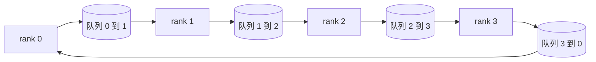

# 从零实现集合通信原语

> 支撑分布式训练的四个集合操作是：allreduce（全规约）、broadcast（广播）、allgather（全收集）和 reduce_scatter（规约散射）。训练框架提供的每一种其他原语都是对这些操作的封装。一旦你基于 `multiprocessing.Queue` 拓扑一次性构建好它们，并用参考实现验证正确性，这条技术路线剩下的工作就只是管道工程了。

**类型：** 构建
**语言：** Python
**前置条件：** 第 19 阶段 Track C 第 42-49 课
**时长：** ~90 分钟

## 学习目标

- 用两趟（reduce-scatter 接着 allgather）实现 ring allreduce，并证明每个 rank 的通信量是每个元素 2(N-1)/N 字节。
- 基于 `multiprocessing.Queue` 上的点到点发送构建 broadcast、allgather 和 reduce_scatter。
- 针对同一输入，用 `torch.distributed` 的 gloo 后端验证每个原语的正确性。
- 根据集群形状、延迟底线和带宽上限，论证选择 ring 还是 tree 的理由。

## 问题

在 N 个 rank 上做朴素 allreduce：将张量发送给根节点 N 次，再将广播发回 N 次。每个 rank 的带宽是 O(N)，根节点成为瓶颈，墙钟时间下限是最慢链路乘以 N。Ring allreduce 将其压平为 2(N-1) 个大小为 T/N 的数据块，每个 rank 的字节数降至 2T(N-1)/N，与集群大小无关。Tree allreduce 在 N 较小和高速迟链路上胜出，因为深度是 log2(N) 跳而不是 2(N-1) 跳。为集群形状选择了错误的拓扑，最慢的 GPU 就决定了每一步的时间。

你在本 Track 中读到的每一个分布式训练框架都依赖这四个原语。PyTorch DDP 对每个参数桶执行一次 allreduce 来同步梯度。ZeRO 通过 reduce_scatter 分片优化器状态，并通过 allgather 广播更新后的参数。FSDP 将完整的前向计算变成 allgather 加 reduce_scatter。流水线并行需要 broadcast 来跨阶段组传输激活值。如果你实现不了这四个集合操作，你就无法推理为什么训练卡住了、为什么梯度不匹配出现在 rank 3、或者为什么切换拓扑后流水线气泡翻倍。

## 概念



### 两趟 Ring Allreduce

将张量等分为 N 个数据块，索引为 0..N-1。每个 rank 拥有索引等于其 rank 的数据块。第一趟，reduce-scatter，执行 N-1 步。在第 s 步，rank r 将数据块 (r - s) mod N 发送给 rank (r + 1) mod N，并从 rank (r - 1) mod N 接收数据块 (r - s - 1) mod N，将接收到的数据块累加到本地副本中。经过 N-1 步后，rank r 拥有其数据块 r 的完整总和。第二趟，allgather，再执行 N-1 步，将已完成的数据块绕环旋转，直到每个 rank 都持有所有数据块的完整总和。

| 原语 | 每个 rank 的字节数 | 步数 | 何时使用 |
|-----------|---------------|-------|-------------|
| Ring allreduce | 2T(N-1)/N | 2(N-1) | 大 T，胖管道同质集群 |
| Tree allreduce | T log2(N) | 2 log2(N) | 小 T 或高速迟链路 |
| Broadcast | T | log2(N) 树形 | 参数初始化、标量配置 |
| Allgather | T(N-1)/N | N-1 | 分片前向、ZeRO 去分片 |
| Reduce_scatter | T(N-1)/N | N-1 | ZeRO 梯度分片 |

### 用队列网格替代 NCCL

NCCL 通过 PCIe 和 NVLink 运行，并利用硬件卸载规约。在 CPU 上，你无法做到这一点。每个环边上的一个 `multiprocessing.Queue` 为你提供了有序的点到点投递，具有单一生产者和单一消费者。规约在用户空间完成，因此你要承担 Python 的开销，但线路模式与 NCCL ring allreduce 完全相同。在队列版本上推理正确性，集群行为随之而来。

### 对照 gloo 验证

每个原语都附带一个单元测试，将其输出与使用 gloo 后端初始化的 `torch.distributed` 在相同张量和相同世界大小下进行比较。如果你的 ring allreduce 与 gloo 的偏差超过 float32 精度，测试失败。对照参考实现进行验证是不可妥协的；没有它，原语看起来是正确的，直到实际训练跑到第 10000 步才暴露问题。

## 构建

`code/main.py` 实现了：

- `Mesh` 类：将 N 个 `multiprocessing.Queue` 实例连接成一个环，并为每个 rank 暴露 `send(dst, tensor)` 和 `recv(src)`。
- `ring_allreduce(mesh, rank, world_size, tensor)`：运行两趟算法。
- `broadcast(mesh, rank, world_size, tensor, src)`：基于对数树。
- `allgather(mesh, rank, world_size, tensor)`：使用 N-1 次旋转。
- `reduce_scatter(mesh, rank, world_size, tensor)`：作为 allreduce 的前半部分。
- `_gloo_reference(op, world_size, tensor)`：通过 `torch.distributed` 以 gloo 后端运行相同输入，进行逐字节比较。

运行它：

```bash
python3 code/main.py
```

输出：每个原语的验证表，比较队列网格和 gloo 的输出，随后是一个每个 rank 的字节计数器，证明 2T(N-1)/N 的扩展性。

## 生产环境中的实际模式

三种模式可以将这些原语加固到可交付的水平。

**在 allreduce 之前对梯度分桶。** 一个 10 亿参数的模型有数万个梯度张量。每个张量一次 allreduce 会使延迟底线乘以 N 次。DDP 将梯度分桶为约 25 MB 的数据块，每个桶执行一次 allreduce；小的张量搭大张量的便车。没有分桶，延迟开销将主导每一步的时间。

**将通信与计算重叠。** 反向传播按逆序逐层计算梯度。一旦最后一层的梯度就绪，立即启动它的 allreduce，同时下一层继续计算。PyTorch DDP 通过桶就绪钩子实现这一点。当网络有余量时，这种重叠将可见的通信时间减半。

**根据消息大小选择 ring 或 tree，而不是凭信仰。** NCCL 内置拓扑检测器：对于约 1 MB 以上的消息选择 ring，以下选择 tree。交叉点来自于带宽与延迟的权衡：大于 1 MB 时，带宽项 2T(N-1)/N 占主导，ring 胜出；小于 1 MB 时，log2(N) 跳数占优。硬编码一种拓扑会在错误的消息大小上牺牲吞吐量。

## 使用

生产模式：

- **PyTorch DDP。** 在反向传播后对分桶梯度调用 `dist.all_reduce`。桶大小可调；对于 100Gbps 以太网，默认 25 MB 是合理的。
- **DeepSpeed ZeRO。** 发出 reduce_scatter 来分片梯度，并在前向之前发出 allgather 来重建完整参数。本课程的原语正是 ZeRO 所做的调用。
- **FSDP。** 前向以 allgather 开始，去分片该层；计算，然后用 reduce_scatter 规约并丢弃去分片的数据。相同的原语，不同的调度。

## 交付

在第 77-81 课中使用队列网格原语。第 77 课将 allreduce 接入 DDP。第 78 课将 reduce_scatter 接入 ZeRO。第 79 课将 broadcast 接入流水线激活值。第 81 课将全部四个原语组合成端到端演示。

## 练习

1. 添加 tree allreduce 变体，根据消息大小在 ring 和 tree 之间切换。测量交叉点。
2. 添加 `recv_timeout_ms`，使卡住的 rank 能报超时错误，而不是永远挂起。
3. 将 `multiprocessing.Queue` 替换为 TCP 套接字来实现四个原语。相同的测试，真实的网络线路。
4. 添加带宽检测钩子，使每个 rank 的字节计数器记录到 JSONL。
5. 在 4 个 rank 上比较 ring 与 tree 在处理 1KB、1MB、16MB 张量时的墙钟时间。用实验数据证明交叉点。

## 关键术语

| 术语 | 人们说的 | 实际含义 |
|------|----------------|------------------------|
| Allreduce | "跨 rank 求和" | 调用后每个 rank 持有相同的规约后张量 |
| Ring | "最快的拓扑" | N-1 个大小为 T/N 的数据块绕环循环两圈 |
| Tree | "对数拓扑" | 规约遵循二叉树；深度为 log2(N) 跳 |
| Allgather | "拼接分片" | 每个 rank 最终持有所有其他 rank 的分片 |
| Reduce_scatter | "拆分求和" | 每个 rank 最终只持有其中一个数据块的总和 |
| Bucket | "融合小张量" | 将 N 个小 allreduce 合并为一个大的 |

## 延伸阅读

- [PyTorch Distributed: NCCL collectives](https://pytorch.org/docs/stable/distributed.html#collective-functions)
- [Horovod ring allreduce 论文](https://arxiv.org/abs/1802.05799)
- [NCCL 拓扑与算法选择](https://docs.nvidia.com/deeplearning/nccl/user-guide/docs/index.html)
- [Patarasuk 和 Yuan，带宽最优 allreduce 算法](https://www.cs.fsu.edu/~xyuan/paper/09jpdc.pdf)
- 第 10 阶段第 05 课 —— 分布式训练概述
- 第 19 阶段第 77 课 —— 基于这些原语构建的 DDP
