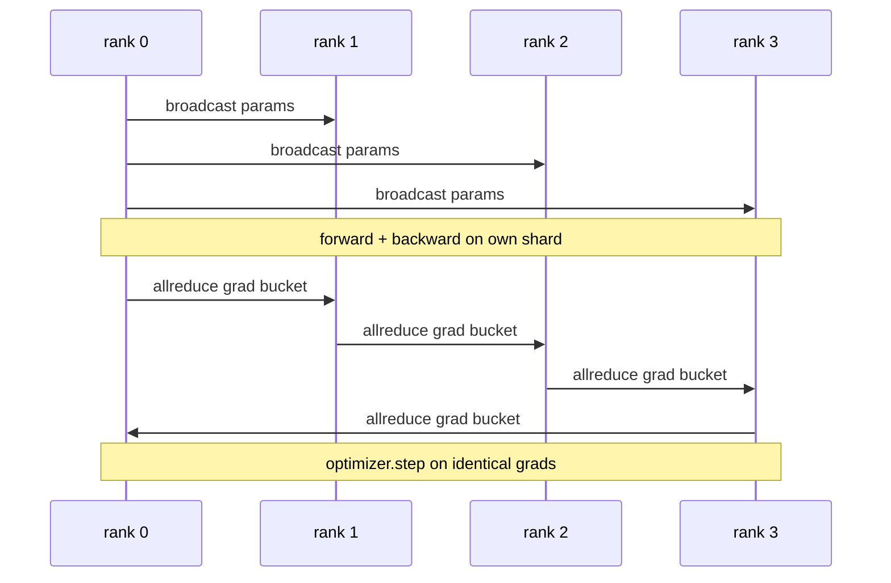

# Sıfırdan Veri Paralel DDP

> DistributedDataParallel, allreduce'ın üstünde bir kancadır. Bir model sarın, başlangıç ​​parametrelerini rütbe 0'dan yayınlayın, böylece her sıra aynı şekilde başlar, gradient'nın allreduce'ını veren her parametreye bir geriye doğru kanca takın ve gerisi gradient inişidir. Desenin tamamı 200 satırdır.

**Tür:** Yapım
**Diller:** Python
**Önkoşullar:** Aşama 19 Bölüm C dersleri 42-49
**Süre:** ~90 dk

## Öğrenme Hedefleri

- Başlangıç ​​parametrelerini yayınlayan ve geriye doğru gradient'ları azaltan `DistributedDataParallel` şeklinde bir sarıcı bağlayın.
- N CPU, dosya tabanlı randevu ile kasvetli arka uç üzerinde `torch.multiprocessing.spawn` ile sıralanır.
- Aynı modeli aynı veriler üzerinde sırayla eğiterek ve adım başına parametre denkliğini göstererek gradient-senkronizasyon doğruluğunu kanıtlayın.
- Çalışan bir DDP'yi üretim DDP'sine dönüştüren iki değişiklik olarak paketlerin (gradient füzyon) ve örtüşmenin (geriye doğru iletişim) kullanımını savunun.

## Sorun

12 GB aktivasyona sahip 1 milyar parametreli model, tek bir tüketici GPU'suna sığmaz. Yerine uysa bile eğitim haftalar sürer. Veriler paralel olarak grubu N sıralamaya böler, her sıralama kendi parçasındaki ileri ve geriyi hesaplar ve her adımda her sıralamanın gradient'leri toplanır, böylece tüm N kopyalar aynı kalır. Toplanan gradient, optimize edicinin adım attığı şeydir.

gradient senkronizasyonu olmadan, N kopya 2. adımda birbirinden ayrılır. Model artık "daha fazla veri üzerinde eğitilmiş bir model" değildir, başlangıç ​​ağırlıklarını paylaşan N ayrı modeldir. gradient senkronizasyonu kötü yapıldığında (parametre başına bir allreduce, çakışma yok, gruplama yok) ağ darboğazdır ve GPU'lar kabloyu boşta bekler. DDP'nin sanatı, gradient senkronizasyonunu hesaplamaya göre neredeyse ücretsiz hale getiriyor. Kurallı PyTorch DDP bunu gradient'ları gruplandırarak, allreduce'u bir sonraki katmanın geriye doğru üst üste bindirerek ve NVLink'te NCCL kullanarak başarır. Üçünü de CPU üzerinde gloo ile yapabilir ve aynı dersleri öğrenebiliriz.

## Konsept



### DDP'nin ihtiyaç duyduğu üç işlem

| Sahne | Toplu | Neden |
|-------|-----------|-----|
| Başlat | 0. sıradan yayın | Her sıralama aynı parametrelerle başlar |
| Geriye doğru | her mezunda azalma | Ortalama gradient, optimize edicinin adım attığı şeydir |
| Bazen | tampon yayını | Batchnorm koşu istatistikleri senkronize kalır |

### Neden toplam değil de demek istiyorum

Allreduce-SUM'un world_size'ye bölünmesi, ortalamayı gradient verir. Ortalama, dünya boyutuna göre değişmez: bir dereceye ayarlanan öğrenme oranı dört seviyede çalışır çünkü adım başına gradient büyüklüğü değişmez. Bölme olmadan Allreduce-SUM, küme boyutunu her değiştirdiğinizde öğrenme oranını yeniden ayarlamanıza zorlar. DDP, TOPLAM'ı sarar ve böler; aynısını derste de yapın.

### Neden gradient'ları paketleyin

Bir transformer binlerce parametre tensörüne sahiptir. Tensör başına bir all-reduce, gloo gecikme tabanını binlerce kez öder. DDP, gradient'leri ~25 MB'lık paketler halinde gruplandırır ve paket başına bir allreduce yayınlar. Kablo boyunca aynı toplam bayt miktarı hareket eder ancak gecikme, paket üzerinden amortismana tabi tutulur. Dersin minik modeli için her şeyi tek bir grupta topluyoruz; yapı, karşıya geçen şeydir.

### Neden tohumu sabitliyoruz?

Her sıralamanın karıştırma için `torch.manual_seed(seed + rank)` 'yi, parametre başlatma için ise `torch.manual_seed(seed)` 'yi çağırması gerekir. Tek bir paylaşılan tohum, her sıralamanın aynı parti sırasını görmesi anlamına gelir (veri paralelliğini ortadan kaldırır); paramlar için sıralamaya özgü bir tohum, başlangıç ​​parametrelerinin kayan epsilon ile uyuşmadığı ve gradient senkronizasyonunun artık kopyaları aynı yapmadığı anlamına gelir. Tohum modelini doğru alın, aksi takdirde parametre eşdeğerliği testi 1. adımda başarısız olur.

## Build It — Kendin Geliştir

`code/main.py` şunu uygular:

- `MiniMLP`: saniyeler içinde birleşecek kadar küçük, kabloları ortaya çıkaracak kadar büyük, 3 katmanlı bir MLP.
- `DistributedDataParallel(model, world_size)`: oluşturma zamanında parametreleri yayınlar, `sync_grads` 'nin birikmiş allreduce-summed derecelerini dünya boyutuna böldüğü bir sarıcı döndürür.
- `worker(rank, world_size, ...)`: gloo, ileri, geri, senkronizasyon, adım üzerinden `torch.distributed` başlatma ile tam eğitim döngüsü.
- `_reference_single_process_loop(...)`: her adımdan sonra bayt eşit parametre denkliği için test tarafından kullanılan, aynı modeli aynı veriler üzerinde tek bir sıralamada sırayla eğitir.

Çalıştır:

```bash
python3 code/main.py
```

Çıktı: tek işlem kaybını ve parametre sağlama toplamını 4 sıradaki DDP çalıştırmasıyla karşılaştıran adım başına eğitim tablosu. İki yol, epsilon'u yüzdürmek için aynı kayıp eğrilerini üreterek gradient senkronizasyonunun doğru olduğunu kanıtlar.

## Vahşi doğada üretim modelleri

Üç model, DDP'yi gönderilmeye yetecek kadar sertleştirir.

**Kullanılmayan parametreleri bulun.** Bazı ileri yollar, parametreleri koşullu olarak atlar (erken çıkış, uzman karışımı yönlendirici). Atlanan parametrelerde gradient yoktur, ancak DDP'nin pakete hazır kancası hala bunları ve allreduce kilitlenmelerini bekler. `find_unused_parameters=True` , DDP'ye, azaltmadan önce hangi parametrelerin gradient'leri aldığına bakmasını söyler. Maliyet, adım başına bir grafik yürüyüşüdür, bu nedenle ileri dallanmalarınız olmadığı sürece bunu bırakın.

**Statik grafik optimizasyonu.** İleri adımlarda kararlı olduğunda, `static_graph=True` , DDP'nin paket zamanlamasını önceden hesaplamasına izin verir. Optimizasyon ölçek açısından önemlidir: ön hesaplama, 10.000 adımı birleştiren adım başına birkaç ms tasarruf sağlar.

**Gradient birikiminin bakıma ihtiyacı vardır.** Her bir mikro toplu işlemi senkronize etmeden K mikro grup üzerinden gradient'leri biriktirmek, 10 kat verim kazancıdır. DDP, `no_sync()` 'ı geriye dönük allreduce işlemini duraklatan bir içerik yöneticisi olarak kullanıma sunar. Yöneticiyi unutun ve hepiniz K kere boşuna azaltın; verim yere düşer.

## Use It — Hazır Araçla Uygula

Üretim modelleri:

- **PyTorch DDP.** Standart uygulama. `torch.nn.parallel.DistributedDataParallel(model)` kabloların gruplanması, örtüşmesi ve no_sync bağlamı.
- **HuggingFace Accelerate.** `torchrun` env değişkenlerini ve model sarmayı işleyen bir başlatıcı ekler. Kaputun altında aynı DDP var.
- **Megatron-LM verileri paralel.** Büyük modeller için DDP'yi tensör paraleliyle birleştirir; veri paralel parçası, geriye doğru tümünü azalt modeliyle aynıdır.

## Ship It — Kullanıma Sun

Ders 78 (Sıfır parçalama), parametre başına allreduce'ı azaltıcı_scatter ile değiştirir, böylece her sıra yalnızca optimizer durumunun kendi parçasını depolar. Ders 81, uçtan uca demoda Sıfır ile DDP'yi oluşturur.

## Egzersizler

1. Yapılandırılabilir boyutta gradient paket ekleyin ve daha derin bir modelde parametre başına bir azaltma ile karşılaştırıldığında hızlanmayı ölçün.
2. `no_sync()` 'yi bağlam yöneticisi olarak uygulayın ve gradient birikiminin K mikro seri üzerinden tek işlemli bir temel çizgiyle eşleştiğini doğrulayın.
3. İlerinin bazen MLP katmanlarından birini atladığı bir `find_unused_parameters` modu ekleyin; bayrak olmadan koşunun kilitlenmesi gerekir.
4. Allreduce tabanlı ve bariyer tabanlı senkronizasyon arasındaki farkı hissetmek için gloo'yu yalnızca `torch.distributed.barrier()` senkronizasyonla değiştirin.
5. Toplu iş boyutları 1, 16, 256 için gradient-senkronizasyon yükünü adım süresinin kesri olarak ölçün ve ölçeklendirmeyi açıklayın.

## Anahtar Terimler

| Dönem | İnsanlar ne diyor | Aslında ne anlama geliyor |
|------|----------------|------------------------|
| DDP | "Veri paralel" | Parametreleri yayınlayan ve her adımda notları azaltan sarmalayıcı |
| Kova | "Sigorta mezunları" | Grup N küçüklerin tümü tek bir büyük parçaya indirgenir |
| Örtüşme | "İletişimi gizle" | Daha sonraki katmanlar hâlâ geriye doğru hesaplama yaparken sorun tamamen azaltılıyor |
| no_sync | "Biriktir" | gradient birikimi için geri gönderme allreduce işlemini atlayın |
| find_unused | "İleri dallanma" | Azaltmadan önce derecesiz parametreleri tespit edin |

## Daha Fazla Okuma

- [PyTorch DistributedDataParallel belgeleri](https://pytorch.org/docs/stable/generated/torch.nn.parallel.DistributedDataParallel.html)
- [PyTorch DDP dahili eğitimi](https://pytorch.org/tutorials/intermediate/ddp_tutorial.html)
- [Li ve diğerleri, PyTorch Distributed: Veri Paralel Eğitimini Hızlandırma Deneyimleri](https://arxiv.org/abs/2006.15704)
- Aşama 19 Ders 76 - DDP'nin üzerine inşa edildiği kolektifler
- Aşama 19 Ders 78 - Sıfır parçalama, parametre başına allreduce'u azalt_scatter ile değiştirir
