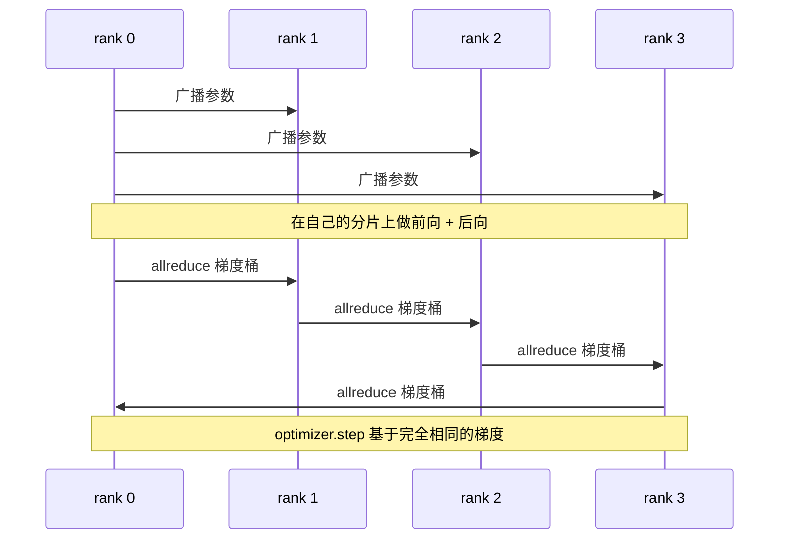

# 从零实现数据并行 DDP

> DistributedDataParallel 本质上是 allreduce 上的一个钩子。将模型包装起来，从 rank 0 广播初始参数使所有 rank 从相同的起点开始，为每个参数安装一个后向钩子来发起梯度的 allreduce，剩下的就是梯度下降。整个模式不过 200 行代码。

**类型：** 构建
**语言：** Python
**前置条件：** 第 19 阶段 C 轨 第 42-49 课
**时间：** ~90 分钟

## 学习目标

- 搭建一个形如 `DistributedDataParallel` 的包装器：初始化时广播参数，后向完成后对梯度做 allreduce。
- 使用 `torch.multiprocessing.spawn` 在 gloo 后端上通过基于文件的 rendezvous 生成 N 个 CPU rank。
- 通过在相同数据上顺序训练同一模型并逐步骤验证参数等价性，证明梯度同步的正确性。
- 阐述使用桶（梯度融合）和重叠（后向计算中同步通信）是将一个可用的 DDP 转变为生产级 DDP 的两项关键改进。

## 问题

一个拥有 12 GB 激活值的十亿参数模型无法放在单张消费级 GPU 上。即使放得下，训练也需要数周时间。数据并行将批次分散到 N 个 rank 上，每个 rank 在自己的分片上计算前向和后向，并在每一步将所有 rank 的梯度求和，使所有 N 个副本保持完全一致。优化器使用这个求和后的梯度进行更新。

没有梯度同步，N 个副本在第 2 步就会产生分歧。模型不再是"在更多数据上训练的一个模型"，而是 N 个恰好共享初始权重的独立模型。如果梯度同步做得很差（每个参数一次 allreduce，没有重叠，没有分桶），网络就会成为瓶颈，GPU 也只能空闲等待通信完成。DDP 的精髓在于让梯度同步相对于计算几乎不产生额外开销。规范的 PyTorch DDP 通过以下方式实现：对梯度分桶、将 allreduce 与下一层的后向计算重叠、以及在 NVLink 上使用 NCCL。我们可以在 CPU 上使用 gloo 完成这三件事，学习同样的经验。

## 概念



### DDP 所需的三种操作

| 阶段 | 集合通信操作 | 原因 |
|-------|-----------|-----|
| 初始化 | 从 rank 0 广播 | 每个 rank 从相同的参数开始 |
| 后向之后 | 对每个梯度做 allreduce | 平均梯度是优化器更新的依据 |
| 有时 | 广播缓冲区 | 保持 BatchNorm 运行时统计信息同步 |

### 为什么用均值而不是求和

Allreduce-SUM 除以 world_size 得到平均梯度。均值的优势在于与 world_size 无关：在一个 rank 上调好的学习率在四个 rank 上同样有效，因为每步的梯度大小不会改变。如果直接使用 Allreduce-SUM 而不做除法，每次改变集群规模时都需要重新调整学习率。DDP 会对 SUM 结果做除法；本课程中请同样处理。

### 为什么对梯度分桶

一个 Transformer 有数千个参数张量。每个张量做一次 allreduce 会让 gloo 的延迟开销重复数千次。DDP 将梯度分组为约 25 MB 的桶，每个桶只发起一次 allreduce。传输的总字节数不变，但延迟被均摊到了整个桶上。对于本课程中的小模型，我们把所有梯度放在一个桶里；重要的是理解这种结构本身。

### 为什么固定随机种子

每个 rank 在 shuffle 数据时必须调用 `torch.manual_seed(seed + rank)`，但在参数初始化时必须调用 `torch.manual_seed(seed)`。如果所有 rank 共享同一个种子，会导致它们看到相同的批次顺序（数据并行失效）；如果对参数初始化使用 rank 特有的种子，初始参数会因浮点精度差异而略有不同，梯度同步将无法使各副本保持一致。请正确设置种子模式，否则参数等价性测试将在第一步就失败。

## 构建

`code/main.py` 实现了：

- `MiniMLP`：一个 3 层 MLP，足够小以在数秒内收敛，又足够大以暴露各组件之间的连接关系。
- `DistributedDataParallel(model, world_size)`：在构造时广播参数，返回一个包装器，其 `sync_grads` 方法将累积的 allreduce 求和梯度除以 world_size。
- `worker(rank, world_size, ...)`：完整的训练循环，使用 gloo 初始化 `torch.distributed`，包括前向、后向、同步和参数更新。
- `_reference_single_process_loop(...)`：在单个 rank 上使用相同数据顺序训练同一模型，用于测试在每个步骤后验证参数是否字节级等价。

运行方式：

```bash
python3 code/main.py
```

输出：一个逐步骤的训练对比表，比较单进程的损失和参数校验和与在 4 个 rank 上运行的 DDP。两条路径产生的损失曲线在浮点精度范围内完全一致，证明了梯度同步的正确性。

## 生产环境中的常见模式

有三种模式可以让 DDP 达到上线水平。

**查找未使用的参数。** 某些前向路径会条件性地跳过部分参数（提前退出、混合专家路由）。被跳过的参数没有梯度，但 DDP 的桶就绪钩子仍然会等待它们，从而导致 allreduce 死锁。`find_unused_parameters=True` 告诉 DDP 在规约前检查哪些参数实际收到了梯度。代价是每步都需要遍历一次计算图，因此如果你的前向路径没有分支，请不要启用。

**静态图优化。** 当前向路径在步骤间保持稳定时，`static_graph=True` 让 DDP 预先计算桶的调度计划。这种优化在大规模训练中很有价值：预计算每步可以节省几毫秒，累积到 10000 步时就非常可观。

**梯度累积需要谨慎。** 在不同步每个微批次的情况下累积 K 个微批次的梯度，可以获得 10 倍的吞吐量提升。DDP 提供了 `no_sync()` 上下文管理器，用于暂停后向后的 allreduce。如果忘记使用这个管理器，你就会白白做 K 次 allreduce，吞吐量会急剧下降。

## 使用

生产环境中的相关实现：

- **PyTorch DDP。** 规范的实现。`torch.nn.parallel.DistributedDataParallel(model)` 封装了分桶、重叠和 no_sync 上下文管理器。
- **HuggingFace Accelerate。** 提供了一个启动器，处理 `torchrun` 环境变量和模型包装。底层同样是 DDP。
- **Megatron-LM 数据并行。** 将 DDP 与张量并行结合用于大模型；数据并行部分仍然是后向之后做 allreduce 的模式。

## 后续学习

第 78 课（ZeRO 分片）将逐个参数的 allreduce 替换为 reduce_scatter，使得每个 rank 只存储优化器状态的一个分片。第 81 课将 DDP 与 ZeRO 组合成端到端演示。

## 练习

1. 添加可配置大小的梯度桶，在一个更深的模型上测量相比逐参数 allreduce 的加速比。
2. 将 `no_sync()` 实现为上下文管理器，并验证 K 个微批次上的梯度累积与单进程基线一致。
3. 添加 `find_unused_parameters` 模式，其中前向有时会跳过其中一个 MLP 层；不启用该标志时运行应该死锁。
4. 将 gloo 替换为仅使用 `torch.distributed.barrier()` 的同步方式，感受基于 allreduce 和基于 barrier 的同步之间的差异。
5. 测量梯度同步开销在步时间中所占的比例，分别测试批次大小为 1、16 和 256 的情况，并解释其缩放规律。

## 关键术语

| 术语 | 人们常说的 | 实际含义 |
|------|----------------|------------------------|
| DDP | "数据并行" | 包装器，每步广播参数并对梯度做 allreduce |
| 桶 (Bucket) | "融合梯度" | 将 N 个小 allreduce 合并为一个大的 allreduce |
| 重叠 (Overlap) | "隐藏通信" | 在后续层仍在计算后向时发起 allreduce |
| no_sync | "累积" | 跳过后向后的 allreduce 进行梯度累积 |
| find_unused | "有分支的前向" | 在规约前检测没有梯度的参数 |

## 延伸阅读

- [PyTorch DistributedDataParallel 文档](https://pytorch.org/docs/stable/generated/torch.nn.parallel.DistributedDataParallel.html)
- [PyTorch DDP 内部原理教程](https://pytorch.org/tutorials/intermediate/ddp_tutorial.html)
- [Li 等人，PyTorch Distributed：加速数据并行训练的经验](https://arxiv.org/abs/2006.15704)
- 第 19 阶段第 76 课——DDP 所依赖的集合通信操作
- 第 19 阶段第 78 课——ZeRO 分片将逐参数 allreduce 替换为 reduce_scatter
