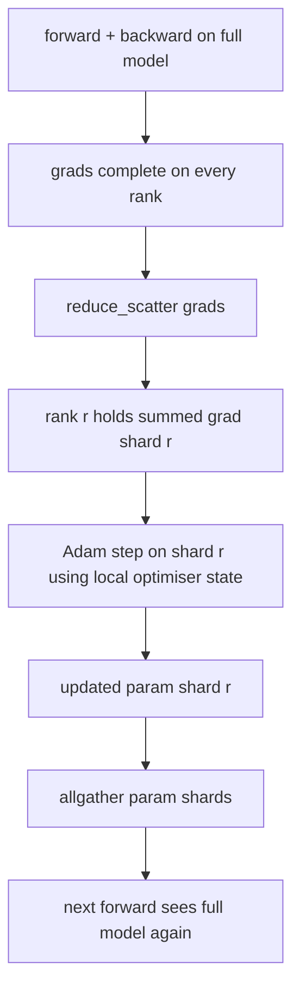

# Sıfır Optimize Edici Durum Parçalaması

> Adam, her ikisi de float32'de olmak üzere parametre başına iki moment tahminini saklar. 7B parametreli bir model, 56 GB optimize edici durumu taşır. N sıralamada sıfır aşama 1 parçaları; her sıra, optimize edicinin 1/N'sine sahiptir. Yerel adımdan sonra güncellenen parametre parçaları geri yayınlanır, her aşama tam modeli yeniden oluşturur ve bir sonraki adım başlar. Kazanç, eğitim yığınındaki en büyük tek tahsiste doğrusal bir hafıza kaybıdır.

**Tür:** Yapım
**Diller:** Python
**Önkoşullar:** Aşama 19 Bölüm C dersleri 42-49
**Süre:** ~90 dk

## Öğrenme Hedefleri

- N kademe boyunca parça iyileştirici durumu (ilk an, ikinci an, fp32 ana kopyası) böylece her kademe 1/N'ye sahip olur.
- Her sıralamaya yalnızca kendi parçasının gradient toplamını sunmak için azaltıcı_scatter'ı kullanın, ardından güncellenen parametre parçalarını geri yayınlamak için allgather'ı kullanın.
- Vanilya DDP'ye karşı aşama 1, aşama 2 ve aşama 3 için bellek tasarruf tablosunu hesaplayın.
- Model boyutu ve bant genişliği bütçesine göre aşama 1, aşama 2 ve aşama 3 seçimini savunun.

## Sorun

Vanilya DDP her şeyi kopyalar: parametreler, gradient'lar ve optimize edici durumu her sıralamada tam olarak mevcuttur. Fp16'daki 7B parametreli bir model için bu, derece başına 14 GB parametre, 14 GB gradients ve 28 GB optimize edici durumu anlamına gelir. Optimize edici durumu en büyük terimdir ve parçalanması en kolay olanıdır çünkü ona ileri veya geri sırasında değil, yalnızca adım sırasında dokunulur.

Sıfır aşama 1, optimize edici durumunu parçalar. Her sıra Adem anlarının 1/N'sini tutar. Geriye doğru gittikten sonra, tam gradient'yi azaltmak ve yerel olarak adım atmak yerine, Sıfır azaltıcı_saçılır, böylece her kademe yalnızca kendi parçasının toplam gradient'ını alır. Sıralama, optimize edici adımını ana parametrelerin parçasına uygular. Güncellenen parametre parçaları daha sonra geri toplanır, böylece her kademe bir sonraki ilerleme için tam modele sahip olur. Optimize edici hafızası N kadar düşer. Adım başına kablo trafiği DDP ile aynıdır: bant genişliğine göre bir azalt_scatter artı bir allgather eşittir bir allreduce. Bellek kazanır, verim kalır.

## Konsept



### Sıfırın Aşamaları

| Sahne | Parçalanmış nedir | Derece başına bellek | Adım başına iletişim |
|-------|----------------|------------------|---------------|
| DDP | hiçbir şey | parametreler + mezunlar + optim | 1x tamamen azalt |
| Sıfır-1 | optimize edici durumu | parametreler + dereceler + optim/N | 1x azalt_scatter + 1x topla |
| Sıfır-2 | optimum + mezunlar | parametreler + dereceler/N + optimum/N | 1x azalt_scatter + 1x topla |
| Sıfır-3 | optim + notlar + parametreler | params/N + dereceler/N + optimum/N | Katman başına 1x allgather + katman başına 1x azaltılmış_scatter |

1. Aşama en ucuz kazançtır çünkü optimizasyon durumu bütçeye hakimdir. Aşama 2, gradient-parça biriktirme mantığına ihtiyaç duyar ancak bant genişliği aynıdır. Aşama 3 (FSDP), her ileri ve geri işlem için katman başına iletişim öder ve parametre parça belleği kaybı elde eder. Ders 1. aşamayı tam olarak uygular.

### Bellek matematiği, gerçek sayılar

Adam ile karışık hassasiyetle eğitilmiş P parametrelerine sahip bir model için:

| Dönem | Vanilya | Sıfır-1 | Neden |
|------|---------|--------|-----|
| fp16 parametreleri | 2P bayt | 2P bayt | ileri için gerekli |
| fp16 mezunları | 2P bayt | 2P bayt | geriye doğru gerekli |
| fp32 ana kopyası | 4P bayt | 4P/N bayt | yalnızca optimum bunu kullanır |
| FP32 ilk an | 4P bayt | 4P/N bayt | yalnızca optimum bunu kullanır |
| FP32 ikinci an | 4P bayt | 4P/N bayt | yalnızca optimum bunu kullanır |
| Toplam | 16P bayt | 4P + 12P/N bayt |   |

N=8'de: vanilya 16P, ZeRO-1 5,5P, %65'lik düşüş. N=64'te: vanilya 16P, ZeRO-1 4,19P, %74'lük düşüş.

### Reduce_scatter neden tüm reduce-sonra-shard'ı yener?

Allreduce her sıralamaya tam toplam gradient değerini verir. Yalnızca r parçasına ihtiyacınız varsa, azaltılan gradient'nin (N-1)/N'si r rütbesinde boşa harcanır. Reduce_scatter her seviyenin sahip olduğu parçayı tam olarak sunar; sıralama başına baytlar allreduce ile aynıdır (çünkü allreduce, azalt_scatter + allgather'dır) ancak ikinci yarı daha sonra parça parça allgather parametresi ile değiştirilir. Ağ kablosu DDP ile aynıdır, bellek bölünmüştür.

## Build It — Kendin Geliştir

`code/main.py` şunu uygular:

- `flatten_params(module)` ve `unflatten_into(module, flat)` , bir modelin parametrelerini tek bir bitişik tensörde paketler ve paketi tekrar açar. Düz düzen, sıralamaya göre parçalamayı basit bir dilim haline getiren şeydir.
- Ana kopyanın ve Adam anlarının rütbe parçasının sahibi olan `ZeroOptimizer(model, world_size, rank, lr)` .
- gradient düz üzerinde azalt_scatter'ı çalıştıran `step()` , Adam'ı rütbenin parçasına uygular ve güncellenen parametrelerin tamamını geri toplar.
- 3 katmanlı bir MLP'yi 20 adım boyunca eğiten ve adım başına bellek bütçesini vanilya DDP temel çizgisiyle birlikte yazdıran bir demo.

Çalıştır:

```bash
python3 code/main.py
```

Çıktı: adım başına kayıp ve ZeRO-1'i gösteren bellek tablosu, DDP'nin tam kopyasına karşı her kademede optimizer durumunun 1/N'sini tutar.

## Vahşi doğada üretim modelleri

Üç model Zero'yu nakliyeye yetecek kadar sertleştirir.

**Parçalı kontrol noktası oluşturma önemlidir.** ZeRO-1'in optimizasyon durumu kademelere göre bölünmüştür; kontrol noktası hangi rütbenin neye sahip olduğunu kaydetmelidir. Ders 80, aynı dünya boyutunda bir Sıfır çalıştırmayı sürdüren parçalanmış kontrol noktası bildirimini oluşturur. Bu olmadan kaydedilen durum yeniden başlatma sırasında okunamaz.

**Önemli olan karma hassasiyettir.** Sıfır karışık hassasiyetli bir tekniktir; FP32 ana kopyası parçalanan şeydir. ZeRO'yu karışık hassasiyet olmadan çalıştırmak, karşılık gelen FP16 ileri kazanımı olmadan FP32 master üzerindeki bellek vergisini öder. Üretim çalışmaları her zaman Sıfır'ı otomatik yayın veya bf16 ağırlıklarıyla eşleştirir.

**Aşama 1, neredeyse bedava bir kazançtır.** İletişim, bant genişliği açısından DDP ile aynıdır. Bellek tasarrufları N cinsinden doğrusaldır. Tek maliyet, optimize edici parçanın muhasebesidir. Parametre parça belleğinde de bir sorun olmadığı sürece üretim yığınları varsayılan olarak 1. aşamaya geçer; daha sonra aşama 2 veya 3, hafıza için iletişimi değiştirir.

## Use It — Hazır Araçla Uygula

Üretim modelleri:

- **DeepSpeed ​​Zero.** Referans uygulaması. `deepspeed_config.json` aşama 1/2/3'ü ve bölüm boyutlarını seçer.
- **PyTorch FSDP.** PyTorch'un yerel eşdeğeri. `ShardingStrategy.SHARD_GRAD_OP` Sıfır-2'dir; `FULL_SHARD` Sıfır-3'tür.
- **HuggingFace Hızlandırma.** Hem DeepSpeed ​​hem de FSDP'yi tek bir yapılandırma altında sarar.

## Ship It — Kullanıma Sun

Ders 79 (boru hattı paralel) ortogonal parçalama eksenidir: Optimize edici durumunu aynı modelde parçalamak yerine, ardışık düzen katmanları katmanlar arasında parçalar. Ders 81, uçtan uca demoda DDP + Sıfır'ı oluşturur.

## Egzersizler

1. gradient'ları parçalayarak Sıfır-2'ye genişletin: her sıralama yalnızca kendi parçası için gradient'yi saklar, bu, geriye doğru parça olmayan kısmın sıfırlanmasıyla elde edilir.
2. Formül tahminine karşı gerçek fp32 bayt kullanımını sıra 0'da yazdıran bir bellek profili oluşturucu ekleyin.
3. Vanilya DDP'nin Sıfır-1'e göre adım başına duvar saati süresini ölçün ve ileri, geri, iletişim olarak ayrıştırın.
4. SıfırO-1 altında gradient kırpmayı uygulayın: L2 normu, yerel normun karesinin tamamen azaltılması yoluyla tüm parçalarda hesaplanmalıdır.
5. Reduce_scatter yerine allreduce ile "saf Sıfır" uygulayın, kablo süresi farkını ölçün. Reduce_scatter seçimini sayılarla savunun.

## Anahtar Terimler

| Dönem | İnsanlar ne diyor | Aslında ne anlama geliyor |
|------|----------------|------------------------|
| Sıfır-1 | "Optimize ediciyi parçalayın" | Her sıralamada 1/N FP32 ana + Adam anları bulunur |
| Sıfır-2 | "Shard mezunları da var" | Ayrıca her rütbe, azaltıcı_scatter |'dan sonra parça olmayan gradient'ları da düşürür.
| Sıfır-3 | "Parça parametreleri" | Her sıra 1/N fp16 parametresine sahiptir; ileriye doğru katman başına her şeyi topla |
| Ana kopya | "fp32 ağırlıkları" | Yüksek hassasiyetli parametre, optimizer güncellemelerini kopyalar |
| Reduce_scatter | "Toplamı böl" | Her rütbeye yalnızca kendi parçasının toplamını verin gradient |

## Daha Fazla Okuma

- [Rajbhandari ve diğerleri, ZeRO: Trilyonlarca Parametre Modelinin Eğitimine Yönelik Bellek Optimizasyonları](https://arxiv.org/abs/1910.02054)
- [DeepSpeed ​​Zero belgeleri](https://www.deepspeed.ai/tutorials/zero/)
- [PyTorch FSDP belgeleri](https://pytorch.org/docs/stable/fsdp.html)
- Aşama 19 Ders 76 - bu derste azalt_scatter ve allgather anlatılmaktadır
- Aşama 19 Ders 80 - Sıfır durumunun kullanması gereken parçalı kontrol noktası
